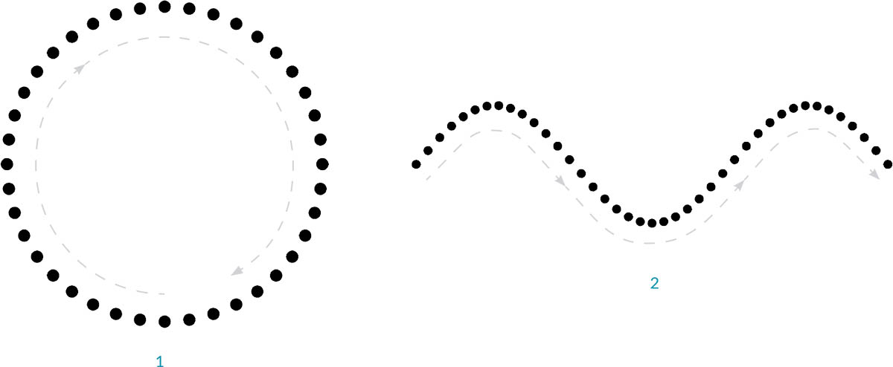
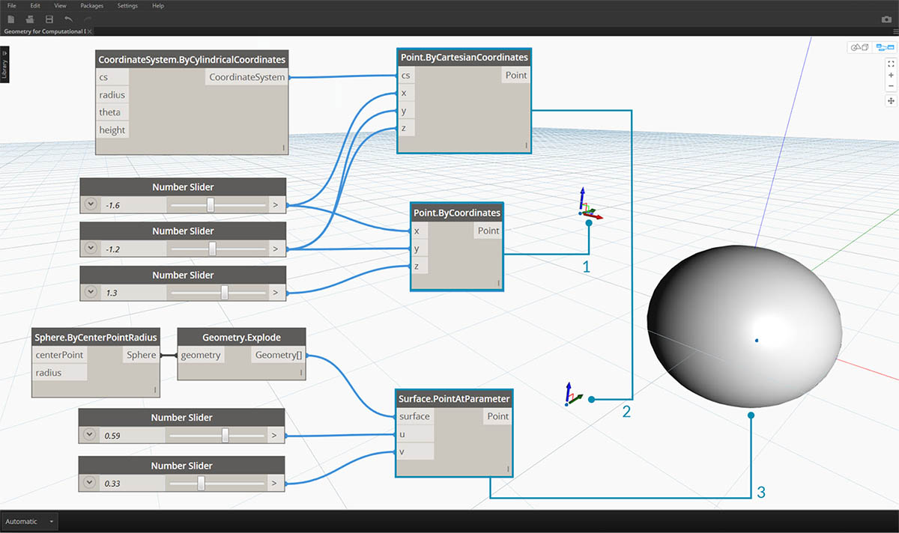

## 점

형상이 모델의 언어라면 점은 알파벳이라고 할 수 있습니다. 점은 다른 모든 형상이 작성되는 토대가 됩니다. 곡선을 작성하려면 점이 두 개 이상 필요하며, 다각형이나 메쉬 면 등을 만들려면 점이 세 개 이상 필요합니다. 점 간의 관계, 순서 및 위치를 정의(사인 함수 사용)하면 원이나 곡선으로 인식되는 고차원적인 형상을 정의할 수 있습니다.



> 1. ```x=r*cos(t)``` 및 ```y=r*sin(t)``` 함수를 사용하는 원
2. ```x=(t)``` 및 ```y=r*sin(t)``` 함수를 사용하는 사인 곡선

### 점이란?

점은 좌표라는 하나 이상의 값에 지나지 않는 것으로 정의됩니다. 점을 정의하는 데 필요한 좌표 값 수는 점이 존재하는 컨텍스트 또는 좌표계에 따라 달라집니다. Dynamo에서 가장 일반적인 종류의 점은 3D 표준 좌표계에 있으며 3개의 좌표 [X,Y,Z]를 갖습니다.


### 좌표로서의 점

점은 2D 좌표계에도 존재할 수 있습니다. 규칙은 작업 중인 공간의 종류에 따라 다른 문자 표기법을 가집니다. 평면에서는 [X,Y]를, 표면에 있는 경우에는 [U,V]를 사용할 수 있습니다.


> 1. 유클리드 좌표계의 점: [X,Y,Z]
2. 곡선 매개변수 좌표계의 점: [t]
3. 표면 매개변수 좌표계의 점: [U,V]

비직관적인 것처럼 보일 수 있지만, 곡선과 표면 모두에 대한 매개변수는 연속적이며 지정된 형상의 가장자리 너머까지 연장됩니다. 매개변수 공간을 정의하는 모양은 3D 표준 좌표계에 있기 때문에 파라메트릭 좌표를 항상 "표준" 좌표로 변환할 수 있습니다. 예를 들어 표면의 점 [0.2, 0.5]는 표준 좌표의 점 [1.8, 2.0, 4.1]과 같습니다.



> 1. 가정된 표준 XYZ 좌표의 점
2. 지정된 좌표계(원통형)를 기준으로 하는 점
3. 표면의 UV 좌표로서의 점
> 이 이미지와 함께 제공되는 예시 파일([Geometry for Computational Design - Points.dyn](datasets/5-3/Geometry for Computational Design - Points.dyn))을 다운로드하십시오(마우스 오른쪽 버튼을 클릭하고 "다른 이름으로 링크 저장..."). 전체 예시 파일 리스트는 부록에서 확인할 수 있습니다.

