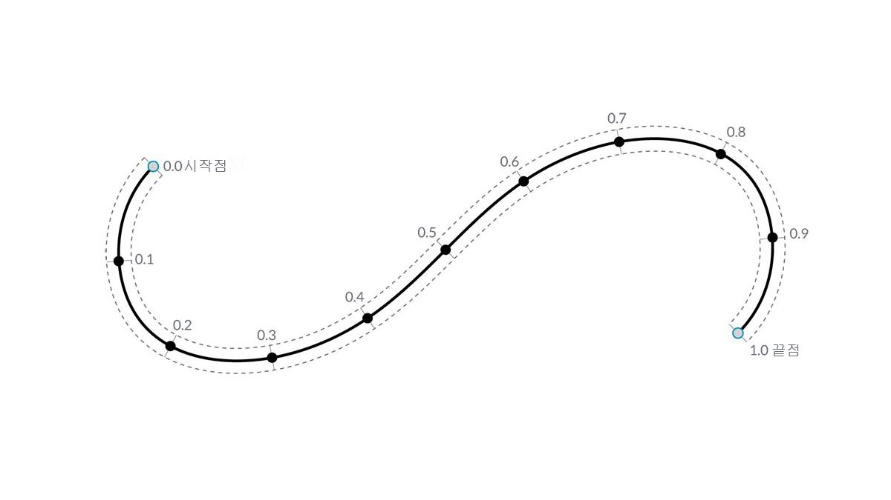
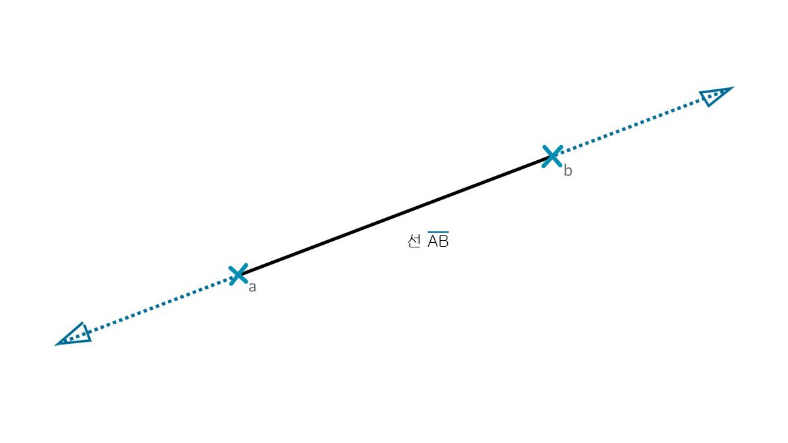

## 곡선

곡선은 선이 얼마나 구부러지거나 펴져 있는가? 또는 얼마나 길거나 짧은가? 등 보다 익숙한 모양 설명 특성 세트를 지닌, 얼마나 길거나 짧은가요? 또한 점이 선에서 스플라인 사이의 모든 항목과 그 사이의 모든 곡선 유형을 정의하기 위한 빌딩 블록이라는 점은 그대로입니다.


> 1. 선
2. 폴리선
3. 호
4. 원
5. 타원
6. NURBS 곡선
7. 폴리 곡선

### 곡선이란?

**곡선**이라는 용어는 일반적으로 다양한 종류의 곡선형(직선인 경우에도) 모양에 사용하는 다목적 용어입니다. 곡선(Curve의 "C"가 대문자인 경우)은 선, 원, 스플라인 등 해당 모양 유형 모두에 대한 상위 분류입니다. 보다 기술적으로 접근하면 곡선은 단순 함수(```x = -1.26*t, y = t```)에서 미적분학과 관련된 함수까지 다양한 함수 모음에 "t"를 입력하여 찾을 수 있는 가능한 모든 점을 그립니다. 어떤 종류의 곡선으로 작업하든 "t"라고 하는 이 **매개변수**는 평가할 수 있는 특성입니다. 또한 모양과 관계없이 모든 곡선에는 곡선을 작성하는 데 사용되는 최소 및 최대 t 값과 일치하는 시작점 및 끝점도 있습니다. 이는 해당 방향성을 이해하는 데도 도움이 됩니다.



> Dynamo에서는 곡선에 대한 "t" 값의 도메인이 0.0부터 1.0까지의 범위라고 가정합니다.

또한 모든 곡선에는 곡선을 그리거나 해석하는 데 사용할 수 있는 다양한 특성이나 특징이 있습니다. 시작점과 끝점 사이의 거리가 0이면 곡선이 "닫힌" 상태입니다. 또한 모든 곡선에는 많은 제어점이 있습니다. 이러한 모든 점이 동일한 평면에 있는 경우 곡선은 "평면"입니다. 전체적으로 곡선에 적용되는 특성도 있고, 곡선을 따라 특정 점에만 적용되는 특성도 있습니다. 예를 들어, 지정된 T 값의 접선 벡터는 로컬 특성이지만 평면성은 전역 특성입니다.

### 선

**선**은 가장 간단한 곡선 형식입니다. 별로 곡선처럼 보이지 않을 수 있지만 실제로는 곡률이 없는 곡선입니다. 선을 작성하는 방법에는 몇 가지가 있습니다. 가장 직관적인 방법은 점 A에서 점 B까지 연결하는 것입니다. 선 AB의 모양은 점 사이에 그려지지만 수학적으로는 양방향으로 무한하게 확장됩니다.



두 선을 연결하면 **폴리선**이 생성됩니다. 여기에 제어점이란 무엇인지가 직관적으로 나타나 있습니다. 이러한 점 위치를 편집하면 폴리선의 모양이 변경됩니다. 폴리선이 닫혀 있으면 다각형이 생성됩니다. 다각형의 모서리 길이가 모두 같으면 정다각형으로 그려집니다.


### 호, 원, 타원 호 및 타원

모양을 정의하는 파라메트릭 함수가 더 복잡해지면서 하나 또는 두 개의 반지름을 그려 선에서 한 단계 더 나아가 **호**, **원**, **타원 호** 또는 **타원**을 작성할 수 있습니다. 호 버전과 원 또는 타원의 차이는 모양이 닫혀 있는지 여부뿐입니다.


### NURBS + 폴리 곡선

**NURBS**(비균일 유리 기준 스플라인)은 단순한 2D 선, 원, 호 또는 직사각형에서 가장 복잡한 3D 자유형 유기적 곡선까지 모든 모양을 정확하게 모델링할 수 있는 수학적 표현입니다. NURBS 모델은 유연하고(제어점이 비교적 적지만 차수 설정에 따라 매끄럽게 보간됨) 정밀하므로(탄탄한 수학으로 묶여 있음) 그림이나 애니메이션에서 제조에 이르는 모든 프로세스에서 사용될 수 있습니다.


**차수**: 곡선의 차수는 제어점이 곡선에 미치는 영향의 범위를 결정합니다. 즉, 차수가 클수록 영향 범위가 커집니다. 차수는 양의 정수입니다. 이 숫자는 일반적으로 1, 2, 3 또는 5이지만 어떤 양의 정수도 될 수 있습니다. NURBS 선과 폴리선은 일반적으로 차수가 1이고 대부분의 자유형 곡선은 차수가 3 또는 5입니다.

**제어점**: 제어점은 차수가 +1 이상인 점으로 이루어진 리스트입니다. NURBS 곡선의 모양을 변경하는 가장 쉬운 방법 중 하나는 해당 제어점을 이동하는 것입니다.

**가중치**: 제어점에는 가중치라고 하는 연관된 숫자가 있습니다. 가중치는 일반적으로 양수입니다. 곡선 제어점의 모든 가중치가 같은 경우(일반적으로 1) 해당 곡선을 비유리라고 하고, 그렇지 않은 경우 유리라고 합니다. 대부분의 NURBS 곡선은 비유리입니다.

**노트**: 노트는 (차수+N-1) 숫자의 리스트입니다. 여기서 N은 제어점의 수입니다. 노트는 가중치와 함께 사용되어 결과 곡선에 제어점이 미치는 영향을 제어합니다. 노트의 한 가지 용도는 곡선의 특정 점에 꼬임을 작성하는 것입니다.


> 1. 차수 = 1
2. 차수 = 2
3. 차수 = 3

차수 값이 높을수록 결과 곡선을 보간하는 데 더 많은 제어점이 사용됩니다.

결과를 비교하기 위해 NURBS 곡선을 작성하는 두 개의 서로 다른 방법을 사용하여 Dynamo에서 사인 곡선을 만들어 보겠습니다.


> 1. *NurbsCurve.ByControlPoints*는 점 리스트를 제어점으로 사용합니다.
2. *NurbsCurve.ByPoints*는 점 리스트를 통해 곡선을 그립니다.
> 이 이미지와 함께 제공되는 예시 파일([Geometry for Computational Design - Curves.dyn](datasets/5-4/Geometry for Computational Design - Curves.dyn))을 다운로드하십시오(마우스 오른쪽 버튼을 클릭하고 "다른 이름으로 링크 저장..."). 전체 예시 파일 리스트는 부록에서 확인할 수 있습니다.

