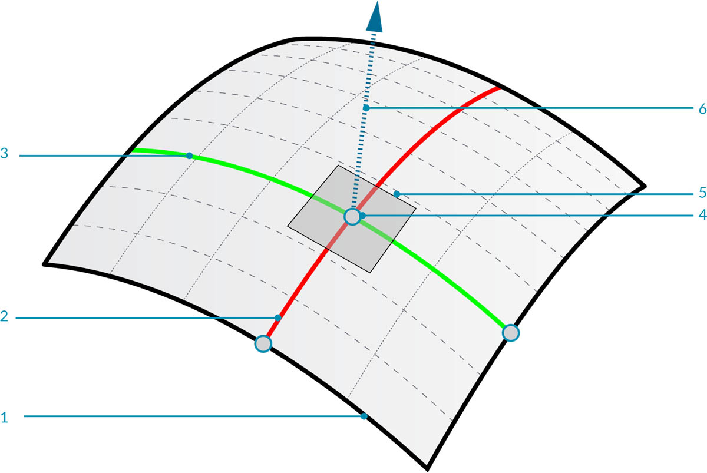

## 표면

모델에서 곡선을 사용하는 방식에서 표면을 사용하는 방식으로 전환하면서 보이는 객체를 3D 표준으로 나타낼 수 있게 되었습니다. 곡선이 항상 평면형인 것은 아닙니다. 곡선은 3차원에 있지만 정의되는 공간이 항상 하나의 차원에 묶이게 되는 것입니다. 표면은 다른 모델링 작업에서 사용할 수 있는 추가 특성 모음과 다른 차원을 제공해 줍니다.

### 표면이란 무엇입니까?

표면은 함수와 두 개의 매개변수로 정의되는 수학적 모양으로, 곡선을 위한 ```t``` 대신, ```U``` 및 ```V```를 사용하여 해당 매개변수 공간을 설명합니다. 즉, 이 유형의 형상으로 작업하는 경우 더 많은 기하학적 데이터를 그려야 합니다. 예를 들어 곡선에는 접선 벡터와 법선 평면(곡선의 길이를 따라 회전 또는 비틀릴 수 있음)이 있지만, 표면에는 방향이 일치하는 법선 벡터와 접선 평면이 있습니다.



> 1. 표면
2. U Iso 곡선
3. V Iso 곡선
4. UV 좌표
5. 수직 평면
6. 법선 벡터

**표면 도메인**: 표면 도메인은 해당 곡면의 3D 점으로 평가되는 (U,V) 매개변수의 범위로 정의됩니다. 각 차원(U 또는 V)의 도메인은 일반적으로 두 개의 숫자(U 최소값~U 최대값)와 (V 최소값~V 최대값)로 기술됩니다.


표면의 모양이 "직사각형"처럼 보이지 않고 위치상 보다 조밀하거나 느슨한 Iso 곡선 세트를 포함할 수 있지만, 해당 도메인으로 정의된 "공간"은 항상 2D입니다. Dynamo에서 표면은 항상 U와 V 방향 모두에서 최소값 0.0 및 최대값 1.0으로 정의된 도메인을 가지는 것으로 인식됩니다. 평면 또는 잘린 표면은 다른 도메인을 가질 수 있습니다.

**Iso 곡선**(또는 아이소파라메트릭 곡선): 곡면의 상수 U 또는 V 값과 해당하는 다른 U 또는 V 방향에 대한 값 도메인으로 정의되는 곡선입니다.

**UV 좌표**: U, V 및 경우에 따라 W로 정의되는 UV 매개변수 공간의 점입니다.


**수직 평면**: 지정된 UV 좌표에서 U 및 V Iso 곡선 모두에 수직인 평면입니다.

**법선 벡터**: 수직 평면을 기준으로 "위쪽" 방향을 정의하는 벡터입니다.

### NURBS 표면

**NURBS 표면**은 NURBS 곡선과 매우 유사합니다. NURBS 표면을 양방향으로 이동하는 NURBS 곡선의 그리드로 생각할 수 있습니다. NURBS 표면의 모양은 U 및 V 방향의 여러 제어점 및 해당 표면의 각도에 따라 정의됩니다. 동일한 알고리즘을 사용하여 제어점, 가중치 및 각도를 통해 모양, 법선, 접선, 곡률 및 기타 특성을 계산할 수 있습니다.


NURBS 표면의 경우 사용자에게 표시되는 모양에 관계없이 제어점의 직사각형 그리드이므로 형상이 내포하는 두 개의 방향이 있습니다. 이러한 방향은 종종 표준 좌표계에 상대적으로 임의 방향이지만, 모델을 분석하거나 표면을 따라 다른 형상을 생성하는 데 자주 사용됩니다.


> 1. 차수 (U,V) = (3,3)
2. 차수 (U,V) = (3,1)
3. 차수 (U,V) = (1,2)
4. 차수 (U,V) = (1,1)

### Polysurface

**Polysurface**는 모서리를 따라 결합된 표면으로 구성됩니다. Polysurface에서는 이제 토폴로지 방식에 따라 연결된 모양을 이동할 수 있다는 점에서 2D UV 정의 이상의 기능을 제공합니다.

> “토폴로지”는 일반적으로 부분이 연결되는 방식 및/또는 Dynamo의 관련 토폴로지가 형상 유형이 되는지에 대한 개념을 설명합니다. 구체적으로 토폴로지는 표면, Polysurface 및 솔리드의 상위 카테고리입니다.


이러한 방식으로 표면을 결합하면(패치라고도 함) 이음새를 가로질러 상세정보를 정의할 뿐만 아니라 좀 더 복잡한 모양을 만들 수 있습니다. Polysurface의 모서리에는 모깎기 또는 모따기 작업을 편리하게 적용할 수 있습니다.

그러면 Dynamo의 매개변수에서 표면을 가져와 평가하여 추출할 수 있는 정보의 종류를 알아보겠습니다.


> 1. *Surface.PointAtParameter*는 지정된 UV 좌표의 점을 반환합니다.
2. *Surface.NormalAtParameter*는 지정된 UV 좌표의 법선 벡터를 반환합니다.
3. *Surface.GetIsoline*은 U 또는 V 좌표에서 Isoparametric 곡선을 반환합니다. IsoDirection 입력을 확인해 주십시오.
> 이 이미지와 함께 제공되는 예제 파일을 다운로드하십시오(마우스 오른쪽 버튼을 클릭하고 "다른 이름으로 링크 저장..." 선택). 예제 파일의 전체 리스트는 부록에서 확인할 수 있습니다.

> 1. [계산 방식 설계를 위한 형상 - Surfaces.dyn](datasets/5-5/Geometry for Computational Design - Surfaces.dyn)
2. [Surface.sat](datasets/5-5/Surface.sat)

