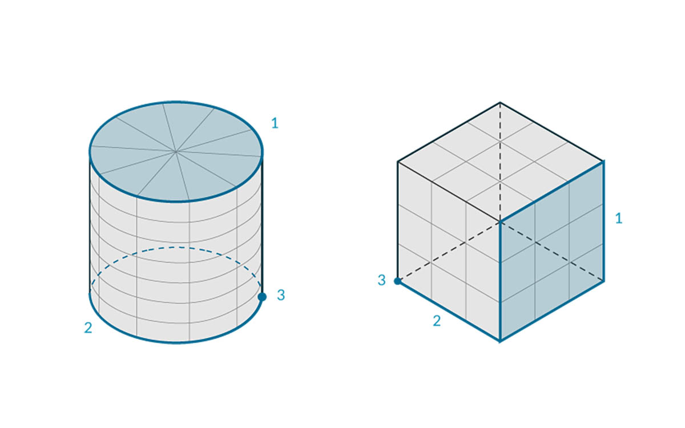
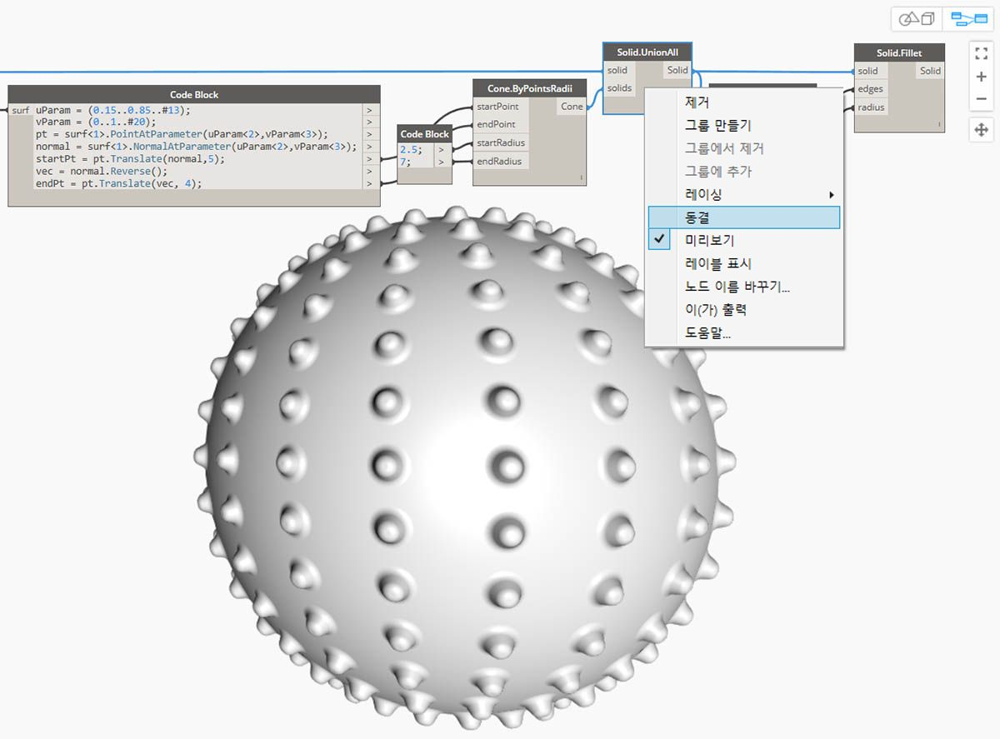
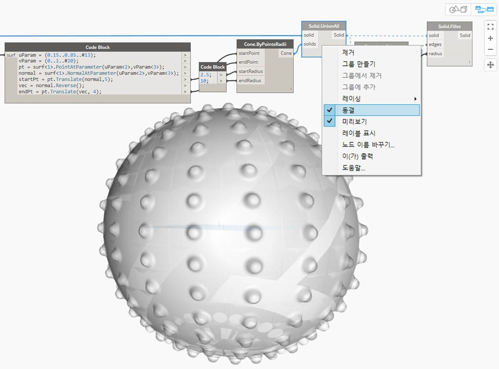
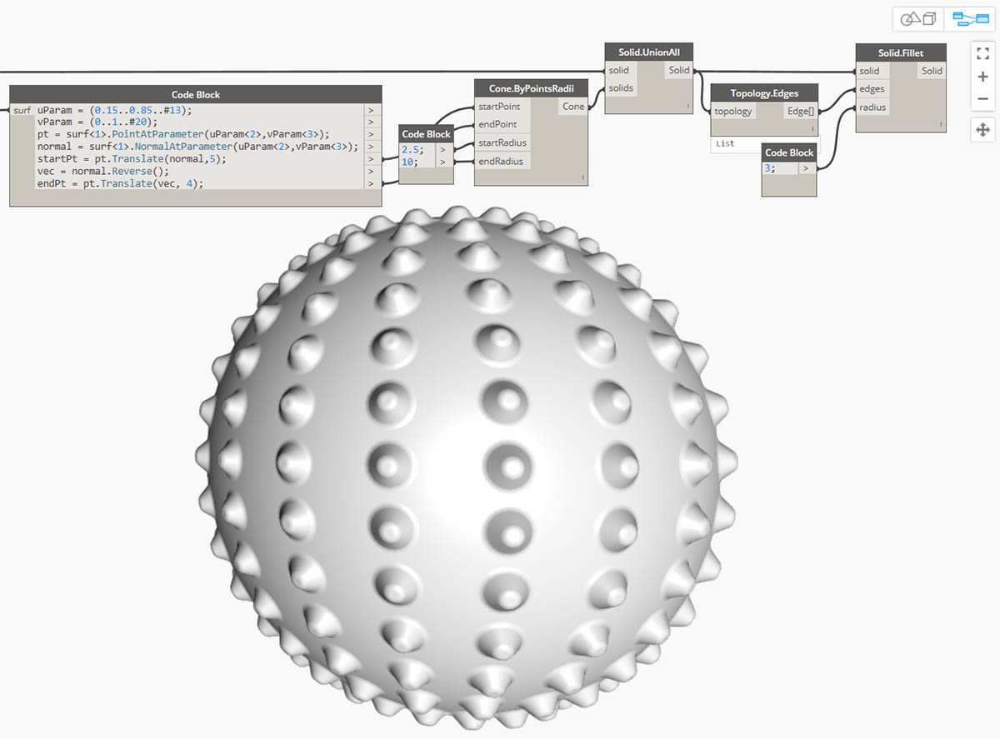

## 솔리드

단일 표면에서는 작성할 수 없는 보다 복잡한 모델을 구성하려고 하거나 명시적인 볼륨을 정의하려는 경우 이제 솔리드(및 Polysurface) 영역을 도입해야 합니다. 단순한 정육면체라도 면당 1개씩 6개의 표면이 필요할 정도로 충분히 복잡하다고 할 수 있습니다. 솔리드의 경우 표면에서는 제공하지 않는 두 가지 핵심 개념인 세부적인 토폴로지 설명(면, 모서리, 정점)과 부울 연산을 활용할 수 있습니다.

### 솔리드란 무엇입니까?

솔리드는 "내부" 또는 "외부"를 정의하는 닫힌 경계 방식에 따라 체적을 포함하는 하나 이상의 표면으로 구성됩니다. 이러한 표면의 수에 관계없이 솔리드로 간주되는 "수밀" 체적을 형성해야 합니다. 솔리드는 표면 또는 Polysurface를 함께 결합하거나 로프트, 스윕 및 회전과 같은 작업을 사용하여 작성할 수 있습니다. 구, 정육면체, 원추 및 원통 원형도 솔리드입니다. 하나 이상의 면이 제거된 정육면체는 몇 가지 유사한 특성이 있지만 솔리드가 아닌 Polysurface로 계산됩니다.

> 1. 평면은 솔리드가 아닌 단일 표면으로 구성됩니다.
2. 구는 하나의 표면으로 구성되지만 솔리드*입니다*.
3. 원추는 솔리드를 만들기 위해 서로 결합된 두 개의 표면으로 구성됩니다.
4. 원통은 솔리드를 만들기 위해 서로 결합된 세 개의 표면으로 구성됩니다.
5. 큐브는 솔리드를 만들기 위해 서로 결합된 6개의 표면으로 구성됩니다.

### 위상

솔리드는 정점, 모서리 및 면의 세 가지 요소 유형으로 구성됩니다. 면은 솔리드를 구성하는 표면입니다. 모서리는 인접한 면 사이의 연결을 정의하는 곡선이며, 정점은 이러한 곡선의 시작점과 끝점입니다. 이러한 요소는 위상 노드를 사용하여 조회할 수 있습니다.

> 1. 면
2. 모서리
3. 정점

### 작업

솔리드는 해당 모서리를 모깎기 또는 모따기하여 날카로운 모서리와 각을 제거하는 방식으로 수정할 수 있습니다. 모따기 작업을 수행하면 두 면 사이에 직선보간 표면이 작성되지만, 모깎기를 수행하면 면 사이에서 혼합되어 접선이 유지됩니다. 

> 1. 솔리드 정육면체
2. 모따기된 정육면체
3. 모깎기된 정육면체

### 부울 연산

솔리드 부울 연산은 두 개 이상의 솔리드를 결합하는 방법입니다. 하나의 부울 연산은 실제로는 다음 4가지 연산을 수행하는 것을 의미합니다.

1. 두 개 이상의 객체를 **교차**시킵니다.
2. 교차점에서 **분할**합니다.
3. 형상의 원치 않는 부분을 **삭제**합니다.
4. 모든 항목을 다시 **결합**합니다.

이렇게 솔리드 부울은 시간을 절약해 주는 강력한 프로세스의 역할을 합니다. 유지할 형상 부분을 구분하는 솔리드 부울 연산에는 다음 세 가지가 있습니다. 

> 1. **Union:** 솔리드의 겹치는 부분을 제거하고 단일 솔리드로 결합합니다.
2. **Difference:** 한 솔리드에서 다른 솔리드를 뺍니다. 빼려는 솔리드를 도구라고 하는데, 도구로 사용할 솔리드를 전환하여 역체적을 유지할 수도 있습니다.
3. **Intersection:** 두 솔리드의 교차 체적만 유지합니다.

이러한 세 가지 연산 외에도 Dynamo에는 여러 솔리드로 차이 및 결합 연산을 수행하기 위한 **Solid.DifferentAll** 노드와 **Solid.UnionAll** 노드가 있습니다. 

> 1. **UnionAll:** 구와 바깥쪽 방향의 원추를 사용한 결합 연산입니다.
2. **DifferenceAll:** 구와 안쪽을 향하는 원추를 사용한 차이 연산입니다.

몇 가지 부울 연산을 사용하여 작은 뿔이 여러 개 있는 구를 만들어 보겠습니다.

> 1. **Sphere.ByCenterPointRadius**: 기준 솔리드를 작성합니다.
2. **Topology.Faces**, **Face.SurfaceGeometry**: 솔리드의 면을 조회하고 표면 형상으로 변환합니다. 이 경우 구에는 하나의 면만 있습니다.
3. **Cone.ByPointsRadians**: 표면의 점을 사용하여 원추를 구성합니다.
4. **Solid.UnionAll**: 원추와 구를 결합합니다.
5. **Topology.Edges**: 새 솔리드의 모서리를 조회합니다.
6. **Solid.Fillet**: 작은 뿔이 여러 개 있는 구의 모서리를 모깎기합니다.
> 이 이미지와 함께 제공되는 예제 파일을 다운로드하십시오(마우스 오른쪽 버튼을 클릭하고 "다른 이름으로 링크 저장..." 선택). 예제 파일의 전체 리스트는 부록에서 확인할 수 있습니다. [계산 방식 설계를 위한 형상 - Solids.dyn](datasets/5-6/Geometry for Computational Design - Solids.dyn)

### 동결

부울 연산은 복잡하므로 계산 속도가 느려질 수 있습니다. 동결 기능을 사용하여 선택한 노드 및 영향을 받은 다운스트림 노드의 실행을 일시 중단할 수 있습니다.

> 마우스 오른쪽 버튼을 클릭할 때 표시되는 상황별 메뉴를 사용하여 솔리드 결합 작업을 동결합니다.

> 선택한 노드와 모든 다운스트림 노드를 연회색 가상 모드로 미리 볼 수 있으며, 영향을 받는 와이어는 파선으로 표시됩니다. 영향을 받는 형상 미리보기도 가상으로 표시됩니다. 그러면 부울 결합을 계산하지 않고 값 업스트림을 변경할 수 있습니다.

> 노드를 동결 해제하려면 마우스 오른쪽 버튼을 클릭하고 동결을 선택 취소합니다.

> 영향을 받는 모든 노드와 연관된 형상 미리보기가 업데이트되고 표준 미리보기 모드로 되돌아갑니다.

