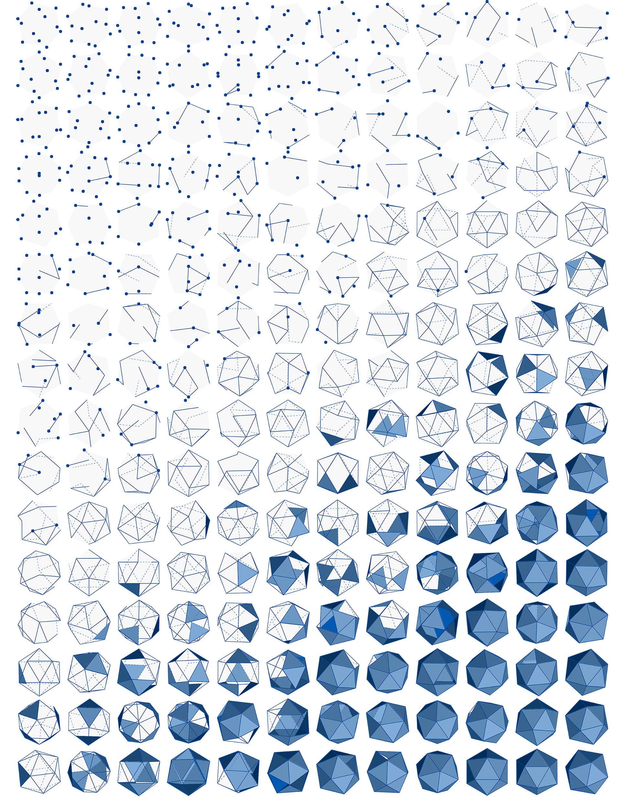

# 계산 방식 설계를 위한 형상

시각적 프로그래밍 환경인 Dynamo를 사용하면 데이터가 처리되는 방식을 조작할 수 있습니다. 데이터는 숫자나 문자이지만 형상도 마찬가지입니다. 컴퓨터의 입장에서 이해한다면, 형상(경우에 따라 계산 형상이라고도 함)은 세련되거나 정교한 성능 중심의 모델을 작성하는 데 사용할 수 있는 데이터라고 할 수 있습니다. 이렇게 조작하려면 사용할 수 있는 다양한 형상 유형을 속속들이 이해해야 합니다.

