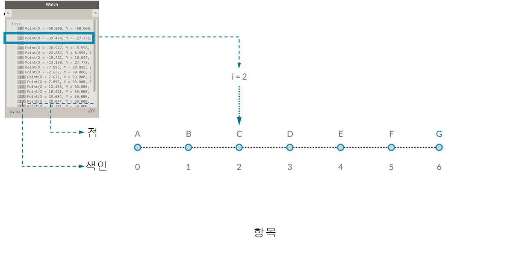
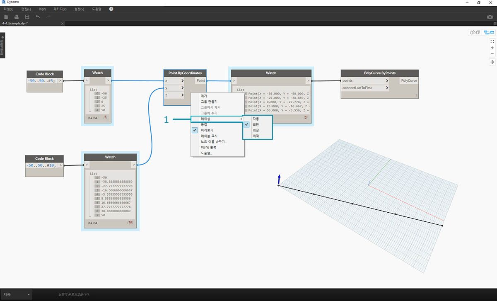
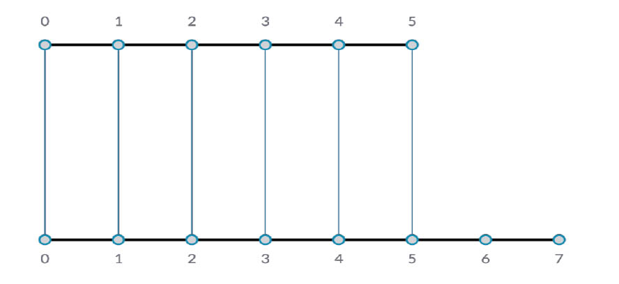
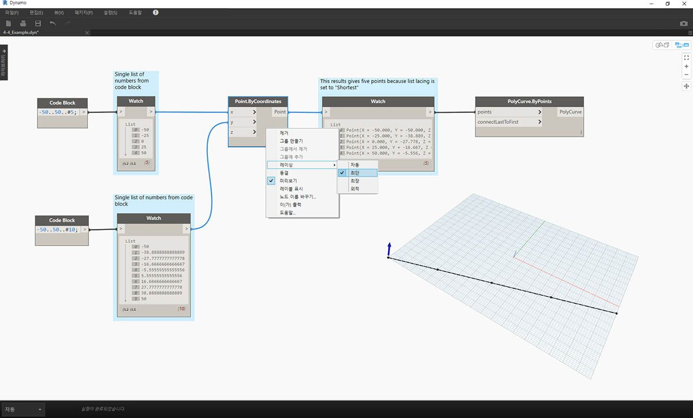
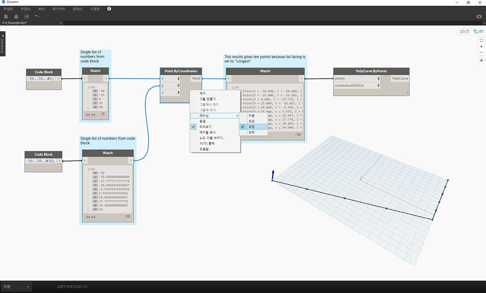
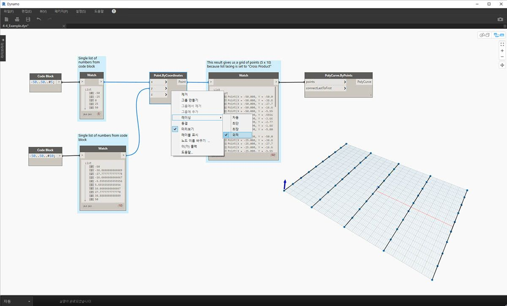

## 리스트란?

리스트는 요소 또는 항목의 모음입니다. 예를 들어 바나나 묶음을 고려해보십시오. 각 바나나는 리스트(또는 묶음) 내의 항목입니다. 각 바나나를 따로 잡는 것보다 바나나 묶음을 잡는 것이 더 쉬운데, 이는 데이터 구조의 파라메트릭 관계에 따라 요소를 그룹화하는 경우에도 마찬가지입니다.

> 사진: [Augustus Binu](https://commons.wikimedia.org/wiki/File:Bananas_white_background_DS.jpg?fastcci_from=11404890&c1=11404890&d1=15&s=200&a=list)

식료품을 구입할 때는 구입한 모든 항목을 바구니에 넣습니다. 이 바구니 또한 리스트입니다. 바나나 빵을 만들려면 3묶음의 바나나가 필요합니다(바나나 빵을 *많이* 만드는 경우). 이 바구니는 바나나 묶음 리스트를 나타내고 각 묶음은 바나나 리스트를 나타냅니다. 바구니는 리스트의 리스트(2차원)이고 바나나는 리스트(1차원)입니다.

Dynamo에서는 리스트 데이터가 정렬되고, 각 리스트의 첫 번째 항목은 색인 "0"을 갖습니다. 아래에서는 Dynamo에서 리스트가 정의되는 방법과 여러 리스트가 서로 어떻게 연관되는지 알아보겠습니다.

## 0부터 시작하는 색인

처음에 다소 이상해 보일 수 있는 점은 리스트의 첫 번째 색인이 항상 1이 아니라 0이라는 것입니다. 따라서 리스트의 첫 번째 항목이라고 하면 실제로 색인 0에 해당하는 항목을 의미합니다.

예를 들어 오른손의 손가락 수를 셀 경우 1에서 5까지 셀 수 있습니다. 그러나 손가락을 하나의 리스트에 포함하면 Dynamo에서는 0부터 4까지의 색인을 지정할 것입니다. 프로그래밍 초보자에게는 다소 이상해 보일 수 있지만 대부분의 계산 시스템에서는 0부터 시작하는 색인이 표준 방식입니다.

리스트에는 항목이 5개 있으며, 해당 리스트에서는 0부터 시작하는 계산 시스템을 사용합니다. 리스트에 저장되는 항목은 숫자일 필요가 없습니다. 점, 곡선, 표면, 패밀리 등 Dynamo에서 지원하는 어떤 데이터 유형도 될 수 있습니다.

종종 리스트에 저장된 데이터 유형을 확인하는 가장 쉬운 방법은 watch 노드를 다른 노드의 출력에 연결하는 것입니다. 기본적으로 watch 노드에서는 자동으로 리스트 왼쪽에 모든 색인이 표시되고 오른쪽에 데이터 항목이 표시됩니다.

이러한 색인은 리스트로 작업할 때 중요한 요소입니다.

### 입력 및 출력

리스트와 관련해서, 입력 및 출력은 사용 중인 Dynamo 노드에 따라 달라집니다. 예를 들어 5개의 점 리스트를 사용하며, 이 출력을 두 개의 다른 Dynamo 노드인 *PolyCurve.ByPoints* 및 *Circle.ByCenterPointRadius*에 연결해 보겠습니다.

> 1. *PolyCurve.ByPoints*의 *points* 입력의 경우 *"Point[]"*를 찾습니다. 이는 점 리스트를 나타냅니다.
2. *PolyCurve.ByPoints*의 출력은 점 5개의 리스트에서 작성된 단일 PolyCurve입니다.
3. *Circle.ByCenterPointRadius*의 *centerPoint* 입력의 경우 *"Point"*를 요청합니다.
4. *Circle.ByCenterPointRadius*의 출력은 중심이 점의 원래 리스트에 해당하는 원 5개의 리스트입니다.

*PolyCurve.ByPoints* 및 *Circle.ByCenterPointRadius*의 입력 데이터는 동일하지만, Polycurve 노드에서는 하나의 polycurve를 제공하며, Circle 노드에서는 각 점에 중심이 있는 5개의 원을 제공합니다. 즉, polycurve는 5개의 점을 연결하는 곡선으로 그려지고, 원은 각 점에 서로 다른 원을 작성합니다. 그렇다면 데이터는 어떻게 될까요?

*Polycurve.ByPoints*의 *points* 입력 위에 커서를 놓으면 해당 입력이 *"Point[]"*를 찾는 것을 확인할 수 있습니다. 끝에 각괄호가 있다는 점에 유의하십시오. 이는 점 리스트를 나타내며, polycurve를 작성하려는 경우 입력은 각 polycurve에 대한 리스트여야 합니다. 따라서 이 노드에서는 각 리스트를 하나의 polycurve로 압축합니다.

반면, *Circle.ByCenterPointRadius*의 *centerPoint* 입력에서는 *"Point"*를 요청합니다. 이 노드에서는 원의 중심점을 정의하기 위한 항목으로 하나의 점을 찾습니다. 바로 이 때문에 입력 데이터에서 5개의 원을 얻게 되는 것입니다. 이렇게 Dynamo에서 입력과 다른 점을 인식하면 데이터 관리 시 노드가 작동하는 방식을 보다 잘 이해할 수 있습니다.

### 레이싱

명확한 솔루션이 없으면 데이터 일치는 문제가 됩니다. 이 문제는 노드가 다른 크기의 입력에 액세스할 수 있는 경우에 발생합니다. 데이터 일치 알고리즘을 변경하면 결과가 크게 달라질 수 있습니다.

점 사이에 선 세그먼트를 작성하는 노드가 있다고 상상해 보십시오(Line.ByStartPointEndPoint). 여기에는 다음과 같이 점 좌표를 제공하는 두 개의 입력 매개변수가 있습니다.

보시다시피 이러한 점 세트 사이에 선을 그리는 여러 가지가 있습니다. 레이싱 옵션은 노드의 중심을 마우스 오른쪽 버튼으로 클릭하고 "레이싱" 메뉴를 선택하여 찾을 수 있습니다.

### 기준 파일

> 이 연습과 함께 제공되는 예시 파일([Lacing.dyn](datasets/6-1/Lacing.dyn))을 다운로드하십시오(마우스 오른쪽 버튼을 클릭하고 "다른 이름으로 링크 저장..." 선택). 전체 예시 파일 리스트는 부록에서 확인할 수 있습니다.

아래의 레이싱 작업을 보여드리기 위해 이 기준 파일을 사용하여 최단 리스트, 최장 리스트 및 외적을 정의해 보겠습니다.

> 1. *Point.ByCoordinates*의 레이싱만 변경하고 위의 그래프의 다른 부분은 변경하지 않습니다.

#### 최단 리스트

가장 간단한 방법은 더 이상 짝을 지을 수 없을 때까지 입력을 일대일로 연결하는 것입니다. 이를 "최단 리스트" 알고리즘이라고 합니다. 다음은 Dynamo 노드의 기본 동작입니다.

> 레이싱을 *최단 리스트*로 변경하면 5개의 점으로 구성된 기본 대각선이 표시됩니다. 5개의 점은 더 짧은 리스트의 길이이므로 최단 리스트 레이싱은 한 리스트의 끝에 도달하면 중지됩니다.

#### 최장 리스트

"최장 리스트" 알고리즘은 더 이상 짝을 지을 수 없을 때까지 입력을 계속 연결하고 요소를 재사용합니다.

> 레이싱을 *최장 리스트*로 변경하면 수직으로 확장되는 대각선이 표시됩니다. 개념 다이어그램과 동일한 방법으로, 5개 항목 리스트의 마지막 항목이 반복되면서 더 긴 리스트의 길이에 도달합니다.

#### Cross Product

마지막으로 “외적” 메서드는 가능한 모든 연결을 설정합니다.

> 레이싱을 *외적*으로 변경하면 각 리스트 간에 모든 조합이 모여 5x10개의 점 그리드가 제공됩니다. 이는 현재 데이터가 리스트의 리스트라는 점을 제외하고, 위 개념 다이어그램에 표시된 것처럼 외적에 대한 동일한 데이터 구조입니다. polycurve를 연결하면 각 리스트가 X 값으로 정의되어 수직선의 행이 표시되는 것을 볼 수 있습니다.

