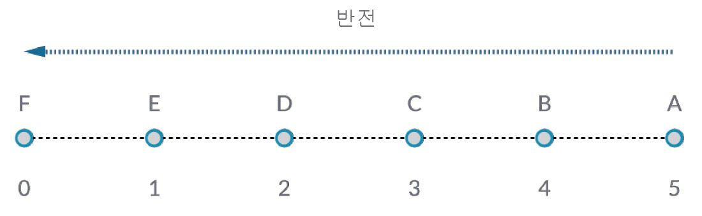
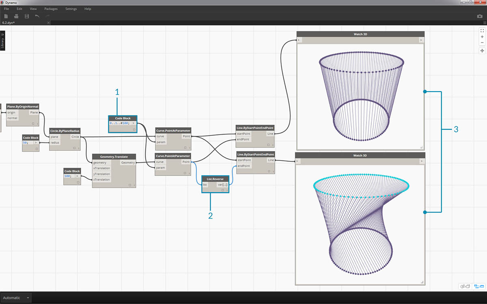
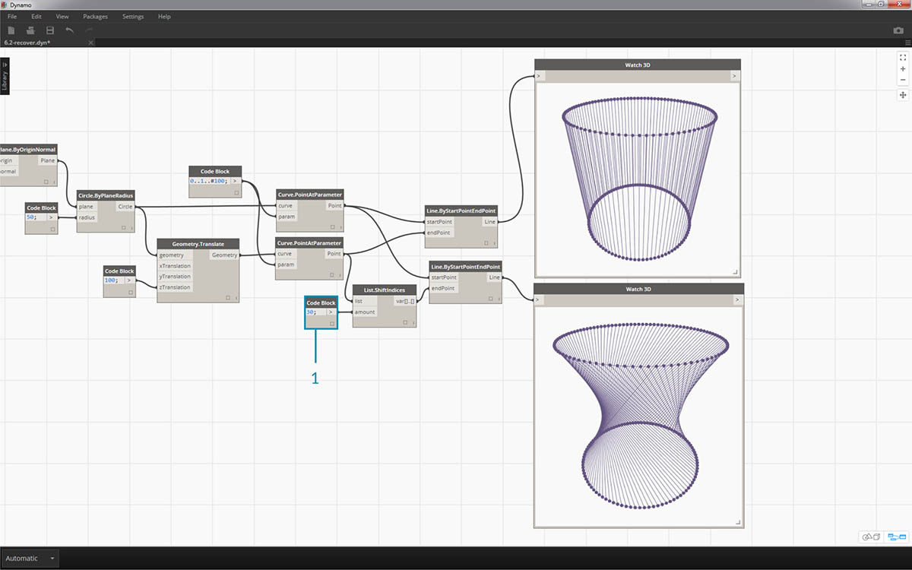
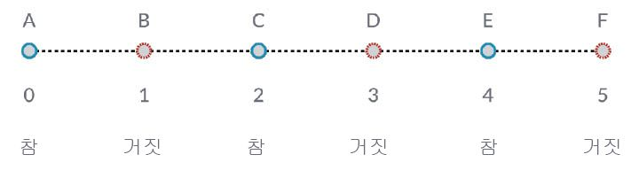

## 리스트 작업

지금까지 리스트가 무엇인지 확인했으므로 리스트에서 수행할 수 있는 작업에 대해 설명하겠습니다. 리스트가 하나의 게임 카드 세트라고 생각해 보십시오. 세트는 리스트이며, 각 카드는 하나의 항목을 나타냅니다.


> 사진 출처: [Christian Gidlöf](https://commons.wikimedia.org/wiki/File:Playing_cards_modified.jpg)

리스트에서는 어떤 **조회**를 만들 수 있을까요? 이러한 조회에서는 기존 특성을 확인합니다.

* 한 세트에 들어 있는 카드의 수는? 52.
* 짝을 이루는 패의 수는? 4.
* 재료? 종이.
* 길이는? 3.5" 또는 89mm.
* 폭은? 2.5" 또는 64mm.

리스트에서 수행할 수 있는 **작업**은 무엇일까요? 작업을 수행하면 해당 작업을 기준으로 리스트가 변경됩니다.

* 세트를 섞을 수 있습니다.
* 값별로 세트를 정렬할 수 있습니다.
* 짝을 이루는 패별로 세트를 정렬할 수 있습니다.
* 세트를 나눌 수 있습니다.
* 각 사람에게 카드를 나눠주기 위해 세트를 나눌 수 있습니다.
* 세트에서 특정 카드를 선택할 수 있습니다.

위에 나열된 모든 작업에는 일반 데이터 리스트로 작업할 수 있도록 비슷한 Dynamo 노드가 있습니다. 아래 단원에는 리스트에서 수행할 수 있는 기본적인 작업 중 일부가 나와 있습니다.

## 리스트 작업

아래의 이미지는 기본 리스트 작업을 보여주기 위해 사용할 기본 그래프입니다. 리스트 내의 데이터를 관리하는 방법을 살펴보고 시각적 결과를 예로 보여드리겠습니다.

#### 연습 - 리스트 작업

> 이 연습과 함께 제공되는 예시 파일([List-Operations.dyn](datasets/6-2/List-Operations.dyn))을 다운로드하십시오(마우스 오른쪽 버튼을 클릭하고 "다른 이름으로 링크 저장..." 선택). 전체 예시 파일 리스트는 부록에서 확인할 수 있습니다.


> 1. 값이 *500*인 ```code block```으로 시작합니다.
2. *Point.ByCoordinates* 노드의 *x* 입력에 연결합니다.
3. 이전 단계의 노드를 *Plane.ByOriginNormal* 노드의 원점 입력에 연결합니다.
4. *Circle.ByPlaneRadius* 노드를 사용하여 이전 단계의 노드를 평면 입력에 연결합니다.
5. *code block*을 사용하여 ```radius```에 대해 값 *50*을 지정합니다. 다음은 작성할 첫 번째 원입니다.
6. *Geometry.Translate* 노드를 사용하여 Z 방향으로 최대 100개 단위만큼 원을 이동합니다.
7. *code block* 노드에서 코드 줄 ```0..1..#10;```을 사용하여 0과 1 사이의 10개 숫자 범위를 정의합니다.
8. 이전 단계의 code block을 두 *Curve.PointAtParameter* 노드의 *param* 입력에 연결합니다. *Circle.ByPlaneRadius*를 최상위 노드의 곡선 입력에 연결하고 *Geometry.Translate*를 그 아래 노드의 곡선 입력에 연결합니다.
9. *Line.ByStartPointEndPoint*를 사용하여 두 *Curve.PointAtParameter* 노드를 연결합니다.


> 1. *Watch3D* 노드에서는 *Line.ByStartPointEndPoint*의 결과를 보여 줍니다. 두 원 사이에 선을 그려 기본 리스트 작업을 나타내고, 이 기준 Dynamo 그래프를 사용하여 아래의 리스트 작업을 살펴보겠습니다.

### List.Count


> *List.Count* 노드는 간단합니다. 리스트의 값 개수를 계산하고 해당 수를 반환합니다. 이 노드는 리스트의 리스트로 작업할 경우 미묘한 차이가 있으며, 이 내용은 다음 섹션에서 살펴보겠습니다.

#### 연습 - List.Count

> 이 연습과 함께 제공되는 예시 파일([List-Count.dyn](datasets/6-2/List-Count.dyn))을 다운로드하십시오(마우스 오른쪽 버튼을 클릭하고 "다른 이름으로 링크 저장..." 선택). 전체 예시 파일 리스트는 부록에서 확인할 수 있습니다.


> 1. *List.Count* 노드에서는 *Line.ByStartPointEndPoint* 노드의 줄 수를 반환합니다. 이 경우 해당 값은 원래 *code block* 노드에서 작성된 점 수와 일치하는 10입니다.

### List.GetItemAtIndex


> *List.GetItemAtIndex*는 기본적으로 리스트의 항목을 조회하는 기본적인 방법입니다. 위 이미지에서는 색인 *"2"*를 사용하여 *"C"* 레이블이 지정된 점을 조회합니다.

#### 연습 - List.GetItemAtIndex

> 이 연습과 함께 제공되는 예시 파일([List-GetItemAtIndex.dyn](datasets/6-2/List-GetItemAtIndex.dyn))을 다운로드하십시오(마우스 오른쪽 버튼을 클릭하고 "다른 이름으로 링크 저장..." 선택). 전체 예시 파일 리스트는 부록에서 확인할 수 있습니다.


> 1. *List.GetItemAtIndex* 노드를 사용하여 색인 *"0"* 또는 줄 리스트의 첫 번째 항목을 선택합니다.
2. *Watch3D* 노드에서는 하나의 줄을 선택한 것이 나타냅니다. 주: 위 이미지를 가져오려면 *Line.ByStartPointEndPoint*의 미리보기를 사용 안 함으로 설정해야 합니다.

### List.Reverse



> *List.Reverse*는 리스트의 모든 항목 순서를 반대로 합니다.

#### 연습 - List.Reverse

> 이 연습과 함께 제공되는 예시 파일([List-Reverse.dyn](datasets/6-2/List-Reverse.dyn))을 다운로드하십시오(마우스 오른쪽 버튼을 클릭하고 "다른 이름으로 링크 저장..." 선택). 전체 예시 파일 리스트는 부록에서 확인할 수 있습니다.



> 1. 반전된 줄 리스트를 올바르게 시각화하려면 code block을 ```0..1..#100;```으로 변경하여 더 많은 줄을 작성합니다.
2. 점 리스트 중 하나에 대해 *Curve.PointAtParameter*와 *Line.ByStartPointEndPoint* 사이에 *List.Reverse* 노드를 삽입합니다.
3. *Watch3D* 노드에서는 두 가지 다른 결과를 표시합니다. 첫 번째 항목에서는 반전된 리스트가 없는 결과를 보여 줍니다. 줄은 인접한 점에 수직으로 연결됩니다. 그러나 반전된 리스트에서는 모든 점을 다른 리스트에 반대 순서로 연결합니다.

### List.ShiftIndices


> *List.ShiftIndices*는 틀기 또는 나선형 패턴이나 기타 유사한 데이터 조작을 작성하는 데 유용한 도구입니다. 이 노드에서는 리스트의 항목을 지정된 색인만큼 이동합니다.

#### 연습 - List.ShiftIndices

> 이 연습과 함께 제공되는 예시 파일([List-ShiftIndices.dyn](datasets/6-2/List-ShiftIndices.dyn))을 다운로드하십시오(마우스 오른쪽 버튼을 클릭하고 "다른 이름으로 링크 저장..." 선택). 전체 예시 파일 리스트는 부록에서 확인할 수 있습니다.


> 1. 반전 리스트와 동일한 프로세스에서 *Curve.PointAtParameter* 및 *Line.ByStartPointEndPoint*에 *List.ShiftIndices*를 삽입합니다.
2. *code block*을 사용하여 리스트를 1개 색인만큼 이동하기 위해 값 *"1"*을 지정했습니다.
3. 변경된 정도는 미세하지만 다른 점 세트에 연결할 때 하단 *Watch3D* 노드의 모든 줄이 1개 색인만큼 이동되었습니다.



> 1. 예를 들어 *code block*을 더 큰 값인 *"30"*으로 변경하면 대각선이 크게 달라진다는 것을 알 수 있습니다. 이 경우 이동은 카메라의 홍채처럼 작동하여 원래의 원통형 형식에서 틀기가 작성됩니다.

### List.FilterByBooleanMask



> *List.FilterByBooleanMask*는 부울 리스트나 "true" 또는 "false" 값을 기준으로 특정 항목을 제거합니다.

#### 연습 - List.FilterByBooleanMask

> 이 연습과 함께 제공되는 예시 파일([List-FilterByBooleanMask.dyn](datasets/6-2/List-FilterByBooleanMask.dyn))을 다운로드하십시오(마우스 오른쪽 버튼을 클릭하고 "다른 이름으로 링크 저장..." 선택). 전체 예시 파일 리스트는 부록에서 확인할 수 있습니다.


> "true" 또는 "false" 값 리스트를 작성하려면 좀 더 많은 작업이 필요합니다.

> 1. *code block*을 사용하여 ```0..List.Count(list);``` 구문으로 표현식을 정의합니다. *Curve.PointAtParameter* 노드를 *list* 입력에 연결합니다. code block록 장에서 이 설정에 대해 좀 더 자세히 설명하겠지만, 이 경우에는 코드 줄에서 *Curve.PointAtParameter* 노드의 각 색인을 나타내는 리스트를 제공합니다.
2. *"%"*(modulus) 노드를 사용하여 *code block*의 출력을 *x* 입력에 연결하고 *4* 값을 *y* 입력에 연결합니다. 이렇게 하면 색인 리스트를 4로 나눈 나머지가 표시됩니다. Modulus는 패턴 작성에 매우 유용한 노드입니다. 모든 값은 가능한 나머지 4개(0, 1, 2, 3)로 표시됩니다.
3. *modulus* 노드에서 0 값은 색인이 4로 나누어떨어짐을 의미합니다(0,4,8 등). *"=="* 노드를 사용하면 *"0"* 값을 기준으로 테스트하여 나누어떨어지는지 테스트할 수 있습니다.
4. *Watch* 노드에서는 *true,false,false,false...*로 표시되는 true/false 패턴이 있음을 나타냅니다.
5. 이 true/false 패턴을 사용하여 두 *List.FilterByBooleanMask* 노드의 마스크 입력에 연결합니다.
6. *Curve.PointAtParameter* 노드를 *List.FilterByBooleanMask*의 각 리스트 입력에 연결합니다.
7. *Filter.ByBooleanMask*의 출력은 *"in"* 및 *"out"*으로 표시됩니다. *"In"*은 마스크 값이 *"true"*인 값을 나타내고 *"out"*은 마스크 값이 *"false"*인 값을 나타냅니다. *Line.ByStartPointEndPoint* 노드의 *"in"* 출력을 *startPoint* 및 *endPoint* 입력에 연결하여 필터링된 선 리스트를 작성했습니다.
8. *Watch3D* 노드에서는 점보다 선 수가 더 적은 것을 나타냅니다. true 값만 필터링하여 노드의 25%만 선택했습니다.

