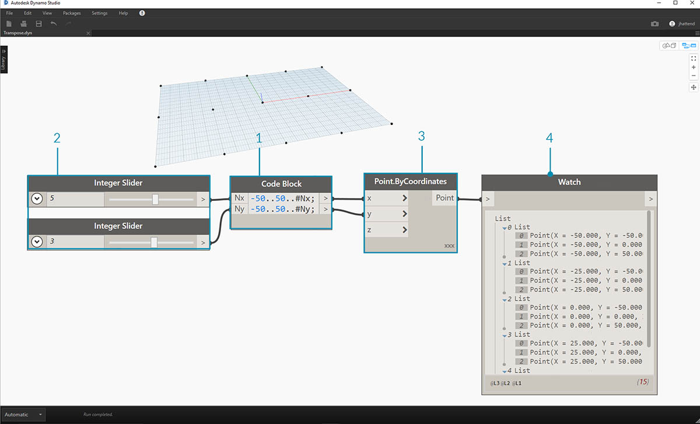
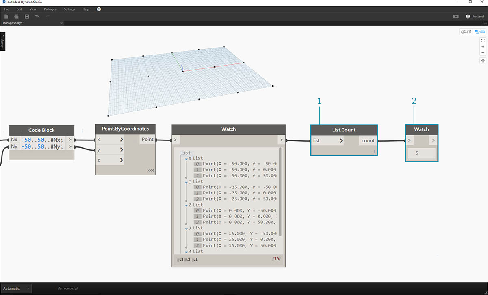
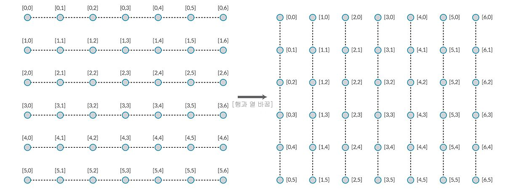
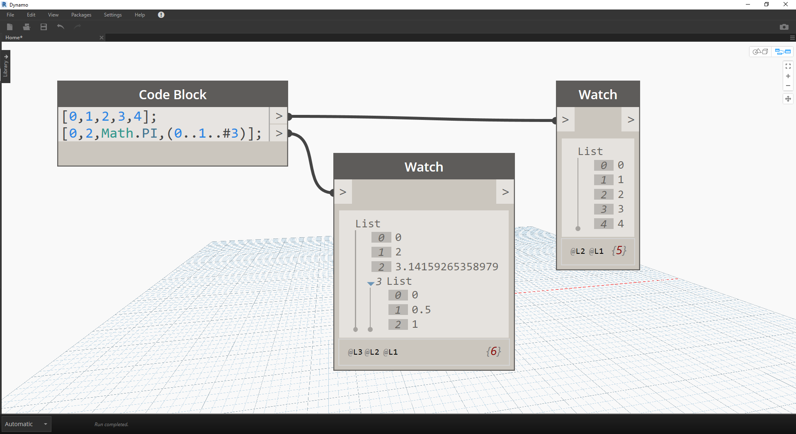
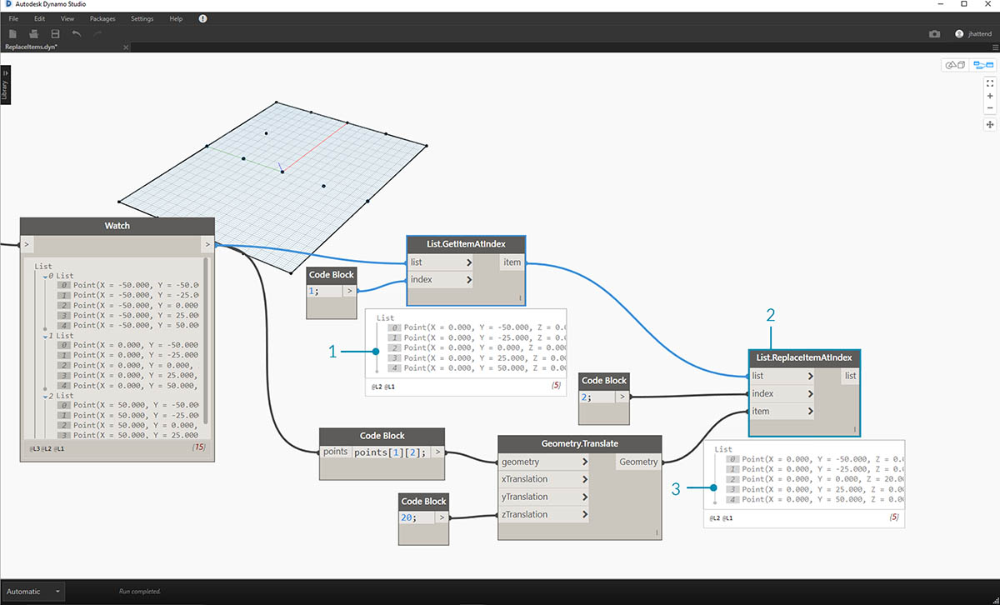
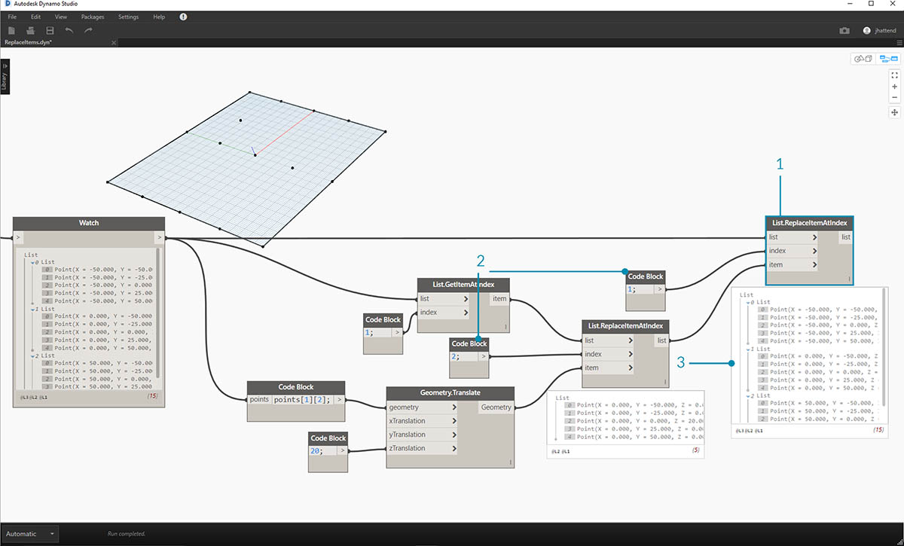

## 리스트의 리스트

계층에 티어를 하나 더 추가하겠습니다. 원래 예시에서 카드 데크를 가져와 여러 개의 데크가 포함된 상자를 작성하면 이제 상자에는 데크 리스트가 나타나고 각 데크에는 카드 리스트가 나타납니다. 이것은 리스트의 리스트입니다. 이 섹션의 내용을 바탕으로 유추해 보자면 아래의 빨간색 상자에는 동전 묶음 리스트가 포함되어 있고, 각 묶음에는 페니 리스트가 포함되어 있습니다.


> 사진 촬영: [Dori](https://commons.wikimedia.org/wiki/File:Stack_of_coins_0214.jpg)

리스트의 리스트에서 만들 수 있는 **조회**는 무엇일까요? 이러한 조회에서는 기존 특성을 확인합니다.

* 동전의 유형은 몇 가지입니까? 2.
* 각 동전 유형의 값은 얼마입니까? $0.01 및 $0.25입니다.
* 쿼터는 무엇으로 만들어졌습니까? 75%의 구리와 25%의 니켈로 만들어졌습니다.
* 페니는 무엇으로 만들어졌습니까? 97.5%의 아연과 2.5%의 구리로 만들어졌습니다.

리스트의 리스트에서 수행할 수 있는 **작업**은 무엇일까요? 작업을 수행하면 해당 작업을 기준으로 리스트의 리스트가 변경됩니다.

* 특정 쿼터 또는 페니의 스택을 선택합니다.
* 특정 쿼터 또는 페니를 선택합니다.
* 쿼터와 페니의 스택을 재정렬합니다.
* 스택을 한꺼번에 섞습니다.

다시 말씀드리지만, Dynamo에는 위에 나와 있는 각 작업과 유사한 노드가 있습니다. 우리는 물리적 객체가 아니라 추상 데이터로 작업하므로 데이터 계층을 위아래로 이동하는 방법을 제어하는 규칙 세트가 필요합니다.

리스트의 리스트를 다루는 경우에는 데이터가 겹쳐 있어 복잡하지만, 몇 가지 놀라운 파라메트릭 작업을 수행할 수 있습니다. 아래의 단원에서 기본 사항을 자세히 살펴보고 몇 가지 추가 작업에 대해 논의해 보겠습니다.

## 하향식 계층

이 섹션에서 배울 기본 개념은 **Dynamo에서는 리스트를 자체의 내부 객체로 취급한다**는 점입니다. 이 하향식 계층은 객체 지향적 프로그래밍을 염두에 두고 개발되었습니다. Dynamo에서는 List.GetItemAtIndex와 같은 명령으로 하위 요소를 선택하는 대신, 데이터 구조에서 주 리스트의 색인을 선택합니다. 그리고 해당 항목은 다른 리스트가 될 수 있습니다. 다음과 같이 예시 이미지로 자세히 살펴보겠습니다.

#### 연습 - 하향식 계층

> 이 연습과 함께 제공되는 예시 파일([Top-Down-Hierarchy.dyn](datasets/6-3/Top-Down-Hierarchy.dyn))을 다운로드하십시오(마우스 오른쪽 버튼을 클릭하고 "다른 이름으로 링크 저장..." 선택). 전체 예시 파일 리스트는 부록에서 확인할 수 있습니다.


> 1. *code block*을 사용하여 두 개의 범위(``` 0..2; 0..3; ```)를 정의했습니다.
2. 이러한 범위는 레이싱이 *"외적"*으로 설정된 *Point.ByCoordinates* 노드에 연결됩니다. 이렇게 하면 점 그리드가 작성되고, 또한 리스트의 리스트가 출력으로 반환됩니다.
3. *Watch* 노드에서는 각 리스트에 4개의 항목이 있는 3개의 리스트를 제공합니다.
4. 색인이 0인 *List.GetItemAtIndex*를 사용하는 경우 Dynamo에서는 첫 번째 리스트와 해당 컨텐츠를 모두 선택합니다. 다른 프로그램에서는 데이터 구조에 있는 모든 리스트의 첫 번째 항목을 선택하겠지만, Dynamo에서는 데이터를 다룰 때 하향식 계층을 채택합니다.

### Flatten 및 List.Flatten

Flatten을 사용하면 데이터 구조에서 데이터의 모든 티어가 제거됩니다. 이는 데이터 계층이 작업에 필요하지 않은 경우에 유용하지만, 정보가 제거되므로 위험할 수 있습니다. 아래 예에서는 데이터 리스트를 단순화한 결과를 보여줍니다.

#### 연습 - Flatten

> 이 연습과 함께 제공되는 예시 파일([Flatten.dyn](datasets/6-3/Flatten.dyn))을 다운로드하십시오(마우스 오른쪽 버튼을 클릭하고 "다른 이름으로 링크 저장..." 선택). 전체 예시 파일 리스트는 부록에서 확인할 수 있습니다.


> 1. 코드 줄을 하나 삽입하여 *code block*의 범위(``` -250..-150..#4; ```)를 정의합니다.
2. *code block*을 *Point.ByCoordinates* 노드의 *x* 및 *y* 입력에 플러깅하면 레이싱이 *"외적"*으로 설정되어 점의 그리드가 가져와집니다.
3. *Watch* 노드에서는 리스트의 리스트가 있음을 보여줍니다.
4. *PolyCurve.ByPoints* 노드에서는 각 리스트를 참조하고 각 polycurve를 작성합니다. Dynamo 미리보기에는 그리드의 각 행을 나타내는 4개의 polycurve가 있습니다.


> 1. polycurve 노드 앞에 *flatten*을 삽입하여 모든 점에 대해 하나의 리스트를 작성했습니다. polycurve 노드에서는 리스트를 참조하여 하나의 곡선을 작성하며, 모든 점은 하나의 리스트에 있으므로, 전체 점 리스트에서 실행되는 하나의 지그재그 polycurve를 얻게 됩니다.

또한 격리된 데이터 티어를 단순화할 수도 있습니다. List.Flatten 노드를 사용하면 계층 상단에서 단순화할 데이터 티어의 세트 수를 정의할 수 있습니다. 이는 워크플로우와 관련이 없을 수도 있는 복잡한 데이터 구조 문제로 고심하고 있는 경우에 정말 유용한 도구입니다. 또 다른 옵션은 List.Map에서 flatten 노드를 함수로 사용하는 것입니다. [List.Map](#listmap-and-listcombine)에 대해서는 아래에서 더 자세히 논의하겠습니다.

### 자르기

파라메트릭 모델링을 사용할 경우 기존 리스트에 데이터 구조를 더 추가해야 하는 경우도 있습니다. 여기에 여러 노드를 사용할 수도 있으며, chop이 가장 기본적인 버전입니다. chop을 사용하면 리스트를 설정된 항목 수의 하위 리스트로 분할할 수 있습니다.

#### 연습 - List.Chop

> 이 연습과 함께 제공되는 예시 파일([Chop.dyn](datasets/6-3/Chop.dyn))을 다운로드하십시오(마우스 오른쪽 버튼을 클릭하고 "다른 이름으로 링크 저장..." 선택). 전체 예시 파일 리스트는 부록에서 확인할 수 있습니다.


> *List.Chop _with a _subLength*의 값 2를 선택하면 각각 2개의 항목이 있는 리스트 4개가 작성됩니다.

chop 명령을 사용하면 지정된 리스트 길이를 기준으로 리스트가 분할됩니다. 어떤 면에서 chop은 flatten과 반대입니다. 즉, 데이터 구조를 제거하는 것이 아니라 새로운 티어를 데이터 구조에 추가합니다. 이 도구는 아래 예처럼 형상 작업에 유용한 도구입니다.


### List.Map 및 List.Combine

List.Map/Combine에서는 설정 기능을 입력 리스트에 적용하지만 계층에서 한 단계 아래에 적용합니다. 조합은 지정된 함수의 입력에 해당하는 여러 입력이 있을 수 있다는 점을 제외하고 맵과 동일합니다.

#### 연습 - List.Map

*참고: 이 연습은 이전 버전의 Dynamo로 작성되었습니다. List.Map 기능의 대부분은 List@Level 기능을 추가하여 해결되었습니다. 자세한 내용은 아래의 [List@Level](#listlevel)을 참조하십시오.*

> 이 연습과 함께 제공되는 예시 파일([Map.dyn](datasets/6-3/Map.dyn))을 다운로드하십시오(마우스 오른쪽 버튼을 클릭하고 "다른 이름으로 링크 저장..." 선택). 전체 예시 파일 리스트는 부록에서 확인할 수 있습니다.

간단한 소개 내용은 이전 섹션의 List.Count 노드를 살펴보십시오.


> *List.Count* 노드에서는 리스트의 모든 항목을 계산합니다. 이를 사용하여 *List.Map*의 작동 방식을 보여드리겠습니다.



> 1. *code block*에 다음 두 줄의 코드를 삽입합니다.

```
-50..50..#Nx;
-50..50..#Ny;
```

이 코드를 입력하면 code block에서 Nx와 Ny에 대한 두 개의 입력을 작성합니다.

2. 두 개의 *integer slider*를 사용하여 *Nx* 및 *Ny* 값을 *code block*에 연결하여 정의합니다.
3. code block의 각 줄을 *Point.ByCoordinates* 노드의 각 *X* 및 *Y* 입력에 연결합니다. 노드를 마우스 오른쪽 버튼으로 클릭하고 "레이싱"을 선택한 다음 *"외적"*을 선택합니다. 그러면 점의 그리드가 작성됩니다. 범위는 -50에서 50 사이로 정의했으므로 기본 Dynamo 그리드에 걸쳐 있습니다.
4. *Watch* 노드에 작성된 점이 표시됩니다. 데이터 구조를 알 수 있습니다. 리스트의 리스트를 작성했습니다. 각 리스트에는 그리드 점의 행이 나타납니다.



> 1. 이전 단계에서 Watch 노드의 출력에 *List.Count* 노드를 부착합니다.
2. *Watch* 노드를 List.Count 출력에 연결합니다.

List.Count 노드에서는 5 값을 제공합니다. 이는 code block에 정의된 "Nx" 변수와 동일합니다. 그 이유는 무엇일까요?

* 먼저, Point.ByCoordinates 노드에서는 리스트를 작성하기 위한 기본 입력으로 "x" 입력을 사용합니다. Nx가 5이고 Ny가 3인 경우 각각 3개의 항목이 포함된 리스트의 리스트를 5개 얻게 됩니다.
* Dynamo에서는 리스트를 자체의 내부 객체로 취급하므로 List.Count 노드가 계층의 주 리스트에 적용됩니다. 결과는 값 5 또는 주 리스트의 리스트 수입니다.


> 1. *List.Map* 노드를 사용하여 계층에서 한 단계 내려가 이 레벨에서 *"함수"*를 수행합니다.
2. *List.Count* 노드에 입력이 없습니다. 이 노드는 함수로 사용되고 있으므로 계층에서 한 단계 아래의 모든 개별 리스트에 *List.Count* 노드가 적용됩니다. *List.Count*의 빈 입력은 *List.Map*의 리스트 입력에 해당합니다.
3. 이제 *List.Count*의 결과로 각각 값이 3인 항목 5개의 리스트가 제공됩니다. 이는 각 하위 리스트의 길이를 나타냅니다.

#### 연습 - List.Combine

*참고: 이 연습은 이전 버전의 Dynamo로 작성되었습니다. List.Combine 기능의 대부분은 List@Level 기능을 추가하여 해결되었습니다. 자세한 내용은 아래의 *[*List@Level*](#listlevel)*을 참조하십시오.*

> 이 연습과 함께 제공되는 예시 파일([Combine.dyn](datasets/6-3/Combine.dyn))을 다운로드하십시오(마우스 오른쪽 버튼을 클릭하고 "다른 이름으로 링크 저장..." 선택). 전체 예시 파일 리스트는 부록에서 확인할 수 있습니다.

이 연습에서는 List.Map과 유사한 논리를 사용하되 여러 요소를 사용하겠습니다. 이 경우 곡선 리스트를 고유한 점 수로 분할하고자 합니다.


> 1. *code block*을 사용하는 경우, 그 줄 아래에서 구문 ```..20..#4; ```및 값 ```20; ```을 사용하여 범위를 정의합니다.
2. *code block*을 두 개의 *Point.ByCoordinates* 노드에 연결합니다.
3. *Point.ByCoordinates* 노드에서 *Line.ByStartPointEndPoint*를 작성합니다.
4. *Watch* 노드에 네 개의 선이 표시됩니다.


> 1. 선을 작성하기 위한 그래프 아래에서 _code block _을 사용하여 별개의 범위를 4개 작성해 선을 고유하게 분할할 수 있습니다. 다음 코드 줄에서 이 작업을 수행합니다.
```
0..1..#3;
0..1..#4;
0..1..#5;
0..1..#6;
```

2. *List.Create* 노드를 사용하여 *code block*의 선 4개를 하나의 리스트로 병합합니다.
3. *Watch* 노드에 리스트의 리스트가 표시됩니다.


> 1. *Curve.PointAtParameter*는 선을 *매개변수* 값에 직접 연결하면 작동하지 않습니다. 계층에서 한 단계 내려야 합니다. 이를 위해 *List.Combine*을 사용하겠습니다.


> *List.Combine*을 사용하면 각 선을 지정된 범위로 성공적으로 분할할 수 있습니다. 이는 약간 까다로우므로 자세히 살펴보겠습니다.

> 1. 먼저 *Curve.PointAtParameter* 노드를 캔버스에 추가합니다. 이 항목은 *_List.Combine 노드에 적용하는 *"function" _또는 *"combinator"*입니다. 곧 더 자세히 다루겠습니다.
2. 캔버스에 *List.Combine* 노드를 추가합니다. *"+"* 또는 *"-"*을 눌러 입력을 더하거나 뺍니다. 이 경우 노드에서 기본 입력 두 개를 사용합니다.
3. *Curve.PointAtParameter* 노드를 *List.Combine*의 *"comb"* 입력에 플러깅하려고 합니다. 또한 하나 이상의 중요한 노드인 경우 *_Curve.PointAtParameter의 "param" _입력*을 마우스 오른쪽 버튼으로 클릭하고 *"기본값 사용"*을 선택 취소합니다. 노드를 함수로 실행할 때 Dynamo 입력의 기본값을 제거해야 합니다. 즉, 추가 노드를 와이어링할 때 기본값을 고려해야 합니다. 따라서 이 경우에는 기본값을 제거해야 합니다.
4. 점을 작성하는 데는 선과 매개변수라는 두 가지 입력이 있습니다. 그러나 이들을 어떻게 어떤 순서로 *List.Combine* 입력에 연결해야 할까요?
5. *Curve.PointAtParameter*의 빈 입력을 맨 위부터 아래로 연결자에 동일한 순서로 채워야 합니다. 따라서 선이 *List.Combine*의 *list1*에 플러깅됩니다.
6. 마찬가지로 매개변수 값은 *List.Combine*의 *list2* 입력에 플러깅됩니다.
7. *Watch* 노드와 Dynamo 미리보기에서는 4개의 선이 있고 각 선이 *code block* 범위를 기반으로 분할되어 있음이 표시됩니다.

### List@Level

List.Map을 선호하는 경우 List@Level 기능을 통해 노드의 입력 포트에서 바로 작업할 리스트 레벨을 선택할 수 있습니다. 이 기능을 이용하면 노드의 모든 수신 입력에 적용할 수 있으며 다른 방법보다 쉽고 빠르게 리스트의 레벨에 액세스할 수 있습니다. 입력으로 사용할 리스트의 레벨만 노드에 지정하고 노드에서 나머지 작업을 수행하도록 합니다.

#### List@Level 연습

이 연습에서는 List@Level 기능을 사용하여 특정 레벨의 데이터를 격리할 것입니다.

> 이 연습과 함께 제공되는 예시 파일([List@Level](datasets/6-3/Listatlevel.dyn))을 다운로드하십시오(마우스 오른쪽 버튼을 클릭하고 "다른 이름으로 링크 저장..." 선택). 전체 예시 파일 리스트는 부록에서 확인할 수 있습니다.


> 1. 간단한 3D 점 그리드부터 시작하겠습니다.
2. 그리드는 X, Y, Z의 범위로 구성되기 때문에 데이터가 X 리스트, Y 리스트, Z 리스트의 3가지 티어로 구성됩니다.
3. 이러한 티어는 서로 다른 **레벨**에 존재합니다. 레벨은 미리보기 버블 아래에 표시됩니다. 리스트 레벨 열은 위 리스트 데이터에 해당하므로 그 안에서 작업할 레벨을 식별하는 데 도움이 됩니다.
4. 리스트 레벨은 가장 낮은 레벨 데이터가 항상 "L1"에 오도록 역순으로 구성됩니다. 그러면 그래프가 업스트림으로 변경되는 경우에도 계획대로 작동할지 확인할 수 있습니다.


> 1. List@Level 함수를 사용하려면 '>'을 클릭합니다. 이 메뉴 내에 두 개의 확인란이 있습니다.
2. **레벨 사용** - List@Level 기능을 사용할 수 있습니다. 이 옵션을 클릭하면 노드를 사용할 입력 리스트 레벨을 클릭하여 선택할 수 있습니다. 이 메뉴를 사용하면 위 또는 아래를 클릭하여 여러 레벨 옵션을 빠르게 시도할 수 있습니다.
3. **리스트 구조 유지** - 이 옵션을 사용하면 해당 입력의 레벨 구조를 유지할 수 있습니다. 경우에 따라 데이터를 고의적으로 하위 리스트로 구성했을 수 있습니다. 이 옵션을 선택하면 리스트 구성이 그대로 유지되고 정보가 손실되지 않습니다.

간단한 3D 그리드를 사용하면 리스트 레벨을 통해 전환하여 리스트 구조를 액세스하고 시각화할 수 있습니다. 각 리스트 레벨과 색인 조합은 원래 3D 세트의 서로 다른 점 세트를 반환합니다.


> 1. DesignScript의 "@L2"에서는 레벨 2의 리스트만 선택할 수 있습니다.
2. 색인 0이 있는 레벨 2의 리스트는 첫 번째 Y 점 세트만 포함하여 XZ 그리드만 반환합니다.
3. 레벨 필터를 "L1"로 변경하면 첫 번째 리스트 레벨의 모든 항목을 볼 수 있습니다. 색인 0이 있는 레벨 1의 리스트는 모든 3D 점을 단순 리스트로 포함합니다.
4. "L3"에 대해 동일한 작업을 시도하는 경우 세 번째 리스트 레벨 점만 표시됩니다. 색인 0이 있는 레벨 3의 리스트에는 첫 번째 Z 점 세트만 포함되며 XY 그리드만 반환됩니다.
5. "L4"에 대해 동일한 작업을 시도하는 경우 세 번째 리스트 레벨 점만 표시됩니다. 색인 0이 있는 레벨 4의 리스트에는 첫 번째 X 점 세트만 포함되며 YZ 그리드만 반환됩니다.

이 특정 예는 List.Map에서도 작성할 수 있지만 List@Level에서는 상호작용을 크게 단순화하여 노드 데이터에 쉽게 액세스할 수 있습니다. 아래에서 List.Map과 List@Level 방법을 서로 비교하며 살펴보십시오.


> 1. 두 방법 모두 동일한 지점에 대한 액세스를 제공하지만 List@Level 방법을 사용하면 단일 노드 내의 데이터 도면층 간에 쉽게 전환할 수 있습니다.
2. List.Map을 사용하여 점 그리드에 액세스하려면 List.Map과 함께 List.GetItemAtIndex 노드를 사용해야 합니다. 단계를 내려가는 모든 리스트 레벨마다 추가 List.Map 노드를 사용해야 합니다. 리스트의 복잡도에 따라 적절한 레벨의 정보에 액세스하려면 그래프에 상당한 양의 List.Map 노드를 추가해야 할 수 있습니다.
3. 이 예에서는 List.Map 노드가 있는 List.GetItemAtIndex 노드가 '@L3'이 선택된 List.GetItemAtIndex와 동일한 리스트 구조를 가진 동일한 점 세트를 반환합니다.

### Transpose

Transpose는 리스트의 리스트를 다룰 때 기본적인 함수입니다. 스프레드시트 프로그램과 마찬가지로 transpose는 데이터 구조의 열과 행을 반전합니다. 아래 기본 행렬을 사용하여 이 내용을 보여드리고, 다음 섹션에서는 Transpose를 사용하여 기하학적 관계를 작성할 수 있는 방법을 보여드리겠습니다.



#### 연습 - List.Transpose

> 이 연습과 함께 제공되는 예시 파일([Transpose.dyn](datasets/6-3/Transpose.dyn))을 다운로드하십시오(마우스 오른쪽 버튼을 클릭하고 "다른 이름으로 링크 저장..." 선택). 전체 예시 파일 리스트는 부록에서 확인할 수 있습니다.


> 이전 연습에서 *List.Count* 노드를 삭제하고 일부 형상으로 이동하여 데이터 구조 방식을 살펴보겠습니다.

> 1. *PolyCurve.ByPoints*를 *Point.ByCoordinates*의 Watch 노드의 출력에 연결합니다.
2. 출력에는 5개의 polycurve가 표시되며 Dynamo 미리보기에서는 곡선을 볼 수 있습니다. Dynamo 노드에서는 점 리스트(또는 이 경우 점 리스트의 리스트)를 찾고 여기에서 단일 polycurve를 작성합니다. 기본적으로 각 리스트가 데이터 구조에서 곡선으로 변환되었습니다.


> 1. 곡선의 한 행을 격리하려면 *List.GetItemAtIndex* 노드를 사용합니다.
2. *code block* 값 2를 사용하여 주 리스트에서 세 번째 요소를 조회합니다.
3. 한 개의 리스트만 노드에 연결되어 있으므로 *PolyCurve.ByPoints*에서는 하나의 곡선을 제공합니다.


> 1. *List.Transpose* 노드는 모든 항목을 리스트의 리스트에 있는 모든 리스트로 바꿉니다. 이 방법은 복잡하게 들리지만 Microsoft Excel의 transpose와 동일한 논리입니다. 즉, 데이터 구조에서 열을 행으로 바꿉니다.
2. 추상 결과 확인: transpose로 인해 리스트 구조가 각각 3개의 항목이 있는 5개의 리스트에서 각각 5개의 항목이 있는 3개의 리스트로 바뀌었습니다.
3. 기하학적 결과 확인: *PolyCurve.ByPoints*를 사용하여 원래 곡선에 수직 방향으로 3개의 polycurve가 표시됩니다.

### Code Block 작성

Code block 줄임에서는 "[]"을 사용하여 리스트를 정의합니다. 그러면 List.Create 노드보다 훨씬 빠르고 효율적인 방법으로 리스트를 작성할 수 있습니다. Code block에 대해서는 7장에 더 자세히 설명되어 있습니다. 아래 이미지를 참조하여 여러 표현식이 포함된 리스트를 code block으로 정의할 수 있는 방법을 확인하십시오.



### Code Block 조회

Code block 줄임에서는 복잡한 데이터 구조에서 원하는 특정 항목을 빠르고 쉽게 선택하는 방법으로 "[]"를 사용합니다. Code block에 대해서는 7장에 더 자세히 설명되어 있습니다. 아래 이미지를 참조하여 여러 데이터 유형이 포함된 리스트를 code block으로 조회할 수 있는 방법을 확인하십시오.


### 연습 - 데이터 조회 및 삽입

> 이 연습과 함께 제공되는 예시 파일([ReplaceItems.dyn](datasets/6-3/ReplaceItems.dyn))을 다운로드하십시오(마우스 오른쪽 버튼을 클릭하고 "다른 이름으로 링크 저장..." 선택). 전체 예시 파일 리스트는 부록에서 확인할 수 있습니다.

이 연습에서는 이전 연습에서 설정한 몇 가지 논리를 사용하여 표면을 편집합니다. 여기서 우리의 목표는 직관적이지만 데이터 구조 탐색 시 더욱 관련성을 높이는 것입니다. 우리는 제어점을 이동하여 표면을 분명하게 표현하려고 합니다.


> 1. 위 노드의 문자열로 시작합니다. 기본 Dynamo 그리드에 걸쳐 있는 기본 표면을 작성하고 있습니다.
2. *code block*을 사용하여 다음 두 코드 줄을 삽입하고 *Surface.PointAtParameter*의 *u* 및 *v* 입력에 각각 연결합니다.
```
-50..50..#3;
-50..50..#5;
```

3. *Surface.PointAtParameter*의 레이싱을 *"외적"*으로 설정해야 합니다.
4. *Watch* 노드에 각각 5개의 항목이 있는 리스트 3개의 리스트가 표시됩니다.


> 이 단계에서는 우리가 작성한 그리드의 중심점을 조회하려고 합니다. 이렇게 하려면 중간 리스트에서 중간 점을 선택합니다. 이해되시죠?

> 1. 이것이 올바른 점인지 확인하려면 Watch 노드 항목을 클릭하여 올바른 항목을 대상으로 하는지 확인할 수도 있습니다.
2. *code block*을 사용하여 다음과 같이 리스트의 리스트를 조회하기 위한 기본 코드 줄을 작성하겠습니다.<br xmlns="http://www.w3.org/1999/xhtml"/>```points[1][2];```
3. *Geometry.Translate*를 사용하여 선택한 점을 *Z* 방향으로 *20* 단위씩 위로 이동할 것입니다.


> 1. *List.GetItemAtIndex* 노드가 있는 점의 중간 행도 선택하겠습니다. 참고: 이전 단계와 마찬가지로, *points[1];* 줄을 사용하여 ```code block```으로 리스트를 조회할 수도 있습니다.



> 지금까지 중심점을 성공적으로 조회하여 위로 이동했습니다. 이제 이동한 이 점을 원래 데이터 구조에 다시 삽입해야 합니다.

> 1. 먼저, 이전 단계에서 격리한 리스트의 항목을 대치하려고 합니다.
2. *List.ReplaceItemAtIndex*를 사용하여 *"2"*의 색인으로 중간 항목을 이동된 점에 연결된 대치 항목(*Geometry.Translate*)으로 대치할 것입니다.
3. 이 출력은 이동된 점을 리스트의 중간 항목으로 입력했음을 보여줍니다.



> 이제 리스트를 수정했으므로 이 리스트를 원본 데이터 구조(리스트의 리스트)에 다시 삽입해야 합니다.

> 1. 동일한 논리 다음에 *List.ReplaceItemAtIndex*를 사용하여 중간 리스트를 수정된 리스트로 대치합니다.
2. 이러한 두 노드의 색인을 정의하는 *code block*은 1과 2이며, *code block*(*points[1][2]*)의 원래 조회와 일치합니다.
3. *index 1*에서 리스트를 선택하면 Dynamo 미리보기에 데이터 구조가 강조 표시됩니다. 이동된 점을 원래 데이터 구조에 병합했습니다.


> 이 점 세트에서 표면을 만드는 여러 가지 방법이 있습니다. 이 경우 곡선을 함께 로프트하여 표면을 작성하겠습니다.

> 1. *NurbsCurve.ByPoints* 노드를 작성하고 새 데이터 구조를 연결하여 세 개의 NURBS 곡선을 작성합니다.


> 1. *Surface.ByLoft*를 *NurbsCurve.ByPoints*의 출력에 연결합니다. 이제 수정된 표면이 있습니다. 형상의 원래 *Z* 값을 변경할 수 있습니다. 변환 후 형상 업데이트를 확인하십시오!

