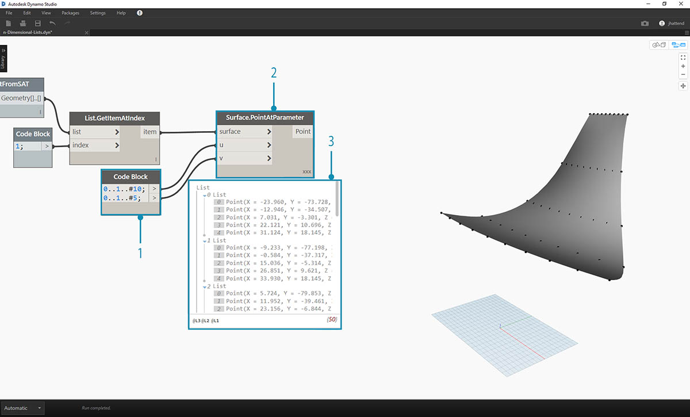
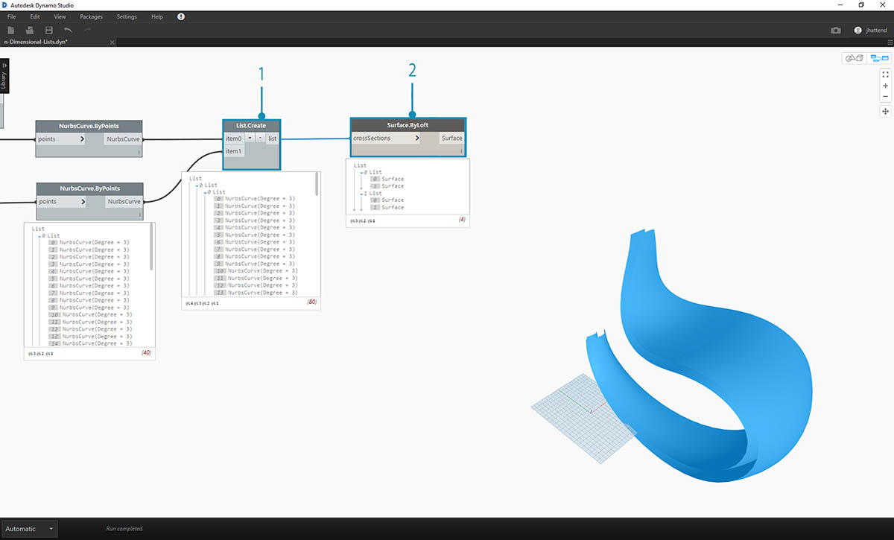
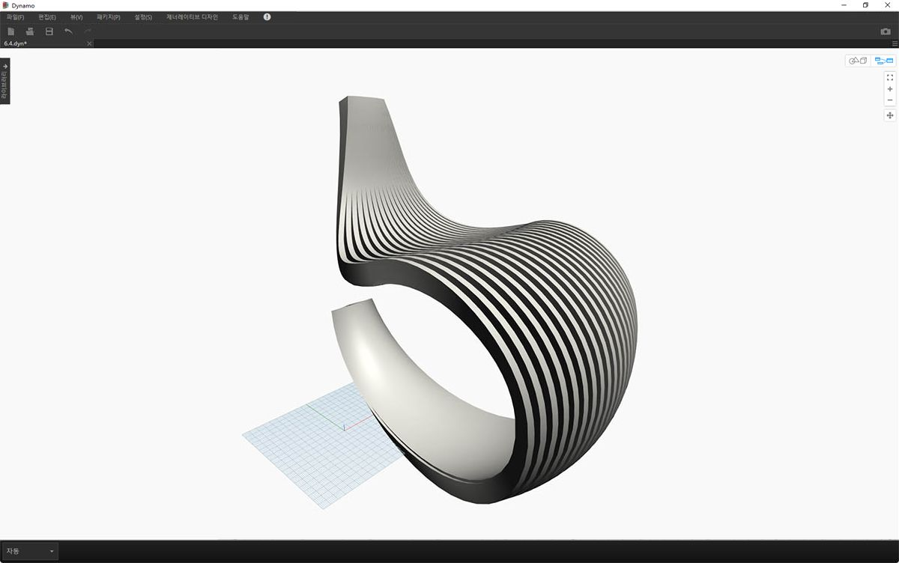
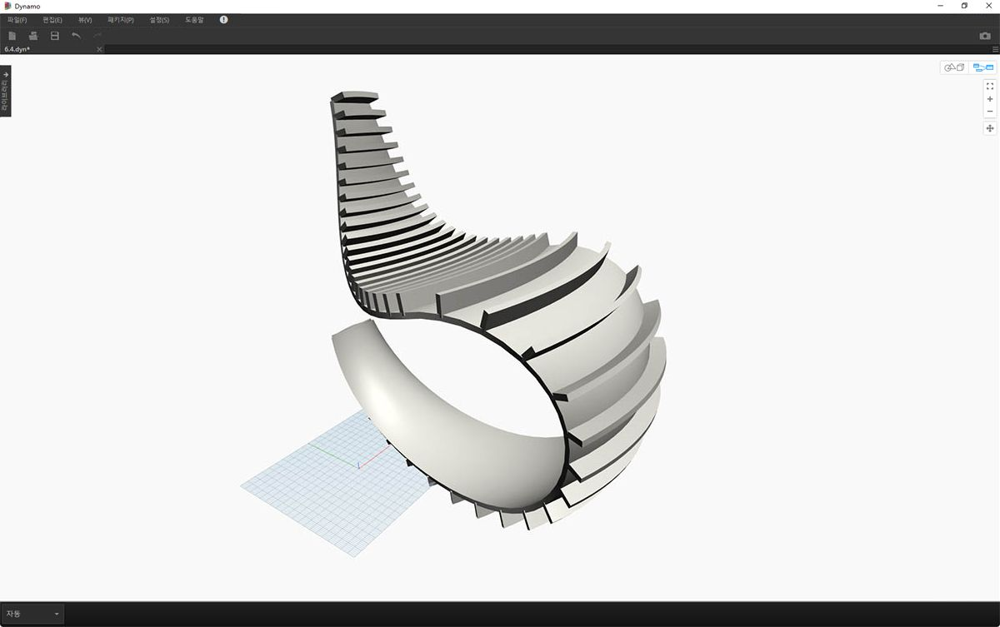

## n차원 리스트

토끼굴 더 아래로 내려가면서 계층에 더 많은 계층을 추가해 보겠습니다. 데이터 구조는 3차원 이상의 리스트의 리스트로 더 확장될 수 있습니다. 리스트는 Dynamo의 자체 항목이므로 가능한 많은 차원이 있는 데이터를 작성할 수 있습니다.

여기에서 작업하는 것은 러시아 마트료시카에 비유할 수 있습니다. 각 리스트는 여러 항목을 포함하는 하나의 컨테이너로 간주할 수 있습니다. 각 리스트는 고유한 특성을 가지며, 고유한 객체로 간주됩니다.


> 러시아 마트료시카(사진: [Zeta](https://www.flickr.com/photos/beppezizzi/145493363)) 세트는 n차원 리스트와 비슷합니다. 각 도면층은 리스트를 나타내고 각 리스트 안에는 항목이 포함되어 있습니다. Dynamo의 경우 각 컨테이너 안에는 여러 개의 컨테이너가 포함될 수 있습니다(각 리스트의 항목을 나타냄).

n차원 리스트는 시각적으로 설명하기 어렵지만, 이 장에서는 3차원 이상의 리스트를 중점적으로 다루는 몇 가지 연습을 진행해보겠습니다.

## 매핑 및 조합

매핑은 Dynamo의 데이터 관리에서 가장 복잡한 부분이며, 특히 리스트의 복잡한 계층 작업을 수행할 때와 관련이 있습니다. 아래에 제공되는 일련의 연습을 진행하면서 데이터가 다차원이 될 때 매핑 및 조합을 사용해야 하는 경우를 살펴보겠습니다.

List.Map 및 List.Combine은 이전 섹션에 미리 설명되어 있습니다. 아래의 마지막 연습에서는 복잡한 데이터 구조에서 이러한 노드를 사용해 보겠습니다.

### 연습 - 2D 리스트 - 기본

> 이 연습과 함께 제공되는 예시 파일을 다운로드하십시오(마우스 오른쪽 버튼을 클릭하고 "다른 이름으로 링크 저장..." 선택). 전체 예시 파일 리스트는 부록에서 확인할 수 있습니다.
1.[n-Dimensional-Lists.dyn](datasets/6-4/n-Dimensional-Lists.dyn) 
2.[n-Dimensional-Lists.sat](datasets/6-4/n-Dimensional-Lists.sat)

이 연습은 가져온 형상을 연결하는 3개의 연습 시리즈 중 첫 번째입니다. 이 연습 시리즈의 각 부분에서는 점점 더 복잡한 데이터 구조를 다룹니다.


> 1. 연습 파일 폴더에 있는 .sat 파일로 시작하겠습니다. *File Path* 노드를 사용하여 이 파일을 선택할 수 있습니다.
2. *Geometry.ImportFromSAT*를 사용하여 형상을 Dynamo 미리보기에 두 개의 표면으로 가져옵니다.


> 이 연습에서는 간단한 작업을 위해 표면 중 하나로 진행합니다.

> 1. 색인 *1*을 선택하여 위쪽 표면을 선택합니다. 이 작업은 *List.GetItemAtIndex* 노드에서 수행합니다.



> 다음 단계에서는 표면을 점 그리드로 분할합니다.

> 1. *code block*을 사용하여 다음 두 코드 줄을 삽입합니다.
```
0..1..#10;
0..1..#5;
```

2. *Surface.PointAtParameter*에서 두 code block 값을 *u *및 *v*에 연결합니다. 이 노드의 *레이싱*을 *"외적"*으로 변경합니다.
3. 출력에는 데이터 구조가 표시되며 Dynamo 미리보기에서도 이 구조를 볼 수 있습니다.


> 1. 데이터 구조가 구성되는 방식을 확인하기 위해 *NurbsCurve.ByPoints*를 *Surface.PointAtParameter*의 출력에 연결합니다.
2. 표면을 따라 수직으로 10개의 곡선이 표시됩니다.


> 1. 기본 *List.Transpose*를 사용하면 리스트의 리스트를 구성하는 열과 행이 반전됩니다.
2. *List.Transpose*의 출력을 *NurbsCurve.ByPoints*에 연결하면 이제 5개의 곡선이 표면을 가로질러 가로로 표시됩니다.

### 연습 - 2D 리스트 - 고급

좀 더 복잡한 작업을 수행해 보겠습니다. 이전 연습에서 작성한 곡선에 대해 작업을 수행하려고 한다고 가정해 보겠습니다. 이러한 곡선을 다른 표면과 연관 짓고 그 사이에서 로프트를 수행하고자 할 수도 있습니다. 이렇게 하려면 데이터 구조에 더 많은 신경을 써야 하지만 기본 논리는 동일합니다.


> 1. 이전 연습의 단계로 시작하고 *List.GetItemAtIndex* 노드를 사용하여 가져온 형상의 상단 표면을 구분합니다.


> 1. *Surface.Offset*을 사용하여 표면을 *10*씩 간격을 띄웁니다.


> 1. 이전 연습과 같은 방법으로 다음과 같은 코드 두 줄을 사용하여 *code block*을 정의합니다.
```
0..1..#10;
0..1..#5;
```

2. 이러한 출력을 두 개의 *Surface.PointAtParameter * 노드에 연결하고 각 *레이싱*을 *"외적"*으로 설정합니다. 이러한 노드 중 하나는 원래 표면에 연결되어 있고 다른 노드는 오프셋 표면에 연결되어 있습니다.


> 1. 이전 연습에서와 같이 출력을 두 개의 *NurbsCurve.ByPoints* 노드에 연결합니다.
2. Dynamo 미리보기에는 두 개의 표면에 해당하는 두 개의 곡선이 표시됩니다.


> 1. *List.Create*를 사용하면 두 곡선 세트를 한 리스트의 리스트로 결합할 수 있습니다.
2. 출력에서 각 NURBS 곡선 연결 세트를 나타내는 10개 항목을 각각 포함하는 리스트가 2개 생성됩니다.
3. *Surface.ByLoft*를 수행하면 이 데이터 구조를 시각적으로 이해할 수 있습니다. 이 노드에서는 각 하위 리스트의 모든 곡선을 로프트합니다.


> 1. *List.Transpose*를 사용하여 모든 열과 행을 반전합니다. 이 노드는 10개의 곡선으로 이루어진 2개의 리스트를 2개의 곡선으로 이루어진 10개의 리스트로 전송합니다. 이제 각 NURBS 곡선이 다른 표면의 이웃 곡선과 연관됩니다.
2. *Surface.ByLoft*를 사용하여 리브 구조에 도달합니다.


> 1. *List.Transpose* 대신 *List.Combine*을 사용할 수 있습니다. 이는 각 하위 리스트에서 *"연결자"*로 작동합니다.
2. 이 경우에는 *List.Create*를 *"연결자"*로 사용하여 하위 리스트에서 각 항목의 리스트를 작성합니다.
3. *Surface.ByLoft* 노드를 사용하여 이전 단계와 동일한 표면을 표시합니다. 이 경우 행과 열을 더 쉽게 바꿀 수 있지만 데이터 구조가 훨씬 복잡해지면 *List.Combine*을 사용하는 것이 더 안정적입니다.


> 1. 몇 단계 이전으로 되돌아가서 리브 구조의 곡선 방향을 전환하려면 *NurbsCurve.ByPoints*에 연결하기 전에 List.Transpose를 사용할 수 있습니다. 그러면 열과 행이 반전되어 5개의 수평 리브가 생성됩니다.

### 연습 - 3D 리스트

이제 한 단계 더 진행해 보겠습니다. 이 연습에서는 가져온 두 표면을 모두 사용하고 복합 데이터 계층을 작성합니다. 이번에도 동일한 기본 논리를 사용하여 동일한 작업을 완료하는 것이 작업 목표입니다.


> 1. 이전 연습에서 가져온 파일로 시작합니다.


> 1. 이전 연습에서와 같이 *Surface.Offset* 노드를 사용하여 *10*만큼 간격을 띄웁니다.
2. 출력에서 오프셋 노드를 사용해서 두 개의 표면을 생성했습니다.


> 1. 이전 연습과 같은 방법으로 다음과 같은 코드 두 줄을 사용하여 code block을 정의합니다.
```
0..1..#20;
0..1..#10;
```

2. 이러한 출력을 두 개의 *Surface.PointAtParameter * 노드에 연결하고 각 레이싱을 *"외적"*으로 설정합니다. 이러한 노드 중 하나는 원래 표면에 연결되어 있고 다른 노드는 오프셋 표면에 연결되어 있습니다.


> 1. 이전 연습에서와 같이 출력을 두 개의 *NurbsCurve.ByPoints* 노드에 연결합니다.
2. *NurbsCurve.ByPoints*의 출력을 보면 이전 연습보다 더 복잡한 두 리스트의 리스트가 생성된 것을 알 수 있습니다. 데이터는 기본 표면을 기준으로 분류되므로 데이터 구조에 다른 계층을 추가했습니다.
3. 또한 *Surface.PointAtParameter* 노드가 좀 더 복잡해졌습니다. 이 경우에는 리스트의 리스트의 리스트를 얻게 됩니다.



> 1. *List.Create* 노드를 사용하여 NURBS 곡선을 하나의 데이터 구조로 병합함으로써 리스트의 리스트의 리스트를 작성합니다.
2. *Surface.ByLoft* 노드를 연결하면 각각 원래 데이터 구조에서 작성된 대로 자체 리스트에 남기 때문에 원래 표면의 버전을 얻게 됩니다.


> 1. 이전 연습에서는 *List.Transpose*를 사용하여 리브 구조를 작성할 수 있었지만, 여기서는 이 기능이 작동하지 않습니다. 바꾸기는 2차원 리스트에서 사용해야 하는데, 현재 리스트는 3차원 리스트이므로 "열 및 행 반전" 작업이 쉽게 작동하지 않습니다. 리스트는 객체이므로 *List.Transpose*를 사용하면 하위 리스트가 있는 리스트가 반전되지만, 계층에서 한 리스트 아래에 있는 NURBS 곡선의 행과 열이 반전되지는 않습니다.


> 1. 여기서는 *List.Combine*이 더 적합합니다. 보다 복잡한 데이터 구조로 이동하는 경우에는 *List.Map* 및 *List.Combine* 노드를 사용할 수 있습니다.
2. *List.Create*를 *"연결자"*로 사용하면 더 잘 작동하는 데이터 구조가 작성됩니다.


> 1. 데이터 구조는 여전히 계층 구조 중 한 단계 아래에서 행과 열이 바뀌어야 합니다. 이렇게 하려면 *List.Map*을 사용합니다. 이 방법은 입력 리스트가 두 개 이상이 아닌 1개가 있는 경우를 제외하고, *List.Combine*과 유사하게 작동합니다.
2. *List.Map*에 적용할 함수는 *List.Transpose*로, 이를 사용하면 기본 리스트 내의 하위 리스트에 포함된 열과 행이 반전됩니다.


> 1. 마지막으로 적절한 데이터 계층을 사용해서 NURBS 곡선을 로프트하여 리브 구조를 제공할 수 있습니다.


> 1. *Surface.Thicken* 노드를 사용하여 형상에 깊이를 추가해 보겠습니다.


> 1. 이 두 구조를 지탱하는 표면을 추가하는 것이 바람직하므로 *List.GetItemAtIndex*를 사용하여 이전 단계의 로프트 표면에서 뒤쪽 표면을 선택하겠습니다.


> 1. 선택한 이러한 표면을 두껍게 하면 연결이 완료됩니다.



> 가장 편안한 흔들의자는 아니지만 많은 데이터가 사용되었습니다.


> 마지막 단계로 줄무늬 멤버의 방향을 반대로 바꿉니다. 이전 연습에서 행과 열을 바꾸는 작업을 사용했으므로 여기에도 비슷한 작업을 수행합니다.

> 1. 계층 구조에 계층이 1개 더 있으므로 *List.Tranpose* 함수와 함께 *List.Map*을 사용하여 NURBS 곡선의 방향을 변경해야 합니다.


> 1. 디딤판 수를 늘리려는 경우 code block을 다음과 같이 변경할 수 있습니다.
```
0..1..#20;
0..1..#10;
```



> 흔들의자의 첫 번째 버전은 날렵한 모습이었으므로, 두 번째 모델은 오프로드에서 휴식을 취하기 적절한 스포츠 유틸리티 버전으로 만들었습니다.

