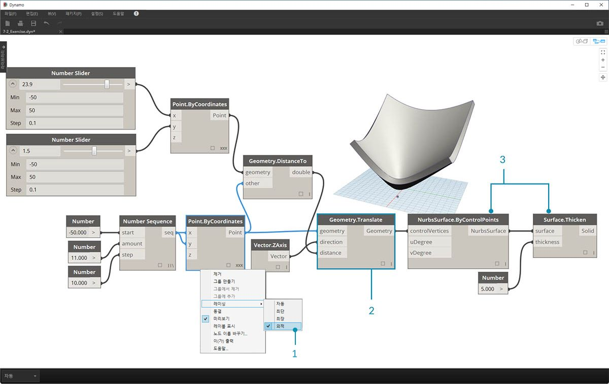
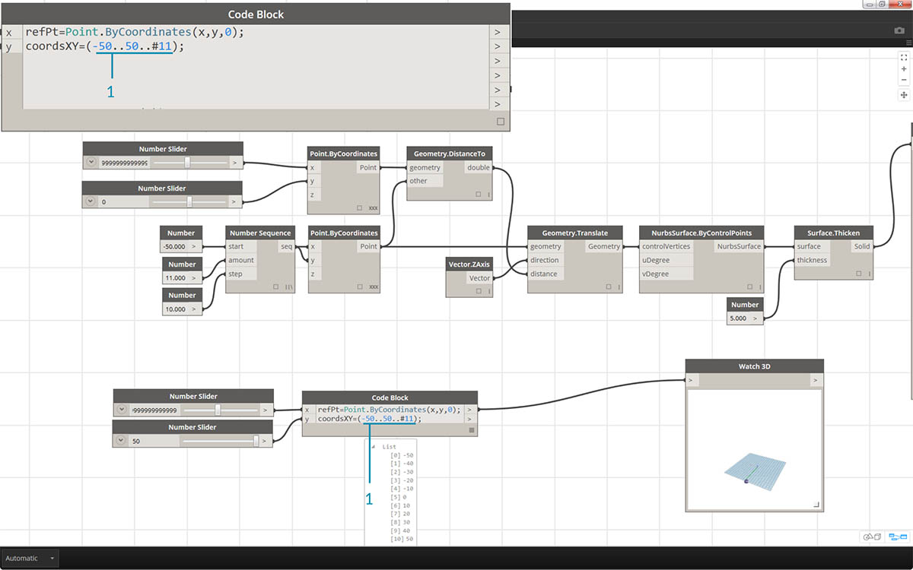
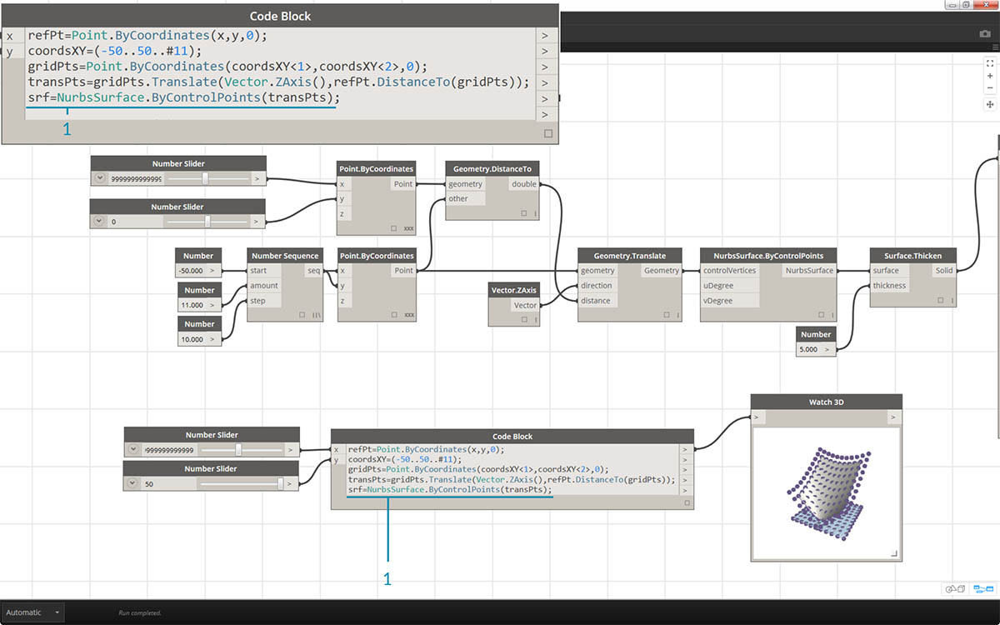
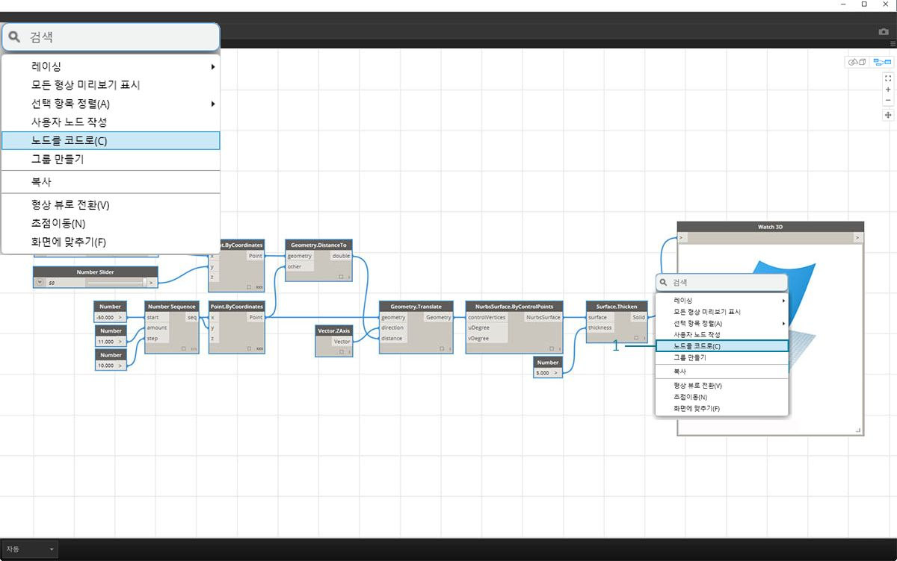

## DesignScript 구문

Dynamo의 노드 이름에서는 일반적인 테마를 확인할 수 있습니다. 각 노드에서는 공백 없이 *"."* 구문을 사용합니다. 이는 각 노드의 맨 위에 있는 문자는 스크립팅의 실제 구문을 나타내고, *"."*(또는 *점 표기법*)은 호출할 수 있는 가능한 메서드에서 요소를 구분하기 때문입니다. 이를 통해 시각적 스크립팅에서 문자 기반 스크립팅으로 쉽게 변환할 수 있습니다.


점 표기법의 일반적인 비유로, Dynamo에서 파라메트릭 사과는 어떻게 처리할 수 있을까요? 다음은 사과를 먹기로 결정하기 전에 사과에 대해 실행할 몇 가지 메서드입니다. 참고: 이는 실제 Dynamo 메서드가 아닙니다.

|Humanly Readible|점 표기법|Output|
| -- | -- | -- |
|사과가 무슨 색인가?|Apple.color|빨간색|
|사과가 잘 익었는가?|Apple.isRipe|true|
|사과 무게는 어떻게 되는가?|Apple.weight|6oz|
|사과가 어디에서 왔는가?|Apple.parent|트리|
|사과에서 만들어지는 것은 무엇인가?|Apple.children|seeds|
|이 사과는 현지에서 키운 것인가?|Apple.distanceFromOrchard|60mi.|

여러분에 대해서는 잘 모르지만 위 표의 출력을 통해 판단해보면 이는 맛있는 사과처럼 보입니다. *Apple.eat()*을 수행해 보겠습니다.

### Code Block의 점 표기법

사과의 비유를 생각하면서 *Point.ByCoordinates*를 살펴보고 code block을 사용하여 점을 작성하는 방법을 살펴보겠습니다.


> *code block* 구문 ```Point.ByCoordinates(0,10);```는 하나의 노드를 사용하여 점을 작성할 수 있다는 점을 제외하고 Dynamo의 *Point.ByCoordinates* 노드와 동일한 결과를 제공합니다. 이 구문은 별도의 노드를 *"X"* 및 *"Y"*에 연결하는 것보다 더 효율적입니다.

> 1. code block에서 *Point.ByCoordinates*를 사용하여 즉시 사용 가능한 노드 *(X,Y)*과 동일한 순서로 입력을 지정합니다.

### 노드 호출하기

노드가 특수한 *"UI" 노드*가 아닌 한, Code Block을 통해 특수 사용자 인터페이스 기능을 사용하는 라이브러리의 모든 일반 노드를 호출할 수 있습니다. 예를 들어 *Circle.ByCenterPointRadius*는 호출할 수 있지만 *Watch 3D* 노드를 호출하는 것은 적절하지 않습니다.

일반 노드(대부분의 라이브러리)는 일반적으로 다음과 같은 세 가지 유형으로 사용됩니다.

* **Create** - 항목 작성 또는 구성
* **Action** - 항목에 대해 작업 수행
* **Query** - 이미 존재하는 항목의 특성을 가져오기

이러한 카테고리에 유의하면 라이브러리 구성을 이해할 수 있습니다. 이러한 세 가지 유형의 메서드 또는 노드는 Code Block 내에서 호출될 때 다르게 취급됩니다.


#### 작성

"Create" 카테고리에서는 형상을 처음부터 새로 구성합니다. code block에 값을 왼쪽에서 오른쪽으로 입력합니다. 이러한 입력은 위에서 아래로의 노드 입력과 같은 순서로 되어 있습니다. 

> *Line.ByStartPointEndPoint* 노드와 code block의 해당 구문을 비교해 보면 동일한 결과를 얻을 수 있습니다.

#### 동작

Action은 해당 유형의 객체에 대해 수행할 수 있는 작업입니다. Dynamo에서는 많은 코딩 언어에 공통되는 *점 표기법*을 사용하여 항목에 작업을 적용합니다. 작업이 완료되면 점을 입력한 후 작업의 이름을 입력합니다. action-type 메서드의 입력은 create-type 메서드와 같이 괄호로 묶으며, 표시되는 첫 번째 입력을 해당 노드에 지정할 필요가 없습니다. 대신, 작업을 수행할 요소를 지정합니다.


> 1. *Point.Add * 노드는 action-type 노드이므로 구문이 조금 다르게 작동합니다.
2. 입력은 (1) *point*와 여기에 추가할 (2) *vector*입니다. *Code Block*에서는 점(항목)의 이름을 *"pt"*로 지정했습니다. *"vec"*라는 벡터를 *"pt"*에 추가하려면 *pt.Add(vec)* 또는 thing, dot, action이라고 씁니다. Add 작업에는 입력이 하나만 있거나 *Point.Add* 노드의 모든 입력에서 첫 번째 입력을 뺀 입력이 포함됩니다. *Point.Add* 노드에 대한 첫 번째 입력은 점 자체입니다.

#### 조회

query-type 메서드는 객체의 특성을 가져옵니다. 객체 자체가 입력이므로 입력을 지정할 필요가 없습니다. 괄호는 필요하지 않습니다.


### 레이싱의 경우

노드를 사용하는 레이싱은 code block을 사용하는 레이싱과 약간 다릅니다. 노드를 사용할 경우 사용자는 노드를 마우스 오른쪽 버튼으로 클릭하고 수행할 레이싱 옵션을 선택하면 됩니다. code block을 사용할 경우에는 사용자가 데이터 구성 방법을 보다 강력하게 제어할 수 있습니다. code block 줄임 메서드에서는 *복제 안내서*를 사용하여 여러 1차원 리스트를 쌍으로 연결하는 방법을 설정합니다. "<>" 꺾쇠괄호로 묶은 숫자를 통해 내포된 결과 리스트의 계층(<1>,<2>,<3> 등)이 정의됩니다. 


> 1. 이 예에서는 두 개의 범위를 정의하는 줄임 메서드를 사용합니다(이 장의 다음 섹션에서 줄임 메서드에 대해 좀 더 자세히 설명함). 즉, ```0..1;```은 ```{0,1}```과 같고, ```-3..-7```은 ```{-3,-4,-5,-6,-7}```과 같습니다. 결과적으로 x 값 2개와 y 값 5개가 표시됩니다. 이러한 불일치 리스트에서 복제 가이드를 사용하지 않는 경우 최단 리스트의 길이에 해당하는 두 점의 리스트가 표시됩니다. 복제 가이드를 사용하여 2개 및 5개 좌표의 가능한 모든 조합(또는 **외적**)을 찾을 수 있습니다.
2. ```Point.ByCoordinates(x_vals<1>,y_vals<2>);``` 구문을 사용하면 각 리스트에 **5**개의 항목이 포함된 **2**개의 리스트가 제공됩니다.
3. ```Point.ByCoordinates(x_vals<2>,y_vals<1>);``` 구문을 사용하면 각 리스트에 **2**개의 항목이 포함된 **5**개의 리스트가 제공됩니다.

이 표기법을 사용하여 주요 리스트(5개 항목으로 구성된 2개 리스트 또는 2개 항목으로 구성된 5개 리스트)를 지정할 수도 있습니다. 이 예에서 복제 가이드의 순서를 변경하여 그리드 내의 점 행 리스트나 그리드 내의 점 열 리스트를 포함하는 결과를 생성합니다.

### Node to Code

위의 code block 메서드에 익숙해지는 데 다시 시간이 걸릴 수 있지만 Dynamo에는 프로세스를 보다 쉽게 만들어주는 "Node to Code"라는 기능이 있습니다. 이 기능을 사용하려면 Dynamo 그래프에서 노드 배열을 선택하고 캔버스를 마우스 오른쪽 버튼으로 클릭한 다음, "Node to Code"를 선택합니다. Dynamo에서는 이러한 노드를 입출력을 모두 포함하는 하나의 code block으로 축소했습니다. 이 기능은 code block을 학습하는 데 유용한 도구일 뿐만 아니라 보다 효율적인 파라메트릭 Dynamo 그래프를 사용하여 작업할 수 있도록 합니다. "Node to Code"를 사용하여 아래의 연습을 마무리할 예정이므로 이 내용을 빼먹지 마십시오.


### 연습

> 이 연습과 함께 제공되는 예시 파일을 다운로드하십시오(마우스 오른쪽 버튼을 클릭하고 "다른 이름으로 링크 저장..." 선택). 전체 예시 파일 리스트는 부록에서 확인할 수 있습니다. [Dynamo-Syntax_Attractor-Surface.dyn](datasets/7-2/Dynamo-Syntax_Attractor-Surface.dyn)

code block의 효과를 표시하기 위해 기존 어트랙터 필드 정의를 code block 형식으로 변환하려고 합니다. 기존 정의로 작업하면 code block이 시각적 스크립팅과 어떻게 연관되는지 알 수 있으며 DesignScript 구문을 배우는 데 도움이 됩니다. 

> 먼저 위 이미지의 정의를 다시 작성하거나 샘플 파일을 엽니다.

> 1. *Point.ByCoordinates*의 레이싱이 *외적*으로 설정되어 있습니다.
2. 그리드의 각 점이 참조점까지의 거리를 기준으로 Z 방향으로 위로 이동합니다.
3. 표면이 다시 작성되고 두꺼워지면서 참조점까지의 거리를 기준으로 형상에 돌출이 작성됩니다.


> 1. 첫 번째 부분에서 시작하여 먼저 참조점을 정의합니다. ```Point.ByCoordinates(x,y,0);``` 참조점 노드 맨 위에 지정된 것과 동일한 *Point.ByCoordinates* 구문을 사용합니다.
2. 슬라이더를 사용하여 동적으로 업데이트할 수 있도록 변수 *x* 및 *y*가 code block에 삽입됩니다.
3. *-50*에서 *50*까지의 범위에 해당하는 *code block* 입력에 *슬라이더*를 추가합니다. 이렇게 하면 기본 Dynamo 그리드에 걸쳐 나타낼 수 있습니다.



> 1. *code block*의 두 번째 줄에서 숫자 시퀀스 노드를 대치하기 위한 줄임 코드인 ```coordsXY = (-50..50..#11);```을 정의합니다. 이 내용에 대해서는 다음 섹션에서 자세히 살펴보겠습니다. 지금은 일단 이 줄임 코드가 시각적 스크립트의 *Number Sequence* 노드와 동일하다는 것만 이해합니다.


> 1. 이제 *coordsXY* 시퀀스에서 점의 그리드를 작성하려고 합니다. 이렇게 하려면 *Point.ByCoordinates* 구문을 사용해야 하지만, 시각적 스크립트에서 수행한 것과 동일한 방식으로 리스트의 *외적*도 시작해야 합니다. 이렇게 하려면 ```gridPts = Point.ByCoordinates(coordsXY<1>,coordsXY<2>,0);``` 줄을 입력합니다. 꺾쇠괄호는 외적 참조를 나타냅니다.
2. *Watch3D* 노드에는 Dynamo 그리드를 가로지르는 점 그리드가 있습니다.


> 1. 이제 다소 까다롭지만 참조점까지의 거리를 기준으로 점 그리드를 위로 이동하려고 합니다. 먼저 이 새 점 세트를 *transPts*라고 지정합니다. 변환은 기존 요소에 대한 작업이므로 ```Geometry.Translate...```를 사용하는 대신, ```gridPts.Translate```를 사용합니다.
2. 캔버스의 실제 노드에서 읽으면 3개의 입력이 있는 것을 알 수 있습니다. 해당 요소에 대해 작업을 수행하고 있으므로(*gridPts.Translate* 사용) 변환할 형상은 이미 선언되어 있습니다. 나머지 두 입력은 함수 *direction* 및 *distance*의 괄호 안에 삽입됩니다.
3. 방향은 충분히 단순하므로 ```Vector.ZAxis()```를 사용하여 수직으로 이동합니다.
4. 여전히 참조점과 각 그리드 점 사이의 거리를 계산해야 하므로 이 작업을 참조점에 대한 작업과 동일한 방식으로 수행합니다. ```refPt.DistanceTo(gridPts)```
5. 코드의 마지막 줄에서는 다음과 같이 변환된 점이 제공됩니다. ```transPts = gridPts.Translate(Vector.ZAxis(),refPt.DistanceTo(gridPts));```



> 1. 이제 Nurbs 표면을 작성하기 위한 적절한 데이터 구조를 가진 점 그리드가 있습니다. ```srf = NurbsSurface.ByControlPoints(transPts);```를 사용하여 표면을 구성합니다.


> 1. 마지막으로, 표면에 깊이를 추가하기 위해 ```solid = srf.Thicken(5);```을 사용하여 솔리드를 구성합니다. 이 경우 코드에서 표면을 5개 단위씩 두껍게 만들었지만 항상 이 값을 변수로 선언한 다음(예: *thickness*로 지칭) 슬라이더를 사용하여 해당 값을 제어할 수 있습니다.

### "Node to Code"로 그래프를 단순화하기

"Node to Code" 기능은 방금 버튼 클릭으로 완료한 전체 연습을 자동화합니다. 이 기능은 사용자 정의 및 재사용 가능한 code block을 작성하는 데 유용할 뿐만 아니라 Dynamo에서 스크립팅하는 방법을 배우기 위한 매우 유용한 도구이기도 합니다.



> 1. 연습의 1단계에서 사용했던 기존 시각적 스크립트로 시작합니다. 모든 노드를 선택하고 캔버스를 마우스 오른쪽 버튼으로 클릭한 다음, *"Node to Code"*를 선택합니다. 아주 간단합니다.


> Dynamo에서는 시각적 그래프, 레이싱 및 모든 항목의 문자 기반 버전을 자동화했습니다. 시각적 스크립트에서 이 기능을 테스트하고 code block의 강력한 성능을 활용해보십시오.

