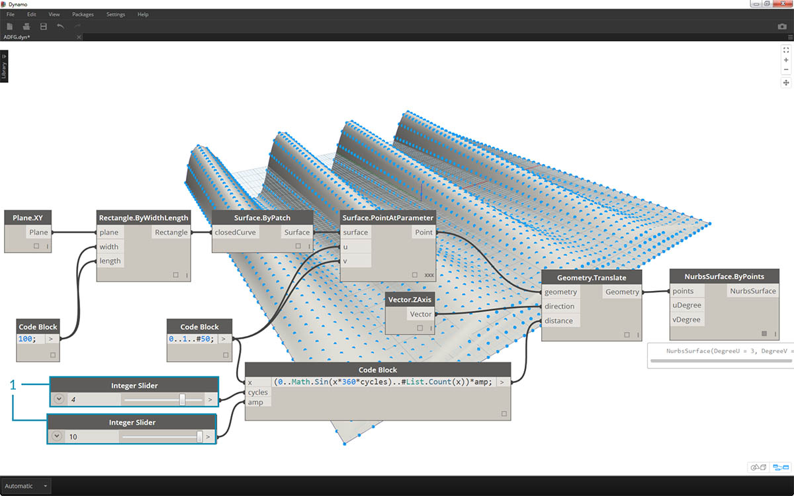

## 축약형

code block에는 데이터 관리를 *훨씬* 더 쉽게 해주는 몇 가지 기본적인 축약 방법이 있습니다. 아래의 기본 사항을 분석하고 이러한 축약형을 데이터 작성 및 조회에 어떻게 사용할 수 있는지 알아보겠습니다.

|데이터 유형|표준 Dynamo|해당하는 Code Block 항목|
| -- | -- | -- |
|번호|||
|문자열|||
|순서|||
|범위|||
|색인의 항목 가져오기|||
|리스트 작성|||
|문자열 연결|||
|조건문|||

### 추가 구문

|노드|해당하는 Code Block 항목|참고|
| -- | -- | -- |
|임의 연산자(+, &&, >=, Not 등)|+, &&, >=, ! 등|“Not”은 “!”가 되지만 "Factorial"과 구분하기 위해 노드를 "Not"으로 지칭합니다.|
|Boolean True|true;|소문자입니다.|
|Boolean False|false;|소문자입니다.|

### 범위

범위 및 시퀀스를 정의하는 방법을 기본 축약형으로 줄일 수 있습니다. code block으로 숫자 데이터 리스트를 정의하기 위한 ".." 구문을 작성할 때 아래 이미지를 참고하십시오. 이 표기법을 이해한 후에는 숫자 데이터를 정말 효율적으로 작성할 수 있게 됩니다. 

> 1. 이 예에서는 숫자 범위가 ```beginning..end..step-size;```를 정의하는 기본 code block 구문으로 대치됩니다. 숫자로 표현되는 제품은 ```0..10..1;```입니다.
2. ```0..10..1;``` 구문은 ```0..10;```과 동일합니다. 단계 크기 1은 축약형 표기의 기본값입니다. 따라서 ```0..10;```을 사용하면 단계 크기가 1인 0-10 사이의 시퀀스가 지정됩니다.
3. *number sequence*의 예는 최대 15개의 리스트가 아니라, 리스트에 포함된 15개의 값을 원한다는 사실을 나타내기 위해 *"#"*을 사용한다는 점을 제외하고 비슷합니다. 이 경우 ```beginning..#ofSteps..step-size:```를 정의합니다. 시퀀스의 실제 구문은 ```0..#15..2```입니다.
4. 이번에는 이전 단계의 *"#"*을 구문의 *"step-size"* 부분에 배치합니다. 이제 *number range*는 *"beginning"*부터 *"end"*까지 설쳐 있으며, *"step-size"* 표기법은 여러 개의 값을 둘 사이에 균일하게 분산합니다(```beginning..end..#ofSteps```).

### 고급 범위

고급 범위를 작성하면 리스트의 리스트를 간단하게 사용할 수 있습니다. 아래 예에서는 1차 범위 표기법에서 변수를 분리한 후 해당 리스트의 다른 범위를 작성합니다. 

> 1. 중첩된 범위를 작성하여 *"#"*이 있는 표기법과 없는 표기법을 비교합니다. 약간 더 복잡해질 수 있지만 기본 범위와 동일한 논리가 적용됩니다.
2. 1차 범위 내의 임의 위치에서 하위 범위를 정의할 수 있으며, 하위 범위가 2개 있을 수도 있습니다.
3. 범위의 *"end"* 값을 제어하여 길이가 다른 범위를 더 많이 작성합니다.


> 논리 연습의 일환으로, 위의 두 축약형을 비교하고, *하위 범위* 및 *"#"* 표기법이 결과 출력을 구동하는 방법을 구문 분석합니다.

### 리스트 만들기 및 리스트에서 항목 가져오기

또한 축약형을 사용해서 리스트를 만드는 것 외에, 리스트를 즉석에서 작성할 수도 있습니다. 이러한 리스트는 광범위한 요소 유형을 포함할 수 있으며 조회도 가능합니다(리스트는 그 자체가 객체임). 요약하면, code block을 통해 중괄호를 사용해서 리스트를 만들고, 대괄호를 사용해서 리스트의 항목을 조회합니다.


> 1. 문자열을 사용하여 리스트를 빠르게 작성하고 항목 색인을 사용하여 조회합니다.
2. 변수를 사용해서 리스트를 작성하고, 범위 축약형 표기법을 사용해서 조회합니다.

내포된 리스트로 관리하는 작업도 유사한 프로세스입니다. 리스트 순서를 인식하고 여러 대괄호 세트를 사용해서 명확히 구분합니다.


> 1. 리스트의 리스트를 정의합니다.
2. 단일 대괄호 표기법으로 리스트를 조회합니다.
3. 이중 대괄호 표기법을 사용하여 항목을 조회합니다.

### 연습

> 이 연습과 함께 제공되는 예시 파일을 다운로드하십시오(마우스 오른쪽 버튼을 클릭하고 "다른 이름으로 링크 저장..." 선택). 전체 예시 파일 리스트는 부록에서 확인할 수 있습니다. [Obsolete-Nodes_Sine-Surface.dyn](datasets/7-3/Obsolete-Nodes_Sine-Surface.dyn)

이 연습에서는 새로운 축약형 기술을 조정하면서 범위 및 수식으로 정의된 달걀 껍질형 표면을 작성합니다. 이 연습에서는 code block과 기존 Dynamo 노드를 동시에 사용하는 방법을 살펴봅니다. 정의를 이해할 수 있도록 Dynamo 노드를 시각적으로 배치하면서, 과도한 데이터 이동 작업에는 code block을 사용합니다.


> 먼저 위의 노드를 연결하여 표면을 작성해 보겠습니다. 숫자 노드를 사용하여 폭과 길이를 정의하는 대신, 캔버스를 두 번 클릭하고 code block에 ```100;```을 입력합니다.


> 1. code block에 ```0..1..#50```을 입력하여 0과 1 사이에 50개 분할 영역으로 구분된 범위를 정의합니다.
2. 범위를 *Surface.PointAtParameter*에 연결합니다. 이 노드에서는 표면 전체에서 0과 1 사이의 *u* 및 *v* 값을 사용합니다. *Surface.PointAtParameter* 노드를 마우스 오른쪽 버튼으로 클릭하여 *레이싱*을 *외적*으로 변경해야 합니다.


> 이 단계에서는 첫 번째 함수를 사용하여 Z에서 위쪽으로 점 그리드를 이동합니다. 이 그리드는 기본 함수를 기준으로 생성된 표면을 구동합니다.

> 1. 위의 이미지와 같이 캔버스에 시각적 노드를 추가합니다.
2. 수식 노드를 사용하는 대신, ```(0..Math.Sin(x*360)..#50)*5;``` 줄이 있는 code block을 사용합니다. 빠른 분석을 위해 내부에 수식을 사용하여 범위를 정의합니다. 이 수식은 사인 함수입니다. 사인 함수에는 Dynamo에서 각도 입력이 수신되므로 전체 사인파를 가져오려면 *x* 값(0에서 1 범위의 입력)에 *360*을 곱합니다. 다음으로, 각 행의 제어 그리드 점과 동일한 수의 분할을 원하므로 *#50*을 사용하여 50개의 재분할 영역을 정의합니다. 마지막으로 승수 5는 변환의 진폭을 늘리므로 Dynamo 미리보기에서 결과를 확인할 수 있습니다.


> 1. 이전 code block이 제대로 작동했지만 완전한 파라메트릭은 아니었습니다. 해당 매개변수를 동적으로 구동하려고 하므로 이전 단계의 줄을 ```(0..Math.Sin(x*360*cycles)..#List.Count(x))*amp;```로 바꿉니다. 이렇게 하면 입력을 기준으로 이러한 값을 정의할 수 있습니다.



> 1. 0부터 10 사이에서 슬라이더를 변경하면 몇 가지 흥미로운 결과를 얻을 수 있습니다.


> 1. 숫자 범위에서 행과 열을 바꾸어 커튼 파형의 방향을 반대로 바꿉니다. ```transposeList = List.Transpose(sineList);```


> 1. 다음과 같이 sineList 및 tranposeList를 추가하면 왜곡된 달걀 껍질형 표면이 표시됩니다. ```eggShellList = sineList+transposeList;```


> 1. 슬라이더를 다시 변경하여 이 알고리즘의 파동을 잔잔하게 만들어 보겠습니다.


> 1. 마지막으로, 이 code block을 사용하여 분리된 데이터 부분을 조회해 보겠습니다. 특정 점 범위를 사용해서 표면을 재생성하려면 위 code block을 *Geometry.Translate*와 *NurbsSurface.ByPoints* 노드 사이에 추가합니다. 여기에는 ```sineStrips[0..15..1];``` 텍스트 줄이 있습니다. 이는 50개 중에서 처음 16개의 점 행을 선택합니다. 표면을 재작성하면 점 그리드의 분리된 부분이 생성된 것을 볼 수 있습니다.


> 1. 마지막 단계에서 이 code block을 좀 더 파라메트릭하게 만들기 위해 0에서 1 사이의 슬라이더를 사용하여 조회를 실행합니다. 이 작업은 코드 줄 ```sineStrips[0..((List.Count(sineStrips)-1)*u)];```를 사용하여 수행합니다. 혼란스러워 보일 수 있지만, 이 코드 줄을 사용하면 리스트 길이를 0에서 1 사이의 승수로 빠르게 축척할 수 있습니다.


> 1. 슬라이더에서 *.53* 값을 사용하면 표면이 그리드의 중간점을 지나 작성됩니다.


> 1. 또한 예상대로 슬라이더에서 *1*을 사용하면 표면이 전체 점 그리드에서 작성됩니다.


> 결과 시각적 그래프를 보면 code block을 강조 표시하고 해당 기능을 확인할 수 있습니다.

> 1. 첫 번째 code block은 *Number* 노드를 대치합니다.
2. 두 번째 code block은 *Number Range* 노드를 대치합니다.
3. 세 번째 code block은 *Formula* 노드(*List.Transpose*, *List.Count* 및 *Number Range*)를 대치합니다.
4. 네 번째 code block은 리스트의 리스트를 조회하고 *List.GetItemAtIndex* 노드를 대치합니다.

