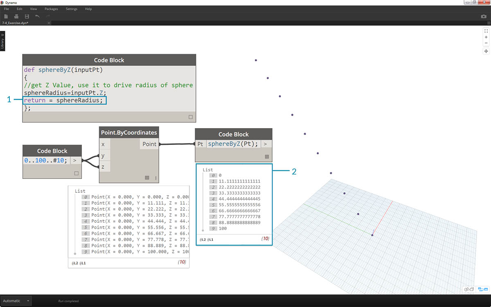

## 코드 블록 함수

함수는 코드 블록에서 작성한 후 Dynamo 정의의 다른 위치에서 다시 호출할 수 있습니다. 이를 통해 파라메트릭 파일에 또 다른 제어층이 작성되며, 이는 텍스트 기반 버전의 사용자 노드로 볼 수 있습니다. 이 경우 "parent" 코드 블록에 쉽게 액세스할 수 있으며 그래프의 모든 위치에 배치할 수 있습니다. 와이어는 필요하지 않습니다.

### 상위

첫 번째 줄에는 키워드 “def”, 그다음에 함수 이름, 괄호로 묶인 입력 이름이 차례로 표시됩니다. 중괄호는 함수의 본문을 정의합니다. "return ="을 사용하여 값을 반환합니다. 함수를 정의하는 Code Block은 다른 Code Block에서 호출되기 때문에 입력 또는 출력 포트가 없습니다. 

```
/*This is a multi-line comment,
which continues for
multiple lines*/
def FunctionName(in1,in2)
{
//This is a comment
sum = in1+in2;
return sum;
};
```

### 개수

동일한 파일의 다른 Code Block에서 해당 이름 및 동일한 개수의 인수를 지정하여 함수를 호출합니다. 이 노드는 라이브러리의 기본 제공 노드처럼 작동합니다.


```
FunctionName(in1,in2);
```

### 연습

> 이 연습과 함께 제공되는 예시 파일을 다운로드하십시오(마우스 오른쪽 버튼을 클릭하고 "다른 이름으로 링크 저장..." 선택). 전체 예시 파일 리스트는 부록에서 확인할 수 있습니다. [Functions_SphereByZ.dyn](datasets/7-4/Functions_SphereByZ.dyn)

이 연습에서는 점의 입력 리스트에서 구를 작성하는 일반 정의를 만들겠습니다. 이러한 구의 반지름은 각 점의 Z 특성에 의해 결정됩니다.


> 각각 0에서 100 사이의 값을 갖는 10개의 값 범위로 시작하겠습니다. 이러한 값을 *Point.ByCoordinates* 노드에 연결하여 대각선을 작성합니다.


> 1. *code block*을 작성하고 코드 줄을 사용하여 정의를 소개합니다.
```
def sphereByZ(inputPt){
};
```

*inputPt*는 함수를 구동할 점을 나타내기 위해 지정한 이름입니다. 현재, 이 함수는 아무 기능도 하지 않지만 이후 단계에서 구축할 것입니다.


> 1. *code block* 함수에 추가하여 주석과 각 점의 *Z* 위치를 조회하는 *sphereRadius* 변수를 배치합니다. *inputPt.Z*에는 괄호가 메서드로 필요하지 않습니다. 기존 요소 특성의 *조회*이므로 입력이 필요하지 않습니다.
```
def sphereByZ(inputPt,radiusRatio)
{
//get Z Value, use it to drive radius of sphere
sphereRadius=inputPt.Z;
};
```


> 1. 이제 다른 *code block*에서 작성한 함수를 불러오겠습니다. 캔버스를 두 번 클릭하여 새 *code block*을 작성하고 *sphereB*를 입력하면 Dynamo는 정의한 *sphereByZ* 함수를 제안합니다. 함수가 intellisense 라이브러리에 추가되었습니다. 멋지지 않은가요?


> 1. 이제 함수를 호출하고, 이전 단계에서 생성한 점에 연결할 *Pt*라는 변수를 작성합니다.
```
sphereByZ(Pt)
```

2. 출력에서 모든 값이 null이라는 것을 확인할 수 있습니다. 그 이유는 무엇일까요? 함수를 정의했을 때 *sphereRadius* 변수를 계산하지만 함수가 *출력*으로 *반환*해야 하는 결과를 정의하지 않았습니다. 이 문제는 다음 단계에서 해결할 수 있습니다.



> 1. 중요한 단계로, 선 ```return = sphereRadius;```를 *sphereByZ* 함수에 추가하여 함수의 출력을 정의해야 합니다.
2. 이제 *code lbock*의 출력이 각 점의 Z 좌표를 나타낸다는 것을 알 수 있습니다.


> 이제 *Parent* 함수를 편집하여 실제 구를 작성하겠습니다.

> 1. 먼저 코드 줄 ```sphere=Sphere.ByCenterPointRadius(inputPt,sphereRadius);```로 구를 정의합니다.
2. 다음으로, 반환 값을 *sphereRadius* 대신 *sphere*로 변경합니다(예: ```return = sphere;```). 이렇게 하면 Dynamo 미리보기에 몇 개의 큰 구가 표시됩니다.


> 1. 이러한 구의 크기를 고려하려면 구분선을 추가하여 *sphereRadius* 값을 업데이트하겠습니다(예: ```sphereRadius = inputPt.Z/20;```) 이제 별도의 구가 표시되며 반지름과 Z 값간의 관계를 이해할 수 있습니다.


> 1. *Point.ByCoordinates* 노드에서 레이싱을 *최단 리스트*에서 *외적*으로 변경하여 점 그리드를 작성합니다. *sphereByZ* 함수는 여전히 전체 효과를 나타내므로 모든 점이 Z 값을 기준으로 하는 반지름의 구를 작성합니다.


> 1. 물을 테스트하기 위해 숫자의 원래 리스트를 *Point.ByCoordinates*에 대한 X 입력에 연결합니다. 이제 정육면체 및 구가 구현되었습니다.
2. 주: 컴퓨터에서 계산하는 데 시간이 오래 걸리는 경우 *#10*을 *#5*와 같은 값으로 변경해 보십시오.


> 1. 작성한 *sphereByZ* 함수는 일반 함수이므로 이전 단원에서 사용한 나선을 다시 불러와 이 함수를 적용할 수 있습니다.


> 마지막 단계: 사용자 정의 매개변수로 반지름 비율을 구동해 보겠습니다. 이렇게 하려면 함수에 대한 새 입력을 작성하고 *20* 구분자를 매개변수로 대치해야 합니다.

> 1. 다음과 같이 *sphereByZ* 정의를 업데이트합니다.
```
def sphereByZ(inputPt,radiusRatio)
{
//get Z Value, use it to drive radius of sphere
sphereRadius=inputPt.Z/radiusRatio;
//Define Sphere Geometry
sphere=Sphere.ByCenterPointRadius(inputPt,sphereRadius);
//Define output for function
return sphere;
};
```

2. 입력에 ```sphereByZ(Pt,ratio);```와 같이 *ratio* 변수를 추가하여 하위 코드 블록을 업데이트합니다. 슬라이더를 새로 작성한 코드 블록 입력에 연결하고, 반지름 비율에 따라 반지름의 크기를 변경합니다.

