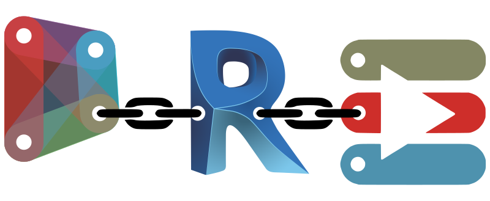
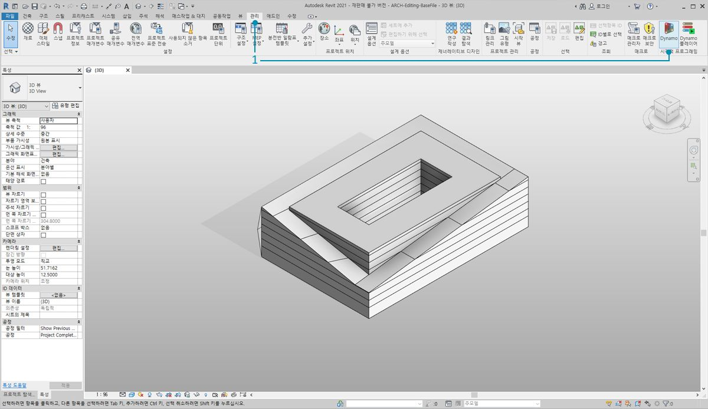
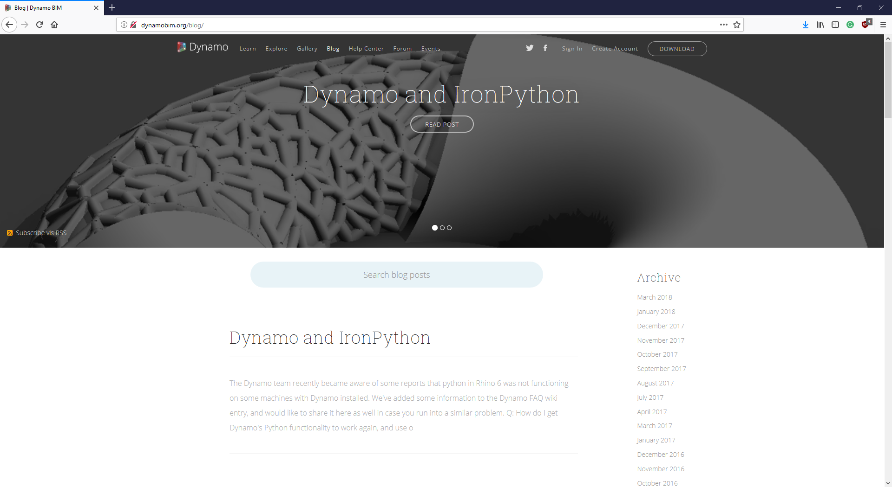

## Revit 연결

Dynamo for Revit은 그래픽 알고리즘 편집기의 데이터 및 논리 환경으로 건물 정보 모델링을 확장했습니다. 이 제품은 대단히 유연하고 강력한 Revit 데이터베이스를 제공하므로 BIM을 새로운 차원에서 활용할 수 있는 기회가 제공합니다.

이 장에서는 BIM을 위한 Dynamo 워크플로우에 대해 중점적으로 설명합니다. 프로젝트로 바로 이동하는 것은 BIM용 그래픽 알고리즘 편집기에 익숙해지는 가장 좋은 방법이기 때문에 섹션은 주로 연습을 기준으로 설명되어 있습니다. 우선 프로그램을 시작하는 것부터 살펴보겠습니다.

####

#### Revit 버전 호환성

Revit과 Dynamo가 계속해서 발전함에 따라, 현재 사용 중인 Revit 버전이 컴퓨터에 설치한 Dynamo for Revit용 버전과 호환되지 않음을 알게 될 수도 있습니다. 아래에는 Revit과 호환되는 Dynamo for Revit 버전을 간단히 설명되어 있습니다.

|Revit 버전|첫 번째 안정적인 Dynamo 버전|마지막으로 지원되는 Dynamo for Revit 버전|
| -- | -- | -- |
|2013|[0.6.1](http://dyn-builds-data.s3-us-west-2.amazonaws.com/DynamoInstall0.6.1.exe)|[0.6.3](http://dyn-builds-data.s3-us-west-2.amazonaws.com/DynamoInstall0.6.3.exe)|
|2014|[0.6.1](http://dyn-builds-data.s3-us-west-2.amazonaws.com/DynamoInstall0.6.1.exe)|[0.8.2](http://dyn-builds-data.s3-us-west-2.amazonaws.com/DynamoInstall0.8.2.exe)|
|2015|[0.7.1](http://dyn-builds-data.s3-us-west-2.amazonaws.com/DynamoInstall0.7.1.exe)|[1.2.1](http://dyn-builds-data.s3-us-west-2.amazonaws.com/DynamoInstall1.2.1.exe)|
|2016|[0.7.2](http://dyn-builds-data.s3-us-west-2.amazonaws.com/DynamoInstall0.7.2.exe)|[1.3.2](http://dyn-builds-data.s3-us-west-2.amazonaws.com/DynamoInstall1.3.2.exe)|
|2017|[0.9.0](http://dyn-builds-data.s3-us-west-2.amazonaws.com/DynamoInstall0.9.0.exe)|[1.3.4](http://dyn-builds-data.s3-us-west-2.amazonaws.com/DynamoInstall1.3.4.exe) / [2.0.3](https://dyn-builds-data.s3-us-west-2.amazonaws.com/DynamoInstall2.0.3.exe)|
|2018|[1.3.0](http://dyn-builds-data.s3-us-west-2.amazonaws.com/DynamoInstall1.3.0.exe)|[1.3.4](http://dyn-builds-data.s3-us-west-2.amazonaws.com/DynamoInstall1.3.4.exe) / [2.0.3](https://dyn-builds-data.s3-us-west-2.amazonaws.com/DynamoInstall2.0.3.exe)|
|2019|[1.3.3](http://dyn-builds-data.s3-us-west-2.amazonaws.com/DynamoInstall1.3.3.exe)|[1.3.4](http://dyn-builds-data.s3-us-west-2.amazonaws.com/DynamoInstall1.3.4.exe) / [2.0.3](https://dyn-builds-data.s3-us-west-2.amazonaws.com/DynamoInstall2.0.3.exe)|
|2020|2.1.0 - Revit 2020에는 이제 Dynamo가 포함되어 있고 Revit처럼 업데이트를 수신합니다.|해당 사항 없음|

####

#### Dynamo의 사용내역

> 이 프로젝트는 시작은 미미했지만 개발자 팀과 열정적인 커뮤니티의 전폭적인 지원을 받으면서 오랫동안 발전해 왔습니다.

Dynamo는 원래 Revit에서 AEC 워크플로우를 간소화하기 위해 개발되었습니다. Revit은 모든 프로젝트에 대해 강력한 데이터베이스를 만들었지만, 일반적인 사용자가 인터페이스의 제약을 벗어나서 이 정보에 액세스하는 것은 어려울 수 있습니다. Revit은 타사 개발자가 사용자 도구를 작성할 수 있도록 하는 포괄적인 API(응용프로그램 프로그램 인터페이스)를 호스팅하고 있습니다. 프로그래머가 이 API를 수년간 사용해 왔지만 누구나 문자 기반 스크립트에 활용할 수 있는 것은 아닙니다. Dynamo는 접근하기 쉬운 그래픽 알고리즘 편집기를 통해 Revit 데이터를 쉽게 사용할 수 있도록 만들려고 합니다.

사용자는 핵심 Dynamo 노드를 사용자 Revit 노드와 함께 사용하여 상호 운용성, 문서, 분석 및 생성을 위해 파라메트릭 워크플로우를 널리 확장할 수 있습니다. Dynamo를 사용하면 지루한 워크플로우 작업을 자동화하는 한편 설계를 더욱 자세하게 살펴볼 수 있습니다.

### Revit에서 Dynamo 실행

> 1. Revit 프로젝트 또는 패밀리 편집기에서 애드인을 찾은 다음, *Dynamo*를 클릭합니다. 참고: Dynamo는 열려 있는 파일에서만 실행됩니다.

> 1. Revit에서 Dynamo를 열면 *"Revit"*이라는 새 카테고리가 나타납니다. 이 카테고리는 Revit 워크플로우에 특히 적합한 노드를 제공하는 UI에 포괄적으로 추가되었습니다.*

**참고 - Revit 전용 노드 패밀리를 사용하면 Dynamo 그래프가 Dynamo for Revit에서 열 때만 작동합니다. 예를 들어 Dynamo for Revit 그래프를 Dynamo 샌드박스에서 여는 경우 Revit 노드가 누락됩니다.*

### 노드 동결

Revit은 강력한 프로젝트 관리 기능을 제공하는 플랫폼이므로 Dynamo의 파라메트릭 작업은 복잡할 수 있고 이로 인해 계산 속도가 느려질 수 있습니다. Dynamo에서 노드를 계산하는 데 시간이 오래 걸리는 경우 그래프를 개발하는 동안 Revit 작업 실행을 일시 중지하기 위해 노드 "동결" 기능을 사용할 수도 있습니다. 노드 동결에 대한 자세한 내용은 [솔리드 장](../05_Geometry-for-Computational-Design/5-6_solids.md#freezing)의 "동결" 섹션을 확인하십시오.

### 커뮤니티

Dynamo는 원래 AEC를 위해 만들어졌기 때문에 광범위하며 계속해서 성장하는 커뮤니티는 업계 전문가들로부터 배우고 연계할 수 있는 훌륭한 리소스가 됩니다. Dynamo의 커뮤니티는 건축가, 엔지니어, 프로그래머 및 설계자들이 열정을 다해 만들고 공유하는 공간입니다.

Dynamo는 지속적으로 진화하는 오픈 소스 프로젝트로, 많은 개발 작업은 Revit과 관련이 있습니다. 이 프로그램을 처음 접하는 경우 토론 포럼에서 [질문을 게시](http://dynamobim.org/forums/forum/dyn/)하여 시작해 보십시오. 프로그래머이며 Dynamo 개발에 참여하고 싶으면 [github 페이지](https://github.com/DynamoDS/Dynamo)를 확인하십시오. 또한 타사 라이브러리를 위한 유용한 리소스는 [Dynamo 패키지 관리자](http://dynamopackages.com/)입니다. 이러한 패키지 중 다수는 AEC를 고려하여 만들어졌습니다. 이 장에서는 패널화를 위한 타사 패키지를 살펴보겠습니다.

> Dynamo는 활성 [블로그](http://dynamobim.com/blog/)도 운영하고 있습니다. 최신 게시물을 읽어 보고 최신 개발 소식을 알아보십시오!

