## 선택

Revit은 데이터가 풍부한 환경입니다. 따라서 "포인트 앤 클릭" 이외의 다양한 선택 기능을 사용할 수 있습니다. 파라메트릭 작업을 수행하는 동안 Revit 데이터베이스를 조회하고 Revit 요소를 Dynamo 형상에 동적으로 링크할 수 있습니다.

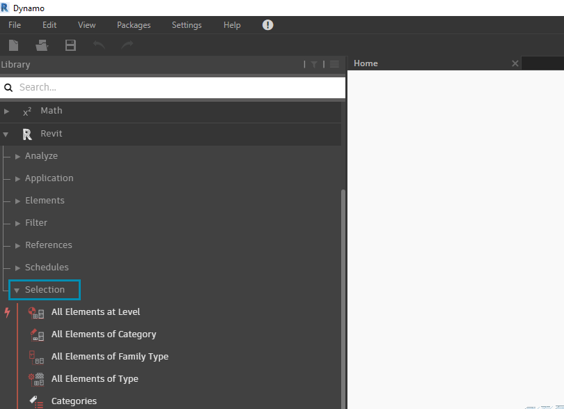

> UI의 Revit 라이브러리에서는 여러 가지 방법으로 형상을 선택할 수 있는 "Selection" 카테고리를 제공합니다.

Revit 요소를 제대로 선택하려면 Revit 요소 계층을 완전히 이해해야 합니다. 프로젝트의 모든 벽을 선택하시겠습니까? 카테고리별로 선택하십시오. 세기 중반의 현대적 로비에서 모든 Eames 의자를 선택하시겠습니까? 패밀리별로 선택하십시오. 연습으로 이동하기 전에 Revit 계층을 간략하게 검토하겠습니다.

#### Revit 계층

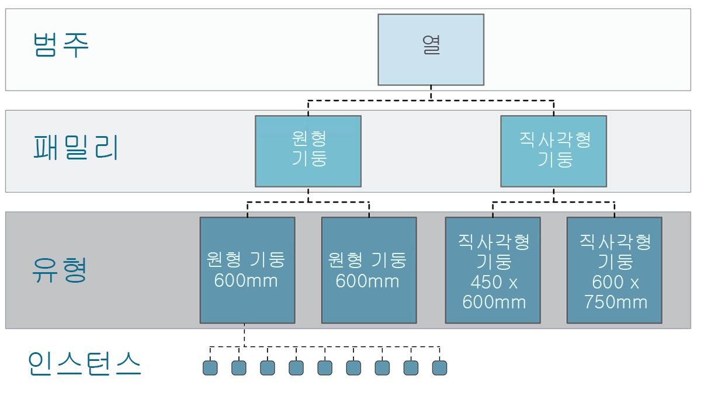

생물학의 분류법인 계, 문, 강, 목, 과, 속, 종을 기억하십니까? Revit 요소도 비슷한 방식으로 분류됩니다. 기본 레벨에서 Revit 계층은 카테고리, 패밀리, 유형* 및 인스턴스로 구분할 수 있습니다. 인스턴스는 고유한 ID를 가진 개별 모델 요소이지만, 카테고리는 일반 그룹(예: "벽" 또는 "바닥")을 정의합니다. Revit 데이터베이스를 이러한 방식으로 구성하면 요소 하나를 선택하고 계층의 지정된 레벨에 따라 유사한 요소를 모두 선택할 수 있습니다.

**주 - Revit의 유형은 프로그래밍의 유형과 다르게 정의됩니다. Revit에서 유형은 "데이터 유형"이 아닌 계층의 분기를 참조합니다.*

#### Dynamo 노드를 사용한 데이터베이스 탐색

아래의 3개 이미지에는 Dynamo의 Revit 요소 선택에 대한 기본 카테고리를 분석한 내용이 나와 있습니다. 이러한 도구는 함께 사용할 수 있는 유용한 도구로, 다음 연습에서 이러한 도구 중 일부를 살펴보겠습니다.


> *포인트 앤 클릭*은 Revit 요소를 직접 선택하는 가장 쉬운 방법입니다. 전체 모델 요소 또는 해당 상의 일부(예: 면 또는 모서리)를 선택할 수 있습니다. 이렇게 하면 해당 Revit 객체에 동적으로 연결된 상태로 유지되므로 Revit 파일이 해당 위치 또는 매개변수를 업데이트하면 참조된 Dynamo 요소가 그래프에서 업데이트됩니다.


> *드롭다운 메뉴*에서는 Revit 프로젝트에서 액세스할 수 있는 모든 요소 리스트를 작성합니다. 이 메뉴를 사용하여 뷰에서 반드시 보이지 않을 수 있는 Revit 요소를 참조할 수 있습니다. 이 도구는 Revit 프로젝트 또는 패밀리 편집기에서 기존 요소를 조회하거나 새 요소를 작성하는 데 유용합니다.

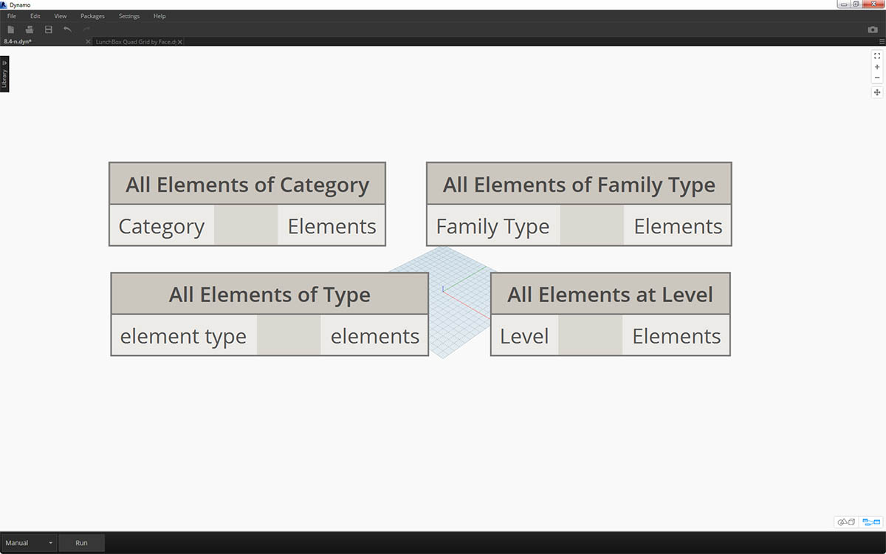

> 또한 *Revit 계층*에서 특정 계층별로 Revit 요소를 선택할 수도 있습니다. 이 옵션은 문서화 또는 생성 인스턴스화 및 사용자화 준비를 위해 대규모 데이터 배열을 사용자화하기 위한 강력한 옵션입니다.

위의 세 가지 이미지를 염두에 두고, 이 장의 나머지 섹션에서 작성할 파라메트릭 응용프로그램을 준비하기 위해 기본 Revit 프로젝트에서 요소를 선택하는 연습을 살펴보겠습니다.

### 연습

> 이 연습과 함께 제공되는 예시 파일을 다운로드하십시오(마우스 오른쪽 버튼을 클릭하고 "다른 이름으로 링크 저장..." 선택). 전체 예시 파일 리스트는 부록에서 확인할 수 있습니다.

> 1. [Selecting.dyn](datasets/8-2/Selecting.dyn)
2. [ARCH-Selecing-BaseFile.rvt](datasets/8-2/ARCH-Selecting-BaseFile.rvt)

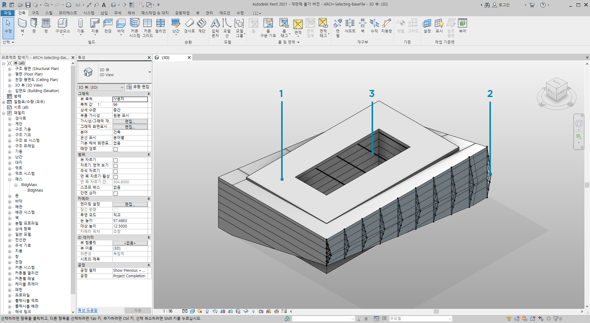

> 이 Revit 파일 예에는 간단한 건물의 세 가지 요소 유형이 있습니다. 이를 Revit 계층의 컨텍스트에서 Revit 요소를 선택하는 예로 사용하겠습니다.

> 1. 건물 매스
2. 트러스(가변 구성요소)
3. 보(구조 프레임)

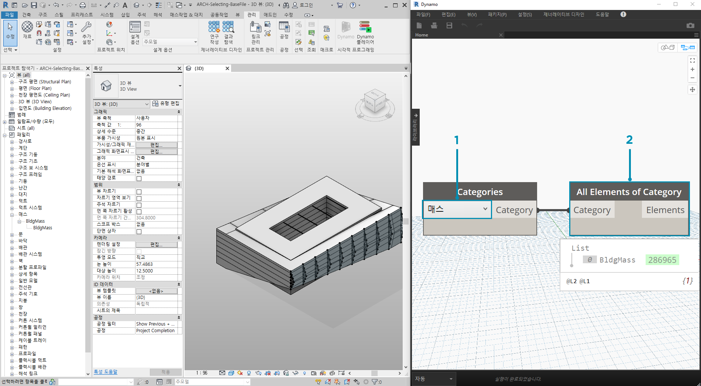

> 현재 Revit 프로젝트 뷰에 있는 요소로부터 어떤 결론을 도출할 수 있습니까? 해당 요소를 선택하기 위해 계층 구조에서 얼마나 아래로 이동해야 합니까? 물론 대규모 프로젝트에서 작업하게 되면 이 과정이 훨씬 복잡해질 것입니다. 사용 가능한 여러 가지 옵션이 있습니다. 즉, 카테고리, 레벨, 패밀리, 인스턴스 등을 기준으로 요소를 선택할 수 있습니다.

> 1. 기본 설정으로 작업하고 있으므로 카테고리 드롭다운 노드에서 *"Mass"*를 선택하여 건물 매스를 선택해 보겠습니다. 이 옵션은 Revit > 선택 탭에서 찾을 수 있습니다.
2. 매스 카테고리의 출력은 단순히 카테고리 자체입니다. 요소를 선택해야 합니다. 이렇게 하려면 *"All Elements of Category"* 노드를 사용합니다.

지금은 Dynamo에서 아무 형상도 표시되지 않습니다. Revit 요소를 선택했지만 요소를 Dynamo 형상으로 변환하지 않았습니다. 이렇게 구분하는 것은 중요합니다. 많은 요소를 선택하려고 할 경우 이로 인해 전반적인 속도가 느려지기 때문에 Dynamo에서 모든 요소를 미리 보려고 하지 않는 것이 좋습니다. Dynamo는 형상 작업을 반드시 수행할 필요 없이 Revit 프로젝트를 관리하기 위한 도구로, 이 장의 다음 섹션에서 살펴보겠습니다.

이 경우에는 간단한 형상으로 작업할 것이므로 형상을 Dynamo 미리보기로 가져오고자 합니다. 위의 감시 노드의 "BldgMass"에는 옆에 초록색 번호*가 있습니다. 이는 요소의 ID를 나타내며 Dynamo 형상이 아닌 Revit 요소를 처리하고 있음을 나타냅니다. 다음 단계는 이 Revit 요소를 Dynamo의 형상으로 변환하는 것입니다.

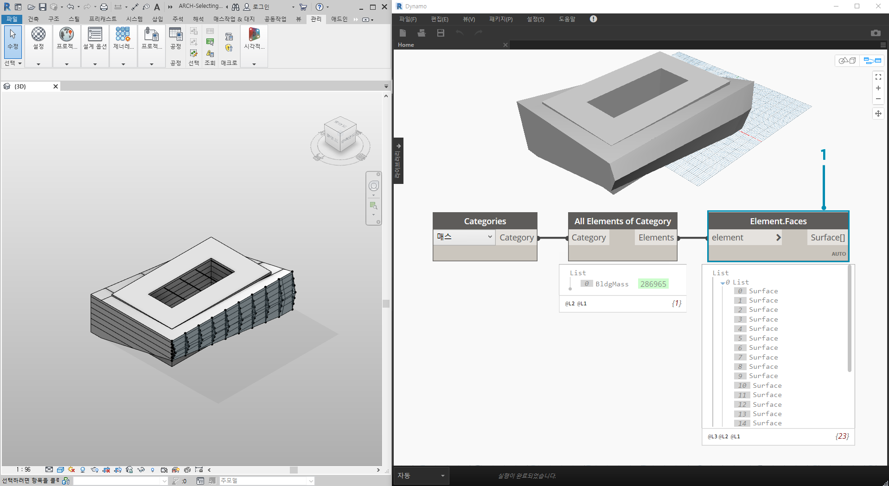

> 1. *Element. Faces* 노드를 사용하여 Revit 매스의 각 면을 나타내는 표면 리스트를 가져옵니다. 이제 Dynamo 뷰포트에서 형상을 보고, 파라메트릭 작업을 위해 면을 참조하기 시작할 수 있습니다.

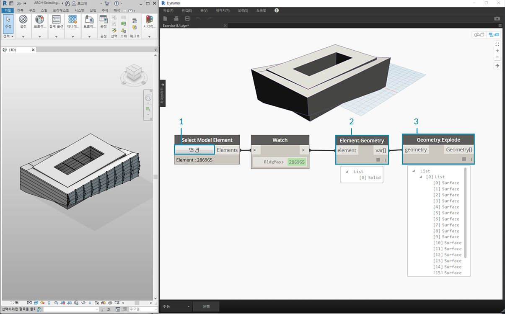

> 대체 방법은 다음과 같습니다. 이 경우 Revit 계층 *("All Elements of Category")*을 통해 선택하지 않고 Revit에서 형상을 명시적으로 선택합니다.

> 1. *"Select Model Element"* 노드를 사용하여 *"선택" *(또는 *"변경"*) 버튼을 클릭합니다. Revit 뷰포트에서 원하는 요소를 선택합니다. 이 경우에는 건물 매스를 선택하겠습니다.
2. *Element.Faces*가 아닌 *Element.Geometry*를 사용하여 전체 매스를 하나의 솔리드 형상으로 선택할 수 있습니다. 이렇게 하면 해당 매스 내에 포함된 모든 형상이 선택됩니다.
3. *Geometry.Explode*를 사용하여 표면 리스트를 다시 가져올 수 있습니다. 이러한 두 노드는 *Element.Faces*와 동일하게 작동하지만, Revit 요소의 형상을 자세히 살펴보기 위한 대체 옵션을 제공합니다.

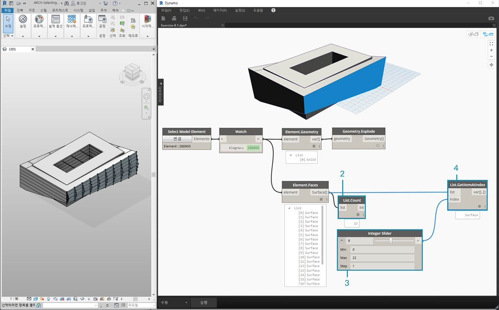

> 1. 몇 가지 기본 리스트 작업을 사용하여 관심 면을 조회할 수 있습니다.
2. 먼저 *List.Count* 노드에는 매스의 23개 표면으로 작업하고 있다고 표시됩니다.
3. 이 숫자를 참조하여 *integer slider*의 최댓값을 *"22"*로 변경합니다.
4. *List.GetItemAtIndex*를 사용하여 *index*에 대해 리스트와 *integer slider*를 입력합니다. 선택한 상태에서 슬라이딩하면서 *index 9*에서 중지한 후, 트러스를 호스팅하는 주 정면을 분리했습니다.

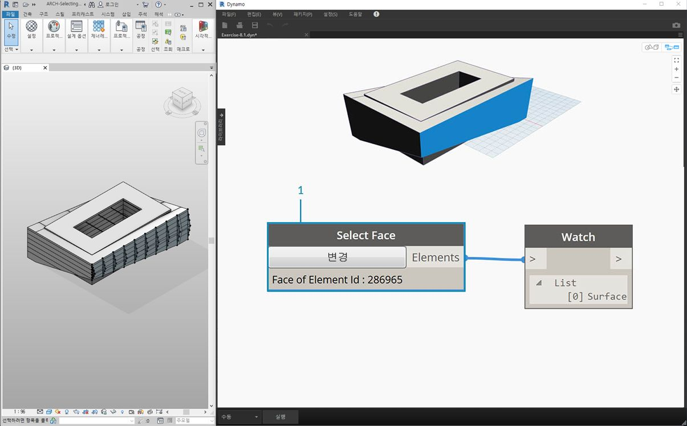

> 1. 이전 단계는 다소 번거로운 작업이었습니다. *"Select Face"* 노드를 사용하면 이 작업을 훨씬 더 빠르게 수행할 수 있습니다. 이렇게 하면 Revit 프로젝트에서 요소 자체가 아닌 면을 분리할 수 있습니다. 전체 요소가 아닌 표면을 선택한다는 점을 제외하면 *"Select Model Element"*와 동일한 상호 작용이 적용됩니다.


> 빌딩의 주 정면 벽을 분리하려 한다고 가정합니다. *"Select Faces"* 노드를 사용하여 이 작업을 수행할 수 있습니다. "선택" 버튼을 클릭한 다음, Revit에서 4개의 주요 정면을 선택합니다.

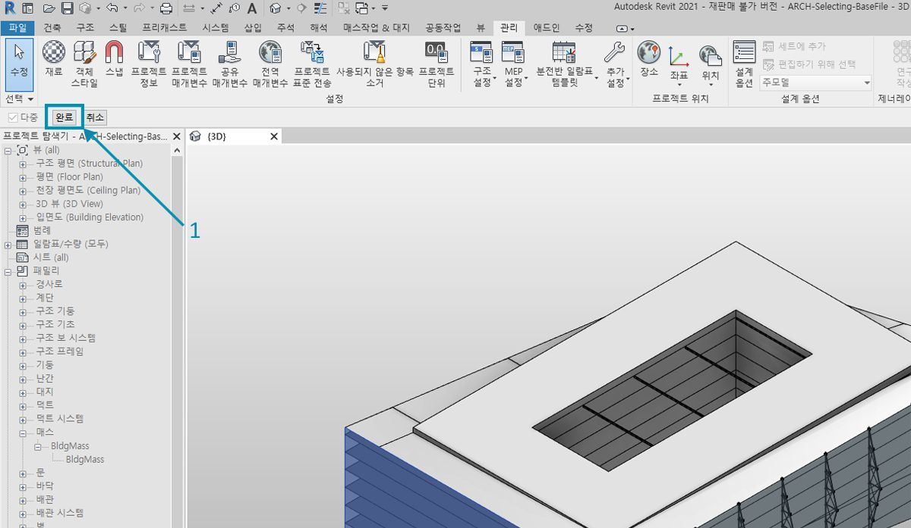

> 1. 네 개의 벽을 선택한 후 Revit에서 *"완료"* 버튼을 클릭해야 합니다.

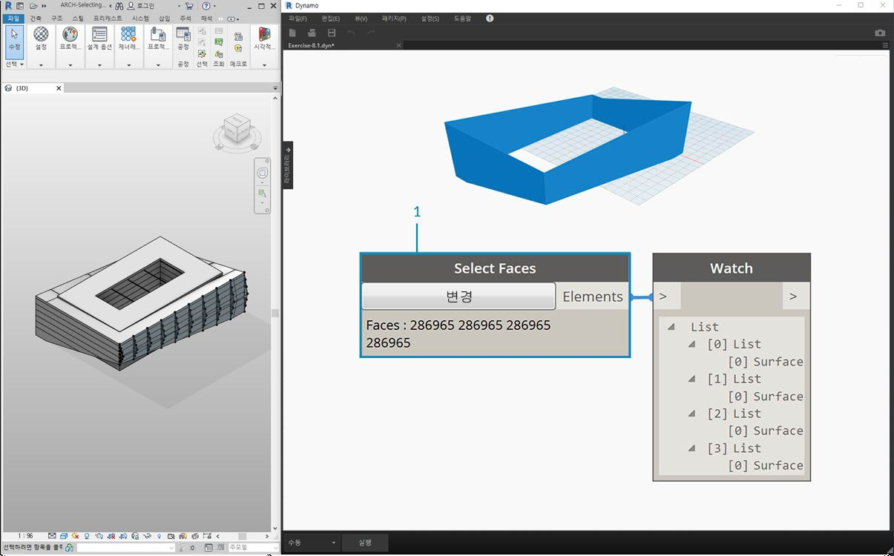

> 1. 이제 면을 Dynamo에 표면으로 가져옵니다.

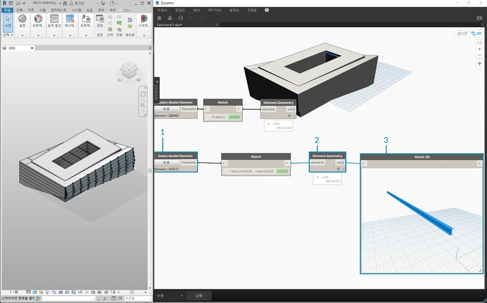

> 1. 이제 아트리움 위의 보를 살펴보겠습니다. *"Select Model Element"* 노드를 사용하여 보 중 하나를 선택합니다.
2. 보 요소를 *Element.Geometry* 노드에 연결합니다. 그러면 Dynamo 뷰포트에 해당 보가 표시됩니다.
3. *Watch3D* 노드를 사용하여 형상을 확대할 수 있습니다(Watch 3D에서 보가 보이지 않는 경우 마우스 오른쪽 버튼을 클릭하고 "창에 맞게 줌"을 누름).

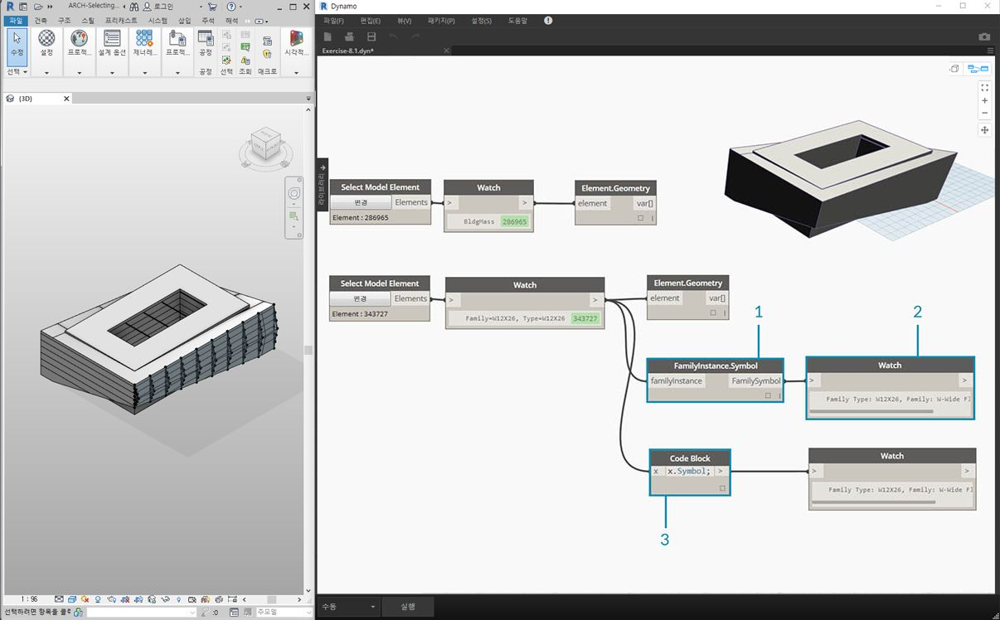

> Revit/Dynamo 워크플로우에서 자주 묻는 질문은 바로 '요소 하나를 선택하고 유사한 요소를 모두 가져오는 방법은 무엇입니까?'입니다. 선택한 Revit 요소에 모든 계층 정보가 포함되어 있으므로 해당 패밀리 유형을 조회하고 해당 유형의 모든 요소를 선택할 수 있습니다.

> 1. 보 요소를 *FamilyInstance.Symbol** 노드에 연결합니다.
2. 이제 *Watch* 노드에 출력이 Revit 요소가 아닌 패밀리 기호임이 표시됩니다.
3. *FamilyInstance.Symbol*은 간단한 조회이므로 ```x.Symbol;```을 사용할 때처럼 쉽게 code block에서 이 작업을 수행하고 동일한 결과를 얻을 수 있습니다.

**주 - 패밀리 기호는 패밀리 유형을 나타내는 Revit API 용어입니다. 이로 인해 혼동이 생길 수 있으므로 이후 릴리즈에서 업데이트할 예정입니다.*

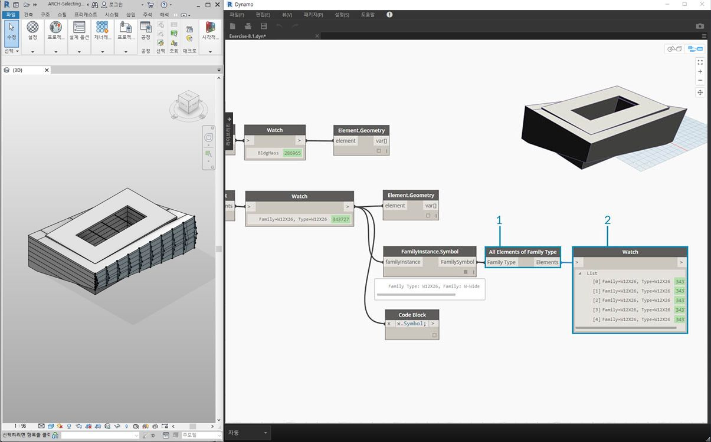

> 1. 나머지 보를 선택하려면 *"All Elements of Family Type"* 노드를 사용합니다.
2. 감시 노드는 다섯 개의 Revit 요소가 선택되었음을 나타냅니다.

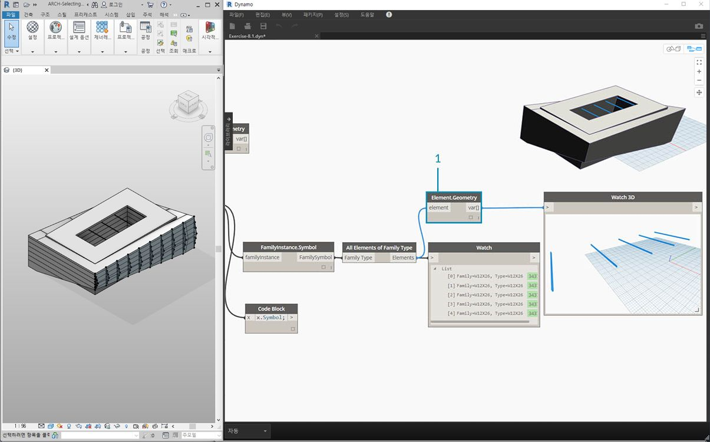

> 1. 이러한 5가지 요소를 모두 Dynamo 형상으로 변환할 수도 있습니다.

보가 500개라면 어떨까요? 이러한 모든 요소를 Dynamo 형상으로 변환하는 작업은 시간이 오래 걸릴 수 있습니다. Dynamo에서 노드를 계산하는 데 시간이 오래 걸리는 경우 그래프를 개발하는 동안 Revit 작업 실행을 일시 중지하기 위해 노드 "고정" 기능을 사용할 수도 있습니다. 노드 고정에 대한 자세한 내용은 [솔리드 장](../05_Geometry-for-Computational-Design/5-6_solids.md#freezing)의 "고정" 섹션을 확인하십시오.

500개의 보를 가져오려는 경우 의도한 파라메트릭 작업을 수행하는 데 모든 표면이 필요합니까? 또는 보에서 기본 정보를 추출하고 기본 형상을 이용해 생성 작업을 수행할 수 있습니까? 이러한 질문은 이 장을 둘러볼 때 유의해야 할 질문입니다. 예를 들어, 트러스 시스템을 살펴보겠습니다.

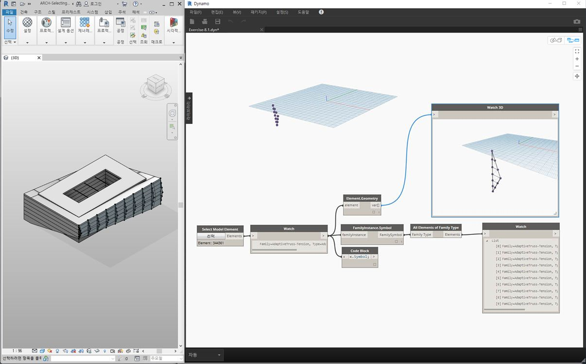

> 동일한 노드 그래프를 사용하여 보 요소 대신 트러스 요소를 선택합니다. 이를 수행하기 전에 이전 단계에서 Element.Geometry를 삭제합니다.

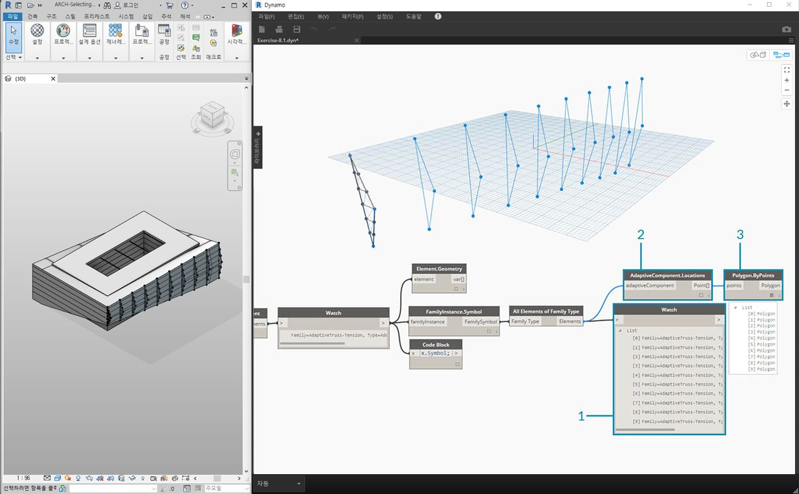

> 1. *Watch* 노드에 Revit에서 선택한 가변 구성요소 리스트가 있는 것을 볼 수 있습니다. 기본 정보를 추출하려고 하므로 가변 점에서 시작합니다.
2. *"All Elements of Family Type"* 노드를 *"AdaptiveComponent.Location"* 노드에 연결합니다. 이렇게 하면 각각에 가변 점 위치를 나타내는 세 개의 점이 있는 리스트의 목록이 제공됩니다.
3. *"Polygon.ByPoints"* 노드를 연결하면 polycurve가 반환됩니다. 이 내용은 Dynamo 뷰포트에서 확인할 수 있습니다. 이 방법을 통해 하나의 요소에 대한 형상을 시각화하고 요소의 나머지 배열에 대한 형상을 추상화했습니다(이 예에 포함된 것보다 번호가 더 클 수 있음).

**팁: Dynamo에서 Revit 요소의 초록색 번호를 클릭하면 Revit 뷰포트가 해당 요소로 줌됩니다.*

