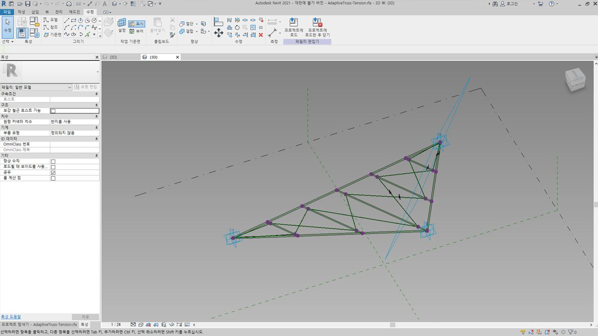
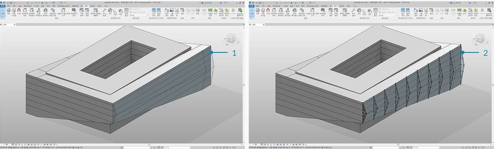
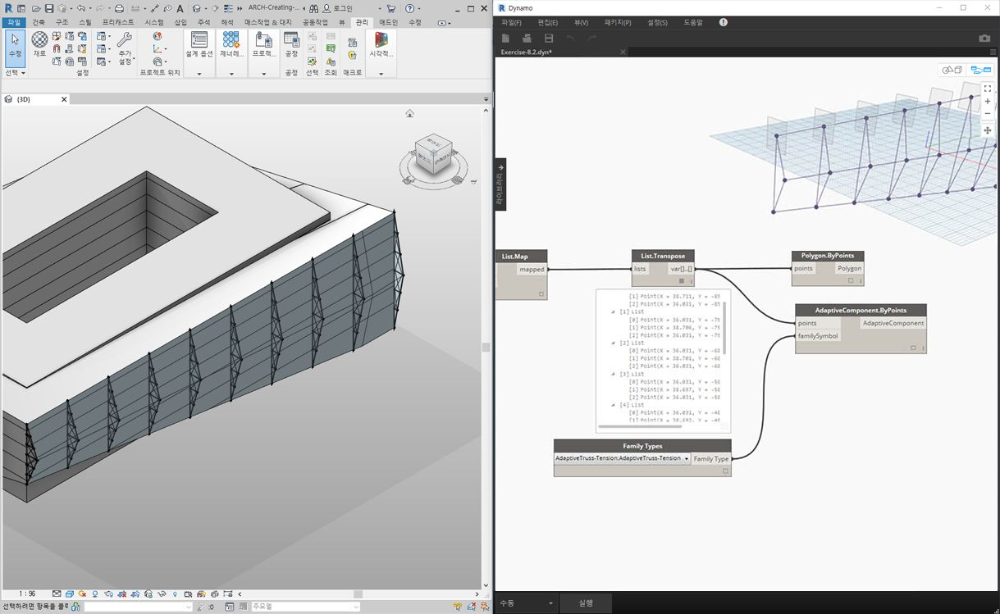
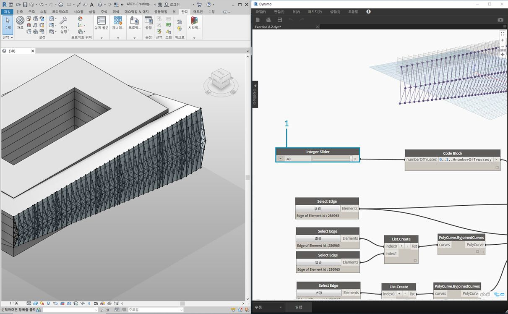
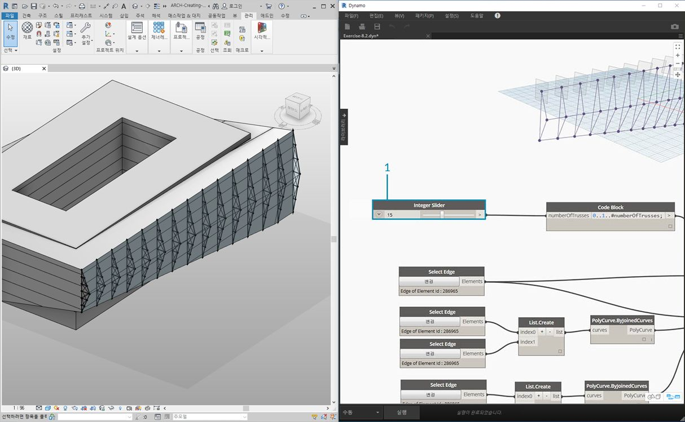
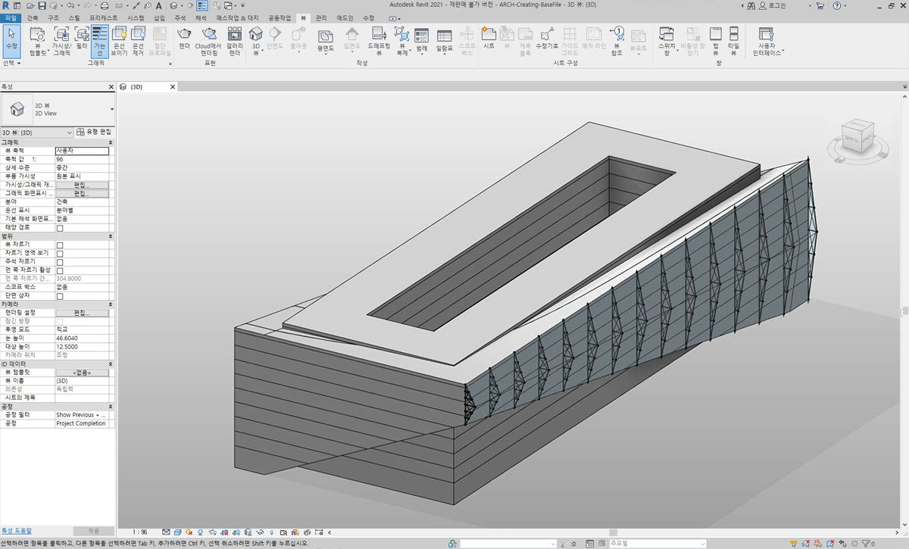
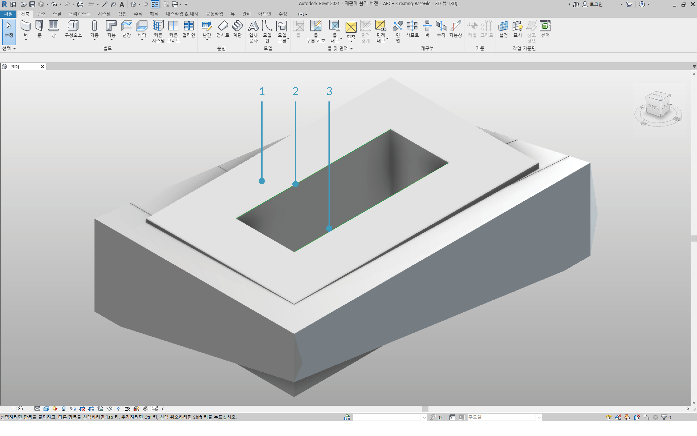
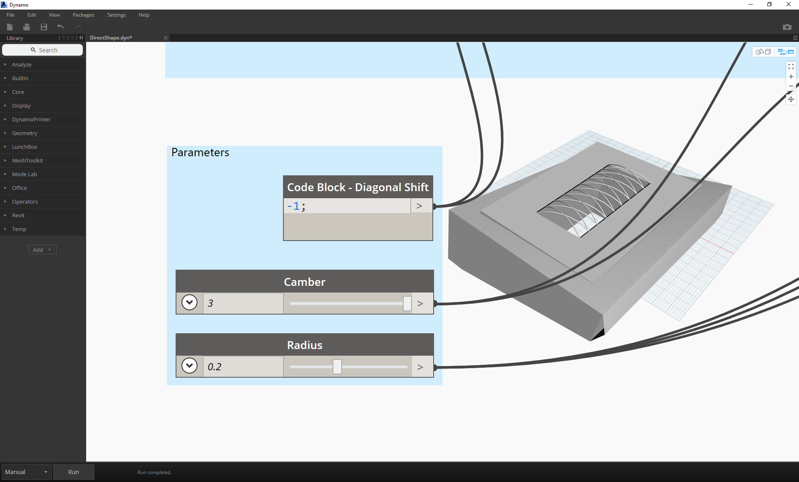
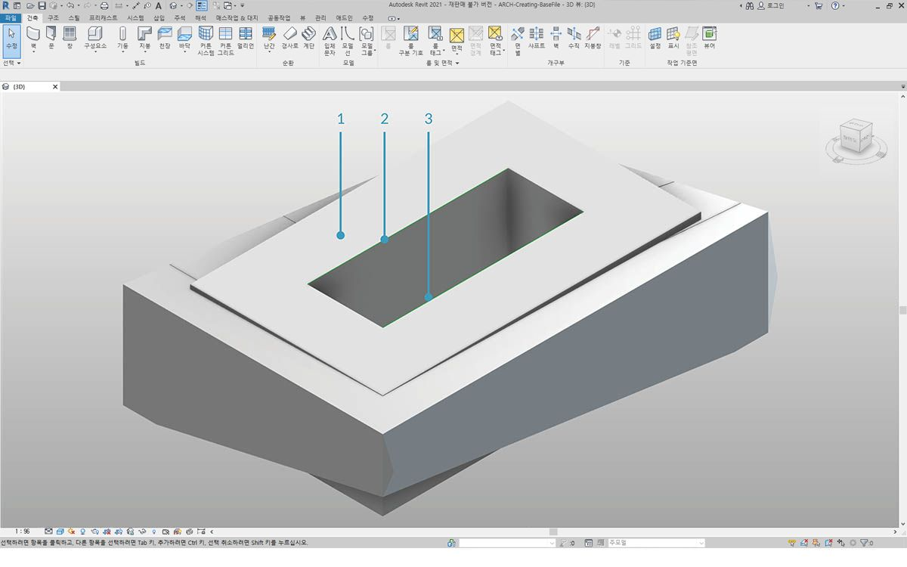

## 작성

전체 파라메트릭 컨트롤을 사용하여 Dynamo에서 Revit 요소의 배열을 작성할 수 있습니다. Dynamo의 Revit 노드에서는 일반 형상에서 특정 카테고리 유형(예: 벽 및 바닥)으로 요소를 가져올 수 있는 기능을 제공합니다. 이 섹션에서는 가변 구성요소와 함께 파라메트릭 방식으로 유연한 요소를 가져오는 방법에 중점을 두겠습니다.


### 가변 구성요소

가변 구성요소는 생성 응용프로그램에 유용한 유연한 패밀리 카테고리입니다. 인스턴스화할 때 가변 점의 기본 위치에 의해 구동되는 복잡한 형상 요소를 작성할 수 있습니다.



> 패밀리 편집기의 세 점 가변 구성요소 예입니다. 이렇게 하면 각 가변 점의 위치에 의해 정의된 트러스가 생성됩니다. 아래 연습에서는 이 구성요소를 사용하여 정면에 걸친 일련의 트러스를 생성하겠습니다.

#### 상호 운용성의 원칙

가변 구성요소는 상호 운용성의 모범 사례에 대한 좋은 예입니다. 기본 가변 점을 정의하여 가변 구성요소의 배열을 작성할 수 있습니다. 그리고 이 데이터를 다른 프로그램으로 전송할 때 형상을 단순한 데이터로 줄일 수 있습니다. Excel 같은 프로그램을 사용한 가져오기 및 내보내기는 유사한 논리를 따릅니다.

정면 컨설턴트가 완전히 명확하게 표현된 형상을 통해 해석할 필요 없이 트러스 요소의 위치를 알고 싶어 한다고 가정해 보십시오. 제작을 준비할 때 컨설턴트가 가변 점의 위치를 참조하여 Inventor 같은 프로그램에서 형상을 재생성할 수 있습니다.

아래 연습에서 설정할 워크플로우를 통해 Revit 요소 작성을 위한 정의를 작성하는 동안 이 모든 데이터에 액세스할 수 있습니다. 이 프로세스를 통해 개념화, 문서화 및 제작을 원활한 워크플로우로 병합할 수 있습니다. 이렇게 하면 상호 운용성을 위한 더 지능형의 효율적인 프로세스가 작성됩니다.

#### 여러 요소 및 리스트


아래 연습에서는 Dynamo에서 Revit 요소 작성을 위해 데이터를 참조하는 방법에 대해 설명하겠습니다. 여러 개의 가변 구성요소를 생성하기 위해 가변 구성요소의 각 점을 나타내는 세 개의 점이 각 리스트에 있는 리스트의 리스트를 정의합니다. Dynamo에서 데이터 구조를 관리할 때 이 점을 염두에 두어야 합니다.

### 연습

> 이 연습과 함께 제공되는 예시 파일을 다운로드하십시오(마우스 오른쪽 버튼을 클릭하고 "다른 이름으로 링크 저장..." 선택). 전체 예시 파일 리스트는 부록에서 확인할 수 있습니다.

> 1. [Creating.dyn](datasets/8-4/Creating.dyn)
2. [ARCH-Creating-BaseFile.rvt](datasets/8-4/ARCH-Creating-BaseFile.rvt)



> 이 섹션의 예시 파일로 시작하거나 이전 세션의 Revit 파일을 계속 사용하면 동일한 Revit 매스가 표시됩니다.

> 1. 이것은 파일을 열었을 때의 상태입니다.
2. 이것은 Revit 매스에 지능형으로 링크된 Dynamo를 사용하여 작성한 트러스 시스템입니다.


> 우리는 *"Select Model Element"* 및 *"Select Face"* 노드를 사용했으며, 이제 형상 계층에서 한 단계 더 아래로 이동하여 *"Select Edge"*를 사용해 보겠습니다. Dynamo 솔버가 *"자동"*을 실행하도록 설정되어 있으면 그래프가 Revit 파일의 변경 사항에 따라 지속적으로 업데이트됩니다. 선택하는 모서리는 Revit 요소 토폴로지에 동적으로 연결됩니다. 토폴로지*가 변경되지 않는 한, 연결은 Revit과 Dynamo 사이에 링크된 상태로 유지됩니다.

> 1. 유리 정면의 맨 위 곡선을 선택합니다. 이 길이는 건물의 전체 길이에 걸쳐 있습니다. 모서리를 선택하는 데 문제가 있을 경우 원하는 모서리가 강조 표시될 때까지 모서리 위에 마우스를 놓고 *"Tab"* 키를 눌러 Revit에서 선택 항목을 선택해야 합니다.
2. 두 *"Select Edge"* 노드를 사용하여 정면의 중간에 있는 돌각을 나타내는 각 모서리를 선택합니다.
3. Revit에서 정면 맨 아래 모서리에 대해 동일한 작업을 수행합니다.
4. *Watch* 노드에서 이제 Dynamo에 선이 있음을 나타냅니다. 그러면, 모서리 자체는 Revit 요소가 아니므로 자동으로 Dynamo 형상으로 변환됩니다. 이러한 곡선은 정면 전체에서 가변 트러스를 인스턴스화하는 데 사용할 참조입니다.

**참고 - 위상을 일관되게 유지하기 위해 추가된 면이나 모서리가 없는 모델을 지칭합니다. 매개변수는 모양을 변경할 수 있지만, 작성 방식은 그대로 유지됩니다.*


> 먼저 곡선을 결합하여 하나의 리스트로 병합해야 합니다. 이러한 방식으로 곡선을 *"그룹화"*하여 형상 작업을 수행할 수 있습니다.

> 1. 정면 가운데에 두 개의 곡선에 대한 리스트를 작성합니다.
2. *List.Create* 구성요소를 *Polycurve.ByJoinedCurves* 노드에 플러깅하여 두 곡선을 Polycurve에 결합합니다.
3. 정면 아래쪽에 두 개의 곡선에 대한 리스트를 작성합니다.
4. *List.Create* 구성요소를 *Polycurve.ByJoinedCurves* 노드에 플러깅하여 두 곡선을 Polycurve에 결합합니다.
5. 마지막으로 세 개의 주 곡선(선 1개와 polycurve 2개)을 하나의 리스트에 결합합니다.


> 맨 위 곡선(선)을 활용하여 정면의 전체 범위를 나타내려고 합니다. 이 선을 따라 평면을 작성하여 리스트에서 함께 그룹화한 곡선 세트와 교차할 것입니다.

> 1. *code block*에서 ```0..1..#numberOfTrusses;``` 구문을 사용하여 범위를 정의합니다.
2. code block의 입력에 *integer slider*를 플러깅합니다. 추측한 바와 같이, 이를 통해 트러스의 수를 나타낼 것입니다. 슬라이더가 *0*에서 *1*로 정의된 범위의 항목 수를 제어합니다.
3. *code block*을 *"Curve.PlaneAtParameter"* 노드의 *param* 입력에 플러깅하고 맨 위 모서리를 *곡선* 입력에 플러깅합니다. 이렇게 하면 10개의 평면이 생기고 정면 전체에 균등하게 분산됩니다.


> 평면은 무한한 2차원 공간을 나타내는 추상적인 형상 조각입니다. 또한 이 단계에서 설정한 것처럼 등고선을 작성하고 교차할 때 적합합니다.

> 1. *Geometry.Intersect* 노드(외적 레이싱 참조)를 사용하여 *Curve.PlaneAtParameter*를 *Geometry.Intersect* 노드의 *entity* 입력에 플러깅합니다. 주 *List.Create* 노드를 *geometry* 입력에 플러깅합니다. 이제 Dynamo 뷰포트에 정의된 평면과 함께 각 곡선의 교차를 나타내는 점이 표시됩니다.


> 출력은 리스트의 리스트입니다. 목적을 위해 너무 많은 리스트가 있습니다. 여기서 부분 단순화를 수행하려고 합니다. 리스트에서 한 단계 내려가 결과를 단순화해야 합니다. 이를 위해 Primer의 리스트 장에 설명된 대로 *List.Map* 작업을 사용합니다.

> 1. *Geometry.Intersect* 노드를 *List.Map*의 리스트 입력에 플러깅합니다.
2. *Flatten* 노드를 *List.Map*의 f(x) 입력에 플러깅합니다. 결과에서 3개의 리스트를 제공하며 각 리스트에는 트러스 수와 동일한 개수가 포함됩니다.
3. 이 데이터를 변경해야 합니다. 트러스를 인스턴스화하려면 패밀리에 정의된 것과 동일한 수의 가변 점을 사용해야 합니다. 이는 세 점 가변 구성요소이므로 각각 10개의 항목(numberOfTrusses)이 있는 리스트 3개 대신, 각각 3개의 항목이 있는 리스트 10개가 필요합니다. 이 방식으로 10개의 가변 구성요소를 작성할 수 있습니다.
4. *List.Map*을 *List.Transpose* 노드에 플러깅합니다. 이제 원하는 데이터 출력이 만들어졌습니다.
5. 데이터가 올바른지 확인하려면 캔버스에 *Polygon.ByPoints* 노드를 추가하고 Dynamo 미리보기에서 다시 확인합니다.


> 다각형을 작성한 방법과 같은 방법으로 가변 구성요소를 배열합니다.

> 1. 캔버스에 *AdaptiveComponent.ByPoints* 노드를 추가하고 *List.Transpose* 노드를 *점* 입력에 플러깅합니다.
2. *Family Types* 노드를 사용하여 *"AdaptiveTruss"* 패밀리를 선택하고 이 패밀리를 *AdaptiveComponent.ByPoints* 노드의 *familySymbol* 입력에 플러깅합니다.



> Revit에서 확인하면 이제 정면 전체에 걸쳐 10개의 트러스가 균일하게 배치되었습니다!



> 1. 그래프를 "조정"하면, *슬라이더*가 변경되어 *numberOfTrusses*가 *40*으로 바뀝니다. 많은 트러스가 사실적이지는 않지만 파라메트릭 링크가 작동합니다.



> 1. 트러스 시스템을 완화하면서 *numberOfTrusses*에 대해 *15* 값으로 절충해보겠습니다.



> 최종 테스트의 경우 Revit에서 매스를 선택하고 인스턴스 매개변수를 편집하여 건물의 형태를 변경하고 트러스가 그에 따라 바뀌는 것을 확인할 수 있습니다. 이 업데이트를 보려면 이 Dynamo 그래프가 열려 있어야 하며, 그래프가 닫히면 바로 링크가 끊어집니다.

### DirectShape 요소

파라메트릭 Dynamo 형상을 Revit으로 가져오는 또 다른 방법은 DirectShape를 사용하는 것입니다. 요약하면, DirectShape 요소 및 관련 클래스는 외부에서 작성된 형상 모양을 Revit 문서에 저장하는 기능을 지원합니다. 형상에 닫힌 솔리드나 메쉬가 포함될 수 있습니다. DirectShape는 기본적으로 "실제" Revit 요소를 작성하는 데 정보가 충분하지 않은 IFC 또는 STEP와 같은 다른 데이터 형식에서 모양을 가져오도록 되어 있습니다. IFC 및 STEP 워크플로우와 마찬가지로 DirectShape 기능은 Dynamo에서 작성된 형상을 Revit 프로젝트에 실제 요소로 가져오는 작업과 함께 사용하기에 적합합니다.

Dynamo 형상을 DirectShape로 Revit 프로젝트에 가져오는 과정을 살펴보고 연습해 보겠습니다. 이 방법을 사용하면 가져온 형상의 카테고리, 재료, 이름을 지정할 수 있으며, 그동안 Dynamo 그래프에 대한 파라메트릭 링크는 유지됩니다.

### 연습

> 이 연습과 함께 제공되는 예시 파일을 다운로드하십시오(마우스 오른쪽 버튼을 클릭하고 "다른 이름으로 링크 저장..." 선택). 전체 예시 파일 리스트는 부록에서 확인할 수 있습니다.

> 1. [DirectShape.dyn](datasets/8-4/DirectShape.dyn)
2. [ARCH-DirectShape-BaseFile.rvt](datasets/8-4/ARCH-DirectShape-BaseFile.rvt)



> 먼저 이 교육의 샘플 파일(ARCH-DirectShape-BaseFile.rvt)을 엽니다.

> 1. 3D 뷰에서는 이전 교육에서 건물 매스를 확인할 수 있습니다.
2. 아트리움의 모서리를 따라 참조 곡선이 하나 있는데 이를 Dynamo에서 참조할 곡선으로 사용하겠습니다.
3. 아트리움의 반대쪽 모서리를 따라 또 다른 참조 곡선이 있으며, 이 곡선도 Dynamo에서 참조할 것입니다.


> 1. Dynamo에서 형상을 참조하기 위해 Revit에서 각 부재에 대해 *Select Model Element*를 사용하겠습니다. Revit에서 매스를 선택하고 *Element.Faces*를 사용하여 이 형상을 Dynamo로 가져옵니다. 이제 Dynamo 미리보기에 매스가 표시됩니다.
2. *Select Model Element* 및 *CurveElement.Curve*를 사용하여 하나의 참조 곡선을 Dynamo로 가져옵니다.
3. *Select Model Element* 및 *CurveElement.Curve*를 사용하여 다른 참조 곡선을 Dynamo로 가져옵니다.


> 1. 샘플 그래프에서 오른쪽으로 줌을 축소하고 초점이동하면 큰 노드 그룹이 표시됩니다. 이러한 노드 그룹은 Dynamo 미리보기에 표시된 격자 지붕 구조를 생성하는 형상 작업입니다. 이러한 노드는 Primer의 *code block 섹션*에서 설명한 대로 [Node to Code](../07_Code-Block/7-2_Design-Script-syntax.md#Node) 기능을 사용하여 생성됩니다.
2. 이 구조는 대각선 이동, 캠버 및 반지름이라는 세 가지 주요 매개변수에 의해 구동됩니다.



> 이 그래프에 대한 매개변수의 근접 모양을 줌합니다. 이를 조정하여 다른 형상 출력을 얻을 수 있습니다.



> 1. *DirectShape.ByGeometry* 노드를 캔버스에 놓으면 **형상, 카테고리, 재료**, **이름** 등 네 가지 입력이 표시됩니다.
2. 형상은 그래프의 형상 작성 부분에서 작성된 솔리드가 됩니다.
3. 카테고리 입력은 드롭다운 *Categories* 노드를 사용하여 선택합니다. 이 경우에는 "구조 프레임"을 사용하겠습니다.
4. 이 경우 더욱 단순하게 "기본값"으로 정의할 수 있지만 위의 노드 배열을 통해 재료 입력이 선택됩니다.


> Dynamo를 실행하고 Revit으로 돌아오면 프로젝트의 지붕에 가져온 형상이 있습니다. 이는 일반 모델이 아니라 구조 프레임 요소입니다. Dynamo에 대한 파라메트릭 링크는 그대로 유지됩니다.


