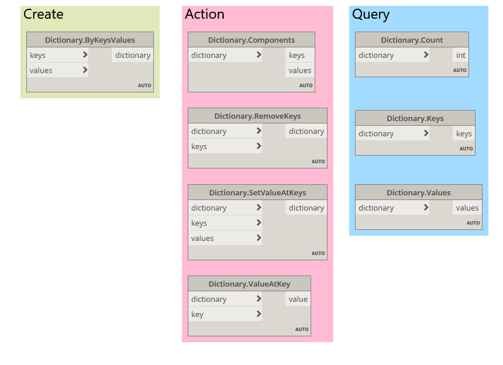

# 사전 노드

Dynamo 2.0은 다양한 사전 노드를 제공하는데, 그러한 노드 중에는 *create, action 및 query* 노드가 있습니다.



* ```Dictionary.ByKeysValues```는 제공된 값과 키를 사용해서 사전을 작성합니다. *항목 수는 가장 짧은 리스트 입력이 됩니다.*
* ```Dictionary.Components```는 입력 사전의 구성요소를 생성합니다. *create 노드의 역 작업입니다.*
* ```Dictionary.RemoveKeys```는 입력 키가 제거된 새 사전 객체를 생성합니다.
* ```Dictionary.SetValueAtKeys```는 입력 키와 값을 기준으로 새 사전을 생성하여 해당 키의 현재 값을 대치합니다.
* ```Dictionary.ValueAtKey```는 입력 키의 값을 반환합니다.
* ```Dictionary.Count```는 사전에 있는 키 값 쌍의 수를 알려줍니다.
* ```Dictionary.Keys```는 현재 사전에 저장된 키를 반환합니다.
* ```Dictionary.Values```는 현재 사전에 저장된 값을 반환합니다.

##### _색인과 리스트로 작업하는 이전 방법 대신, 전반적으로 데이터를 사전과 연관 짓는 것이 유용한 대안이 될 수 있습니다._

