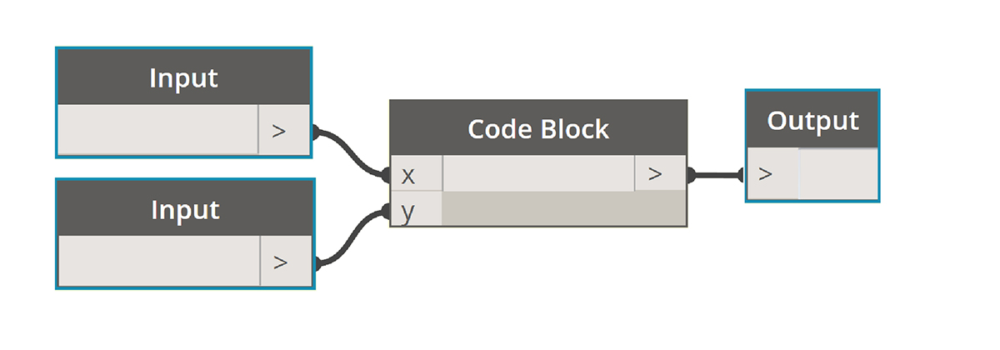
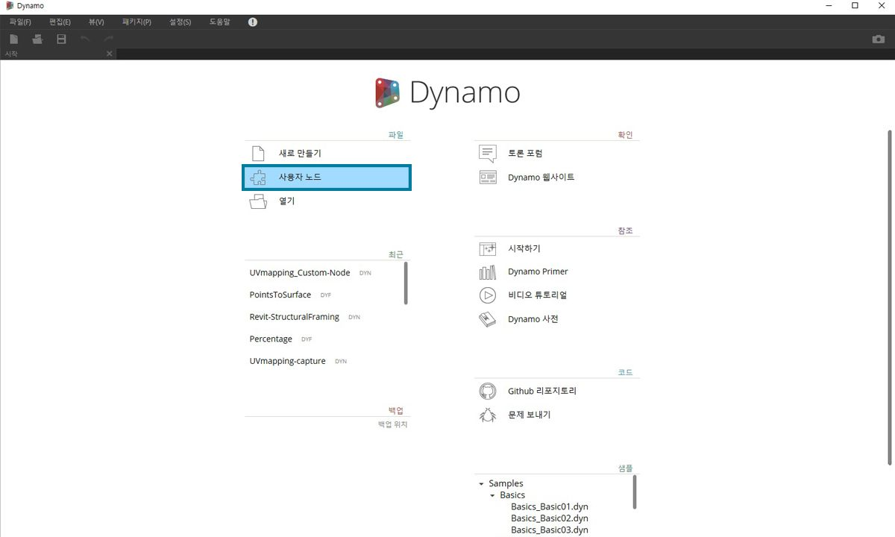
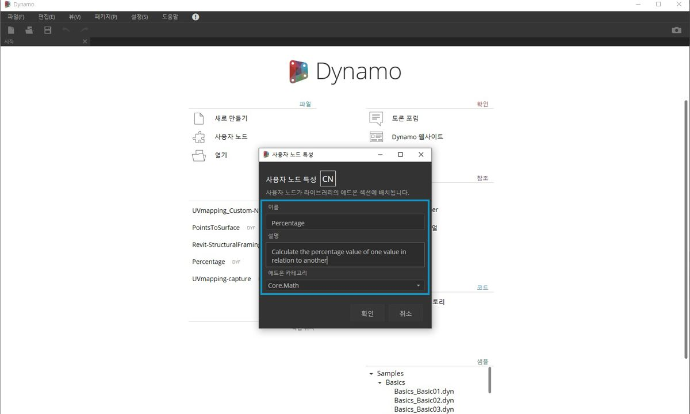
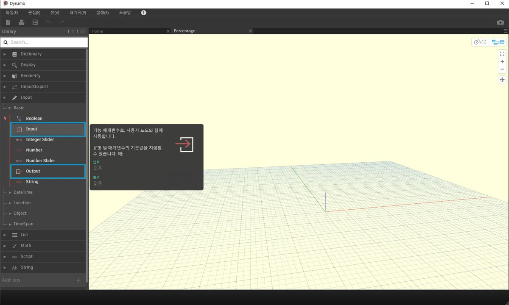

## 사용자 노드

Dynamo는 광범위한 시각적 프로그래밍 작업을 위해 다양한 코어 노드를 제공합니다. 경우에 따라 더 빠르거나 더 뛰어넌 솔루션, 또는 쉽게 공유할 수 있는 솔루션은 바로 자체 노드를 작성하는 것입니다. 자체 노드는 다른 프로젝트에서 재사용할 수 있으므로 그래프를 더욱 명확하고 선명하게 만들고 패키지 관리자에 푸시하여 글로벌 Dynamo 커뮤니티와 공유할 수 있습니다.

### 그래프 정리

사용자 노드는 개념상 컨테이너로 간주할 수 있는 "Dynamo 사용자 노드" 내에 다른 노드 및 사용자 노드를 중첩하여 생성됩니다. 이 컨테이너 노드가 그래프에서 실행되면 해당 컨테이너 노드 내의 모든 항목이 실행되어 유용한 노드 조합을 재사용하고 공유할 수 있게 됩니다.

### 변경 사항에 맞게 조정

그래프에 여러 개의 사용자 노드 사본이 있는 경우 기본 사용자 노드를 편집하여 모든 사본을 업데이트할 수 있습니다. 이렇게 하면 워크플로우나 설계에서 발생할 수 있는 변경 사항에 맞게 조정하는 방식으로 그래프를 원활하게 업데이트할 수 있습니다.

### 작업 공유

사용자 노드의 가장 좋은 기능은 작업 공유 기능입니다. "파워 유저"가 복잡한 Dynamo 그래프를 만들고 Dynamo를 처음 접하는 설계자에게 전달하는 경우 그래프를 설계 상호작용을 위한 필수 요소로 압축할 수 있습니다. 사용자 노드를 열어 내부 그래프를 편집할 수 있지만 "컨테이너"는 단순하게 유지할 수 있습니다. 이 프로세스에서 사용자 노드를 사용하면 Dynamo 사용자가 깔끔하고 직관적인 그래프를 설계할 수 있습니다.

### 노드를 작성하는 여러 가지 방법

Dynamo에서 사용자 노드를 작성하는 방법에는 여러 가지가 있습니다. 이 장의 예에서는 Dynamo UI에서 직접 사용자 노드를 작성해 보겠습니다. 자신이 프로그래머이며 C# 또는 Zero-Touch 형식에 관심이 있는 경우 Dynamo Wiki에서 [이 페이지](https://github.com/DynamoDS/Dynamo/wiki/How-To-Create-Your-Own-Nodes)를 참조하여 더 자세히 알아볼 수 있습니다.

### 사용자 노드 환경

사용자 노드 환경으로 이동하여 백분율을 계산하는 단순 노드를 만들어 보겠습니다. 사용자 노드 환경은 Dynamo 그래프 환경과 다르지만, 기본적으로 상호작용은 동일합니다. 언급한 김에 바로 첫 번째 사용자 노드를 작성해 보겠습니다.

> 사용자 노드를 처음부터 새로 작성하려면 Dynamo를 시작하고 사용자 노드를 선택하거나 캔버스에서 Ctrl+Shift+N을 누릅니다.

> 사용자 노드 특성 대화상자에서 이름, 설명 및 카테고리를 지정합니다.

> 1. **이름:** Percentage
2. **설명**: 값 하나의 다른 값 대비 백분율을 계산합니다.
3. **카테고리:** Core.Math

> 지정하면 노란색 배경의 캔버스가 열립니다. 이는 사용자 노드 내에서 작업하고 있음을 나타냅니다. 이 캔버스에서는 모든 코어 Dynamo 노드와 함께 사용자 노드에서 들어오고 나가는 데이터에 레이블을 지정하는 **입력** 및 **출력** 노드에 액세스할 수 있습니다. 이러한 노드는 *코어>입력*에서 찾을 수 있습니다.

> 1. **입력:** 입력 노드는 사용자 노드에 입력 포트를 작성합니다. 입력 노드의 구문은 *input_name : datatype = default_value(선택 사항)*입니다.

2. **출력:** 입력과 유사하지만, 이러한 노드는 사용자 노드에서 출력 포트를 만들고 이름을 지정합니다. 입력 및 출력 유형에 힌트를 제공하는 **사용자 주석**을 입력 및 출력 포트에 추가해 보십시오. 이는 [사용자 노드 작성 섹션](10-2_Creating.md)에 자세히 설명되어 있습니다.

이 사용자 노드를 .dyf(표준 .dyn와는 다름) 파일로 저장할 수 있으며, 이 노드는 사용자 세션 및 후속 세션에 자동으로 추가됩니다. 사용자 노드의 특성에서 지정한 카테고리에서 사용자 라이브러리의 사용자 노드를 찾을 수 있습니다.

> 왼쪽: 기본 라이브러리의 Core > Math 카테고리, 
오른쪽: 새 사용자 노드의 Core > Math

### 다음에 알아볼 내용

이제 첫 번째 사용자 노드를 작성했으므로 다음 섹션에서는 사용자 노드 기능 및 일반 워크플로우를 게시하는 방법에 대해 자세히 알아보겠습니다. 또한 한 표면에서 다른 표면으로 형상을 전송하는 사용자 노드를 개발하는 과정도 살펴보겠습니다.

