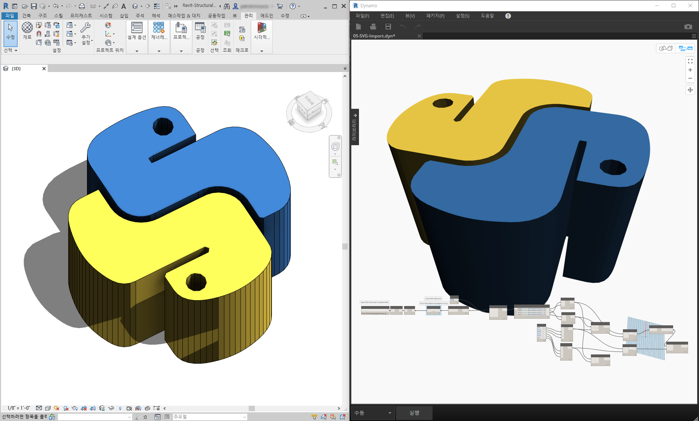
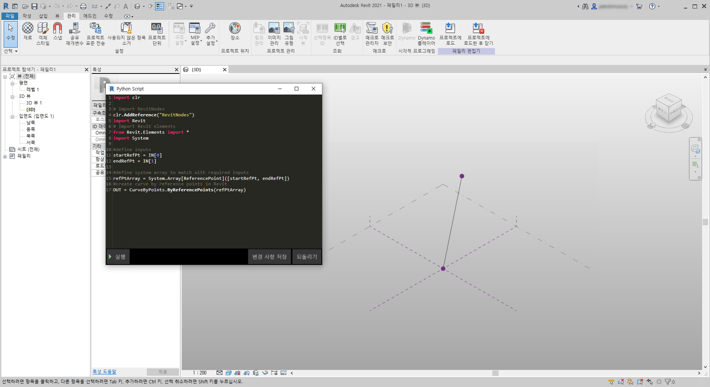
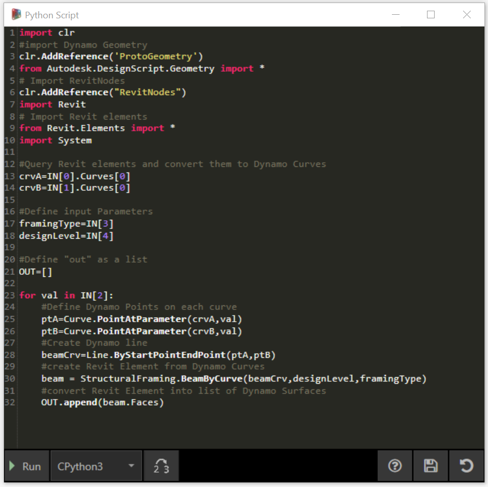

## Python 및 Revit

Dynamo에서 Python 스크립트를 사용하는 방법에 대해 설명했으므로 이제 Revit 라이브러리를 스크립팅 환경에 연결하는 방법을 살펴보겠습니다. 아래의 code block에서 처음 세 줄을 포함하는 Dynamo 코어 노드를 가져왔습니다. Revit 노드, Revit 요소 및 Revit 문서 관리자를 가져오려는 경우 다음과 같은 일부 코드 줄만 추가하면 됩니다.

```
import clr
clr.AddReference('ProtoGeometry')
from Autodesk.DesignScript.Geometry import *

# Import RevitNodes
clr.AddReference("RevitNodes")
import Revit

# Import Revit elements
from Revit.Elements import *

# Import DocumentManager
clr.AddReference("RevitServices")
import RevitServices
from RevitServices.Persistence import DocumentManager

import System
```

이렇게 하면 Revit API에 액세스할 수 있으며 모든 Revit 작업에 대한 사용자 스크립트가 제공됩니다. 시각적 프로그래밍 프로세스와 Revit API 스크립팅을 결합하면 공동 작업 및 도구 개발이 크게 개선됩니다. 예를 들어 BIM 관리자와 구조도 설계자는 동일한 그래프에서 함께 작업할 수 있습니다. 이러한 공동 작업을 통해 모델의 설계 및 실행을 개선할 수 있습니다.



### 플랫폼별 API

Dynamo Project 이면의 계획은 플랫폼 구현 범위를 넓히는 것입니다. Dynamo에서 일람표에 프로그램을 추가하면 사용자는 Python 스크립팅 환경에서 플랫폼별 API에 액세스할 수 있습니다. Revit이 이 섹션의 성공 사례에 해당하지만, 앞으로는 다른 플랫폼의 스크립팅에 대한 포괄적인 튜토리얼을 제공하는 더 많은 장이 제공될 예정입니다. 또한 이제 Dynamo로 가져올 수 있는 많은 [IronPython](http://ironpython.net/) 라이브러리에 액세스할 수 있습니다.

아래의 예는 Python을 사용하여 Dynamo에서 Revit 관련 작업을 구현하는 방법을 보여 줍니다. Dynamo 및 Revit과의 Python 관계에 대한 자세한 검토가 필요한 경우 [Dynamo Wiki 페이지](https://github.com/DynamoDS/Dynamo/wiki/Python-0.6.3-to-0.7.x-Migration)를 참고하십시오. Python 및 Revit의 또 다른 유용한 리소스는 [Revit Python 쉘](https://github.com/architecture-building-systems/revitpythonshell) 프로젝트입니다.

### 연습 01

> 새로운 Revit 프로젝트를 작성합니다. 이 연습과 함께 제공되는 예시 파일을 다운로드하십시오(마우스 오른쪽 버튼을 클릭하고 "다른 이름으로 링크 저장..." 선택). 전체 예시 파일 리스트는 부록에서 확인할 수 있습니다. [Revit-Doc.dyn](datasets/10-5/Revit-Doc.dyn)

이 연습에서는 Dynamo for Revit의 기본적인 Python 스크립트를 살펴볼 것입니다. 이 연습은 Revit 파일 및 요소 처리, Revit과 Dynamo 간의 커뮤니케이션 등에 중점을 둡니다.


> 이는 Dynamo 세션에 링크된 Revit 파일의 *doc*, *uiapp* 및 *app*을 검색하기 위해 미리 마련된 메서드입니다. 이전에 Revit API에서 작업해본 적이 있는 프로그래머는 감시 리스트의 항목을 알아차릴 수도 있습니다. 이러한 항목이 익숙하지 않더라도 아래의 연습에서 다른 예시를 사용하므로 괜찮습니다.

Dynamo에서 Revit 서비스를 가져오고 문서 데이터를 검색하는 방법은 다음과 같습니다. 

> Dynamo의 Python 노드를 살펴봅니다. 해설이 달린 코드는 아래와 같습니다.

```
# Enable Python support and load DesignScript library
import clr
# Import DocumentManager
clr.AddReference("RevitServices")
import RevitServices
from RevitServices.Persistence import DocumentManager

# Place your code below this line
doc = DocumentManager.Instance.CurrentDBDocument
uiapp = DocumentManager.Instance.CurrentUIApplication
app = uiapp.Application

# Assign your output to the OUT variable.
OUT = [doc,uiapp,app]
```

### 연습 02

> 이 연습과 함께 제공되는 예시 파일을 다운로드하십시오(마우스 오른쪽 버튼을 클릭하고 "다른 이름으로 링크 저장..." 선택). 전체 예시 파일 리스트는 부록에서 확인할 수 있습니다. [Revit-ReferenceCurve.dyn](datasets/10-5/Revit-ReferenceCurve.dyn)

이 연습에서는 Dynamo Python 노드를 사용하여 Revit에서 간단한 모델 곡선을 작성하겠습니다.


> 위 이미지의 노드 세트로 시작합니다. 먼저 Dynamo 노드에서 Revit에 두 개의 참조점을 작성합니다.

> Revit에서 새로운 개념 매스 패밀리를 작성하여 시작합니다. Dynamo를 시작하고 위 이미지의 노드 세트를 작성합니다. 먼저 Dynamo 노드에서 Revit에 두 개의 참조점을 작성합니다.

> 1. code block을 작성하고 값을 “0;”으로 지정합니다.
2. 이 값을 X, Y 및 Z 입력에 대한 ReferencePoint.ByCoordinates 노드에 연결합니다.
3. 단계 크기가 1인 -100에서 100 사이의 슬라이더를 3개 작성합니다.
4. 각 슬라이더를 ReferencePoint.ByCoordinates 노드에 연결합니다.
5. Python 노드를 작업공간에 추가하고, 노드에서 "+" 버튼을 클릭하여 다른 입력을 추가한 후 두 참조점을 각 입력에 연결합니다. Python 노드를 엽니다.


> Dynamo의 Python 노드를 살펴봅니다. 해설이 달린 코드는 아래와 같습니다.

> 1. **System.Array:** Revit에는 입력으로 Python 리스트가 아닌 시스템 배열이 필요합니다. 이 경우 코드 줄이 1개 더 추가될 뿐이지만 인수 유형에 신경 쓰면 Revit에서 Python 프로그래밍을 쉽게 처리할 수 있습니다.

```
import clr

# Import RevitNodes
clr.AddReference("RevitNodes")
import Revit
# Import Revit elements
from Revit.Elements import *
import System

#define inputs
startRefPt = IN[0]
endRefPt = IN[1]

#define system array to match with required inputs
refPtArray = System.Array[ReferencePoint]([startRefPt, endRefPt])
#create curve by reference points in Revit
OUT = CurveByPoints.ByReferencePoints(refPtArray)
```



> Dynamo에서 Python을 사용하여 하나의 선으로 연결된 참조점 두 개를 작성했습니다. 다음 연습에서 좀 더 자세히 살펴보겠습니다.

### 연습 03

> 이 연습에 함께 제공되는 예시 파일을 다운로드하고 압축을 해제하십시오(마우스 오른쪽 버튼 클릭 및 "다른 이름으로 링크 저장..."). 전체 예시 파일 리스트는 부록에서 확인할 수 있습니다. [Revit-StructuralFraming.zip](datasets/10-5/Revit-StructuralFraming.zip)

> 이 연습은 간단하지만, Revit에서 Dynamo로, 그리고 그 반대로 데이터와 형상을 연결하는 항목을 이해하는 데 도움이 됩니다. 먼저 Revit-StructuralFraming.rvt를 열어 보겠습니다. 이 파일이 열리면 Dynamo를 로드하고 Revit-StructuralFraming.dyn 파일을 엽니다.


> 이 Revit 파일에는 기본적인 내용이 포함됩니다. 2개의 참조 곡선(레벨 1에 1개, 레벨 2에 1개)이 그려집니다. 이러한 곡선을 Dynamo로 가져와 라이브 링크를 유지하려고 합니다.


> 이 파일에는 Python 노드의 5개 입력에 연결된 노드 세트가 있습니다.

> 1. **Select Model Element Nodes:** 각각에 대한 선택 버튼을 누르고 Revit에서 해당 곡선을 선택합니다.
2. **Code Block:***"0..1..#x;"* 구문을 사용하여 0에서 20 사이의 정수 슬라이더를 *x* 입력에 연결합니다. 이렇게 하면 두 곡선 사이에 그릴 빔 수가 지정됩니다.
3. **Structural Framing Types:** 드롭다운 메뉴에서 기본 W12x26 빔을 선택합니다.
4. **Levels:** "레벨 1"을 선택합니다.



> Python의 이 코드는 약간 더 조밀하지만, 코드 내의 해설에 프로세스에서 발생하는 상황이 설명됩니다.

```
import clr
#import Dynamo Geometry
clr.AddReference('ProtoGeometry')
from Autodesk.DesignScript.Geometry import *
# Import RevitNodes
clr.AddReference("RevitNodes")
import Revit
# Import Revit elements
from Revit.Elements import *
import System

#Query Revit elements and convert them to Dynamo Curves
crvA=IN[0].Curves[0]
crvB=IN[1].Curves[0]

#Define input Parameters
framingType=IN[3]
designLevel=IN[4]

#Define "out" as a list
OUT=[]

for val in IN[2]:
#Define Dynamo Points on each curve
ptA=Curve.PointAtParameter(crvA,val)
ptB=Curve.PointAtParameter(crvB,val)
#Create Dynamo line
beamCrv=Line.ByStartPointEndPoint(ptA,ptB)
#create Revit Element from Dynamo Curves
beam = StructuralFraming.BeamByCurve(beamCrv,designLevel,framingType)
#convert Revit Element into list of Dynamo Surfaces
OUT.append(beam.Faces)
```


> Revit에는 두 곡선을 구조적 요소로 스패닝하는 빔 배열이 있습니다. 참고: 이는 실제 예가 아닙니다. 해당 구조적 요소는 Dynamo에서 작성된 기본 Revit 인스턴스의 예로 사용됩니다.  Dynamo에서는 결과도 볼 수 있습니다. Watch3D 노드의 빔은 Revit 요소에서 조회된 형상을 나타냅니다.

Revit 환경에서 Dynamo 환경으로 데이터를 변환하는 프로세스가 지속됩니다. 요약하면 프로세스가 진행되는 방식은 다음과 같습니다.

1. Revit 요소 선택
2. Revit 요소를 Dynamo 곡선으로 변환
3. Dynamo 곡선을 일련의 Dynamo 점으로 분할
4. 두 곡선 사이의 Dynamo 점을 사용하여 Dynamo 선 작성
5. Dynamo 선을 참조하여 Revit 빔 작성
6. Revit 빔의 형상을 조회하여 Dynamo 표면 출력

이 작업은 약간 까다로워 보일 수 있지만 스크립트를 사용하면 Revit에서 곡선을 편집하고 솔버를 다시 실행하는 것만큼 간단해집니다(단, 이렇게 하는 경우 이전 빔을 삭제해야 할 수도 있음). *이는 Python에서 빔을 배치하여 OOTB 노드에 있는 연결이 끊어지기 때문입니다.*


> Revit에서 참조 곡선을 업데이트하여 새로운 빔 배열을 얻게 됩니다.

