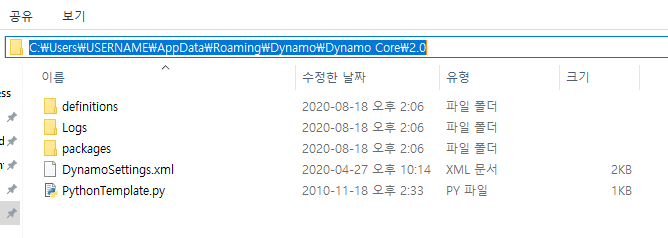
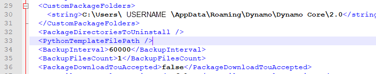
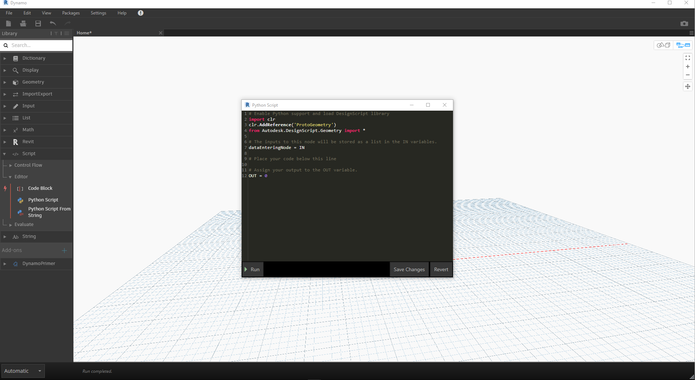

## Python 템플릿

Dynamo 2.0을 사용하면 Python 창을 처음 열 때 사용할 기본 템플릿 ```(.py extension)```을 지정할 수 있습니다. 이 기능은 Dynamo 내에서 Python 사용을 촉진하기 위해 오랫동안 요청되어 왔습니다. 템플릿을 사용할 수 있는 경우 사용자 Python 스크립트를 개발할 때 기본 가져오기를 바로 사용할 수 있게 됩니다.

이 템플릿의 위치는 Dynamo 설치의 ```APPDATA``` 위치에 있습니다.

보통 경로는 다음과 같습니다```( %appdata%\Dynamo\Dynamo Core\{version}\)```.



### 템플릿 설정

이 기능을 사용하려면 ```DynamoSettings.xml``` 파일에 다음 행을 추가해야 합니다. *(메모장에서 편집)*



여기에서 ```<PythonTemplateFilePath />```를 간단히 다음으로 대치할 수 있습니다.

```
<PythonTemplateFilePath>
<string>C:\Users\CURRENTUSER\AppData\Roaming\Dynamo\Dynamo Core\2.0\PythonTemplate.py</string>
</PythonTemplateFilePath>
```

*참고: CURRENTUSER를 사용자 이름으로 대체해야 함*

다음으로, 내장 항목으로 사용하려는 기능이 포함된 템플릿을 작성해야 합니다. 이 예에서는 Revit 관련 가져오기와 Revit으로 작업할 때의 다른 일반적인 항목을 포함할 수 있습니다.

빈 메모장 문서를 시작하고 다음 코드를 그 안에 붙여 넣습니다.

```
import clr

clr.AddReference('RevitAPI')
from Autodesk.Revit.DB import *
from Autodesk.Revit.DB.Structure import *

clr.AddReference('RevitAPIUI')
from Autodesk.Revit.UI import *

clr.AddReference('System')
from System.Collections.Generic import List

clr.AddReference('RevitNodes')
import Revit
clr.ImportExtensions(Revit.GeometryConversion)
clr.ImportExtensions(Revit.Elements)

clr.AddReference('RevitServices')
import RevitServices
from RevitServices.Persistence import DocumentManager
from RevitServices.Transactions import TransactionManager

doc = DocumentManager.Instance.CurrentDBDocument
uidoc=DocumentManager.Instance.CurrentUIApplication.ActiveUIDocument

#Preparing input from dynamo to revit
element = UnwrapElement(IN[0])

#Do some action in a Transaction
TransactionManager.Instance.EnsureInTransaction(doc)

TransactionManager.Instance.TransactionTaskDone()

OUT = element
```

완료되면 ```APPDATA``` 위치에 이 파일을 ```PythonTemplate.py```로 저장합니다.

### 이후의 Python 스크립트 동작

Python 템플릿을 정의했으므로 Dynamo는 Python 노드가 배치될 때마다 이 템플릿을 찾습니다. 이 템플릿을 찾을 수 없는 경우 기본 Python 창과 유사한 항목이 표시됩니다.



Python 템플릿을 찾은 경우(이 예의 Revit 템플릿처럼) 작성한 기본 항목을 볼 수 있습니다.


이러한 유용한 추가 기능에 대한 자세한 정보(Radu Gidei 작성)를 다음에서 확인할 수 있습니다. [https://github.com/DynamoDS/Dynamo/pull/8122](https://github.com/DynamoDS/Dynamo/pull/8122)

