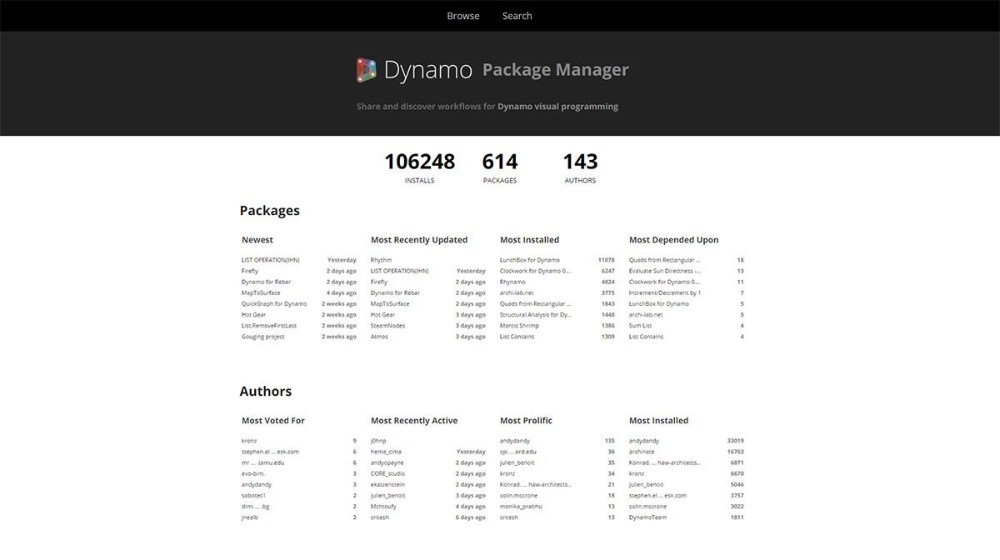
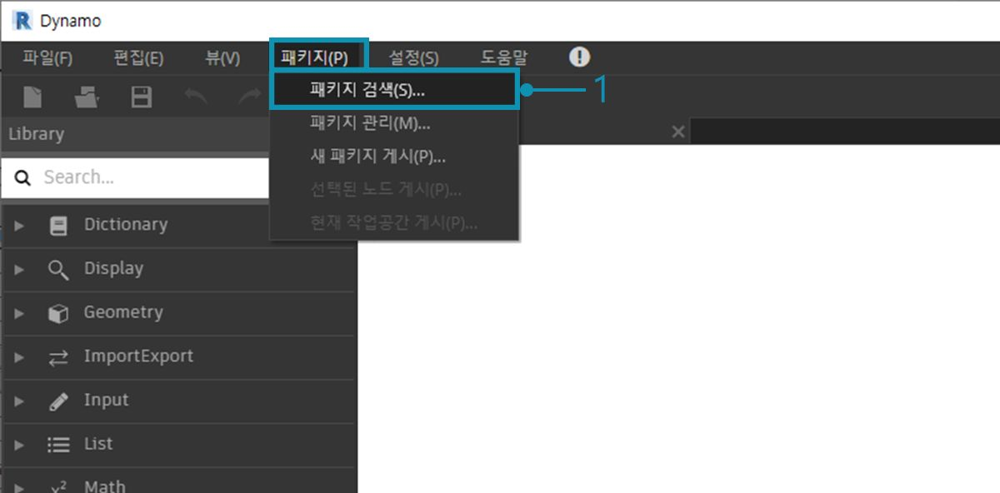
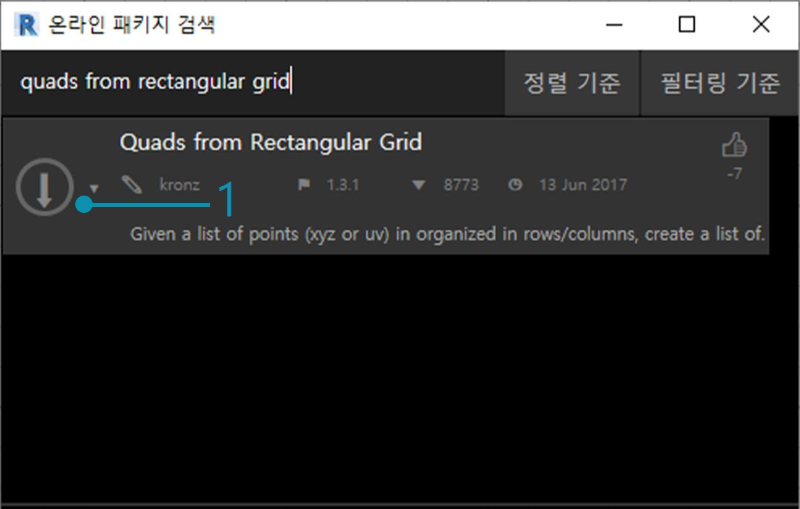
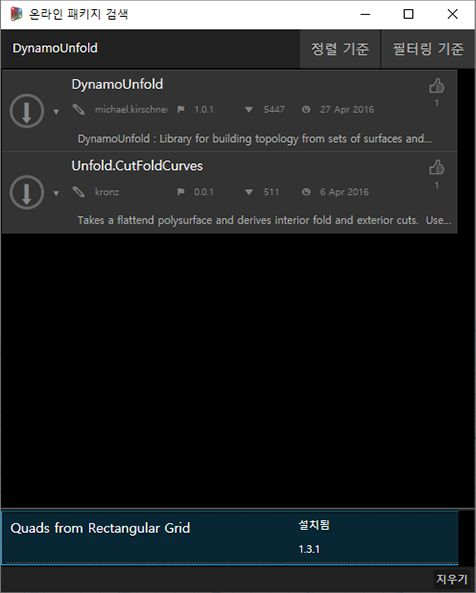
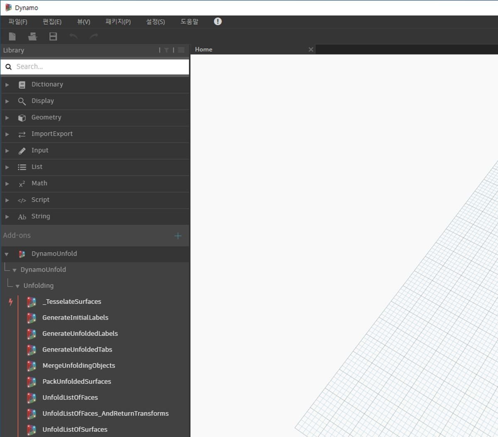
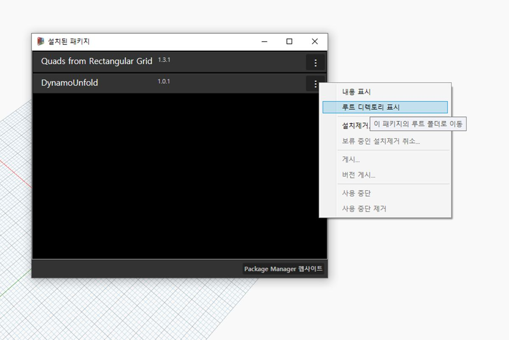
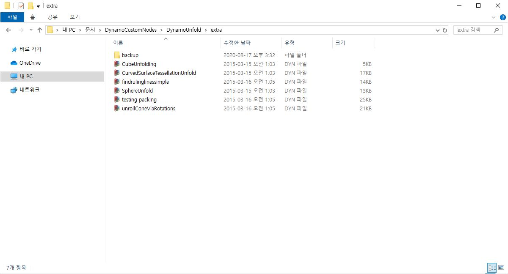
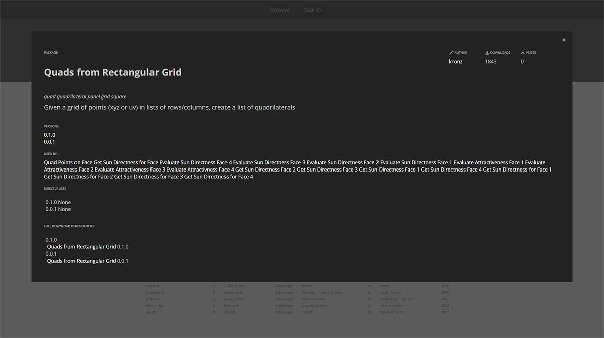

## 패키지

간단히 말해서 패키지는 사용자 노드의 모음입니다. Dynamo Package Manager는 커뮤니티가 온라인으로 게시된 패키지를 다운로드할 수 있는 포털입니다. 이러한 툴셋은 Dynamo의 핵심 기능을 확장하고, 누구나 액세스 가능하며, 버튼 클릭으로 다운로드되도록 타사에서 개발합니다.

Dynamo와 같은 오픈 소스 프로젝트에서는 이러한 유형의 커뮤니티 참여가 활성화되어 있습니다. 전용 타사 개발자가 있으므로 Dynamo는 다양한 산업 분야에 해당하는 워크플로우로 확장할 수 있습니다. 이러한 이유로 Dynamo 팀에서는 패키지 개발 및 게시를 간소화하기 위해 합심하여 노력했습니다. 이 내용은 다음 섹션에서 좀 더 자세히 다룰 예정입니다.

### 패키지 설치

패키지를 설치하는 가장 쉬운 방법은 Dynamo 인터페이스에서 패키지 도구막대를 사용하는 것입니다. 이 기능으로 이동한 후 바로 설치하겠습니다. 이 빠른 예에서는 그리드에서 쿼드 패널을 작성할 때 자주 사용하는 패키지를 설치합니다. 

> 1. Dynamo에서 *패키지>패키지 검색...*으로 이동합니다.

> 검색 막대에서 "직사각형 그리드의 쿼드"를 검색해 보겠습니다. 그러면 이 검색 조회와 일치하는 모든 패키지가 표시됩니다. 일치하는 이름을 가진 첫 번째 패키지를 선택하려고 합니다.

> 1. 패키지 이름 왼쪽에 있는 다운로드 화살표를 클릭하면 패키지가 설치됩니다. 완료되었습니다.

> 1. 이제 Dynamo 라이브러리에 *"buildz"*라는 다른 그룹이 있는 것을 확인할 수 있습니다. 이 이름은 패키지의 [개발자](http://buildz.blogspot.com/)를 나타내며, 사용자 노드가 이 그룹에 배치됩니다. 이는 바로 사용할 수 있습니다.

> 직사각형 그리드를 정의하는 빠른 code block 작업을 통해 직사각형 패널 리스트를 작성했습니다.

### 패키지 폴더

위의 예에서는 하나의 사용자 노드가 있는 패키지에 초점을 맞추고 있지만, 여러 개의 사용자 노드 및 지원 데이터 파일이 있는 패키지를 다운로드할 때도 동일한 프로세스를 사용합니다. 이제 보다 포괄적인 패키지인 Dynamo Unfold를 사용하여 살펴보겠습니다.

> 위의 예에서와 같이 먼저 *패키지>패키지 검색..*을 선택합니다. 이번에는 대/소문자에 주의하면서 한 단어 *"DynamoUnfold"*를 검색해 보겠습니다. 패키지가 표시되면 패키지 이름 왼쪽에 있는 화살표를 클릭하여 다운로드합니다. 이제 Dynamo Unfold가 Dynamo 라이브러리에 설치됩니다.

> Dynamo 라이브러리에는 여러 카테고리와 사용자 노드가 있는 *DynamoUnfold* 그룹이 있습니다.

> 이제 패키지의 파일 구조를 살펴보겠습니다. Dynamo에서 *"패키지>패키지 관리..."*를 선택합니다. 설치한 두 개의 라이브러리가 포함된 위의 창이 표시됩니다. *DynamoUnfold* 오른쪽의 버튼을 클릭하고 *"루트 디렉토리 표시"*를 선택합니다.

> 이렇게 하면 패키지의 루트 디렉토리로 이동됩니다. 3개의 폴더와 1개의 파일이 있는지 확인합니다.

> 1. *bin* 폴더에는 .dll 파일이 있습니다. 이 Dynamo 패키지는 Zero-Touch를 사용하여 개발되었으므로 사용자 노드가 이 폴더에 저장됩니다.
2. *dyf* 폴더에는 사용자 노드가 있습니다. 이 패키지는 Dynamo 사용자 노드를 사용하여 개발되지 않았으므로 이 패키지의 경우 이 폴더는 비어 있습니다.
3. extra 폴더에는 예시 파일을 비롯한 모든 추가 파일이 저장됩니다.
4. pkg 파일은 패키지 설정을 정의하는 기본 텍스트 파일입니다. 지금은 이를 무시해도 됩니다.

> *"extra"* 폴더를 열면 설치 중에 다운로드된 여러 가지 예시 파일이 있습니다. 모든 패키지에 예시 파일이 있는 것은 아니지만, 패키지에 속하는 예시가 있는 경우 여기서 찾을 수 있습니다. *"SphereUnfold"*를 열어 보겠습니다.

> 파일을 열고 솔버에서 *"실행"*을 누르면 펼쳐진 구가 표시됩니다. 이와 같은 예시 파일은 새 Dynamo 패키지를 사용하는 방법을 배우는 데 유용합니다.

### Dynamo Package Manager

Dynamo 패키지를 찾는 또 다른 방법은 온라인으로 [Dynamo Package Manager](http://dynamopackages.com/)를 탐색하는 것입니다. 이 리포지토리는 다운로드 횟수와 인기 순서대로 패키지를 정렬하기 때문에 패키지를 찾는 좋은 방법입니다. 또한 일부 Dynamo 패키지는 Dynamo 빌드의 버전 및 종속성에 따라 영향을 받기 때문에 이는 패키지의 최신 업데이트에 대한 정보를 쉽게 수집하는 방법이기도 합니다.

> Dynamo Package Manager에서 *"직사각형 그리드의 쿼드"*를 클릭하면 설명, 버전, 개발자 및 가능한 종속성을 확인할 수 있습니다.

패키지 파일은 Dynamo Package Manager에서 다운로드할 수도 있지만 Dynamo에서 바로 다운로드하는 프로세스가 더 원활합니다.

### 파일이 로컬로 저장되는 위치

Dynamo Package Manager에서 파일을 다운로드하거나 모든 패키지 파일이 저장되는 위치를 확인하려면 *설정>노드 및 패키지 경로 관리...*를 클릭합니다. 폴더 디렉토리 옆의 줄임표를 클릭하여 루트 폴더를 복사하고 탐색기 창에서 패키지를 좀 더 자세히 살펴볼 수 있습니다. 기본적으로 패키지는 *C:/Users/[사용자 이름]/AppData/Roaming/Dynamo/[Dynamo 버전]* 폴더 경로와 비슷한 위치에 설치됩니다.

### 패키지에 대해 좀 더 자세히 알아보기

Dynamo 커뮤니티는 끊임없이 발전하고 진화하고 있습니다. 때때로 Dynamo Package Manager를 탐색하면 흥미로운 새 개발 항목을 찾아낼 수 있습니다. 다음 섹션에서는 최종 사용자 관점부터 고유한 Dynamo 패키지 작성자의 관점까지 고려하며 패키지를 좀 더 자세히 살펴보겠습니다.

