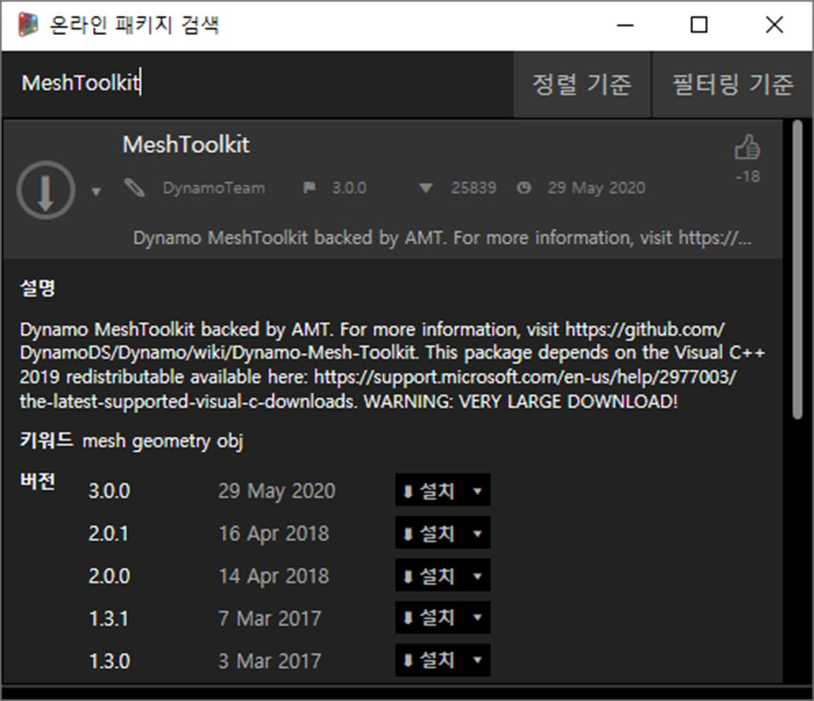
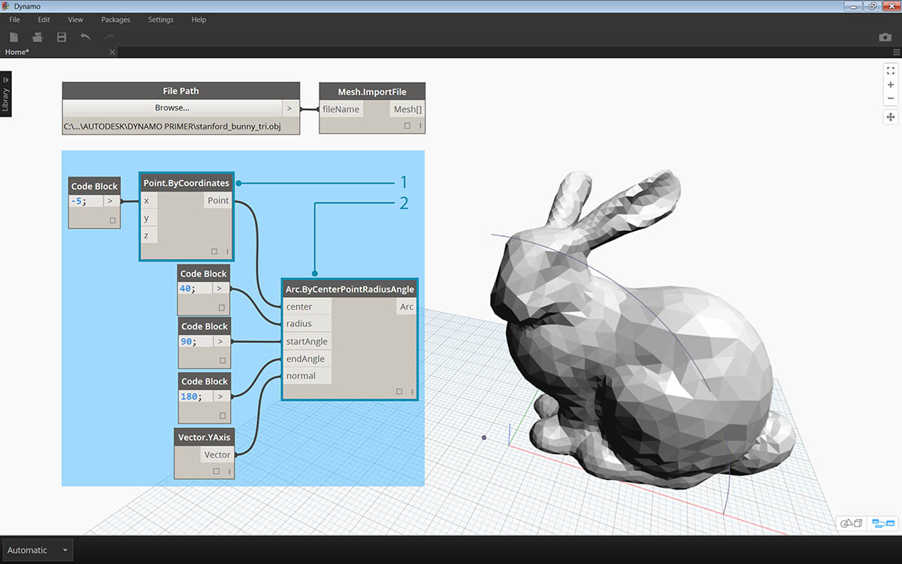
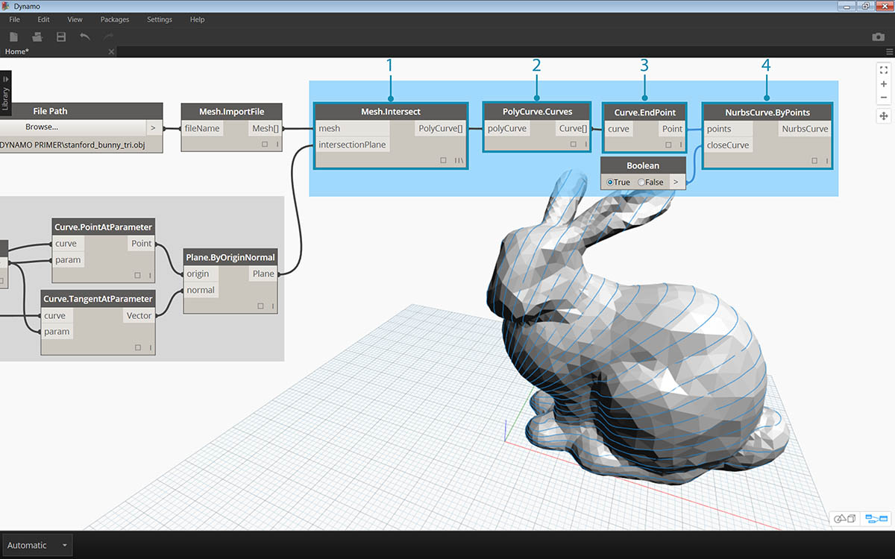

## 패키지 성공 사례 - Mesh Toolkit

Dynamo Mesh Toolkit에서는 외부 파일 형식에서 메쉬를 가져오고, Dynamo 형상 객체에서 메쉬를 작성하고, 정점 및 색인으로 메쉬를 수동으로 작성하는 도구를 제공합니다. 라이브러리에서는 메쉬를 수정 또는 복구하거나, 제작에 사용할 수평 슬라이스를 추출하는 도구도 제공합니다.

Dynamo Mesh Toolkit은 Autodesk의 지속적인 메쉬 연구의 한 부분으로, 향후 몇 년 동안 지속적으로 성장할 것입니다. 툴킷에서 새로운 메서드가 자주 제공될 계획이니, 새 기능에 대한 의견, 버그 및 제안 사항과 관련하여 언제든지 Dynamo 팀에 연락해 주십시오.

### 메쉬와 솔리드 비교

아래 연습에서는 Mesh Toolkit을 사용하는 몇 가지 기본적인 메쉬 작업을 보여줍니다. 이 연습에서는 메쉬를 일련의 평면과 교차하는데, 이는 솔리드를 사용하는 경우 계산이 많이 필요할 수 있습니다. 솔리드와 달리 메쉬에는 설정된 “해상도”가 있으며 수학적으로 정의되지 않고 위상적으로 정의되며, 작업에 따라 이 해상도를 손쉽게 정의할 수 있습니다. 메쉬-솔리드 관계에 대한 자세한 내용은 이 입문서의 [계산 방식 설계를 위한 형상](../05_Geometry-for-Computational-Design/5_geometry-for-computational-design.md) 장을 참조하십시오. Mesh Toolkit을 보다 철저하게 검사하려면 [Dynamo Wiki 페이지](https://github.com/DynamoDS/Dynamo/wiki/Dynamo-Mesh-Toolkit)를 참조할 수 있습니다. 그러면 아래 연습의 패키지로 이동하겠습니다.

### Mesh Toolkit 설치

> Dynamo의 맨 위 메뉴 막대에서 *패키지 > 패키지 검색...*으로 이동합니다. 검색 필드에 *"MeshToolkit"*을 한 글자씩 입력합니다. 이때 대/소문자를 지켜야 합니다. 사용 중인 Dynamo 버전에 적합한 패키지를 알려 주는 다운로드 화살표를 클릭합니다. 아주 간단한 과정입니다!

### 연습

> 이 연습의 예제 파일을 다운로드하고 압축을 풉니다(마우스 오른쪽 버튼을 클릭하고 "다른 이름으로 링크 저장..." 선택). 예제 파일의 전체 리스트는 부록에서 확인할 수 있습니다. [MeshToolkit.zip](datasets/11-2/MeshToolkit.zip)

먼저 Dynamo에서 *Mesh-Toolkit_Intersect-Mesh.dyn*을 엽니다. 이 예에서는 Mesh Toolkit에서 교차 노드를 살펴보고, 메쉬를 가져와 일련의 입력 평면과 교차시켜 슬라이스를 작성해 보겠습니다. 이 작업은 레이저 커터, 워터젯 커터 또는 CNC 밀에서의 제작을 위한 모형을 준비하기 위한 출발점입니다.

> 1. **파일 경로:** 가져올 메시 파일(*stanford_bunny_tri.obj*)을 찾습니다. 지원되는 파일 유형은 .mix 및 .obj입니다.
2. **Mesh.ImportFile:** 파일 경로를 연결하여 메쉬를 가져옵니다.

> 1. **Point.ByCoordinates:** 한 점을 생성합니다. 이 점이 호의 중심이 됩니다.
2. **Arc.ByCenterPointRadiusAngle:** 점을 중심으로 호를 생성합니다. 이 곡선은 일련의 평면을 배치하는 데 사용됩니다.

> 1. 코드 블록: 0에서 1 사이의 숫자 범위를 작성합니다.
2. **Curve.PointAtParameter:** 호를 *‘curve’* 입력에 연결하고 코드 블록 출력을 *‘param’* 입력에 연결하여 곡선을 따라 일련의 점을 추출합니다.
3. **Curve.TangentAtParameter:** 동일한 입력을 이전 노드에 연결합니다.
4. **Plane.ByOriginNormal:** 점을 *'origin'* 입력에 연결하고 벡터를 *'normal'* 입력에 연결하여 각 점에서 일련의 평면을 작성합니다.

이제 호를 따라 방향이 지정된 일련의 평면이 표시됩니다. 다음으로 이러한 평면을 사용하여 메쉬를 교차시키겠습니다.

> 1. **Mesh.Intersect:** 평면을 가져온 메쉬와 교차시켜 일련의 PolyCurve 윤곽을 작성합니다.
2. **PolyCurve.Curves:** PolyCurve를 해당 곡선 조각으로 나눕니다.
3. **Curve.EndPoint:** 각 곡선의 끝점을 추출합니다.
4. **NurbsCurve.ByPoints:** 점을 사용하여 NURBS 곡선을 구성합니다. 부울 노드를 *True*로 설정하여 곡선을 닫습니다.

> 1. **Surface.ByPatch:** 각 윤곽에 대한 표면 패치를 생성하여 메쉬의 "슬라이스"를 작성합니다.

> 와플/계란 상자 효과를 위해 두 번째 슬라이스 세트를 추가합니다.

메쉬와 유사한 솔리드를 비교하면 교차 작업이 더 빠르게 계산되는 것을 알 수 있습니다. 이 연습에 설명된 것과 같은 워크플로우에는 메쉬 작업이 적합합니다.

