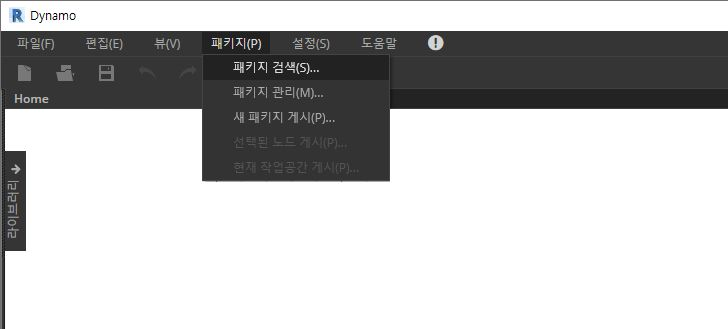
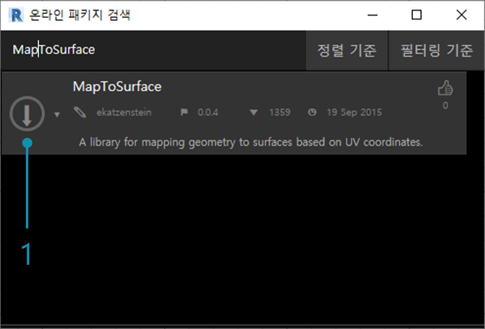
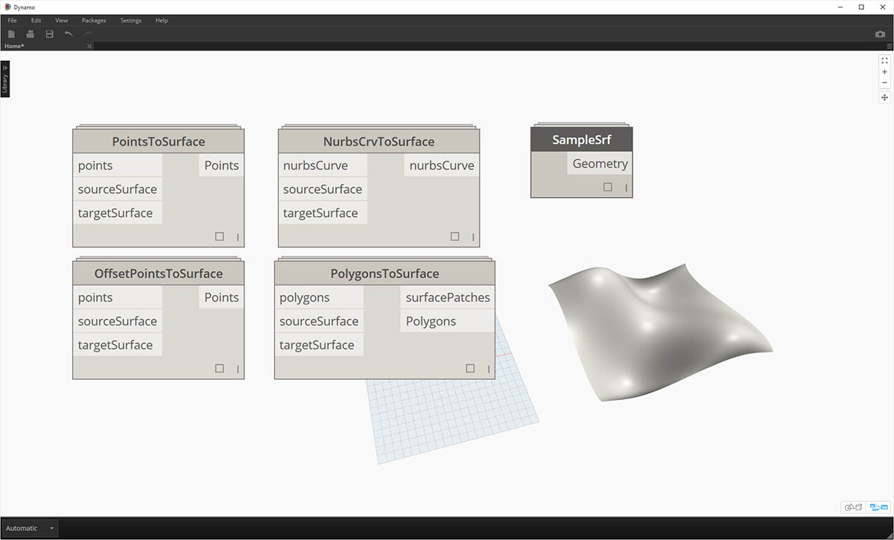
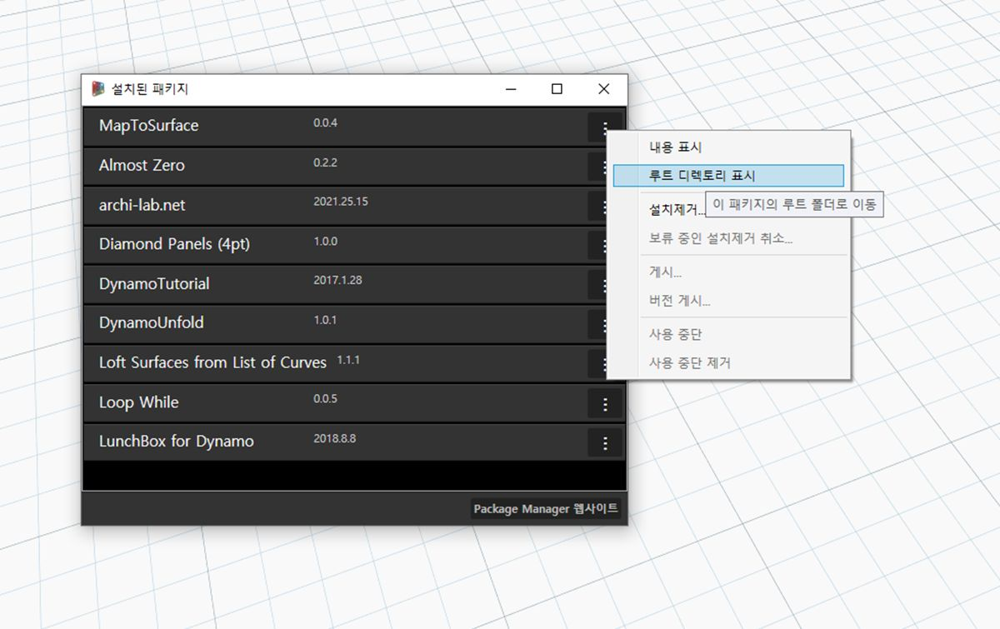

## 패키지 개발

Dynamo에서는 개인적으로 사용하거나 Dynamo 커뮤니티와 공유하기 위해 패키지를 작성하는 다양한 방법을 제공합니다. 아래의 성공 사례에서 기존 패키지를 분해하여 설정 방법을 살펴보겠습니다. 이 성공 사례는 이전 장의 단원을 토대로 작성되었으며, 한 Dynamo 표면에서 다른 표면으로 UV 좌표별로 형상을 매핑하기 위한 사용자 노드 세트를 제공합니다.

### MapToSurface

한 표면에서 다른 표면으로의 점 UV 매핑을 보여 주는 샘플 패키지로 작업해 보겠습니다. 우리는 이 기본서의 [사용자 노드 작성](../10_Custom-Nodes/10-2_Creating.md) 섹션에서 도구의 기본 사항을 이미 만들었습니다. 아래의 파일은 UV 매핑의 개념을 파악하고 게시 가능한 라이브러리를 위한 도구 세트를 개발하는 방법을 보여 줍니다.

> 이 이미지에서는 UV 좌표를 사용하여 한 표면에서 다른 표면으로 점을 매핑합니다. 이 패키지는 이러한 개념을 기준으로 하지만, 좀 더 복잡한 형상을 나타냅니다.

### 패키지 설치

이전 장에서는 XY 평면에 정의된 곡선을 기준으로 Dynamo에서 표면을 패널화하기 위한 방법을 살펴보았습니다. 이 성공 사례에서는 더 많은 치수를 포함하는 형상을 위해 이러한 개념을 확장합니다. 이 패키지가 개발된 방식을 보여 주기 위해 이를 구축된 대로 설치해 보겠습니다. 다음 섹션에서는 이 패키지가 게시된 방식을 살펴보겠습니다.

> 여기는 쉬운 부분입니다. Dynamo에서 *"패키지>패키지 검색..."*으로 이동합니다.

> *"MapToSurface"*(1개의 단어) 패키지를 검색합니다.

> 1. 패키지를 찾으면 패키지 이름 왼쪽에 있는 큰 다운로드 화살표를 클릭합니다. 그러면 패키지가 Dynamo에 설치됩니다.

> 1. 설치하고 나면 "DynamoPrimer" 그룹 또는 Dynamo 라이브러리에서 사용자 노드를 사용할 수 있게 됩니다. 이제 패키지가 설치되었으므로 설정 방법을 살펴보겠습니다.

### 사용자 노드

현재 작성 중인 패키지에서는 참조용으로 만든 5개의 사용자 노드를 사용합니다. 아래에서는 각 노드가 수행하는 작업을 살펴보겠습니다. 일부 사용자 노드는 다른 사용자 노드를 통해 만들어지며, 그래프는 다른 사용자가 쉽게 이해할 수 있도록 배치되어 있습니다.

> 이는 5개의 사용자 노드로 구성된 간단한 패키지입니다. 아래 단계에서는 각 사용자 노드의 설정에 대해 간략하게 설명하겠습니다.

> **PointsToSurface:** 다른 모든 매핑 노드의 기준이 되는 기본 사용자 노드입니다. 간단히 말해, 해당 노드에서는 소스 표면 UV 좌표의 점을 대상 표면 UV 좌표의 위치에 매핑합니다. 점은 보다 복잡한 형상이 만들어지는 기준이 되는 가장 기본적인 형상이기 때문에 이 논리를 사용하여 2D 및 3D 형상을 한 표면에서 다른 표면으로 매핑할 수 있습니다.

> **PolygonsToSurface:** 매핑된 점을 1D 형상에서 2D 형상으로 연장하는 논리가 여기서는 간단히 다각형으로 나와 있습니다. *"PointsToSurface"* 노드를 이 사용자 노드에 중첩했습니다. 이런 식으로 각 다각형의 점을 표면에 매핑한 다음, 매핑된 해당 점에서 다각형을 재생성할 수 있습니다. 적절한 데이터 구조(점 리스트의 리스트)를 유지하여 다각형을 점 세트로 줄인 후에 따로 유지할 수 있습니다.

> **NurbsCrvtoSurface:** *"PolygonsToSurface"* 노드에서와 같이 동일한 논리가 여기에 적용됩니다. 하지만 다각형 점을 매핑하는 대신, NURBS 곡선의 제어점을 매핑합니다.

> **OffsetPointsToSurface:** 이 노드는 조금 더 복잡하지만 개념은 단순합니다. 즉, *"PointsToSurface"* 노드와 같이 이 노드에서는 한 표면에서 다른 표면으로 점을 매핑합니다. 그러나 원래 소스 표면에 없는 점도 고려하고, 가장 가까운 UV 매개변수에 대한 거리를 가져온 후 이 거리를 해당 UV 좌표의 대상 표면 법선에 매핑합니다. 이 방법은 예시 파일을 통해 보다 잘 이해할 수 있습니다.

> **SampleSrf:** 예시 파일에서 소스 그리드부터 물결형 표면으로 매핑할 파라메트릭 표면을 작성하는 간단한 노드입니다.

### 예시 파일

예시 파일은 패키지의 루트 폴더에서 찾을 수 있습니다(Dynamo의 경우 *패키지>패키지 관리...*로 이동하여 이 폴더로 이동).

> 패키지 관리 창에서 *"MapToSurface"* 오른쪽에 있는 세로로 된 3개의 점을 클릭하고 *"루트 디렉토리 표시"*를 선택합니다.

루트 디렉토리가 열리면 *"extra"* 폴더로 이동합니다. 이 폴더에는 사용자 노드가 아닌 패키지의 모든 파일이 들어 있습니다. 여기에는 Dynamo 패키지에 대한 예시 파일(있는 경우)이 저장되어 있습니다. 아래의 스크린샷에는 각 예시 파일에 설명된 개념이 나와 있습니다.

> **01-PanelingWithPolygons:** 이 예시 파일에서는 직사각형 그리드를 기준으로 표면을 패널화하는 데 *"PointsToSurface"*를 사용하는 방법을 보여 줍니다. [이전 장](../10_Custom-Nodes/10-2_Creating.md)에서 비슷한 워크플로우를 설명했기 때문에 이 과정은 익숙하게 느껴질 것입니다.

> **02-PanelingWithPolygons-II:** 이 연습 파일에서는 비슷한 워크플로우를 사용하여 한 표면에서 다른 표면으로 원(또는 원을 나타내는 다각형)을 매핑하는 설정을 보여 줍니다. 여기서는 *"PolygonsToSurface"* 노드가 사용됩니다.

> **03-NurbsCrvsAndSurface:** 이 예시 파일에서는 "NurbsCrvToSurface" 노드를 사용하므로 약간 더 복잡해집니다. 대상 표면이 지정된 거리만큼 간격이 띄어지고 NURBS 곡선은 원래 대상 표면과 간격띄우기 표면에 매핑됩니다. 여기서 매핑된 두 곡선은 표면을 작성하기 위해 로프트된 후 두꺼워집니다. 그 결과 솔리드는 대상 표면 법선을 나타내는 굴곡을 가지게 됩니다.

> **04-PleatedPolysurface-OffsetPoints:** 이 예시 파일에서는 소스 표면에서 대상 표면으로 주름식 polysurface를 매핑하는 방법을 보여 줍니다. 소스 및 대상 표면은 각각 그리드와 회전된 표면에 걸쳐 있는 직사각형 표면입니다.

> **04-PleatedPolysurface-OffsetPoints:** 소스 표면에서 대상 표면으로 매핑된 소스 polysurface입니다.

> **05-SVG-Import:** 사용자 노드에서는 여러 유형의 곡선을 매핑할 수 있으므로 이 마지막 파일에서는 Illustrator에서 내보낸 SVG 파일을 참조하고 가져온 곡선을 대상 표면에 매핑합니다.

> **05-SVG-Import:** .svg 파일의 구문을 분석하면 곡선이 .xml 형식에서 Dynamo polycurve로 변환됩니다.

> **05-SVG-Import:** 가져온 곡선이 대상 표면에 매핑됩니다. 따라서 Illustrator에서 패널화를 명시적으로(가리키고 클릭) 설계하고, Dynamo로 가져온 후 대상 표면에 적용할 수 있습니다.

