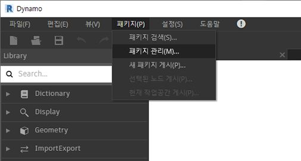
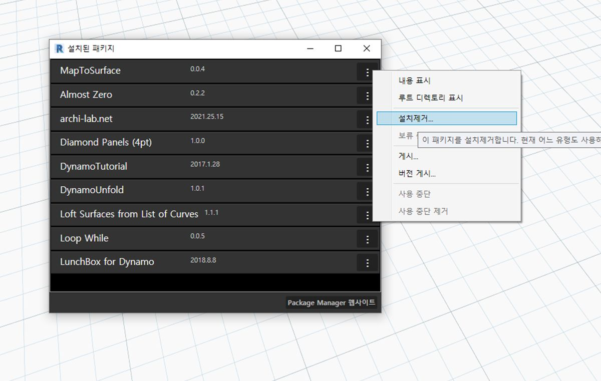
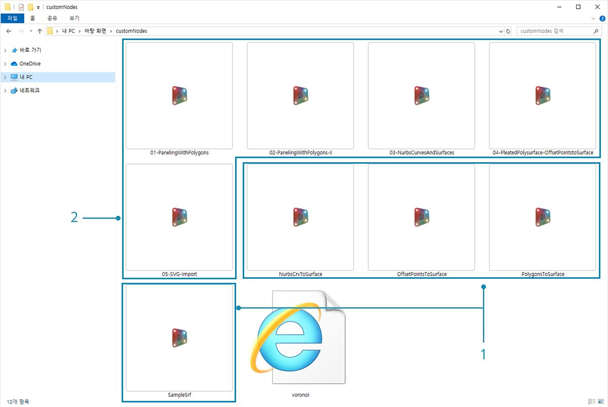
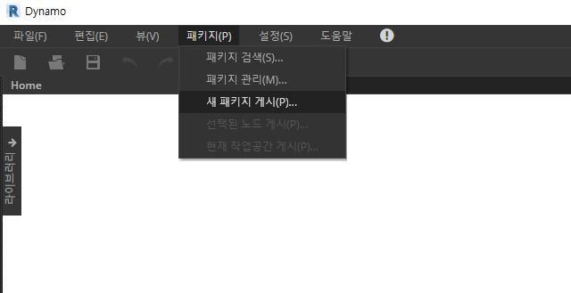
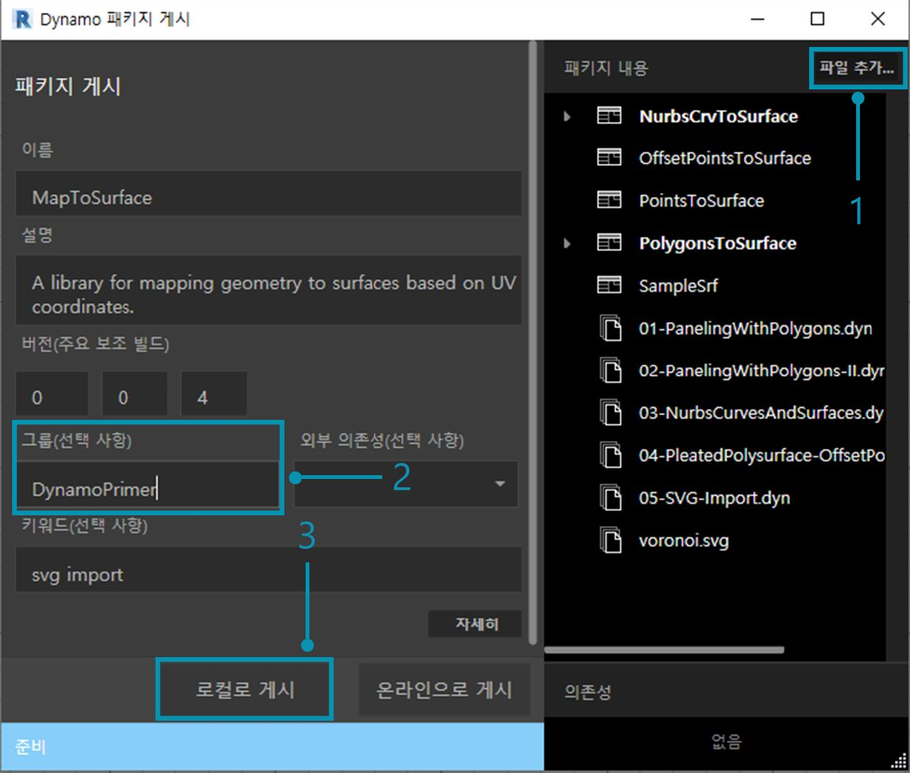
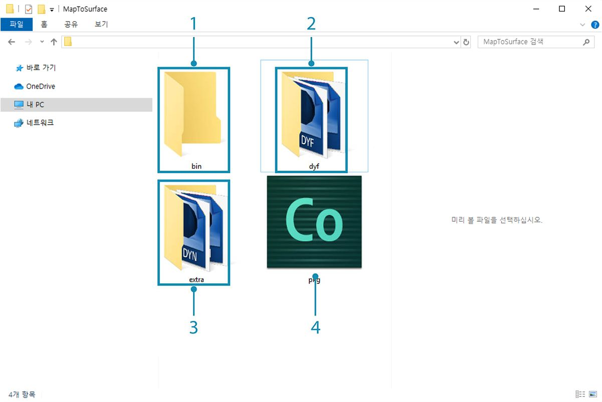
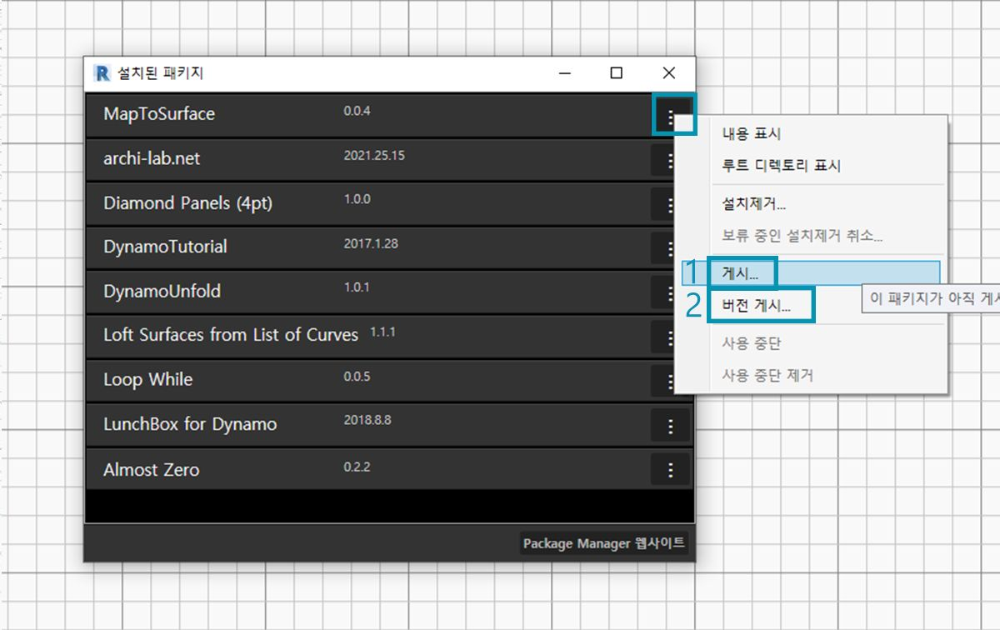

## 패키지 게시하기

이전 섹션에서는 사용자 노드 및 예시 파일을 사용해서 *MapToSurface* 패키지를 설정하는 방법을 자세히 살펴보았습니다. 하지만 로컬로 개발된 패키지를 게시하려면 어떻게 해야 할까요? 이 성공 사례에서는 로컬 폴더의 파일 세트에서 패키지를 게시하는 방법을 보여 줍니다.  패키지를 게시하는 방법에는 여러 가지가 있습니다. 다음은 추천되는 프로세스로, **로컬로 게시하고, 로컬로 개발한 후 온라인으로 게시하는** 과정으로 진행됩니다. 패키지에 모든 파일이 포함된 폴더로 시작하겠습니다.

### 패키지 제거하기

이전 단원에서 패키지를 설치한 경우에는 동일한 패키지로 작업하는 일이 없도록 MapToSurface 패키지를 게시하기 전에 제거합니다.

> 먼저 *패키지>패키지 관리...*로 이동합니다.

> *"MapToSurface"*에 해당하는 버튼을 선택하고 *"설치제거..."*를 선택합니다. 그런 다음, Dynamo를 다시 시작합니다. 다시 열 때 *"패키지 관리"* 창을 선택하면 *MapToSurface*가 더 이상 해당 창에 표시되지 않습니다. 이제 처음부터 새로 시작할 준비가 되었습니다.

### 패키지를 로컬로 게시하기

*주: 이 파일을 작성할 때 Dynamo 패키지 게시는 Dynamo Studio 또는 Dynamo for Revit에서만 사용할 수 있습니다. Dynamo Sandbox에는 게시 기능이 없습니다.*

> 이 패키지 성공 사례와 함께 제공되는 예시 파일을 다운로드하고 압축을 해제하십시오(마우스 오른쪽 버튼 클릭 및 "다른 이름으로 링크 저장..."). 전체 예시 파일 리스트는 부록에서 확인할 수 있습니다. [MapToSurface.zip](datasets/11-4/MapToSurface.zip)

> 이는 패키지에 대한 첫 번째 제출이며, 모든 예시 파일 및 사용자 노드를 하나의 폴더에 배치했습니다. 이 폴더가 준비되면 Dynamo Package Manager로 업로드할 준비가 된 것입니다.

> 1. 이 폴더에는 5개의 사용자 노드(.dyf)가 포함되어 있습니다.
2. 또한 이 폴더에는 5개의 예시 파일(.dyn)과 1개의 가져온 벡터 파일(.svg)도 포함되어 있습니다. 이러한 파일은 사용자에게 사용자 노드를 사용하는 방법을 보여 주기 위해 입문 연습으로 사용됩니다.

> Dynamo에서 먼저 *패키지>새 패키지 게시...*를 클릭합니다.

> *"Dynamo 패키지 게시"* 창 왼쪽에 표시되는 관련 양식은 이미 작성했습니다.

> 1. *"파일 추가"*를 클릭하여 화면 오른쪽의 폴더 구조에 포함된 파일도 추가했습니다. .dyf 파일이 아닌 파일을 추가하려면 탐색기 창에서 파일 유형을 **"모든 파일(*.*)"**. 모든 파일, 사용자 노드(.dyf) 또는 예시 파일(.dyn)을 별다른 구분 없이 추가했습니다. 패키지를 게시하면 Dynamo에서는 이러한 항목을 분류합니다.
2. "그룹" 필드는 Dynamo UI에서 사용자 노드를 찾을 그룹을 정의합니다.
3. "로컬로 게시"를 클릭하여 게시합니다. 이 작업을 따라 진행하고 있는 경우 Package Manager에 중복된 패키지를 포함하지 않기 위해 *"로컬로 게시"*는 클릭하고, *"온라인으로 게시"*는 클릭하지 **않아야 합니다**.

> 1. 게시하고 나면 "DynamoPrimer" 그룹 또는 Dynamo 라이브러리에서 사용자 노드를 사용할 수 있게 됩니다.

> 이제 루트 디렉토리를 확인하여 Dynamo에서 방금 작성한 패키지의 형식을 어떻게 지정했는지 살펴보겠습니다. 이렇게 하려면 *패키지>패키지 관리...*를 클릭합니다.

> 패키지 관리 창에서 *"MapToSurface"* 오른쪽에 있는 세로로 된 3개의 점을 클릭하고 *"루트 디렉토리 표시"*를 선택합니다.

> 루트 디렉토리는 패키지의 로컬 위치에 있습니다(패키지를 "로컬"로 게시함). Dynamo에서는 현재 이 폴더를 참조하여 사용자 노드를 읽고 있습니다. 따라서 영구적인 폴더 위치(예: 데스크톱 아님)에 디렉토리를 로컬로 게시하는 것이 중요합니다. 다음은 Dynamo 패키지 폴더를 분석한 것입니다.

> 1. *bin* 폴더에는 C# 또는 Zero-Touch 라이브러리로 작성된 .dll 파일이 있습니다. 이 패키지에 대한 항목은 없으므로 이 예에서는 이 폴더가 비어 있습니다.
2. *dyf* 폴더에는 사용자 노드가 있습니다. 이 폴더를 열면 이 패키지의 모든 사용자 노드(.dyf 파일)가 표시됩니다.
3. 추가 폴더에는 모든 추가 파일이 포함됩니다. 이러한 파일은 Dynamo 파일(.dyn) 또는 필요한 추가 파일(.svg, .xls, .jpeg, .sat 등)일 가능성이 큽니다.
4. pkg 파일은 패키지 설정을 정의하는 기본 텍스트 파일입니다. 이 작업은 Dynamo에서 자동화되어 있지만, 자세히 확인해 보고 싶은 경우 편집할 수 있습니다.

### 패키지를 온라인으로 게시하기

> **주: 실제로 자체 패키지를 게시하지 않는 한, 이 단계에 따라 작업하지 마십시오.**

> 1. 게시할 준비가 되면 "패키지 관리" 창에서 MapToSurface의 오른쪽에 있는 버튼을 선택하고 *게시...*를 선택합니다.
2. 이미 게시된 패키지를 업데이트하는 경우 "버전 게시"를 선택하면 Dynamo에서는 해당 패키지의 루트 디렉토리에 있는 새 파일을 기반으로 하여 온라인으로 패키지를 업데이트합니다. 아주 간단합니다.

### 버전 게시...

게시된 패키지의 루트 폴더에서 파일을 업데이트하는 경우 *패키지 관리* 창에서 *"버전 게시..."*를 선택하여 새 버전의 패키지를 게시할 수 있습니다. 이렇게 하면 원활하게 필요에 따라 컨텐츠를 업데이트하고 커뮤니티와 공유할 수 있습니다. *버전 게시*는 패키지의 유지 담당자인 경우에만 작동합니다.

