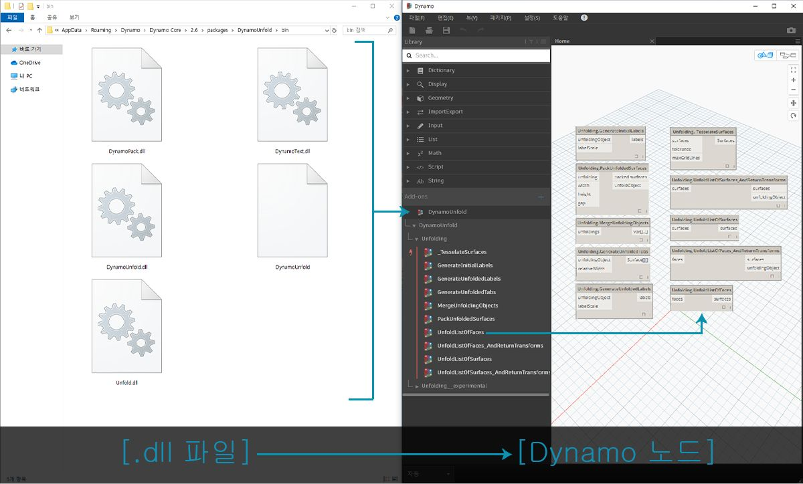
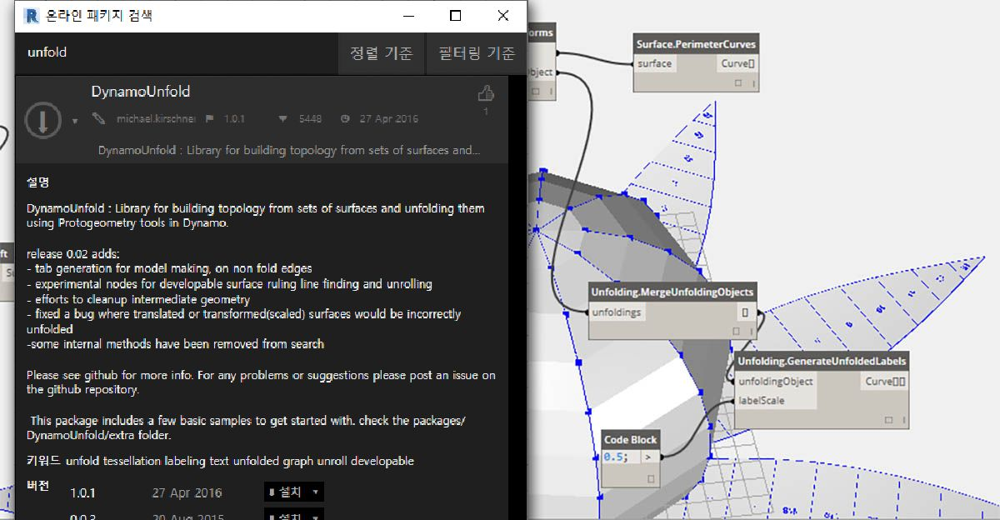
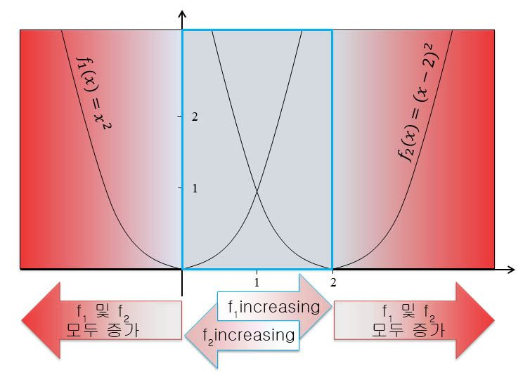
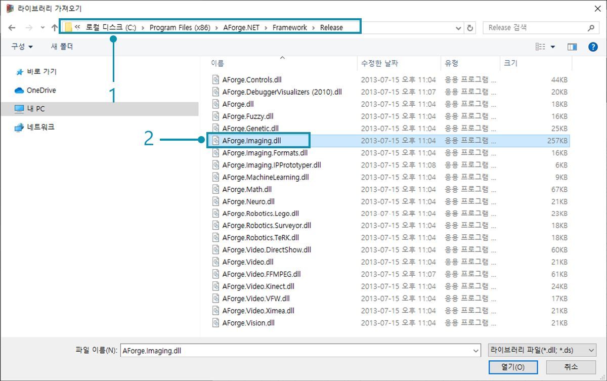
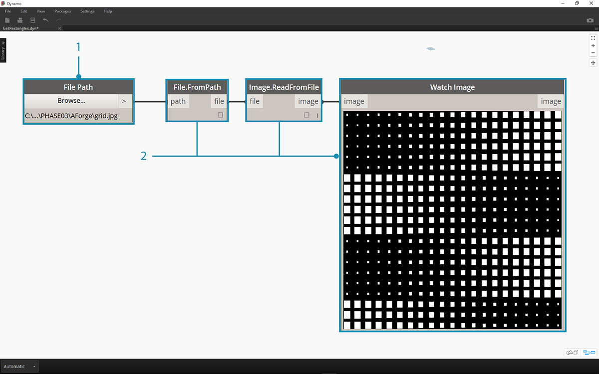
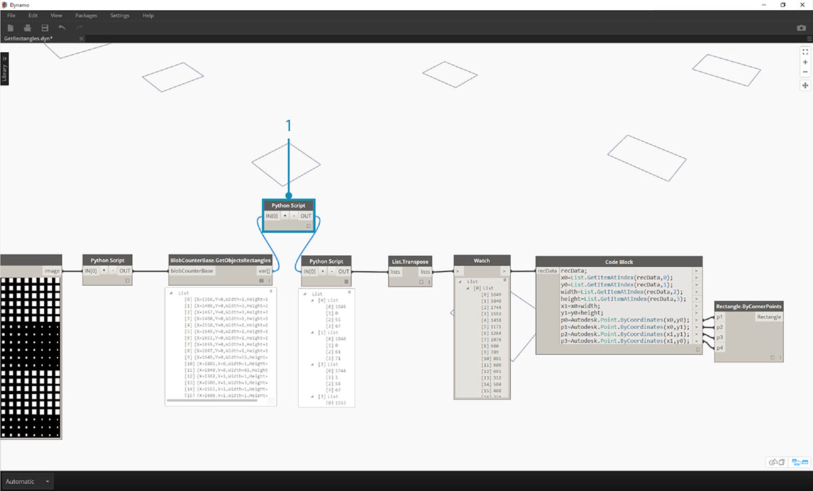

## Zero-Touch란?

Zero-Touch 가져오기는 간단한 포인트 앤 클릭 방법으로 C# 라이브러리를 가져오는 것을 의미합니다. Dynamo에서는 *.dll* 파일의 공용 메서드를 읽고 Dynamo 노드로 변환합니다. Zero-Touch를 사용하여 자체 사용자 노드 및 패키지를 개발하고 외부 라이브러리를 Dynamo 환경으로 가져올 수 있습니다.



Zero-Touch를 사용하면 실제로 Dynamo용으로 개발되지 않았을 수 있는 라이브러리를 가져와 새로운 노드 모음을 작성할 수 있습니다. 현재의 Zero-Touch 기능은 Dynamo Project의 교차 플랫폼 방식을 보여 줍니다.

이 섹션에서는 Zero-Touch를 사용하여 타사 라이브러리를 가져오는 방법을 설명합니다. 자체 Zero-Touch 라이브러리를 개발하는 방법에 대한 내용은 [Dynamo Wiki 페이지](https://github.com/DynamoDS/Dynamo/wiki/Zero-Touch-Plugin-Development)를 참조하십시오.

### Zero-Touch 패키지

Zero-Touch 패키지는 사용자 정의 사용자 노드를 보완하는 데 유용한 도구입니다. C# 라이브러리를 사용하는 몇 가지 패키지가 아래 테이블에 나열되어 있습니다. 패키지에 대한 자세한 내용은 부록의 [패키지 섹션](../Appendix/A-3_packages.md)을 참조하십시오.

|로고/이미지|이름|
| -- | -- |
||[Mesh Toolkit](https://github.com/DynamoDS/Dynamo/wiki/Dynamo-Mesh-Toolkit)|
||[Dynamo Unfold](http://dynamobim.com/dynamounfold/)|
||[Rhynamo](http://www.case-inc.com/blog/what-is-rhynamo)|
||[Optimo](https://github.com/BPOpt/Optimo)|

### 성공 사례 - AForge 가져오기

이 성공 사례에서는 [AForge](http://www.aforgenet.com/) 외부 *.dll* 라이브러리를 가져오는 방법을 보여 드리겠습니다. AForge는 이미지 처리에서 인공 지능에 이르는 다양한 기능을 제공하는 강력한 라이브러리입니다. AForge의 이미징 클래스를 참조하여 아래의 이미지 처리 연습 몇 가지를 수행해 보겠습니다.

> 이 패키지 성공 사례와 함께 제공되는 예시 파일을 다운로드하고 압축을 해제하십시오(마우스 오른쪽 버튼 클릭 및 "다른 이름으로 링크 저장..."). 전체 예시 파일 리스트는 부록에서 확인할 수 있습니다. [Zero-Touch-Examples.zip](datasets/11-5/Zero-Touch-Examples.zip).

> 1. 먼저 AForge를 다운로드합니다. [AForge 다운로드 페이지](http://www.aforgenet.com/framework/downloads.html)에서 *[설치 프로그램 다운로드]*를 선택하고 다운로드가 완료되면 설치합니다.


> 1. Dynamo에서 새 파일을 작성하고 *파일 > 라이브러리 가져오기...*를 선택합니다.



> 1. 팝업 창에서 AForge 설치의 릴리즈 폴더로 이동합니다. 이는 *C:\Program Files (x86)\AForge.NET\Framework\Release*와 유사한 폴더에 있을 수 있습니다.
2. **AForge.Imaging.dll:** 이 성공 사례에서는 AForge 라이브러리의 이 파일 하나만 사용하겠습니다. 이 *.dll*을 선택하고 *"열기"*를 누릅니다.


> 1. Dynamo로 돌아가면 라이브러리 도구막대에 *"AForge" * 노드 그룹이 추가된 것을 볼 수 있습니다. 이제 비주얼 프로그램에서 AForge 이미징 라이브러리에 액세스할 수 있습니다.

### 연습 1 - 모서리 탐지

이제 라이브러리를 가져왔으므로 이 첫 번째 연습을 간단히 시작해보겠습니다. 샘플 이미지에서 몇 가지 기본 이미지 처리를 수행하여 AForge 이미지가 필터링되는 방법을 살펴봅니다. *"Watch Image"* 노드를 사용하여 결과를 표시하고 Photoshop의 필터와 유사한 필터를 Dynamo에서 적용합니다.

> 이 패키지 성공 사례와 함께 제공되는 예시 파일을 다운로드하고 압축을 해제하십시오(마우스 오른쪽 버튼 클릭 및 "다른 이름으로 링크 저장..."). 전체 예시 파일 리스트는 부록에서 확인할 수 있습니다. [ZeroTouchImages.zip](datasets/11-5/ZeroTouchImages.zip)

이제 라이브러리를 가져왔으므로 이 첫 번째 연습을 간단히 시작해보겠습니다(*01-EdgeDetection.dyn*). 샘플 이미지에서 몇 가지 기본 이미지 처리를 수행하여 AForge 이미지가 필터링되는 방법을 살펴봅니다. *"Watch Image"* 노드를 사용하여 결과를 표시하고 Photoshop의 필터와 유사한 필터를 Dynamo에서 적용합니다.


> 먼저 작업할 이미지를 가져옵니다. 캔버스에 *File Path* 노드를 추가하고 다운로드한 연습 폴더(사진 생성: [flickr](https://www.flickr.com/photos/wwworks/667298782))에서 "soapbutions.jpg"를 선택합니다.


> 1. File Path 노드에서는 선택한 이미지에 대한 경로 문자열을 간단히 제공합니다. 이 File Path를 Dynamo 환경의 이미지로 변환해야 합니다.
2. File Path 노드를 File.FromPath 노드에 연결합니다.
3. 이 파일을 이미지로 변환하기 위해 Image.ReadFromFile 노드를 사용하겠습니다.
4. 마지막으로, 결과를 살펴보겠습니다. Watch Image 노드를 캔버스에 놓고 Image.ReadFromFile에 연결합니다. 아직 AForge를 사용하지 않았지만 이미지를 Dynamo로 가져왔습니다.


> 탐색 메뉴의 AForge.Imaging.AForge.Filters에서 사용 가능한 다양한 필터를 볼 수 있습니다. 이제 이러한 필터 중 하나를 사용하여 임계값에 따라 이미지의 채도를 낮춰 보겠습니다.

> 1. 3개의 슬라이더를 캔버스에 놓은 다음, 해당 범위를 0에서 1로 변경하고 단계 값을 0.01로 변경합니다.
2. 캔버스에 Grayscale.Grayscale 노드를 추가합니다. 이는 그레이스케일 필터를 이미지에 적용하는 AForge 필터입니다. 1단계의 세 슬라이더를 cr, cg 및 cb에 연결합니다. 맨 위 및 맨 아래 슬라이더를 값 1로, 중간 슬라이더를 값 0으로 변경합니다.
3. 그레이스케일 필터를 적용하려면 이미지에 대해 수행할 작업이 필요합니다. 이를 위해 IFilter.Apply를 사용합니다. 이미지를 image 입력에 연결하고 Grayscale.Grayscale을 iFilter 입력에 연결합니다.
4. Watch Image 노드에 연결하여 이미지 채도를 낮춥니다.


> 빨간색, 초록색 및 파란색의 임계값을 기준으로 이 이미지의 채도를 낮추는 방법을 조정할 수 있습니다. 이러한 임계값은 Grayscale.Grayscale 노드에 대한 입력 내용에 의해 정의됩니다. 이미지가 꽤 어둡게 보입니다. 초록색 값이 슬라이더에서 0으로 설정되어 있기 때문입니다.

> 1. 맨 위 및 맨 아래 슬라이더를 값 0으로, 중간 슬라이더를 값 1로 변경합니다. 이렇게 하면 좀 더 명확하게 채도가 낮아진 이미지를 얻을 수 있습니다.


> 채도가 낮아진 이미지를 사용하고 그 위에 다른 필터를 적용해 보겠습니다. 채도가 낮아진 이미지에는 약간의 대비가 있으므로 일부 모서리 탐지를 테스트하고자 합니다.

> 1. SobelEdgeDetector.SobelEdgeDetector 노드를 캔버스에 추가합니다. 이 노드를 IFilter로서 새 IFilter 노드에 연결하고 채도가 낮아진 이미지를 IFilter 노드의 이미지 입력에 연결합니다.
2. Sobel 모서리 탐지기에서 새 이미지의 모서리가 강조 표시되었습니다.


> 확대하면 모서리 탐지기에서 픽셀로 표시된 버블의 윤곽이 표시됩니다. AForge 라이브러리에는 이와 같은 결과를 가져와 Dynamo 형상을 작성하는 도구가 있습니다. 다음 연습에서 이러한 내용을 살펴보겠습니다.

### 연습 2 - 직사각형 작성

> 이 패키지 성공 사례와 함께 제공되는 예시 파일을 다운로드하고 압축을 해제하십시오(마우스 오른쪽 버튼 클릭 및 "다른 이름으로 링크 저장..."). 전체 예시 파일 리스트는 부록에서 확인할 수 있습니다. [ZeroTouchImages.zip](datasets/11-5/ZeroTouchImages.zip)

이제 몇 가지 기본적인 이미지 처리를 소개했으므로 이미지를 사용하여 Dynamo 형상을 구동해 보겠습니다. 기초 레벨에서는 이 연습을 통해 AForge 및 Dynamo를 사용하여 이미지의 *"라이브 추적"*을 수행하는 것이 목표입니다. 여기서는 작업을 간단하게 유지하면서 참조 이미지에서 직사각형을 추출할 예정이지만, AForge에서는 좀 더 복잡한 작업에 필요한 도구도 제공됩니다. 다운로드한 연습 파일에서 *02-RectangleCreation.dyn*을 사용해 보겠습니다.



> 1. File Path 노드를 사용하여 연습 폴더의 grid.jpg로 이동합니다.
2. 위의 나머지 노드 시리즈를 연결하여 과정 파라메트릭 그리드를 표시합니다.

다음 단계에서는 이미지의 흰색 사각형을 참조하고 이를 실제 Dynamo 형상으로 변환하려고 합니다. AForge에는 강력한 Computer Vision 도구가 많이 있는데 여기서는 [BlobCounter](http://www.aforgenet.com/framework/docs/html/d7d5c028-7a23-e27d-ffd0-5df57cbd31a6.htm)라는 라이브러리에 특히 중요한 도구를 사용하겠습니다.


> 1. 캔버스에 BlobCounter를 추가한 후에는 이미지를 처리할 방법이 필요합니다(이전 연습의 IFilter 도구와 유사). 안타깝게도 "Process Image" 노드는 Dynamo 라이브러리에 즉시 표시되지 않습니다. 이는 이 함수가 AForge 소스 코드에 표시되지 않기 때문입니다. 이 문제를 해결하기 위해 해결 방법을 찾아야 합니다.


> 1. 캔버스에 Python 노드를 추가합니다.

```
import clr
clr.AddReference('AForge.Imaging')
from AForge.Imaging import *

bc= BlobCounter()
bc.ProcessImage(IN[0])
OUT=bc
```

> 위의 코드를 Python 노드에 추가합니다. 이 코드에서는 AForge 라이브러리를 가져온 다음, 가져온 이미지를 처리합니다.


> 이미지 출력을 Python 노드 입력에 연결하면 Python 노드에서 AForge.Imaging.BlobCounter 결과를 얻게 됩니다.

다음 단계에서는 [AForge Imaging API](http://www.aforgenet.com/framework/docs/html/d087503e-77da-dc47-0e33-788275035a90.htm)에 친숙해지기 위한 몇 가지 작업을 진행합니다. Dynamo 작업을 위해 이 모든 기능을 배울 필요는 없습니다. 여기서는 Dynamo 환경의 유연성을 활용하면서 외부 라이브러리로 작업하는 경우를 더 많이 다룹니다.


> 1. Python 스크립트의 출력을 BlobCounterBase.GetObjectRectangles에 연결합니다. 그러면 임계값을 기준으로 이미지의 객체가 읽히고 픽셀 공간에서 정량화된 직사각형이 추출됩니다.


> 1. 캔버스에 다른 Python 노드를 추가하고 GetObjectRectangles에 연결한 다음, 아래 코드를 입력합니다. 그러면 구성된 Dynamo 객체 리스트가 작성됩니다.

```
OUT = []
for rec in IN[0]:
subOUT=[]
subOUT.append(rec.X)
subOUT.append(rec.Y)
subOUT.append(rec.Width)
subOUT.append(rec.Height)
OUT.append(subOUT)
```


> 1. 이전 단계의 Python 노드 출력을 바꿉니다. 그러면 각 직사각형의 X, Y, 폭 및 높이를 나타내는 4개의 리스트가 작성됩니다.
2. Code Block을 사용하여 Rectangle.ByCornerPoints 노드(아래 코드)를 수용하는 구조로 데이터를 구성합니다.

```
recData;
x0=List.GetItemAtIndex(recData,0);
y0=List.GetItemAtIndex(recData,1);
width=List.GetItemAtIndex(recData,2);
height=List.GetItemAtIndex(recData,3);
x1=x0+width;
y1=y0+height;
p0=Autodesk.Point.ByCoordinates(x0,y0);
p1=Autodesk.Point.ByCoordinates(x0,y1);
p2=Autodesk.Point.ByCoordinates(x1,y1);
p3=Autodesk.Point.ByCoordinates(x1,y0);
```


> 축소하면 이미지에서 흰색 사각형을 나타내는 직사각형 배열이 표시됩니다. 프로그래밍을 통해 Illustrator의 라이브 추적과 거의 유사한 작업을 수행했습니다.


> 그러나 아직 정리를 좀 더 해야 합니다. 확대하면 불필요한 작은 직사각형이 많이 있는 것을 볼 수 있습니다.



> 1. GetObjectRectangles 노드와 다른 Python 노드 사이에 Python 노드를 삽입하여 원치 않는 직사각형을 제거합니다. 이 노드의 코드는 아래에 나와 있으며, 지정된 크기보다 작은 모든 직사각형을 제거합니다.

```
rectangles=IN[0]
OUT=[]
for rec in rectangles:
if rec.Width>8 and rec.Height>8:
OUT.append(rec)
```


> 불필요한 직사각형이 사라지면 재미 삼아 이러한 사각형에서 표면을 작성하고 해당 면적을 기준으로 일정 거리만큼 돌출시켜 보겠습니다.


> 1. 마지막으로 both_sides 입력을 false로 변경하고 한 방향으로 돌출시킵니다. 이를 수지에 담그면 재미있는 테이블을 얻게 됩니다.

이러한 예는 기본적인 예이지만 여기에 설명된 개념은 흥미로운 실제 응용 사례에 적용할 수 있습니다. Computer Vision은 수많은 프로세스에 사용할 수 있습니다. 예를 들면 바코드 판독기, 투시 일치, [투영 매핑](https://www.youtube.com/watch?v=XSR0Xady02o) 및 [증강 현실](http://aforgenet.com/aforge/articles/gratf_ar/)이 있습니다. 이 연습과 관련된 AForge의 고급 항목에 대한 자세한 내용은 [이 문서](http://aforgenet.com/articles/shape_checker/)에서 읽어보십시오.

