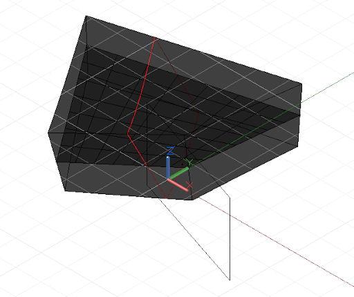

# DesignScript 형상 기본 사항

Dynamo 표준 형상 라이브러리의 가장 단순한 기하학적 객체는 점입니다. 모든 형상은 생성자라는 특수 함수를 사용하여 작성되며, 생성자는 각각 해당 특정 형상 유형의 새 인스턴스를 반환합니다. Dynamo에서 생성자는 객체 유형의 이름(이 경우 Point)으로 시작되며 뒤에 생성 메서드가 옵니다. x, y 및 z 데카르트 좌표로 지정한 3D 점을 작성하기 위해 *ByCoordinates* 생성자를 사용합니다.


```js
// create a point with the following x, y, and z
// coordinates:
x = 10;
y = 2.5;
z = -6;

p = Point.ByCoordinates(x, y, z);
```

Dynamo의 생성자는 일반적으로 "*By*" 접두어로 지정되고, 이러한 함수를 호출하면 새로 작성된 해당 유형의 객체가 반환됩니다. 새로 작성된 이 객체는 등호 기호의 왼쪽에 명명된 변수에 저장됩니다.

대부분의 객체에는 여러 다른 생성자가 있으며 *BySphericalCoordinates* 생성자를 사용하여 구의 반지름, 첫 번째 회전 각도 및 두 번째 회전 각도(도 단위로 지정됨)로 지정된 구에 있는 점을 작성할 수 있습니다.


```js
// create a point on a sphere with the following radius,
// theta, and phi rotation angles (specified in degrees)
radius = 5;
theta = 75.5;
phi = 120.3;
cs = CoordinateSystem.Identity();

p = Point.BySphericalCoordinates(cs, radius, theta,
    phi);
```

선처럼 더 높은 차원의 형상을 생성하는 데 점을 사용할 수 있으며, *ByStartPointEndPoint* 생성자를 사용하여 두 점 간에 선 객체를 작성할 수 있습니다.


```js
// create two points:
p1 = Point.ByCoordinates(3, 10, 2);
p2 = Point.ByCoordinates(-15, 7, 0.5);

// construct a line between p1 and p2
l = Line.ByStartPointEndPoint(p1, p2);
```

마찬가지로 일련의 선 또는 곡선을 가져와 그 사이의 표면을 보간하는 *Loft* 생성자를 사용하는 경우처럼 선을 사용하여 더 높은 차원의 표면 형상을 만들 수 있습니다.


```js
// create points:
p1 = Point.ByCoordinates(3, 10, 2);
p2 = Point.ByCoordinates(-15, 7, 0.5);

p3 = Point.ByCoordinates(5, -3, 5);
p4 = Point.ByCoordinates(-5, -6, 2);

p5 = Point.ByCoordinates(9, -10, -2);
p6 = Point.ByCoordinates(-11, -12, -4);

// create lines:
l1 = Line.ByStartPointEndPoint(p1, p2);
l2 = Line.ByStartPointEndPoint(p3, p4);
l3 = Line.ByStartPointEndPoint(p5, p6);

// loft between cross section lines:
surf = Surface.ByLoft([l1, l2, l3]);
```

표면 역시 더 높은 차원의 솔리드 형상을 작성하는 데 사용할 수 있는데, 예를 들어 지정된 거리만큼 표면을 두껍게 할 수 있습니다. 많은 객체에는 프로그래머가 해당 객체에 대해 명령을 수행할 수 있도록 하는 메서드라고 하는 함수가 연결되어 있습니다. 모든 형상 조각에 공통적으로 적용되는 메서드에는 각각 지정된 양만큼 형상을 변환(이동) 및 회전하는 *Translate* 및 *Rotate*가 포함됩니다. 표면에는 표면의 새 두께를 지정하는 숫자인 단일 입력을 사용하는 *Thicken* 메서드가 있습니다.


```js
p1 = Point.ByCoordinates(3, 10, 2);
p2 = Point.ByCoordinates(-15, 7, 0.5);

p3 = Point.ByCoordinates(5, -3, 5);
p4 = Point.ByCoordinates(-5, -6, 2);

l1 = Line.ByStartPointEndPoint(p1, p2);
l2 = Line.ByStartPointEndPoint(p3, p4);

surf = Surface.ByLoft([l1, l2]);

// true indicates to thicken both sides of the Surface:
solid = surf.Thicken(4.75, true);
```

*Intersection* 명령은 더 높은 차원 객체에서 더 낮은 차원 형상을 추출할 수 있습니다. 이렇게 추출한 낮은 차원 형상은 형상 작성, 추출, 재작성으로 연결되는 일련의 프로세스에서 더 높은 차원 형상의 기준을 형성할 수 있습니다. 이 예에서는 생성된 솔리드를 사용하여 표면을 작성하고 표면을 사용하여 곡선을 작성합니다.



```js
p1 = Point.ByCoordinates(3, 10, 2);
p2 = Point.ByCoordinates(-15, 7, 0.5);

p3 = Point.ByCoordinates(5, -3, 5);
p4 = Point.ByCoordinates(-5, -6, 2);

l1 = Line.ByStartPointEndPoint(p1, p2);
l2 = Line.ByStartPointEndPoint(p3, p4);

surf = Surface.ByLoft([l1, l2]);

solid = surf.Thicken(4.75, true);

p = Plane.ByOriginNormal(Point.ByCoordinates(2, 0, 0),
    Vector.ByCoordinates(1, 1, 1));

int_surf = solid.Intersect(p);

int_line = int_surf.Intersect(Plane.ByOriginNormal(
    Point.ByCoordinates(0, 0, 0),
    Vector.ByCoordinates(1, 0, 0)));
```

