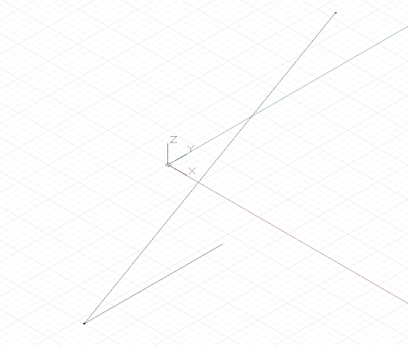

# 기하학적 원형

Dynamo가 다양한 복합 형상 형태를 작성할 수 있지만, 간단한 기하학적 원형은 모든 계산 방식 설계의 토대를 형성합니다. 이는 최종 설계 형태로 직접 표현되거나 보다 복잡한 형상이 생성되는 비계로 사용됩니다.

CoordinateSystem은 반드시 형상의 일부는 아니지만 형상을 생성하기 위한 중요한 도구입니다. CoordinateSystem 객체는 회전, 방향 및 축척 등의 위치 및 형상 변환을 모두 추적합니다.

회전, 축척 또는 방향 전환 없이 한 점(x = 0, y = 0, z = 0)을 중심으로 CoordinateSystem을 작성하려면 ID 생성자를 호출하기만 하면 됩니다.


```js
// create a CoordinateSystem at x = 0, y = 0, z = 0,
// no rotations, scaling, or sheering transformations

cs = CoordinateSystem.Identity();
```

형상 변환이 있는 CoordinateSystem은 이 장의 범위를 벗어나지만 다른 생성자를 사용하여 특정 지점에서 *CoordinateSystem.ByOriginVectors*라는 좌표계를 작성할 수 있습니다.


```js
// create a CoordinateSystem at a specific location,
// no rotations, scaling, or sheering transformations
x_pos = 3.6;
y_pos = 9.4;
z_pos = 13.0;

origin = Point.ByCoordinates(x_pos, y_pos, z_pos);
identity = CoordinateSystem.Identity();

cs = CoordinateSystem.ByOriginVectors(origin,
    identity.XAxis, identity.YAxis, identity.ZAxis);
```

가장 간단한 기하학적 원형은 3D 공간에서 0차원 위치를 나타내는 점입니다. 앞에서 설명한 것처럼 특정 좌표계에서 점을 작성하는 여러 가지 방법이 있습니다. *Point.ByCoordinates*는 지정된 X, Y 및 Z 좌표를 사용하여 점을 작성하고 *Point.ByCartesianCoordinates*는 특정 좌표계에서 지정된 X, Y 및 Z 좌표를 사용하여 점을 작성합니다. *Point.ByCylindricalCoordinates*는 반지름, 회전 각도 및 높이를 갖는 원통에 놓여 있는 점을 작성하고, *Point.BySphericalCoordinates*는 반지름 및 2개의 회전 각도가 있는 구에 놓여 있는 점을 작성합니다.

이 예는 다양한 좌표계에서 작성된 점을 보여줍니다.


```js
// create a point with x, y, and z coordinates
x_pos = 1;
y_pos = 2;
z_pos = 3;

pCoord = Point.ByCoordinates(x_pos, y_pos, z_pos);

// create a point in a specific coordinate system
cs = CoordinateSystem.Identity();
pCoordSystem = Point.ByCartesianCoordinates(cs, x_pos,
    y_pos, z_pos);

// create a point on a cylinder with the following
// radius and height
radius = 5;
height = 15;
theta = 75.5;

pCyl = Point.ByCylindricalCoordinates(cs, radius, theta,
    height);

// create a point on a sphere with radius and two angles

phi = 120.3;

pSphere = Point.BySphericalCoordinates(cs, radius, 
    theta, phi);
```

그 다음으로 높은 차원의 Dynamo 원형은 두 끝점 사이의 무한한 수의 점을 나타내는 선 세그먼트입니다. 생성자 *Line.ByStartPointEndPoint*로 두 개의 경계점을 명시적으로 지정하거나 해당 방향에서 시작점, 방향 및 길이(*Line.ByStartPointDirectionLength*)를 지정하여 선을 작성할 수 있습니다.



```js
p1 = Point.ByCoordinates(-2, -5, -10);
p2 = Point.ByCoordinates(6, 8, 10);

// a line segment between two points
l2pts = Line.ByStartPointEndPoint(p1, p2); 

// a line segment at p1 in direction 1, 1, 1 with 
// length 10
lDir = Line.ByStartPointDirectionLength(p1,
    Vector.ByCoordinates(1, 1, 1), 10);
```

Dynamo에는 3D로 만든 기하학적 원형의 가장 기본적인 유형을 나타내는 객체가 있습니다. 예를 들어 직육면체는 *Cuboid.ByLength*로 작성되고, 원추는 *Cone.ByPointsRadius* 및 *Cone.ByPointsRadii*로 작성됩니다. 원통은 *Cylinder.ByRadiusHeight*로 작성되고, 구는 *Sphere.ByCenterPointRadius*로 작성됩니다.


```js
// create a cuboid with specified lengths
cs = CoordinateSystem.Identity();

cub = Cuboid.ByLengths(cs, 5, 15, 2);

// create several cones
p1 = Point.ByCoordinates(0, 0, 10);
p2 = Point.ByCoordinates(0, 0, 20);
p3 = Point.ByCoordinates(0, 0, 30);

cone1 = Cone.ByPointsRadii(p1, p2, 10, 6);
cone2 = Cone.ByPointsRadii(p2, p3, 6, 0);

// make a cylinder
cylCS = cs.Translate(10, 0, 0);

cyl = Cylinder.ByRadiusHeight(cylCS, 3, 10);

// make a sphere
centerP = Point.ByCoordinates(-10, -10, 0);

sph = Sphere.ByCenterPointRadius(centerP, 5);
```

