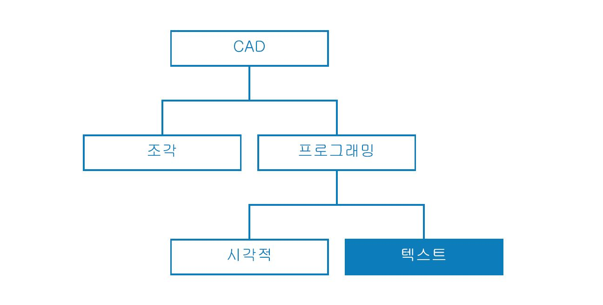

## 스크립팅 전략

시각적 스크립팅 환경 내의 텍스트 기반 스크립팅을 활용하면 DesignScript, Python, ZeroTouch(C#)를 사용하여 강력한 시각적 관계를 사용할 수 있습니다. 사용자는 입력 슬라이더와 같은 요소를 노출시키고, 대규모 작업을 DesignScript로 압축하며, 동일한 작업공간 내에서 Python 또는 C#을 통해 강력한 도구 및 라이브러리에 액세스할 수 있습니다. 효과적으로 관리할 경우 이러한 전략을 결합하면 전체 프로그램에 대해 사용자화 사용 가능성, 명확성 및 효율성을 많이 향상할 수 있습니다. 아래에는 텍스트 스크립트를 사용하여 시각적 스크립트를 보강하는 데 도움이 되는 일련의 지침이 나와 있습니다.



### 스크립팅해야 하는 경우에 대해 알아보기

텍스트 스크립팅의 경우 시각적 프로그래밍보다 더 복잡한 관계를 설정할 수 있지만 그와 겹치는 기능도 많습니다. 노드가 효과적으로 사전에 패키지된 코드이고, 전체 Dynamo 프로그램을 DesignScript 또는 Python으로 작성할 수 있기 때문에 그렇습니다. 그러나 노드와 와이어의 인터페이스에서 그래픽 정보의 직관적인 흐름을 작성하므로 우리는 시각적 스크립팅을 사용합니다. 텍스트 스크립팅의 기능이 시각적 스크립팅보다 유용한 지점을 알면 노드와 와이어의 직관적인 특성을 포기하지 않고 이 기능을 사용해야 하는 경우에 대한 중요한 단서를 얻게 될 것입니다. 아래에는 스크립팅해야 하는 경우와 사용해야 하는 언어에 대한 지침이 나와 있습니다.

**텍스트 스크립팅의 목적:**

* 루핑

* 재귀

* 외부 라이브러리에 액세스

**언어 선택:**

||루핑|재귀|노드 압축|Ext. 라이브러리|줄임|
| -- | -- | 
|**DesignScript**|예|예|예|아니오|예|
|**Python**|예|예|부분적|예|아니오|
|**ZeroTouch(C#)**|아니요|아니오|아니오|예|아니오|

> 각 Dynamo 라이브러리에서 액세스 가능한 리스트를 보려면 [스크립팅 참조](http://primer.dynamobim.org/en/12_Best-Practice/12-3_Scripting-Reference.html)를 참조하십시오.

### 파라메트릭 방식으로 생각하기

필연적으로 파라메트릭 환경인 Dynamo에서 스크립팅할 경우 코드가 상주할 노드 및 와이어의 프레임워크를 기준으로 코드를 구성하는 것이 좋습니다. 텍스트 스크립트가 포함된 노드는 소수의 특정 입력, 함수 및 예상 출력이 있는 프로그램의 다른 노드처럼 생각하십시오. 그러면 즉시 해당 노드 내의 코드에 작은 변수 세트가 포함되어 작동하게 되며, 이것이 깔끔한 파라메트릭 시스템의 열쇠입니다. 아래에는 코드를 시각적 프로그램에 보다 효율적으로 통합하기 위한 몇 가지 지침이 나와 있습니다.

**외부 변수 식별하기:**

* 해당 데이터를 직접 작성하는 모델을 구성할 수 있도록 설계 문제에서 지정된 매개변수를 확인해 보십시오.

* 코드를 작성하기 전에 다음 변수를 식별하십시오.

  * 최소한의 입력 세트

  * 의도한 출력

  * 상수


> 몇 가지 변수는 코드를 작성하기 전에 설정되어 있습니다.

> 1. 강우를 시뮬레이션할 표면
2. 기본 빗방울 수(에이전트)
3. 기본 빗방울 이동 거리
4. 가장 가파른 경로를 내려가는 경우와 표면을 횡단하는 경우 간의 전환
5. Python 노드(각 입력 수 포함)
6. 반환된 곡선을 파란색으로 만드는 Code Block

**내부 관계 설계하기:**

* 매개변수화를 사용하면 방정식 또는 시스템의 최종 결과를 조작하거나 변경하기 위해 특정 매개변수 또는 변수를 편집할 수 있습니다.

* 스크립트의 엔터티가 논리적으로 관련된 경우 항상 서로의 함수로 정의하십시오. 이렇게 하면 하나가 수정되는 경우 나머지 요소가 비례적으로 업데이트될 수 있습니다.

* 다음과 같이 키 매개변수를 노출하는 방식으로만 입력 수를 최소화합니다.

  * 매개변수 세트를 더 많은 상위 매개변수에서 파생할 수 있는 경우 상위 매개변수만 스크립트 입력으로 노출합니다. 그러면 인터페이스의 복잡성이 줄어들어 스크립트의 가용성이 높아집니다.


> [Python 노드](http://primer.dynamobim.org/en/09_Custom-Nodes/9-4_Python.html) 내 예시의 코드 "모듈"

> 1. 입력
2. 스크립트 내부의 변수
3. 이러한 입력 및 변수를 사용하여 해당 함수를 수행하는 루프
> 팁: 솔루션에서처럼 과정에 최대한 중점을 두십시오.

**DRY(Don't Repeat Yourself) 원칙:**

* 스크립트에서 동일한 항목을 표현할 방법이 여러 가지 있는 경우 어느 시점에 중복 표현이 동기화되지 않아 유지보수 문제, 공통 분할 불량, 내부 모순이 초래될 수 있습니다.

* DRY 원칙에 따르면 "모든 지식은 시스템 내에서 단일하고, 명백하며, 권위 있게 표현되어야 합니다."

  * 이 원칙이 제대로 적용되면 스크립트의 모든 관련 요소가 예측 가능한 방식으로 균일하게 변경되고, 모든 관련 없는 요소가 서로 간에 논리적인 결과를 일으키지 않습니다.

```
### BAD
for i in range(4):
for j in range(4):
point = Point.ByCoordinates(3*i, 3*j, 0)
points.append(point)
```

```
### GOOD
count = IN[0]
pDist = IN[1]

for i in range(count):
for j in range(count):
point = Point.ByCoordinates(pDist*i, pDist*j, 0)
points.append(point)
```

> 팁: 스크립트에서 엔터티(위 예에서는 상수)를 복제하기 전에 소스에 링크할 수 있는지에 대해 자문해 보십시오.

### 모듈 방식으로 구성하기

코드가 점점 길어지고 복잡해짐에 따라 “중요한 아이디어”나 매우 중요한 알고리즘은 점점 더 읽기 어려워집니다. 또한 어떤 특정 상황이 어디에서 발생하는지 추적하거나, 문제가 발생하는 경우 버그를 찾거나, 다른 코드를 통합하거나, 개발 작업을 지정하기가 더욱 어려워집니다. 이러한 문제를 방지하기 위해 실행하는 작업에 따라 코드를 분할하는 구성 전략으로, 모듈에서 코드를 작성하는 것이 좋습니다. 다음은 모듈화 방식으로 스크립트를 보다 쉽게 관리할 수 있는 몇 가지 팁입니다.

**모듈에 코드 작성하기:**

* "모듈"은 작업공간의 Dynamo 노드와 유사하게 특정 작업을 수행하는 코드 그룹입니다.

* 인접 코드(함수, 클래스, 입력 그룹 또는 가져오고 있는 라이브러리)와 시각적으로 분리해야 하는 무엇이든 모듈이 될 수 있습니다.

* 모듈에서 코드를 개발하면 시각적이고 직관적인 품질의 노드뿐만 아니라 텍스트 스크립팅에서만 가능한 복잡한 관계도 활용할 수 있습니다.


> 이러한 루프에서는 우리가 연습에서 개발할 "agent"라는 클래스를 호출합니다.

> 1. 각 에이전트의 시작점을 정의하는 코드 모듈
2. 에이전트를 업데이트하는 코드 모듈
3. 에이전트 경로에 대한 트레일을 그리는 코드 모듈

**코드 재사용 발견하기:**

* 코드가 두 곳 이상에서 같은(또는 매우 유사한) 작업을 수행하는 것을 발견한 경우 호출할 수 있는 함수로 클러스터링할 방법을 찾으십시오.

* “관리자” 함수는 프로그램 흐름을 제어하며, 주로 구조 간 데이터 이동과 같은 낮은 레벨의 세부 정보를 처리하는 “작업자” 함수에 대한 호출을 포함합니다.


> 이 예시에서는 중심점의 Z 값을 기준으로 반지름과 색상을 사용하여 구를 작성합니다.

> 1. "작업자" 상위 함수 두 개: 반지름이 있는 구를 작성하고 중심점의 Z 값을 기준으로 색상을 표시하는 함수.
2. 두 작업자 함수를 결합하는 "관리자" 상위 함수. 이를 호출하면 내부의 두 함수가 모두 호출됩니다.

**확인해야 할 사항만 표시하기:**

* 모듈 인터페이스에는 모듈에서 제공하거나 요구하는 요소가 나타납니다.

* 단위 간의 인터페이스가 정의되면 각 단위의 세부 설계를 별도로 진행할 수 있습니다.

**분리 가능성/대치 가능성:**

* 모듈에서는 서로에 대해 잘 모르거나 상관하지 않습니다.

**모듈화의 일반적인 형태:**

* 코드 그룹화:

```
# IMPORT LIBRARIES
import random
import math
import clr
clr.AddReference('ProtoGeometry')
from Autodesk.DesignScript.Geometry import *

# DEFINE PARAMETER INPUTS
surfIn = IN[0]
maxSteps = IN[1]
```

* 함수:

```
def get_step_size():
area = surfIn.Area
stepSize = math.sqrt(area)/100
return stepSize

stepSize = get_step_size()
```

* 클래스:

```
class MyClass:
i = 12345

def f(self):
return 'hello world'

numbers = MyClass.i
greeting = MyClass.f
```

### 지속적으로 조정하기

Dynamo에서 텍스트 스크립트를 개발하는 동안 실제로 작성되는 것이 기대하는 바와 일치하는지 지속적으로 확인하는 것이 좋습니다. 그러면 예기치 못한 이벤트(구문 오류, 논리 불일치, 부정확한 값, 이상 출력 등)를마지막에 한꺼번에 확인하는 대신 중간중간 드러나는 대로 빠르게 확인할 수 있습니다. 텍스트 스크립트는 캔버스의 노드 내에 있으므로 시각적 프로그램의 데이터 흐름에 이미 통합되어 있습니다. 따라서 출력할 데이터를 지정하고, 프로그램을 실행하고, Watch 노드를 사용하여 스크립트에서 흐름 상태를 평가하는 것처럼 간단하게 연속적 스크립트 모니터링을 수행할 수 있습니다. 다음은 스크립트를 구성할 때 지속적으로 검사할 수 있는 몇 가지 팁입니다.

**진행하면서 테스트하기:**

* 기능 클러스터를 완료할 때마다 다음을 수행합니다.

  * 이전 단계로 이동하여 코드를 검사합니다.

  * 엄격하게 확인합니다. 공동작업자가 이 작업이 무엇인지 이해할 수 있는가? 이 작업을 수행할 필요가 있는가? 이 기능을 보다 효율적으로 수행할 수 있는가? 불필요한 중복이나 의존성을 작성하고 있는가?

  * 빠르게 테스트하여 "타당한" 데이터가 반환되는지 확인합니다.

* 다음과 같이 스크립트가 업데이트되면 노드에서 항상 관련 데이터를 출력하도록 스크립트에서 작업 중인 최신 데이터를 출력으로 지정합니다.


> [Python 노드](http://primer.dynamobim.org/en/09_Custom-Nodes/9-4_Python.html)에서 예시 코드를 조정합니다.

> 1. 솔리드의 모든 모서리가 곡선으로 돌아가 경계 상자를 작성하는지 확인합니다.
2. 개수 입력이 범위로 변환되는지 확인합니다.
3. 이 루프에서 좌표계가 제대로 변환되고 회전되었는지 확인합니다.

**"극단적인 경우" 예상하기:**

* 스크립팅하는 동안 할당된 도메인의 최솟값 및 최댓값에 입력 매개변수를 크랭크하여 프로그램이 극단적인 조건에서도 계속 작동하는지 확인합니다.

* 프로그램이 극단적인 조건에서 작동하더라도 의도하지 않은 null/공백/0 값을 반환하는지 확인합니다.

* 어떤 경우에는 몇몇 스크립트 관련 기본 문제를 나타내는 버그와 오류가 이러한 극단적인 경우에만 드러납니다.

  * 오류의 원인을 파악한 다음 문제를 방지하려면 내부적으로 수정해야 할지 아니면 매개변수 도메인을 다시 정의해야 할지를 결정합니다.

> 팁: 항상 사용자가 자신에게 표시된 모든 입력 값의 모든 조합을 사용한다고 가정하십시오. 그러면 원치 않는 갑작스러운 상황이 발생하지 않습니다.

### 효율적으로 디버깅하기

디버깅은 스크립트에서 "버그"를 제거하는 프로세스입니다. 버그는 오류, 비효율성, 부정확성 또는 예상치 못한 결과일 수 있습니다. 버그는 스크립트를 사용하여 철자가 잘못된 변수 이름을 보다 널리 퍼진 구조적 문제로 수정하는 것처럼 간단하게 해결할 수 있습니다. 스크립트를 만들면서 조정하면 버그가 완전히 없어진다는 보장은 없지만 이러한 잠재적 문제를 조기에 포착할 수 있습니다. 아래에는 버그를 체계적으로 해결하는 데 도움이 되는 몇 가지 모범 사례를 검토한 내용이 나와 있습니다.

**Watch 풍선 사용하기:**

* 프로그램 조정이라는 개념과 유사하게 OUT 변수에 데이터를 지정하여 코드의 여러 위치에서 반환되는 데이터를 확인합니다.

**의미 있는 주석 작성하기:**

* 의도한 결과를 명확하게 설명하면 코드 모듈을 디버깅하기가 훨씬 쉽습니다.

```
# Loop through X and Y
for i in range(xCount):
for j in range(yCount):

# Rotate and translate the coordinate system
toCoord = fromCoord.Rotate(solid.ContextCoordinateSystem.Origin,Vector.ByCoordinates(0,0,1),(90*(i+j%seed)))
vec = Vector.ByCoordinates((xDist*i),(yDist*j),0)
toCoord = toCoord.Translate(vec)

# Transform the solid from the source coord system to the target coord system and append to the list
solids.append(solid.Transform(fromCoord,toCoord))
```

> 이 경우 일반적으로 주석과 빈 줄이 과도하게 많아지지만, 디버깅할 때 주석 내용을 관리 가능한 여러 부분으로 나누면 유용할 수 있습니다.

**코드의 모듈성 활용하기:**

* 문제의 소스는 특정 모듈로 격리할 수 있습니다.

* 잘못된 모듈을 식별하고 나면 문제를 훨씬 더 간단하게 해결할 수 있습니다.

* 프로그램을 수정해야 하는 경우 모듈에서 개발된 코드는 다음과 같이 훨씬 더 쉽게 변경할 수 있습니다.

  * 새 모듈 또는 디버깅된 모듈을 기존 프로그램에 삽입할 수 있으며, 삽입하더라도 프로그램의 나머지 부분은 변경되지 않습니다.


> [Python 노드](http://primer.dynamobim.org/en/09_Custom-Nodes/9-4_Python.html)에서 예시 파일을 디버깅합니다.

> 1. 입력 형상에서 형상 자체보다 큰 경계 상자를 반환합니다. 이는 xDist 및 yDist를 OUT에 지정하면 볼 수 있습니다.
2. 입력 형상의 모서리 곡선에서 xDist 및 yDist에 대해 올바른 거리로 적절한 경계 상자를 반환합니다.
3. xDist 및 yDist 값 문제를 해결하기 위해 삽입한 코드 "모듈"입니다.

### 연습 - 가장 가파른 경로

> 이 연습과 함께 제공되는 예시 파일을 다운로드하십시오(마우스 오른쪽 버튼을 클릭하고 "다른 이름으로 링크 저장..." 선택). 전체 예시 파일 리스트는 부록에서 확인할 수 있습니다. [SteepestPath.dyn](datasets/13-1/SteepestPath.dyn)

텍스트 스크립팅의 모범 사례를 고려하여 비 시뮬레이션 스크립트를 작성해 보겠습니다. 그래프 전략에서 체계적이지 않은 시각적 프로그램에 모범 사례를 적용할 수 있었지만 그렇게 하는 것은 텍스트 스크립팅을 사용하는 것보다 훨씬 더 어렵습니다. 텍스트 스크립팅에서 설정한 논리적 관계는 가시성이 낮아 복잡한 코드에서는 풀기가 거의 불가능할 수 있습니다. 텍스트 스크립팅의 기능을 사용하면 조직의 책임이 더 커집니다. 각 단계를 살펴보고 그 과정에서 모범 사례를 적용해 보겠습니다.


> 우리의 스크립트는 어트랙터가 변형된 표면에 적용됩니다.

가장 먼저 해야 할 작업은 필요한 Dynamo 라이브러리를 가져오는 것입니다. 먼저 이렇게 하면 Python에서 Dynamo 기능에 전역적으로 액세스할 수 있게 됩니다.


> 사용하려는 모든 라이브러리를 여기로 가져와야 합니다.

다음으로, 스크립트의 입력과 출력을 정의해야 합니다. 이는 노드에서 입력 포트로 표시됩니다. 이러한 외부 입력이 스크립트의 토대가 되고 파라메트릭 환경을 설정하는 열쇠가 됩니다.


> Python 스크립트에서 변수에 해당하는 입력을 정의하고 원하는 출력을 결정해야 합니다.

> 1. 우리가 걸어갈 표면
2. 우리가 걷게 할 에이전트의 수
3. 에이전트가 걸을 수 있는 최대 걸음 수
4. 표면 아래로 최단 경로를 택하거나 횡단할 수 있는 옵션
5. 스크립트의 입력(IN[0], IN[1])에 해당하는 입력 식별자가 있는 Python 노드
6. 다른 색상으로 표시할 수 있는 출력 곡선

이제 모듈성 실습을 이용하여 스크립트 본문을 작성해 보겠습니다. 여러 시작점에 대해 표면 아래의 최단 경로를 시뮬레이션하는 것은 여러 함수가 필요한 중대한 작업입니다. 스크립트 전체에서 다른 함수를 호출하는 대신 이를 단일 클래스인 당사의 에이전트로 수집하여 코드를 모듈화할 수 있습니다. 이 클래스 또는 "모듈"의 여러 함수는 다른 변수를 사용하여 호출하거나 다른 스크립트에서 재사용할 수도 있습니다.


> 한 걸음씩 걸을 때마다 가능한 가장 가파른 방향으로 이동하도록 선택하여 표면을 걷게 하려는 에이전트에 대해 다음과 같은 클래스 또는 청사진을 정의해야 합니다.

> 1. 이름.
2. 모든 에이전트가 공유하는 전역 속성
3. 각 에이전트마다 고유한 인스턴스 속성
4. 걷게 하는 함수
5. 각 걸음의 위치를 트레일 리스트로 카탈로그화하는 함수

시작 위치를 정의하여 에이전트를 초기화하겠습니다. 이는 스크립트를 조정하고 에이전트 클래스가 제대로 작동하는지 확인할 수 있는 좋은 기회입니다.


> 표면을 걷는 것을 관찰하고 해당 초기 속성을 정의하려는 모든 에이전트를 인스턴스화해야 합니다.

> 1. 비어 있는 새 트레일 리스트
2. 표면에서 여정을 시작할 위치
3. 여기서 스크립트가 반환하는 결과를 확인하기 위해 에이전트 리스트를 출력으로 지정했습니다. 올바른 수의 에이전트가 반환되지만, 반환되는 형상을 확인하려면 나중에 스크립트를 다시 조정해야 합니다.

각 단계에서 각 에이전트를 업데이트합니다.


> 그런 다음 내포된 루프를 입력해야 합니다. 여기서 각 에이전트와 각 걸음에 대해 해당 위치를 업데이트하고 해당 트레일 리스트에 기록합니다. 또한 걸음마다 에이전트가 표면에서 한 걸음 더 내디뎌서 내려갈 수 없는 지점에 도달하지 않았는지 확인합니다. 그러한 조건이 충족되면 해당 에이전트의 여정이 종료됩니다.

에이전트가 완전히 업데이트되었으므로 이들을 나타내는 형상을 반환해 보겠습니다.


> 모든 에이전트가 하강 제한 또는 최대 걸음 수에 도달한 후, 해당 트레일 리스트의 지점을 통해 polycurve를 작성하고 polycurve 트레일을 출력합니다.

가장 가파른 경로를 찾는 스크립트입니다.


> 1. 기본 표면의 강우를 시뮬레이션하는 사전 설정입니다.
2. 가장 가파른 경로를 찾는 대신 기본 표면을 횡단하도록 에이전트를 전환할 수 있습니다.


> 전체 Python 텍스트 스크립트입니다.

