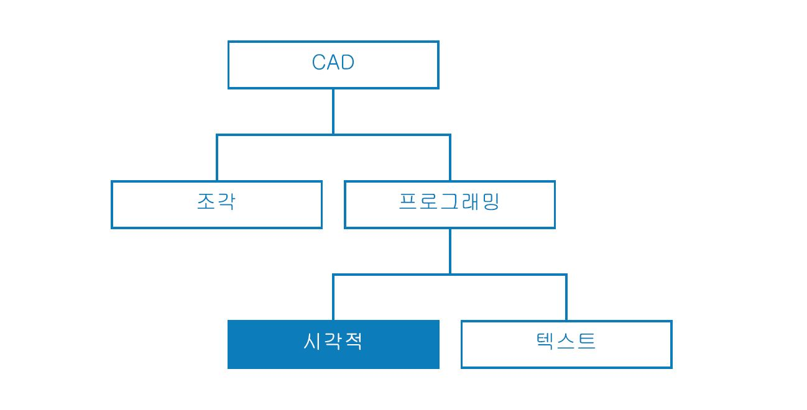
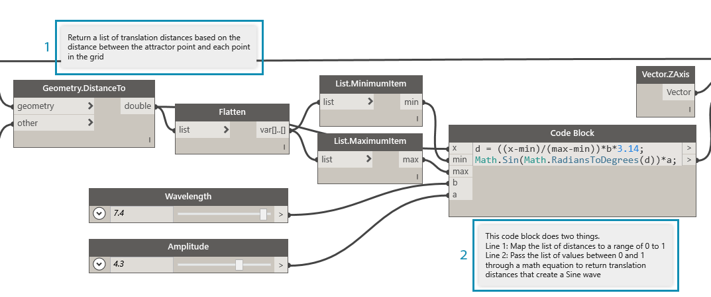
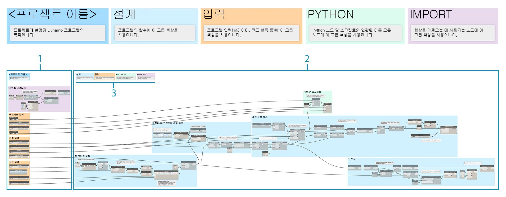
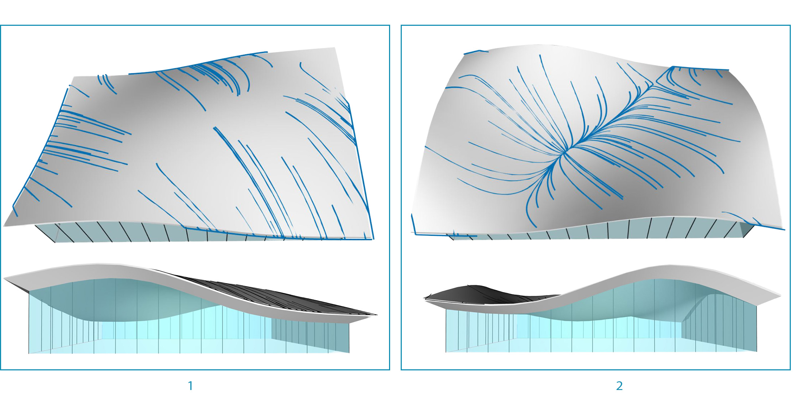

## 그래프 전략

이 장의 앞부분에서는 Primer를 통해 Dynamo의 강력한 시각적 스크립팅 기능을 구현하는 방법에 대해 다루었습니다. 이러한 기능에 대한 충분한 이해는 견고한 시각적 프로그램을 구축하는 단단한 기초이자 첫 번째 단계입니다. 현장에서 시각적 프로그램을 사용하거나, 동료들과 공유하거나, 오류 문제를 해결하거나, 제한을 테스트할 때는 처리할 추가적인 문제가 있습니다. 다른 사람이 프로그램을 사용할 예정이거나 지금부터 6개월 동안 공개할 예정이면 즉각적인 그래픽과 논리적 명확성이 있어야 합니다. Dynamo에는 프로그램의 복잡성을 관리하는 많은 도구가 있으며, 이 장에서는 그러한 도구를 사용할 시기에 대한 지침을 제공합니다.

### 복잡성 줄이기

Dynamo 그래프를 개발하고 아이디어를 테스트함에 따라 규모와 복잡성이 빠르게 증가할 수 있습니다. 기능적인 프로그램을 만드는 것이 중요한 한편, 최대한 간단하게 만드는 것도 그만큼 중요합니다. 그래프를 더 빠르고 예측 가능한 방식으로 실행하게 될 뿐만 아니라 나중에 다른 사용자와 함께 그 논리를 이해하게 됩니다. 아래에는 그래프의 논리를 명확히 표시하는 여러 가지 방법이 나와 있습니다.

#### 그룹으로 모듈화하기

* 그룹을 사용하면 프로그램을 구축할 때 **기능적으로 고유한 부분을 작성**할 수 있습니다.
* 그룹을 사용하면 모듈성과 정렬을 유지하면서 **프로그램의 큰 부분을 이동**할 수 있습니다.
* 그룹에서 수행하는 작업(입력 대 함수)을 **구분할 수 있도록 그룹의 색상을 변경**할 수 있습니다.
* 그룹을 사용하면 **그래프를 구성하여 사용자 노드 작성을 간소화**할 수 있습니다.

> 이 프로그램의 색상으로 각 그룹의 용도가 식별됩니다. 이 전략을 사용하여 개발하는 그래픽 표준이나 템플릿에서 계층을 작성할 수 있습니다.

> 1. 함수 그룹(파란색)
2. 입력 그룹(주황색)
3. 스크립트 그룹(초록색)
> 그룹을 사용하는 방법은 [프로그램 관리하기](http://primer.dynamobim.org/en/03_Anatomy-of-a-Dynamo-Definition/3-4_best_practices.html)를 참조하십시오.

#### Code Block을 사용하여 효율적으로 개발하기

* 경우에 따라 Code Block을 사용하여 **검색보다 빠르게 숫자 또는 노드 메서드를 입력**할 수 있습니다(Point.ByCoordinates, Number, String, Formula).

* Code Block은 **DesignScript에서 사용자 함수를 정의하여 그래프의 노드 수를 줄이려는 경우**에 유용합니다.

> 1과 2는 모두 동일한 기능을 수행합니다. 각 노드를 개별적으로 검색하고 추가하는 것보다 코드 몇 줄을 작성하는 것이 훨씬 더 빨랐습니다. code block은 훨씬 간결하기도 합니다.

> 1. Code Block에 작성된 설계 스크립트
2. 노드 내 동등한 프로그램
> Code Block을 사용하는 방법은 [Code Block이란](http://primer.dynamobim.org/en/07_Code-Block/7-1_what-is-a-code-block.html)을 참조하십시오.

#### Node to Code를 사용하여 압축하기

* 간단한 노드 모음을 가져와 단일 Code Block에 해당 DesignScript를 쓰는 **Node to Code를 사용하여 그래프의 복잡성을 줄일** 수 있습니다.
* Node to Code를 사용하면 **프로그램의 명확성을 유지하면서 코드를 압축**할 수 있습니다.
* Node to Code를 사용할 경우의 **장점**은 다음과 같습니다.
* 계속 편집 가능한 하나의 구성요소로 쉽게 코드 압축
* 그래프의 대부분을 단순화할 수 있음
* '미니 프로그램'을 자주 편집하지 않는 경우에 유용
* 함수와 같은 기타 code block 기능을 통합하는 데 유용

* Node to Code를 사용할 경우의 **단점**은 다음과 같습니다.
* 일반 이름을 지정할 경우 읽기가 어려워짐
* 다른 사용자가 이해하기가 더 어려움
* 시각적 프로그래밍 버전으로 쉽게 돌아갈 수 있는 방법 없음

> 1. 기존 프로그램
2. Node to Code로 작성한 Code Block
> Node to Code를 사용하는 방법에 대한 자세한 내용은 [설계 스크립트 구문](http://primer.dynamobim.org/en/07_Code-Block/7-2_Design-Script-syntax.html)을 참조하십시오.

#### List@Level을 통해 데이터에 유연하게 액세스하기

* List@Level을 사용하면 상당한 크기의 캔버스 공간을 차지할 수 있는 List.Map 및 List.Combine 노드**를 대체하여 그래프의 복잡성을 줄일** 수 있습니다.
* List@Level에서는 노드의 입력 포트에서 바로 리스트의 임의 레벨에 있는 데이터에 액세스할 수 있게 해주어 **List.Map/List.Combine보다 더 빨리 노드 논리를 구성하는 방법**을 제공합니다.

> 우리는 CountTrue의 "list" 입력에 대해 List@Level을 활성화하여 BoundingBox.Contains에서 반환하는 True 값이 어떤 리스트에 몇 개인지 확인할 수 있습니다. 사용자는 List@Level을 통해 입력으로 데이터를 가져올 레벨을 결정할 수 있습니다. List@Level을 사용하면 유연하고 효율적이므로 List.Map 및 List.Combine과 관련된 다른 방법에 비해 적극 권장됩니다.

> 1. 리스트 레벨 2에서 true 값 계산
2. 리스트 레벨 3에서 true 값 계산
> List@Level을 사용하는 방법은 [리스트의 리스트](http://primer.dynamobim.org/en/06_Designing-with-Lists/6-3_lists-of-lists.html#list@level)를 참조하십시오.

### 가독성 유지하기

그래프를 최대한 간단하고 효율적으로 만들 뿐만 아니라 그래픽 명확성을 위해 노력하십시오. 논리적 그룹화를 사용하여 그래프를 직관적으로 만들기 위한 최선의 노력에도 불구하고 관계가 명확하게 표시되지 않을 수 있습니다. 그룹 내부에 간단한 메모를 기록하거나 슬라이더 이름을 바꾸면 사용자 자신이나 다른 사용자가 불필요한 혼란을 겪거나 그래프를 훑어보지 않아도 됩니다. 아래에는 그래프 내에, 그리고 그래프 전체에 그래픽 일관성을 적용하는 데 유용한 몇 가지 방법이 나와 있습니다.

#### 노드 정렬을 통한 시각적 연속성

* 그래프 작성을 마친 후 작업을 줄이려면 **작업하면서 자주 노드를 정렬**하여 노드 배치를 읽을 수 있도록 해야 합니다.
* 다른 사용자가 사용자의 그래프를 사용해 작업하려는 경우 **보내기 전에 노드-와이어 배치가 쉽게 유동되는지 확인**해야 합니다.
* 정렬에 활용하려면 **"노드 배치 정리" 기능을 사용하여 그래프를 자동으로 정렬**합니다. 그러나 이렇게 하는 것이 직접 정렬하는 것보다 정확하지는 않습니다.

> 1. 구성되지 않은 그래프
2. 정렬된 그래프
> 노드 정렬을 사용하는 방법은 [프로그램 관리하기](http://primer.dynamobim.org/en/03_Anatomy-of-a-Dynamo-Definition/3-4_best_practices.html)를 참조하십시오.

#### 이름을 바꾸어 알아보기 쉽게 레이블 지정하기

* 입력의 이름을 바꾸면 다른 사람들이 그래프를 쉽게 이해할 수 있습니다. **특히 플러깅 대상이 화면에서 벗어날 경우**에 유용합니다.
* **입력 이외에 다른 노드의 이름을 바꿀 때는 주의하십시오.** 이에 대한 대안은 노드 클러스터에서 사용자 노드를 작성하고 그 이름을 바꾸는 것입니다. 여기에 다른 것이 포함되어도 이해될 것입니다.

> 1. 표면 조작을 위한 입력
2. 건축 매개변수를 위한 입력
3. 배수 시뮬레이션 스크립트를 위한 입력
> 노드의 이름을 바꾸려면 해당 이름을 마우스 오른쪽 버튼으로 클릭하고 "노드 이름 바꾸기..."를 선택합니다.

#### 메모를 사용하여 설명하기

* **그래프의 일부에 노드로 표현할 수 없는 일반 언어 설명이 필요**하다면 메모를 추가해야 합니다.
* **노드 또는 그룹 모음이 너무 크거나 복잡해서 즉시 쉽게 이해할 수 없는 경우** 메모를 추가해야 합니다.

> 1. 원시 변환 거리를 반환하는 프로그램 부분을 설명하는 메모
2. 해당 값을 사인파에 매핑하는 코드를 설명하는 메모
> 메모를 추가하는 방법은 [프로그램 관리하기](http://primer.dynamobim.org/en/03_Anatomy-of-a-Dynamo-Definition/3-4_best_practices.html)를 참조하십시오.

### 지속적으로 조정하기

시각적 스크립트를 작성하는 동안 반환되는 결과가 예상되는 결과와 같은지 확인하는 것이 중요합니다. 모든 오류나 문제로 인해 즉시 프로그램이 실패하는 것은 아닙니다. 특히, 먼 다운스트림에 영향을 줄 수 있는 null 또는 0 값이 그렇습니다. 이 전략은 [스크립팅 전략](http://primer.dynamobim.org/en/12_Best-Practice/13-2_Scripting-Strategies.html)의 텍스트 스크립팅 컨텍스트에도 설명되어 있습니다. 다음 방법은 예상한 결과를 얻을 수 있도록 도와줍니다.

#### Watch 및 미리보기 풍선으로 데이터 모니터링하기

* 프로그램을 구축할 때 Watch 또는 미리보기 풍선을 사용하여 **키 출력에서 예상한 결과를 반환하는지 확인**합니다.

> Watch 노드는 다음을 비교하는 데 사용됩니다.

> 1. 원시 변환 거리
2. 사인 방정식을 통해 전달되는 값
> Watch를 사용하는 방법에 대해서는 [라이브러리](http://primer.dynamobim.org/en/03_Anatomy-of-a-Dynamo-Definition/3-2_dynamo_libraries.html)를 참조하십시오.

### 재사용 가능성 확인하기

사용자가 독립적으로 작업하는 경우에도 다른 사람이 언젠가 프로그램을 열 가능성이 높습니다. 다른 사람이 프로그램에 필요한 항목을 신속하게 파악하고 이 프로그램의 입력과 출력을 통해 생성할 수 있어야 합니다. 이는 특히 Dynamo 커뮤니티와 공유하고 다른 사람의 프로그램에서 사용할 사용자 노드를 개발할 때 중요합니다. 이러한 방법을 통해 강력하고 재사용 가능한 프로그램과 노드가 작성됩니다.

#### 입/출력 관리하기

* 판독성 및 확장성을 보장하려면 **최대한 많은 입력 및 출력을 시도하고 최소화**해야 합니다.
* 캔버스에 단일 노드를 추가하기도 전에 먼저 논리가 어떻게 작동할 수 있는지 **대략적인 윤곽을 작성하여 논리를 작성하는 방법**에 대한 전략을 짜보아야 합니다. 대략적인 윤곽을 개발할 때는 스크립트에 적용할 입력 및 출력을 추적해야 합니다.

#### 사전 설정을 사용하여 입력 값 포함하기

* **그래프에 포함할 특정 옵션 또는 조건**이 있는 경우 사전 설정을 사용하여 신속하게 액세스해야 합니다.
* 사전 설정을 사용하면 실행 시간이 긴 그래프에서 **특정 슬라이더 값을 캐싱하여 복잡성을 줄일** 수도 있습니다.

> 사전 설정을 사용하는 방법에 대해서는 [사전 설정을 사용하여 데이터 관리하기](http://primer.dynamobim.org/en/03_Anatomy-of-a-Dynamo-Definition/3-5_presets.html)를 참조하십시오.

#### 사용자 노드를 사용하여 프로그램 포함하기

* **프로그램을 단일 컨테이너에 수집**할 수 있는 경우 사용자 노드를 사용해야 합니다.
* 다른 프로그램에서 **그래프의 일부를 자주 재사용할 경우** 사용자 노드를 사용해야 합니다.
* **Dynamo 커뮤니티와 기능을 공유**하려면 사용자 노드를 사용해야 합니다.

> 점 변환 프로그램을 사용자 노드에 수집하면 강력하면서도 고유한 프로그램을 이동식으로 만들고 훨씬 쉽게 이해할 수 있습니다. 이름이 올바르게 지정된 입력 포트를 사용하면 다른 사용자가 노드 사용 방법을 쉽게 이해할 수 있습니다. 각 입력에 대한 설명과 필수 데이터 유형을 추가해야 합니다.

> 1. 기존 어트랙터 프로그램
2. 이 프로그램(PointGrid)을 수집하는 사용자 노드
> 사용자 노드를 사용하는 방법에 대해서는 [사용자 노드 소개](http://primer.dynamobim.org/en/09_Custom-Nodes/9-1_Introduction.html)를 참조하십시오.

#### 템플릿 작성하기

* 템플릿을 작성하여 **공동작업자가 그래프를 이해하는 표준화된 방법을 갖도록 시각적 그래프 전체에 그래픽 표준을 설정**할 수 있습니다.
* 템플릿을 작성할 때 **그룹 색상 및 글꼴 크기**를 표준화하여 워크플로우 또는 데이터 작업의 유형을 분류할 수 있습니다.
* 템플릿을 작성할 때 그래프에서 **프런트엔드 워크플로우와 백엔드 워크플로우 간의 차이를 레이블, 색상 또는 스타일로 지정하는 방법을 표준화**할 수도 있습니다.

> 1. 프로그램의 UI 또는 프런트엔드에는 프로젝트 이름, 입력 슬라이더 및 형상 가져오기 등이 있습니다.
2. 프로그램의 백엔드
3. 그룹 색상 카테고리(일반 설계, 입력, Python 스크립팅, 가져온 형상)

### 연습 - 건축 지붕

> 이 연습과 함께 제공되는 예시 파일을 다운로드하십시오(마우스 오른쪽 버튼을 클릭하고 "다른 이름으로 링크 저장..." 선택). 전체 예시 파일 리스트는 부록에서 확인할 수 있습니다. [RoofDrainageSim.zip](datasets/13-2/RoofDrainageSim.zip)

몇 가지 모범 사례를 설정했으므로 종합된 프로그램에 빨리 적용해 보겠습니다. 프로그램에서 지붕이 생성되지만 그래프의 상태가 작성자의 "마인드맵"과 같습니다. 이 상태로는 구성 또는 용도에 대한 설명이 부족합니다. 다른 사용자가 사용 방법을 이해할 수 있도록 프로그램을 구성하고, 설명하고, 분석하는 모범 사례를 진행해 보겠습니다.

> 프로그램이 작동하지만 그래프가 체계적이지 않습니다.

프로그램에서 반환된 데이터 및 형상을 결정하는 것부터 시작하겠습니다.

> 데이터에 중요한 변경 사항이 발생하는 경우를 이해하는 것은 논리적 분할 또는 모듈성을 설정하는 데 중요합니다. Watch 노드가 있는 프로그램의 나머지 부분을 조사하여 다음 단계로 이동하기 전에 그룹을 결정할 수 있는지 여부를 확인합니다.

> 1. 수학 방정식이 포함된 이 Code Block은 프로그램의 중요한 부분처럼 보입니다. Watch 노드가 표시되어 변환 거리 리스트가 반환됩니다.
2. 이 영역의 용도가 명확하지 않습니다. BoundingBox.Contains의 리스트 레벨 L2에 True 값이 정렬되며, List.FilterByBoolMask가 있으면 점 그리드의 일부를 샘플링하고 있음을 의미합니다.

프로그램의 요소 부분을 이해하고 나면 그룹에 배치해 보겠습니다.

> 그룹을 사용하면 사용자가 프로그램의 부분을 시각적으로 구분할 수 있습니다.

> 1. 3D 대지 모델 가져오기
2. 사인 방정식을 기반으로 점 그리드 변환
3. 점 그리드의 샘플 부분
4. 건축 지붕 표면 작성
5. 유리 커튼월 작성

그룹이 설정된 상태에서 노드를 정렬하여 그래프 전체에 걸친 시각적 연속성을 작성합니다.

> 시각적 연속성을 통해 사용자는 노드 간의 암시적 관계 및 프로그램 흐름을 확인할 수 있습니다.

그래픽 개선 사항을 한층 더 추가하여 프로그램에 더 쉽게 액세스할 수 있도록 합니다. 메모를 추가하여 프로그램의 특정 영역이 작동하는 방식을 설명하고, 입력에 사용자 이름을 지정하고, 서로 다른 유형의 그룹에 색상을 지정합니다.

> 이러한 그래픽 개선 사항을 통해 사용자는 프로그램에서 수행하는 작업에 대해 자세히 알 수 있습니다. 서로 다른 그룹 색상을 사용하면 입력을 함수와 구분할 수 있습니다.

> 1. 주
2. 알아보기 쉬운 이름의 입력

프로그램을 압축하기 전에 Python 스크립트 배수 시뮬레이터를 소개할 전략적 위치를 찾아보겠습니다. 첫 번째로 축척된 지붕 표면의 출력을 각각의 스크립팅 입력에 플러깅합니다.

> 이 프로그램에서 이 지점의 스크립팅을 통합하기로 선택했으므로 배수 시뮬레이션을 원래의 단일 지붕 표면에서 실행할 수 있습니다. 해당 특정 표면은 미리 볼 수 없지만, 모따기된 Polysurface의 상단 표면을 선택할 필요가 없습니다.

> 1. 스크립트 입력에 대한 소스 형상
2. Python 노드
3. 입력 슬라이더
4. 켜기/끄기 "스위치"

모든 것이 제자리에 배치되었으므로 그래프를 단순화하겠습니다.

> Node to Code와 사용자 노드로 프로그램을 압축하니 그래프의 크기가 크게 줄었습니다. 지붕 표면 및 벽을 작성하는 그룹은 이 프로그램에만 해당하는 것이기 때문에 코드로 변환되었습니다. 점 변환 그룹은 다른 프로그램에서 사용될 수 있으므로 사용자 노드에 포함되었습니다. 예시 파일에서는 점 변환 그룹에서 자체 사용자 노드를 작성합니다.

> 1. "점 그리드 변환" 그룹을 포함할 사용자 노드
2. "건축 지붕 표면 및 커튼월 작성" 그룹을 압축할 Node to Code

마지막 단계로, 본보기 지붕 양식에 대한 사전 설정을 작성합니다.

> 이러한 입력은 지붕 양식의 주요 동인이며 사용자가 프로그램의 잠재력을 확인하는 데 도움이 됩니다.

두 가지 사전 설정 뷰가 포함된 프로그램입니다.

> 지붕 배수 패턴은 사용자에게 각 사전 설정의 해석 뷰를 제공합니다.

