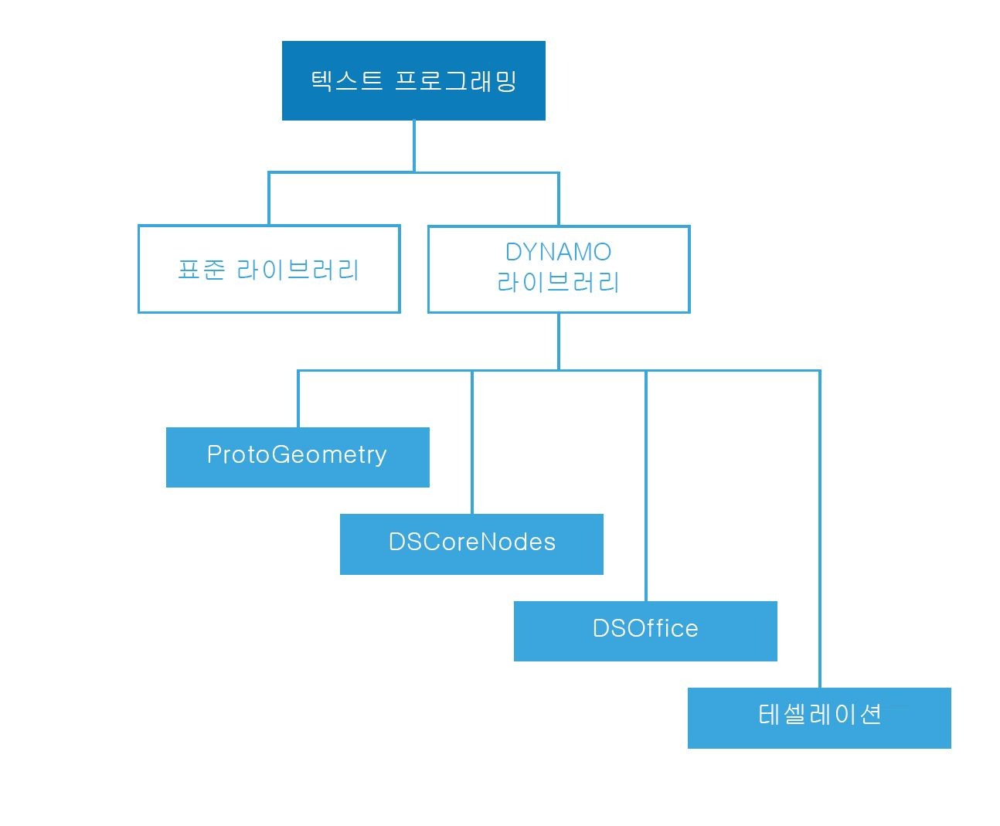

## 스크립팅 참조

이 참조 페이지에서는 코드 라이브러리, 레이블 지정 및 스타일 지정에 대한 보다 자세한 내용을 통해 스크립팅 전략에서 다루는 모범 사례를 확장합니다. 아래에서는 Python을 사용하여 개념을 설명할 텐데, 동일한 원칙이 Python 및 C#(Zerotouch)에도 적용되지만 이때 구문은 다릅니다.

### 사용할 라이브러리

표준 라이브러리는 Dynamo 외부에 있으며 프로그래밍 언어 Python 및 C#(Zerotouch)에 있습니다. Dynamo에는 노드 계층에 바로 해당되는 고유한 라이브러리 세트도 있으므로, 사용자는 노드 및 와이어로 만들 수 있는 모든 요소를 코드에서 만들 수 있습니다. 아래에는 각 Dynamo 라이브러리를 통해 액세스할 수 있는 항목과 표준 라이브러리를 사용해야 하는 경우에 대한 지침이 나와 있습니다.



**표준 라이브러리 및 Dynamo 라이브러리**

* Python 및 C#의 표준 라이브러리를 사용하여 Dynamo 환경에서 고급 데이터 및 흐름 구조를 만들 수 있습니다.
* Dynamo 라이브러리는 형상 및 기타 Dynamo 객체를 작성하기 위한 노드 계층 구조에 바로 해당됩니다.

**Dynamo 라이브러리**

* ProtoGeometry
  * 기능: 호, 경계 상자, 원, 원추, 좌표계, 직육면체, 곡선, 원통, 모서리, 타원, 타원 호, 면, 형상, 나선, 색인 그룹, 선, 메쉬, NURBS 곡선, NURBS 표면, 평면, 점, 다각형, 직사각형, 솔리드, 구, 표면, 위상, TSpline, UV, 벡터, 정점
  * 가져오는 방법: ```import Autodesk.DesignScript.Geometry```
  * **Python 또는 C#을 통해 ProtoGeometry를 사용할 때** 비관리형 객체를 작성하는 경우에는 해당 메모리를 수동으로 관리해야 합니다. 자세한 내용은 아래의 **비관리형 객체**를 참고하십시오.

* DSCoreNodes
  * 기능: 색상, 색상 범위 2D, 날짜 시간, 시간 간격, IO, 수식, 논리, 리스트, 수학, 쿼드 트리, 문자열, 스레드
  * 가져오는 방법: ```import DSCore```

* 테셀레이션
  * 기능: 볼록 헐, Delaunay, Voronoi.
  * 가져오는 방법: ```import Tessellation```

* DSOffice
  * 기능: Excel
  * 가져오는 방법: ```import DSOffice```

### 신중하게 레이블 지정하기

스크립팅하는 동안 우리는 변수, 유형, 함수, 기타 도면요소 등을 나타내기 위해 끊임없이 식별자를 사용합니다. 이러한 기호 표기 체계를 통해 알고리즘을 만들면 일반적으로 일련의 문자로 구성되어 있는 레이블을 통해 정보를 편리하게 참조할 수 있습니다. 명명 작업은 나중에 자신 및 다른 사람이 쉽게 읽고 이해할 수 있는 코드를 작성하는 데 매우 중요한 역할을 합니다. 다음은 스크립트에서 항목을 명명할 때 기억해야 할 몇 가지 팁입니다.

**약어를 사용해도 좋지만 해설에 약어에 대한 설명을 포함합니다.**

```
### BAD
csfX = 1.6
csfY= 1.3
csfZ = 1.0
```

```
### GOOD
# column scale factor (csf)
csfX = 1.6
csfY= 1.3
csfZ = 1.0
```

**중복된 레이블을 지정하지 않도록 합니다.**

```
### BAD
import car
seat = car.CarSeat()
tire = car.CarTire()
```

```
### GOOD
import car
seat = car.Seat()
tire = car.Tire()
```

**변수 이름에는 부정 논리 대신 긍정 논리를 사용합니다.**

```
### BAD
if 'mystring' not in text:
print 'not found'
else:
print 'found'
print 'processing'
```

```
### GOOD
if 'mystring' in text:
print 'found'
print 'processing'
else:
print 'not found'
```

**기본적으로 "역방향 표기"를 사용합니다.**

```
### BAD
agents = …
active_agents = …
dead_agents ...
```

```
### GOOD
agents = …
agents_active = …
agents_dead = ...
```

> 이 방식이 구조적 측면에서 좀 더 적합합니다.

**별칭을 사용하여 지나치게 길고 자주 반복되는 체인을 줄입니다.**

```
### BAD
from RevitServices.Persistence import DocumentManager

DocumentManager = DM

doc = DM.Instance.CurrentDBDocument
uiapp = DM.Instance.CurrentUIApplication
```

```
### GOOD
from RevitServices.Persistence import DocumentManager as DM

doc = DM.Instance.CurrentDBDocument
uiapp = DM.Instance.CurrentUIApplication
```

> 별칭을 지정하면 곧 매우 혼란스러운 비표준 프로그램이 작성될 수 있습니다.

**필요한 단어만 사용합니다.**

```
### BAD
rotateToCoord = rotateFromCoord.Rotate(solid.ContextCoordinateSystem.Origin,Vector.ByCoordinates(0,0,1),5)
```

```
### GOOD
toCoord = fromCoord.Rotate(solid.ContextCoordinateSystem.Origin,Vector.ByCoordinates(0,0,1),5)
```

> “모든 것은 가능한 한 간단하게 만들어야 하지만, 너무 간단해서는 안 된다.” - Albert Einstein

### 일관된 스타일 지정하기

일반적으로, 프로그래밍 방법에는 몇 가지가 있습니다. 따라서 "개인적인 스크립팅 스타일"이란 자신이 도중에 수없이 많은 작은 결정을 선택하거나 선택하지 않은 결과입니다. 즉, 코드의 가독성과 유지 관리성은 내부 일관성과 일반적인 스타일 규칙 준수에 따른 직접적인 결과입니다. 경험상, 두 위치에서 동일하게 보이는 코드는 동일하게 작동합니다. 다음은 명확하고 일관된 코드를 작성하기 위한 몇 가지 팁입니다.

**명명 규칙:** 코드의 각 엔티티 유형에 대해 아래의 규칙 중 하나를 선택하고 선택한 규칙을 준수하십시오.

* 변수, 함수, 메서드, 패키지, 모듈:
`lower_case_with_underscores`

* 클래스 및 예외:
`CapWords`

* 보호된 메서드 및 내부 함수:
`_single_leading_underscore(self, ...)`

* 전용 메서드:
`__double_leading_underscore(self, ...)`

* 상수:
`ALL_CAPS_WITH_UNDERSCORES`

> 팁: 아주 짧은 블록에서 해당 컨텍스트를 통해 의미를 명확히 알 수 있는 경우를 제외하고는 단일 문자 변수(특히 l, O, I)를 사용하지 마십시오.

**빈 줄 사용:**

* 최상위 함수와 클래스 정의를 두 개의 빈 줄로 묶습니다.

  * 클래스 내부의 메서드 정의는 1개의 빈 줄로 묶습니다.

  * 드문 경우지만 빈 줄을 추가로 사용하여 관련 함수의 그룹을 구분할 수 있습니다.

**불필요한 공백 방지:**

* 괄호, 대괄호 또는 중괄호의 안:

```
### BAD
function( apples[ 1 ], { oranges: 2 } )
```

```
### GOOD:
function(apples[1], {oranges: 2})
```

* 쉼표, 세미콜론 또는 콜론의 바로 앞:

```
### BAD
if x == 2 : print x , y ; x , y = y , x
```

```
### GOOD
if x == 2: print x, y; x, y = y, x
```

* 함수 호출의 인수 리스트가 시작되는 여는 괄호의 바로 앞:

```
### BAD
function (1)
```

```
### GOOD
function(1)
```

* 색인화 또는 분할이 시작되는 여는 괄호의 바로 앞:

```
### BAD
dict ['key'] = list [index]
```

```
### GOOD
dict['key'] = list[index]
```

* 항상 이러한 바이너리 연산자 한쪽에 1개의 공백을 둡니다.

```
assignment ( = )
augmented assignment ( += , -= etc.)
comparisons ( == , < , > , != , <> , <= , >= , in , not in , is , is not )
Booleans ( and , or , not )
```

**줄 길이 감시:**

* 79자만 넘지 않으면 문제가 없습니다.

* 필요한 편집기 창의 폭을 제한하면 여러 파일을 나란히 열어 둘 수 있으며, 이 방법은 인접한 열에 두 버전이 있는 코드 검토 도구를 사용할 때 유용합니다.

* 긴 줄의 경우 표현식을 괄호로 묶어 여러 줄로 나눌 수 있습니다.

**명백한 내용으로 중복되는 해설 방지:**

* 해설이 적어야 코드를 읽기 쉬운 경우도 있습니다. 특히 의미 있는 기호 이름을 대신 사용해야 하는 경우 더욱 그렇습니다.

* 좋은 코딩 습관을 들이면 해설에 대한 의존도가 줄어듭니다.

```
### BAD
# get the country code
country_code = get_country_code(address)

# if country code is US
if (country_code == 'US'):
# display the form input for state
print form_input_state()
```

```
### GOOD
# display state selection for US users
country_code = get_country_code(address)
if (country_code == 'US'):
print form_input_state()
```

> 팁: 해설에서는 이유를 알려주고 코드에서는 방법을 알려줍니다.

**오픈 소스 코드 확인:**

* 오픈 소스 프로젝트는 많은 개발자가 함께 만드는 것입니다. 이러한 프로젝트는 팀이 가능한 한 효율적으로 함께 작업할 수 있도록 높은 수준의 코드 가독성을 유지해야 합니다. 따라서 해당 프로젝트의 소스 코드를 살펴보면서 이러한 개발자들이 어떤 작업을 하고 있는지 관찰하는 것이 좋습니다.

* 규칙 개선:

  * 각 규칙이 현재의 필요에 맞게 작동하고 있는지를 질문합니다.

  * 기능/효율성이 저하되고 있습니까?

### C#(Zerotouch) 표준

**Zerotouch용 C#을 작성하고 Dynamo에 기여하기 위한 지침을 보려면 다음과 같은 Wiki 페이지를 확인하십시오.**

  * 다음 Wiki에서는 코드 문서화 및 테스트를 위한 몇 가지 일반적인 코딩 표준에 대해 설명합니다. [https://github.com/DynamoDS/Dynamo/wiki/Coding-Standards](https://github.com/DynamoDS/Dynamo/wiki/Coding-Standards)

  * 다음 Wiki에서는 특히 라이브러리, 카테고리, 노드 이름, 포트 이름 및 약어에 대한 명명 표준을 다룹니다. [https://github.com/DynamoDS/Dynamo/wiki/Naming-Standards](https://github.com/DynamoDS/Dynamo/wiki/Naming-Standards)

  **비관리형 객체:**

  사용자가 작성한 Python 또는 C# 형상 객체의 Dynamo 형상 라이브러리*(ProtoGeometry)*를 사용하는 과정을 가상 컴퓨터에서 관리하지 않고 이러한 여러 객체의 메모리를 수동으로 정리해야 하는 경우를 나타냅니다. 기본 또는 비관리형 객체를 정리하려면 **Dispose** 메서드 또는 **using** 키워드를 사용하면 됩니다. 개요를 보려면 다음 Wiki 항목을 참고하십시오. [https://github.com/DynamoDS/Dynamo/wiki/Zero-Touch-Plugin-Development#dispose--using-statement](https://github.com/DynamoDS/Dynamo/wiki/Zero-Touch-Plugin-Development#dispose--using-statement)

  그래프로 반환하지 않거나 참조를 저장하지 않는 비관리형 리소스만 제거하면 됩니다. 이 섹션의 나머지 부분에서는 이러한 객체를 *중간 형상*이라고 부르겠습니다. 아래의 코드 예시에서는 이 객체 클래스의 예를 확인할 수 있습니다. 이 zero touch C# 함수 **singleCube**는 단일 정육면체를 반환하지만 실행 중에 10,000개의 추가 정육면체를 작성합니다. 이러한 다른 형상이 중간 구성 형상으로 사용된 것처럼 가장할 수 있습니다.

  **이 zero touch 함수는 Dynamo와 충돌할 가능성이 높습니다.** 10,000개의 솔리드를 작성했지만 그중 하나만 저장하고 반환했습니다. 대신, 반환하는 항목을 제외한 모든 중간 정육면체를 제거해야 합니다. 반환하는 항목은 그래프로 전파되어 다른 노드에서 사용되므로 제거하지 않을 것입니다.

```
public Cuboid singleCube(){

var output = Cuboid.ByLengths(1,1,1);

for(int i = 0; i<10000;i++){
output = Cuboid.ByLengths(1,1,1);
}
return output;
}
```

수정된 코드는 다음과 같습니다.

```
public Cuboid singleCube(){

var output = Cuboid.ByLengths(1,1,1);
var toDispose = new List<Geometry>();

for(int i = 0; i<10000;i++){
toDispose.Add(Cuboid.ByLengths(1,1,1));
}

foreach(IDisposable item in toDispose ){
item.Dispose();
}

return output;
}
```

일반적으로 ```Surfaces```, ```Curves``` 및 ```Solids```와 같은 형상만 제거하면 됩니다. 그러나 안전하게 모든 형상 유형(```Vectors```, ```Points```, ```CoordinateSystems```)을 제거해도 됩니다.

