

# 노드의 색인

##### 이 색인에서는 이 Primer에 사용된 모든 노드 및 기타 유용할 수 있는 구성요소에 대한 추가 정보를 제공합니다. 여기에는 Dynamo에서 사용할 수 있는 500개의 노드 중 일부만 소개되어 있습니다.

## Bulitin 함수

||||
| -- | -- | -- |
||**개수** 지정된 리스트의 항목 수를 반환합니다.||
||**평면화** 다차원 입력 리스트의 단순화된 1D 리스트를 반환합니다.||
||**지도** 값을 입력 범위로 매핑합니다.||

## 코어

#### Core.Color

||||
| -- | -- | -- |
||작성||
||**Color.ByARGB** 알파, 빨간색, 녹색, 파란색 구성요소로 색상을 구성합니다.||
||**색상 범위** 시작 색상과 끝 색상 간의 색상 그라데이션에서 색상을 가져옵니다.||
||작업||
||**Color.Brightness** 이 색상의 밝기 값을 가져옵니다.||
||**Color.Components** 색상의 구성요소를 알파, 빨간색, 녹색, 파란색의 순서로 나열합니다.||
||**Color.Saturation** 이 색상의 채도 값을 가져옵니다.||
||**Color.Hue** 이 색상의 색조 값을 가져옵니다.||
||조회||
||**Color.Alpha** 색상의 알파 구성요소를 찾습니다(0~255).||
||**Color.Blue** 색상의 파란색 구성요소를 찾습니다(0~255).|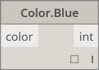|
||**Color.Green** 색상의 녹색 구성요소를 찾습니다(0~255).||
||**Color.Red** 색상의 빨간색 구성요소를 찾습니다(0~255).||

#### Core.Display

||||
| -- | -- | -- |
||작성||
|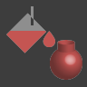|**Display.ByGeometryColor** 색상을 사용하여 형상을 표시합니다.||

#### Core.Input

||||
| -- | -- | -- |
||작업||
||**부울** True와 False 사이에서 선택합니다.|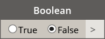|
||**코드 블록** DesignScript 코드를 직접 작성할 수 있습니다.||
||**디렉토리 경로** 시스템에서 디렉토리를 선택하여 디렉토리 경로를 가져올 수 있습니다.||
||**파일 경로** 시스템에서 파일을 선택하여 파일 이름을 가져올 수 있습니다.||
||**정수 슬라이더** 정수 값을 생성하는 슬라이더입니다.||
||**번호**  숫자를 작성합니다.||
||**번호 슬라이더**  숫자 값을 생성하는 슬라이더입니다.||
||**문자열** 문자열을 작성합니다.||

#### Core.List

||||
| -- | -- | -- |
||작성||
||**List.Create** 지정된 입력에서 새 리스트를 작성합니다.||
||**List.Combine** 두 시퀀스의 각 요소에 연결자를 적용합니다.||
|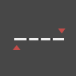|**숫자 범위** 지정된 범위에서 숫자의 시퀀스를 작성합니다.||
||**숫자 시퀀스** 숫자의 시퀀스를 작성합니다.||
||작업||
||**List.Chop** 리스트를 각각 지정된 양의 항목이 포함된 리스트 세트로 자릅니다.||
||**List.Count** 지정된 리스트에 저장된 항목의 개수를 가져옵니다.||
||**List.Flatten** 리스트의 내포된 리스트를 특정한 양만큼 단순화합니다.||
||**List.FilterByBoolMask** 별도의 부울 리스트에서 해당하는 인덱스를 조회하여 시퀀스를 필터링합니다.||
||**List.GetItemAtIndex** 지정된 색인에 위치하는 지정된 리스트에서 항목을 가져옵니다.||
||**List.Map** 리스트의 모든 요소에 함수를 적용하고 결과에서 새 리스트를 생성합니다.||
||**List.Reverse** 지정된 리스트의 항목이 역순으로 포함된 새 리스트를 작성합니다.||
||**List.ReplaceItemAtIndex** 지정된 인덱스에 위치한 지정된 리스트에서 항목을 대체합니다.||
||**List.ShiftIndices** 리스트의 인덱스를 지정된 수만큼 오른쪽으로 이동합니다.||
||**List.TakeEveryNthItem** 지정된 리스트에서 지정된 간격띄우기 이후 지정된 값의 배수인 인덱스의 항목을 가져옵니다.|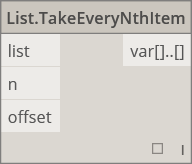|
||**List.Transpose** 리스트의 리스트에서 행과 열을 교체합니다. 다른 행보다 짧은 행이 몇 개 있을 경우 null 값이 결과 배열에 자리 표시자로 삽입되어 항상 직사각형이 되도록 합니다.||

#### Core.Logic

||||
| -- | -- | -- |
||작업||
||**If** 조건문입니다. 테스트 입력의 부울 값을 확인합니다. 테스트 입력이 true인 경우 결과에서 true 입력을 출력하고, 그렇지 않은 경우 결과에서 false 입력을 출력합니다.||

#### Core.Math

||||
| -- | -- | -- |
||작업||
||**Math.Cos** 각도의 코사인 값을 계산합니다.||
||**Math.DegreesToRadians** 도 각도를 라디안 각도로 변환합니다.||
|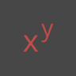|**Math.Pow** 숫자를 지정된 멱 수만큼 제곱합니다.||
||**Math.RadiansToDegrees** 라디안 각도를 도 각도로 변환합니다.||
||**Math.RemapRange** 분포 비율을 유지하면서 숫자 리스트의 범위를 조정합니다.||
||**Math.Sin** 각도의 사인을 계산합니다.||

#### Core.Object

||||
| -- | -- | -- |
||작업||
||**Object.IsNull** 지정된 객체가 null인지 확인합니다.||

#### Core.Scripting

||||
| -- | -- | -- |
||작업||
||**공식** 수학 공식을 계산합니다. 평가에 NCalc를 사용합니다. [http://ncalc.codeplex.com](http://ncalc.codeplex.com)을 참조하십시오.||

#### Core.String

||||
| -- | -- | -- |
||작업||
||**String.Concat** 여러 문자열을 하나의 문자열로 연결합니다.||
||**String.Contains** 지정된 문자열에 지정된 하위 문자열이 포함되어 있는지 확인합니다.||
||**String.Join** 결합되는 각 문자열 사이에 지정된 구분자를 삽입하여, 여러 문자열을 하나의 문자열로 연결합니다.||
||**String.Split** 단일 문자열을 지정된 구분 문자열을 사용하여 문자열 리스트로 구분합니다.||
||**String.ToNumber** 문자열을 정수 또는 double 값으로 변환합니다.||

#### Core.View

||||
| -- | -- | -- |
||작업||
||**View.Watch** 노드의 출력을 시각화합니다.||
||**View.Watch 3D** 형상의 동적 미리보기를 표시합니다.|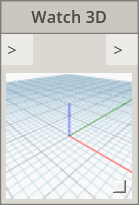|

## 지오메트리

#### Geometry.Circle

||||
| -- | -- | -- |
||작성||
||**Circle.ByCenterPointRadius** 표준 XY 평면의 입력 중심점과 반지름을 사용하고 표준 Z를 법선으로 사용하여 원을 작성합니다.||
||**Circle.ByPlaneRadius** 입력 평면 원점(루트)을 중심으로 지정된 반지름을 사용하여 입력 평면에 원을 작성합니다.||

#### Geometry.CoordinateSystem

||||
| -- | -- | -- |
||작성||
||**CoordinateSystem.ByOrigin** 입력 점을 원점으로 하고 X 및 Y축이 WCS X 및 Y축으로 설정된 CoordinateSystem을 작성합니다.||
||**CoordinateSystem.ByCyclindricalCoordinates** 지정된 좌표계를 기준으로 지정된 원통형 좌표 매개변수에서 CoordinateSystem을 작성합니다.||

#### Geometry.Cuboid

||||
| -- | -- | -- |
||작성||
||**Cuboid.ByLengths**(원점) 입력 점을 중심으로 지정된 폭, 길이, 높이의 직육면체를 작성합니다.||

#### Geometry.Curve

||||
| -- | -- | -- |
||작업||
||**Curve.Extrude**(거리) 곡선을 법선 벡터 방향으로 돌출시킵니다.||
||**Curve.PointAtParameter** StartParameter() 및 EndParameter() 사이의 지정된 매개변수에서 곡선상의 점을 가져옵니다.||

#### Geometry.Geometry

||||
| -- | -- | -- |
||작업||
||**Geometry.DistanceTo** 이 형상에서 다른 형상까지의 거리를 가져옵니다.||
||**Geometry.Explode** 복합 또는 분리되지 않은 요소를 구성요소 부품으로 분리합니다.||
||**Geometry.ImportFromSAT** 가져온 형상 리스트입니다.||
||**Geometry.Rotate**(basePlane) 객체를 평면 원점 및 법선 주위로 지정된 각도만큼 회전합니다.||
||**Geometry.Translate** 형상 유형을 지정된 방향으로 지정된 거리만큼 변환합니다.||

#### Geometry.Line

||||
| -- | -- | -- |
||작성||
||**Line.ByBestFitThroughPoints** 점의 산점도에 가장 가까운 선을 작성합니다.||
||**Line.ByStartPointDirectionLength** 점에서 시작하여 벡터 방향으로 지정된 길이만큼 연장되는 직선을 작성합니다.||
||**Line.ByStartPointEndPoint** 두 입력 점 사이에 직선을 작성합니다.||
||**Line.ByTangency** 입력 곡선의 매개변수 점에서 입력 곡선에 접하는 선을 작성합니다.||
||조회||
||**Line.Direction** 곡선 방향입니다.|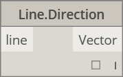|

#### Geometry.NurbsCurve

||||
| -- | -- | -- |
||작성||
||**NurbsCurve.ByControlPoints** 명시적 제어점을 사용하여 BSplineCurve를 작성합니다.|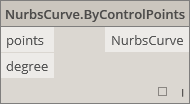|
||**NurbsCurve.ByPoints** 점 사이를 보간하여 BSplineCurve를 작성합니다.|qcomm|

#### Geometry.NurbsSurface

||||
| -- | -- | -- |
||작성||
||**NurbsSurface.ByControlPoints** 명시적 제어점과 지정된 U 및 V 각도를 사용하여 NurbsSurface를 작성합니다.||
||**NurbsSurface.ByPoints** 지정된 보간 점과 U 및 V 각도를 사용하여 NurbsSurface를 작성합니다. 결과 표면은 모든 점을 통과합니다.||

#### Geometry.Plane

||||
| -- | -- | -- |
||작성||
||**Plane.ByOriginNormal** 루트 점을 중심으로 입력 법선 벡터를 사용하여 평면을 작성합니다.||
||**Plane.XY** 표준 XY 평면에 평면을 작성합니다.||

#### Geometry.Point

||||
| -- | -- | -- |
||작성||
||**Point.ByCartesianCoordinates** 3개의 데카르트 좌표를 사용하여 지정된 좌표계에서 점을 형성합니다.||
||**Point.ByCoordinates**(2D)  지정된 2개의 데카르트 좌표를 사용하여 XY 평면에 점을 형성합니다. Z 구성요소는 0입니다.||
||**Point.ByCoordinates**(3D) 지정된 3개의 데카르트 좌표를 사용하여 점을 형성합니다.||
||**Point.Origin** 원점(0,0,0)을 가져옵니다.||
||작업||
||**Point.Add** 점에 벡터를 추가합니다. Translate(벡터)과 같습니다.||
||조회||
||**Point.X** 점의 X 구성요소를 가져옵니다.||
||**Point.Y** 점의 Y 구성요소를 가져옵니다.||
||**Point.Z** 점의 Z 구성요소를 가져옵니다.||

#### Geometry.Polycurve

||||
| -- | -- | -- |
||작성||
||**Polycurve.ByPoints** 점을 연결하는 일련의 선에서 PolyCurve를 작성합니다. 닫힌 곡선의 경우 마지막 점은 시작점과 같은 위치에 있어야 합니다.|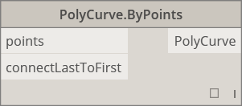|

#### Geometry.Rectangle

||||
| -- | -- | -- |
||작성||
||**Rectangle.ByWidthLength**(평면) 입력 평면 루트를 중심으로 입력 폭(평면 X축 길이)과 길이(평면 Y축 길이)를 사용하여 직사각형을 작성합니다.||

#### Geometry.Sphere

||||
| -- | -- | -- |
||작성||
||**Sphere.ByCenterPointRadius** 입력 점을 중심으로 지정된 반지름을 사용하여 솔리드 구를 작성합니다.|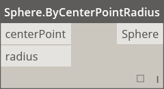|

#### Geometry.Surface

||||
| -- | -- | -- |
||작성||
||**Surface.ByLoft** 입력 횡단면 곡선 사이에서 로프트하여 표면을 작성합니다.||
||**Surface.ByPatch** 입력 곡선에 의해 정의된 닫힌 경계의 내부를 채워 표면을 작성합니다.||
||작업||
||**Surface.Offset** 표면의 간격을 표면 법선 방향으로 지정된 거리만큼 띄웁니다.||
||**Surface.PointAtParameter** 지정된 U 및 V 매개변수에서 점을 반환합니다.||
||**Surface.Thicken** 표면을 두껍게 하여 솔리드로 만들고, 표면의 양쪽에서 표면 법선 방향으로 돌출합니다.||

#### Geometry.UV

||||
| -- | -- | -- |
||작성||
||**UV.ByCoordinates** 두 double 값에서 UV를 작성합니다.||

#### Geometry.Vector

||||
| -- | -- | -- |
||작성||
||**Vector.ByCoordinates** 3개의 유클리드 좌표로 벡터를 형성합니다.||
||**Vector.XAxis** 표준 X축 벡터(1,0,0)를 가져옵니다.||
||**Vector.YAxis** 표준 Y축 벡터(0,1,0)를 가져옵니다.||
||**Vector.ZAxis** 표준 Z축 벡터(0,0,1)를 가져옵니다.||
||작업||
||**Vector.Normalized** 벡터의 정규화된 버전을 가져옵니다.||

## 연산자

||||
| -- | -- | -- |
||**+** 더하기||
||**-** 빼기||
||***** 곱하기|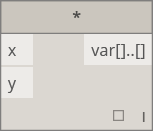|
||**/** 나누기||
||**%** 모듈 방식 분할에서는 두 번째 입력으로 나눈 후 첫 번째 입력의 나머지를 계산합니다.||
||**<** Less Than||
||**>** 보다 큼||
||**==** 두 값 간의 균일성에 대한 균일성 테스트입니다.|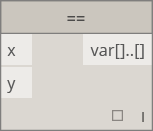|

