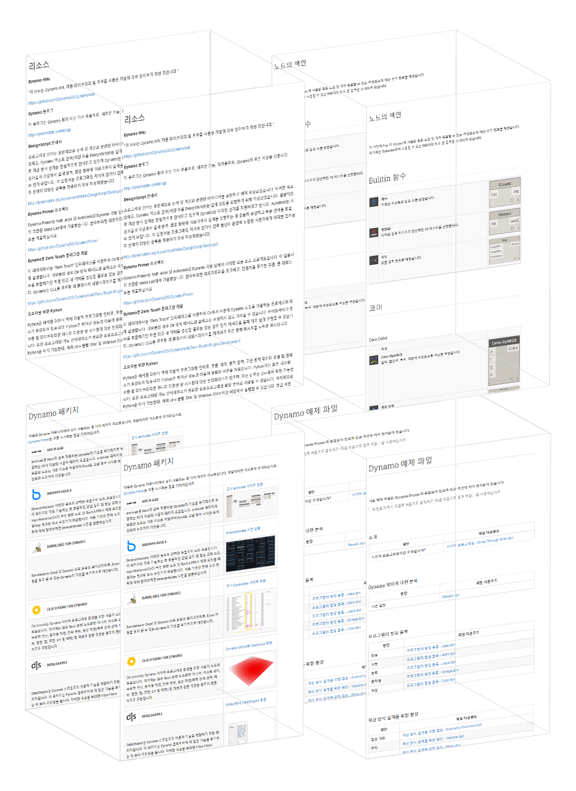

# 부록 A: 리소스

이 섹션에서는 Dynamo를 보다 유용하게 활용하기 위한 추가 리소스를 찾을 수 있습니다. 또한 중요 노드의 색인, 유용한 패키지 모음, 이 입문서에 포함된 예제 파일의 리포지토리도 추가해 두었습니다. [Dynamo Primer](https://github.com/DynamoDS/DynamoPrimer)는 오픈 소스이므로 이 섹션에 내용을 자유롭게 추가할 수 있습니다! 

