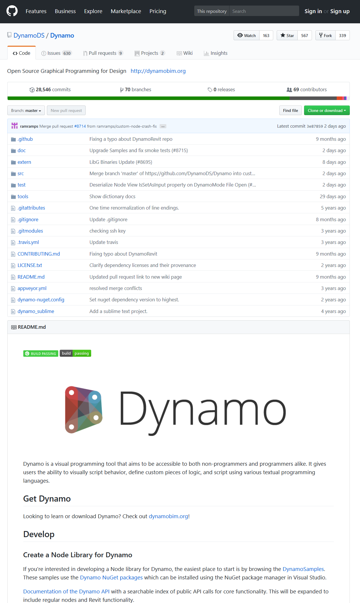

## Co to jest dodatek Dynamo?

Dodatek Dynamo będzie dosłownie tym, do czego zostanie zastosowany. Praca z dodatkiem Dynamo może obejmować korzystanie z aplikacji, zarówno w połączeniu z innym oprogramowaniem firmy Autodesk, jak i bez niego, używanie procesu programowania wizualnego lub uczestnictwo w szerokiej społeczności użytkowników i współpracowników.

### Aplikacja

Dodatek Dynamo to aplikacja, czyli oprogramowanie, które można pobrać i uruchomić w samodzielnym trybie „piaskownicy” (odizolowanym) lub jako wtyczkę do innego oprogramowania, takiego jak Revit lub Maya. Dodatek opisano jako:

> Narzędzie do programowania wizualnego, które ma być przystępne zarówno dla programistów, jak i osób niezajmujących się programowaniem zawodowo. Daje użytkownikom możliwość wizualnego skryptowania zachowania, definiowania niestandardowych elementów logiki i skryptowania przy użyciu różnych tekstowych języków programowania.


> 1. Zobacz dodatek Dynamo w działaniu z programem Revit
2. Pobierz instalator

### Proces

Po zainstalowaniu aplikacji dodatek Dynamo umożliwia pracę w procesie programowania wizualnego, w którym łączy się elementy, aby zdefiniować zależności i sekwencje działań składających się na algorytmy niestandardowe. Algorytmów można używać do tworzenia szerokiej gamy aplikacji — od przetwarzania danych po generowanie geometrii — wszystko to w czasie rzeczywistym i bez pisania jakiegokolwiek ```kodu```.


> Wystarczy dodać elementy, połączyć je i już można zacząć pracę nad programami wizualnymi.

### Społeczność

Dodatek Dynamo nie byłby tak przydatny bez silnej grupy aktywnych użytkowników i współtwórców. Przyłącz się do społeczności, obserwując blog, dodając swoje prace do galerii lub dyskutując na temat dodatku Dynamo na forum.


### Platforma

Dodatek Dynamo ma być narzędziem do programowania wizualnego dla projektantów, dzięki czemu pozwala tworzyć narzędzia, które korzystają z zewnętrznych bibliotek lub dowolnego produktu firmy Autodesk mającego interfejs API. Dzięki programowi Dynamo Studio można tworzyć programy w aplikacji w stylu „piaskownicy” — jednak ekosystem dodatku Dynamo wciąż rośnie.

Kod źródłowy projektu jest typu open source, co pozwala rozszerzać jego funkcjonalność bez ograniczeń. Zajrzyj na stronę tego projektu w serwisie GitHub — przejdź do części „Works in Progress”, aby przekonać się, jak użytkownicy dostosowują dodatek Dynamo.



> Przeglądaj, twórz odgałęzienia i rozpocznij rozszerzanie dodatku Dynamo stosownie do własnych potrzeb

