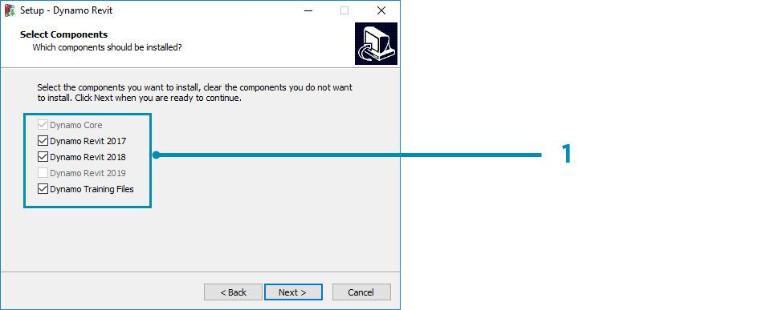
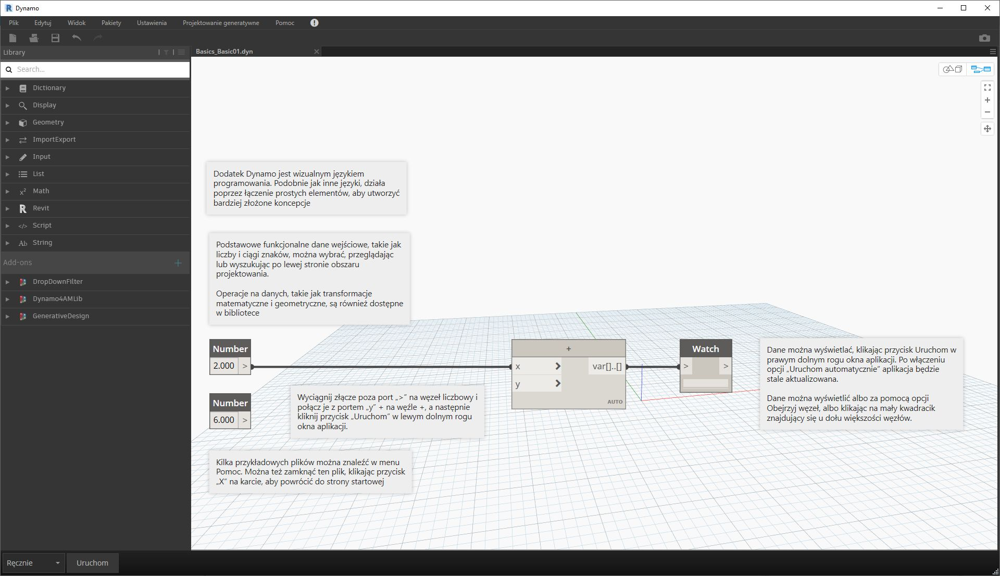

## Instalowanie i uruchamianie dodatku Dynamo

Dodatek Dynamo to aktywny projekt typu open source z dostępnymi do pobrania instalatorami w wersji zarówno oficjalnej, jak i wstępnej (tak zwane „codzienne kompilacje”). Pobierz oficjalną wersję dodatku, aby rozpocząć pracę, lub współtwórz dodatek Dynamo za pomocą codziennych kompilacji lub projektu w serwisie GitHub.

### Pobieranie

Aby pobrać oficjalną wersję dodatku Dynamo, odwiedź [witrynę internetową Dynamo](http://dynamobim.com/). Pobieranie można rozpocząć natychmiast, klikając pozycję na stronie głównej lub przechodząc do dedykowanej strony pobierania.

> 1. Obejrzyj nagranie wideo dotyczące projektowania obliczeniowego za pomocą dodatku Dynamo dla programu Architecture
2. Ewentualnie przejdź do strony pobierania

W tym miejscu można pobrać najświeższe, wciąż opracowywane wersje. Możesz też przejść do projektu [Dynamo w serwisie Github](https://github.com/DynamoDS/Dynamo).

> 1. Pobierz instalator wersji oficjalnej
2. Pobierz instalatory codziennych kompilacji
3. Wypróbuj pakiety niestandardowe od społeczności programistów
4. Zaangażuj się w rozwój dodatku Dynamo w serwisie GitHub

### Instalowanie

Przejdź do katalogu pobranego instalatora i uruchom plik wykonywalny. Podczas instalacji program instalacyjny umożliwia dostosowanie składników, które zostaną zainstalowane.

> 1. Wybierz składniki, które mają zostać zainstalowane.

W tym miejscu należy zdecydować, czy uwzględnić składniki łączące dodatek Dynamo z innymi zainstalowanymi aplikacjami, takimi jak Revit. Aby uzyskać więcej informacji na temat platformy Dynamo, zobacz **rozdział 1.2**.

### Uruchamianie

Aby uruchomić dodatek Dynamo, przejdź do folderu \Program Files\Dynamo\Dynamo Revit\x.y, a następnie wybierz plik DynamoSandbox.exe. Spowoduje to otwarcie wersji samodzielnej i wyświetlenie *strony początkowej * dodatku Dynamo. Na tej stronie widoczne są standardowe menu i pasek narzędzi, jak również zbiór skrótów, które zapewniają dostęp do funkcji plików i do dodatkowych zasobów.

> 1. Pliki — rozpocznij nowy pliku lub otwórz istniejący
2. Ostatnie — przewiń ostatnie pliki
3. Kopia zapasowa — uzyskaj dostęp do kopii zapasowych
4. Zapytaj — uzyskaj bezpośredni dostęp do forum użytkowników lub witryny dodatku Dynamo
5. Odniesienie — rozwiń umiejętności, korzystając z dodatkowych zasobów szkoleniowych
6. Kod — weź udział w projekcie typu open source
7. Przykłady — zapoznaj się z przykładami, które są dostarczone z instalacją

Otwórz pierwszy plik przykładowy, aby otworzyć pierwszy obszar roboczy i upewnić się, że dodatek Dynamo działa poprawnie. Kliknij kolejno opcje Przykłady > Podstawy > **Basics_Basic01.dyn**.

> 1. Potwierdź, że na pasku wykonywania jest wyświetlana informacja „Automatycznie”, lub kliknij przycisk Uruchom
2. Postępuj zgodnie z instrukcjami i połącz węzeł **Number** z węzłem **+**
3. Potwierdź, że ten węzeł Watch pokazuje wynik

Jeśli ten plik zostanie wczytany pomyślnie, powinno być możliwe uruchomienie pierwszego programu wizualnego za pomocą dodatku Dynamo.

