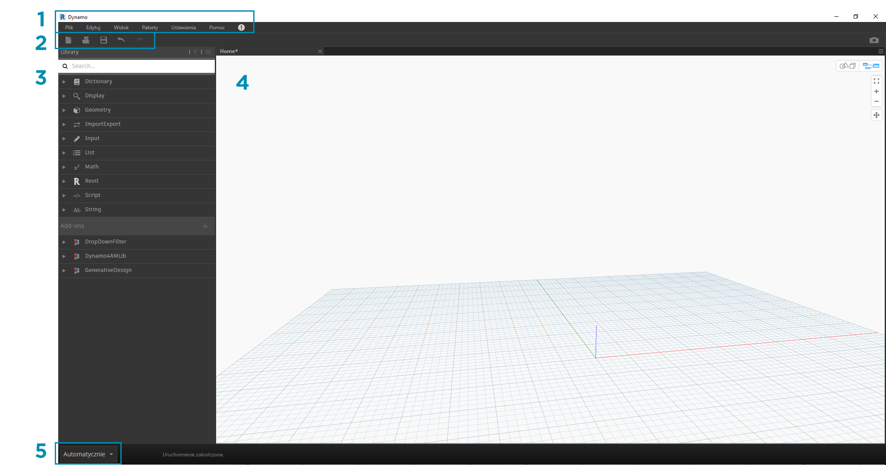
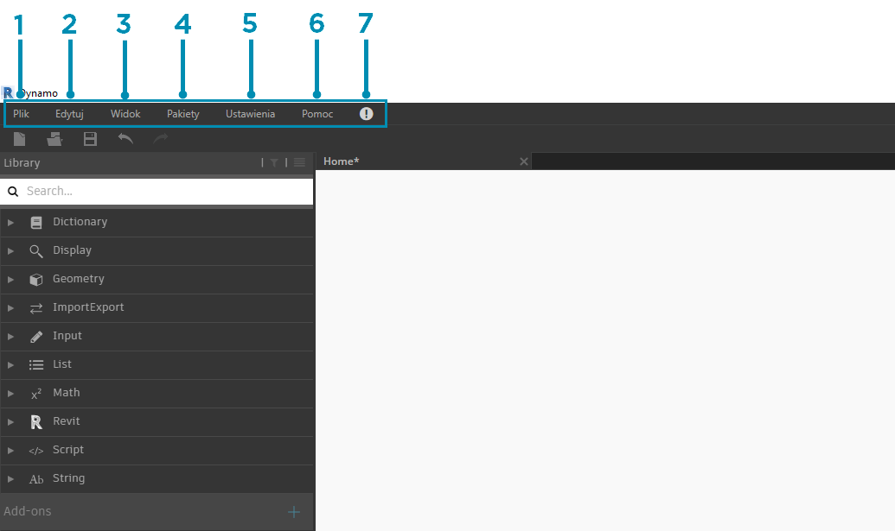
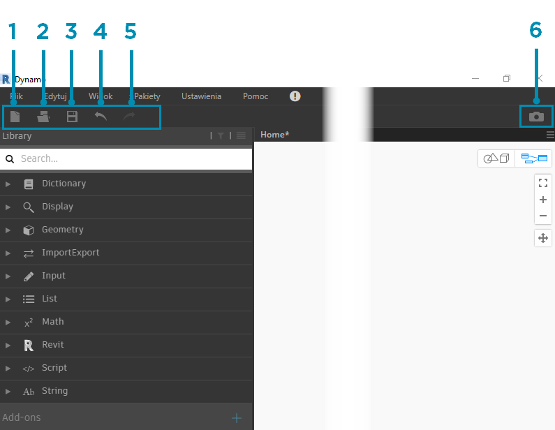
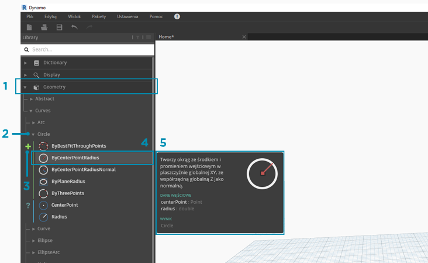
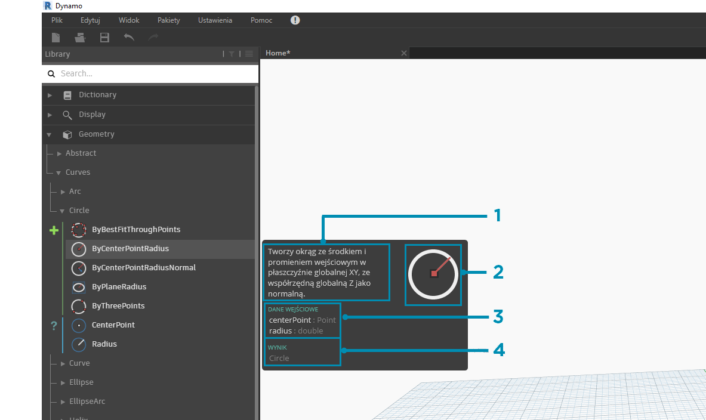
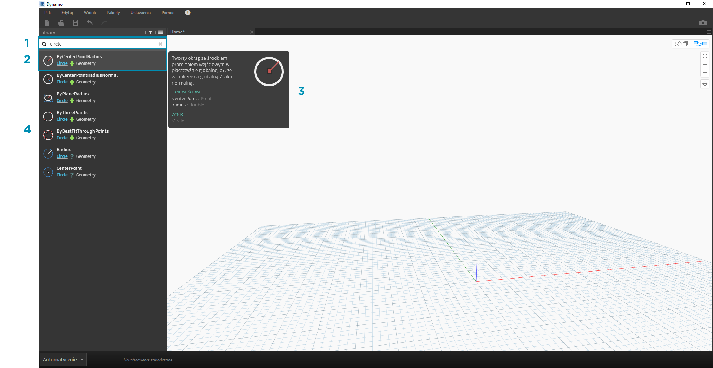
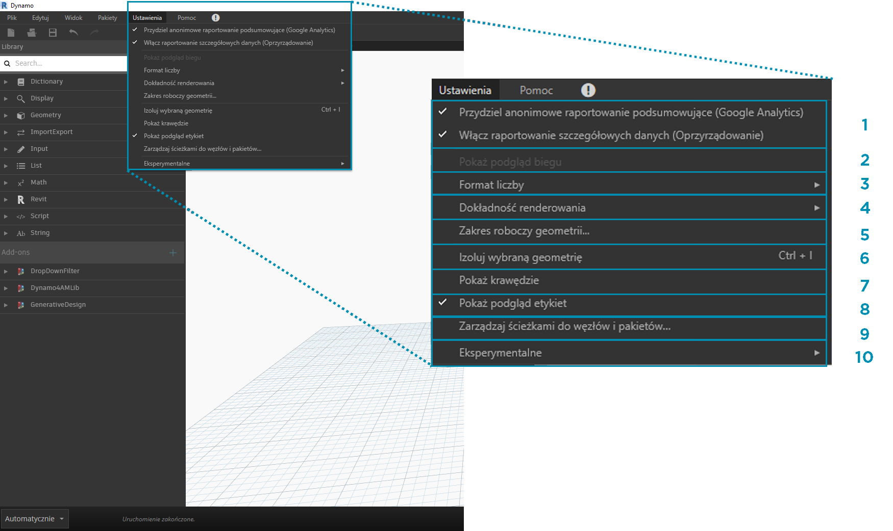
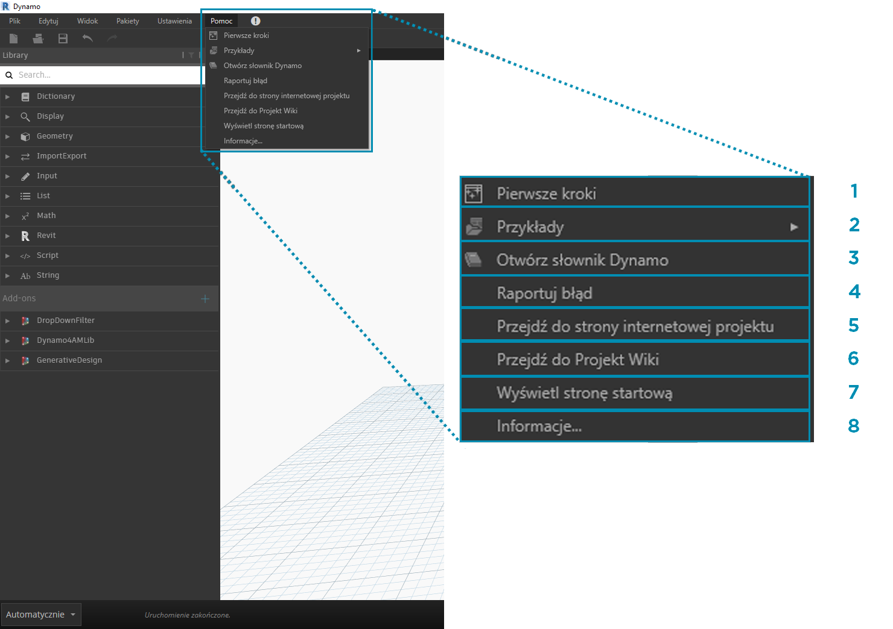

## Interfejs użytkownika dodatku Dynamo

Interfejs użytkownika (UI) dodatku Dynamo jest podzielony na pięć głównych regionów, z których największym jest obszar roboczy, w którym tworzone są programy wizualne.

> 1. Menu
2. Pasek narzędzi
3. Biblioteka
4. Obszar roboczy
5. Pasek uruchamiania

Przyjrzyjmy się dokładniej interfejsowi użytkownika i przeanalizujmy funkcje każdego regionu.

#### Menu

Menu rozwijane to doskonałe narzędzia pozwalające znaleźć niektóre podstawowe funkcje aplikacji Dynamo. Podobnie jak w większości programów systemu Windows, operacje związane z zarządzaniem plikami i operacjami dotyczącymi wyboru oraz edycji elementów znajdują się w dwóch pierwszych menu. Pozostałe menu są bardziej specyficzne dla dodatku Dynamo.

> 1. Plik
2. Edycja
3. Widok
4. Pakiety
5. Ustawienia
6. Pomoc
7. Powiadomienia

#### Pasek narzędzi

Pasek narzędzi Dynamo zawiera szereg przycisków umożliwiających szybki dostęp do plików oraz polecenia Cofnij [Ctrl+Z] i Ponów [Ctrl+Y]. Po skrajnej prawej stronie znajduje się kolejny przycisk, który umożliwia wyeksportowanie migawki obszaru roboczego. Jest on wyjątkowo przydatny do tworzenia dokumentacji i udostępniania.

> 1. Nowy — utwórz nowy plik .dyn
2. Otwórz — otwórz istniejący plik .dyn (obszar roboczy) lub .dyf (węzeł niestandardowy)
3. Zapisz/Zapisz jako — zapisz aktywny plik .dyn lub .dyf
4. Cofnij — cofnij ostatnią operację
5. Ponów — ponów następną operację
6. Eksportuj obszar roboczy jako obraz — eksportuj widoczny obszar roboczy jako plik PNG

#### Biblioteka

Biblioteka zawiera wszystkie wczytane węzły, w tym domyślne węzły dołączone do instalacji oraz dodatkowo wczytane węzły niestandardowe lub pakiety. Węzły w bibliotece są zorganizowane hierarchicznie w obrębie bibliotek, kategorii i, w razie potrzeby, podkategorii w zależności od tego, czy węzły **tworzą** dane, wykonują **operacje**, czy wysyłają **zapytania** dotyczące danych.

##### Przeglądanie

Domyślnie **Biblioteka** zawiera osiem kategorii węzłów. Menu **Podstawowe** i **Geometria** świetnie nadają się do rozpoczęcia przeglądania, ponieważ zawierają największą liczbę węzłów. Przeglądanie tych kategorii jest najszybszym sposobem zrozumienia hierarchii tego, co można dodać do obszaru roboczego, a także najlepszym sposobem odnajdowania nowych węzłów, których wcześniej nie używano.

> Teraz skupimy się na domyślnej kolekcji węzłów, ale później rozszerzymy tę bibliotekę za pomocą węzłów niestandardowych, dodatkowych bibliotek i menedżera pakietów.

> 1. Słownik
2. Widoczność
3. Geometria
4. Import/Eksport
5. Dane wejściowe
6. Lista
7. Pasuje
8. Revit
9. Pokaz
10. Ciąg
11. Dodatki

Przeglądaj bibliotekę, klikając różne menu. Kliknij kolejno opcje Geometria > Krzywe > Okrąg. Zwróć uwagę na nowo wyświetloną część menu, a w szczególności na etykiety **Utwórz** i **Zapytanie**.

> 1. Biblioteka
2. Kategoria
3. Podkategoria: Utwórz/Operacje/Zapytanie
4. Węzeł
5. Opis węzła i właściwości — te informacje są wyświetlane po najechaniu kursorem na ikonę węzła.

W tym samym menu Okrąg ustaw kursor myszy na pozycji **ByCenterPointRadius**. Okno zawiera bardziej szczegółowe informacje o węźle poza jego nazwą i ikoną. Dzięki temu można szybko zrozumieć, do czego służy węzeł, jakich wejść wymaga i jakie będą jego dane wyjściowe.

> 1. Opis — prosty opis węzła
2. Ikona — większa wersja ikony w menu Biblioteka
3. Wejścia — nazwa, typ danych i struktura danych
4. Wyjścia — typ danych i struktura

##### Wyszukiwanie

Jeśli dosyć dobrze wiadomo, jaki węzeł ma zostać dodany do obszaru roboczego, najlepiej skorzystać z pola **Wyszukaj**. Jeśli akurat nie edytuje się ustawień ani nie określa się wartości w obszarze roboczym, kursor zawsze znajduje się w tym polu. Po rozpoczęciu wpisywania biblioteka Dynamo wyświetli wybrane najlepsze dopasowanie (ze ścieżkami nawigacji, w których można znaleźć pozycję w kategoriach węzłów) i listę dodatkowych dopasowań dla wyszukiwania. Po naciśnięciu klawisza Enter lub kliknięciu elementu w przyciętej przeglądarce wyróżniony węzeł zostanie dodany do środka obszaru roboczego.

> 1. Pole wyszukiwania
2. Wynik będący najlepszym dopasowaniem (wybrany)
3. Dodatkowe dopasowania

### Ustawienia

Opcje od ustawień geometrycznych po ustawienia użytkownika można znaleźć w menu **Ustawienia**. W tym miejscu można wyłączyć udostępnianie danych użytkownika na potrzeby ulepszania dodatku Dynamo, jak również określić dokładność dziesiętną aplikacji i jakość renderingu geometrii.

> 1. Włączanie raportowania — opcje udostępniania danych użytkownika w celu ulepszania dodatku Dynamo.
2. Pokaż podgląd biegu — podgląd stanu wykonania wykresu. Węzły zaplanowane do wykonania zostaną wyróżnione na wykresie.
3. Opcje formatu liczb — zmień ustawienia dokumentu dla miejsc dziesiętnych.
4. Dokładność renderowania — podwyższ lub obniż jakość renderowania dokumentu.
5. Skalowanie geometrii — wybierz zakres geometrii, nad którą pracujesz.
6. Izoluj wybraną geometrię — izolowana geometria tła w oparciu o wybór węzła.
7. Pokaż/ukryj krawędzie geometrii — włącz/wyłącz krawędzie geometrii 3D.
8. Pokaż/ukryj podgląd etykiet — włącza lub wyłącza podgląd etykiet danych poniżej węzłów.
9. Zarządzaj ścieżkami do węzłów i pakietów — zarządzaj ścieżkami do plików, aby wyświetlać węzły i pakiety w bibliotece.
10. Włączanie funkcji eksperymentalnych — używaj nowych funkcji beta w dodatku Dynamo.

### Pomoc

Jeśli nie wiesz, co zrobić dalej, skorzystaj z menu **Pomoc**. W tym miejscu można znaleźć pliki przykładowe dołączone do instalacji, a także uzyskać dostęp do jednej z informacyjnych witryn internetowych dodatku Dynamo za pomocą przeglądarki internetowej. Jeśli to konieczne, sprawdź zainstalowaną wersję dodatku Dynamo i to, czy jest ona aktualna, za pomocą opcji **Informacje**.

> 1. Pierwsze kroki — krótkie wprowadzenie do korzystania z dodatku Dynamo.
2. Przykłady — informacyjne pliki przykładowe.
3. Otwórz słownik Dynamo — zasoby z dokumentacją dla wszystkich węzłów.
4. Zgłoś błąd — zgłoś problem w serwisie GitHub.
5. Przejdź do strony internetowej projektu — wyświetl projekt Dynamo w serwisie GitHub.
6. Przejdź do Projekt Wiki — odwiedź witrynę wiki, aby dowiedzieć się więcej na temat opracowywania rozwiązań za pomocą interfejsu API dodatku Dynamo, obsługi bibliotek i narzędzi.
7. Wyświetl stronę startową — wróć do strony startowej dodatku Dynamo z poziomu dokumentu.
8. Informacje — dane wersji dodatku Dynamo.

