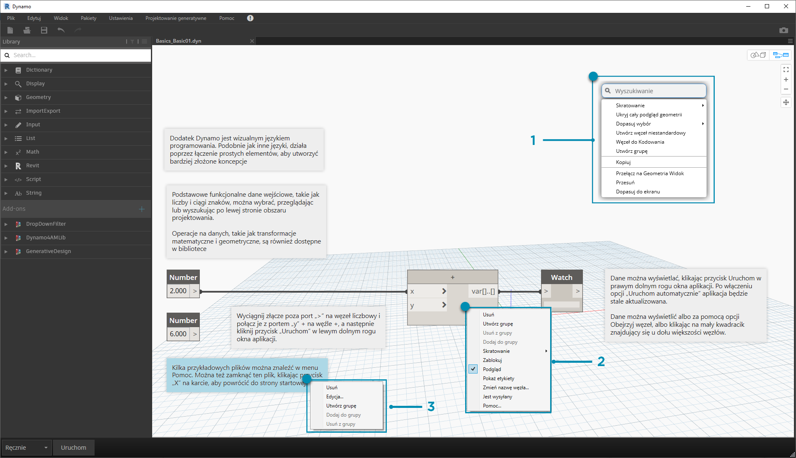
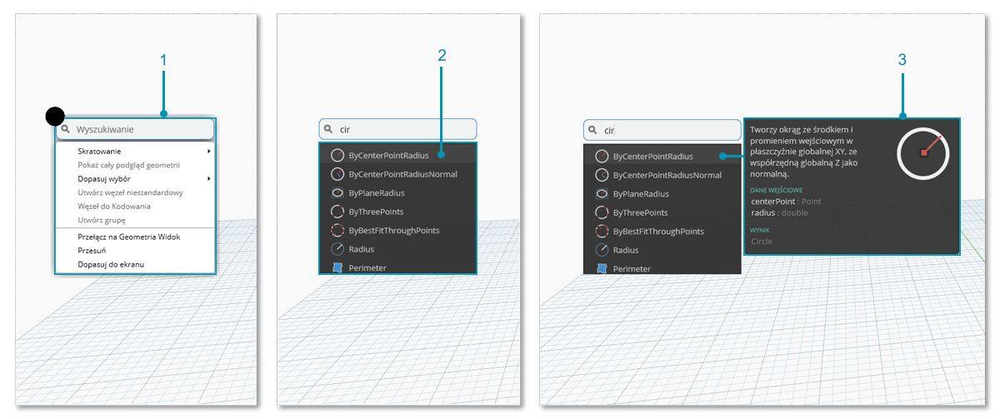

## Obszar roboczy

**Obszar roboczy** dodatku Dynamo to obszar, w którym opracowuje się programy wizualne, a także sprawdza się podgląd geometrii wynikowej. Niezależnie od tego, czy pracuje się w głównym obszarze roboczym, czy w węźle niestandardowym, można nawigować za pomocą myszy lub przycisków w prawym górnym rogu. Przełączanie się między trybami u dołu po prawej stronie pozwala przechodzić między podglądami, po których się nawiguje.

> Uwaga: węzły i geometria mają porządek rysowania, więc obiekty mogą być renderowane jeden na drugim. Może to być mylące podczas dodawania wielu kolejnych węzłów, ponieważ mogą one być renderowane w tym samym położeniu w obszarze roboczym.

> 1. Karty
2. Przyciski powiększania/przesuwania
3. Tryb podglądu
4. Kliknięcie dwukrotne obszaru roboczego

### Karty

Aktywna karta obszaru roboczego umożliwia nawigację i edycję programu. Po otwarciu nowego pliku domyślnie otwierany jest nowy **główny** obszar roboczy. Można również otworzyć nowy obszar roboczy **węzła niestandardowego** z menu Plik lub za pomocą dostępnej po kliknięciu prawym przyciskiem myszy opcji *Nowy węzeł według wyboru*, gdy są wybrane węzły (więcej o tej funkcji później).

> Uwaga: może być otwarty tylko jeden główny obszar roboczy jednocześnie, ale na dodatkowych kartach może być otwartych wiele obszarów roboczych węzłów niestandardowych.

### Nawigacja po podglądzie 3D i wykresach

W dodatku Dynamo w obszarze roboczym są renderowane zarówno wykres, jak i wyniki 3D wykresu (jeśli tworzymy geometrię). Domyślnie wykres jest aktywnym podglądem, więc używanie przycisków nawigacji lub środkowego przycisku myszy do przesuwania i powiększania powoduje nawigowanie po wykresie. Między aktywnymi podglądami można przełączać się na trzy sposoby:

> 1. Przyciski przełączania podglądu w obszarze roboczym
2. Kliknij prawym przyciskiem myszy w obszarze roboczym i wybierz opcję *Przełącz na ... Widok*
3. Skrót klawiaturowy (Ctrl+B)

Tryb nawigacji w podglądzie 3D umożliwia również **bezpośrednie manipulowanie** punktami, co zaprezentowano w części [Pierwsze kroki](http://primer.dynamobim.org/02_Hello-Dynamo/2-6_the_quick_start_guide.html).

### Powiększanie w celu ponownego wyśrodkowania

W trybie nawigacji w podglądzie 3D można łatwo przesuwać, powiększać i obracać modele. Aby jednak powiększyć konkretnie obiekt utworzony przez węzeł geometrii, można użyć ikony Powiększ wszystko z wybranym pojedynczym węzłem.

> 1. Wybierz węzeł odpowiadający geometrii, na której ma zostać wyśrodkowany widok.
2. Przełącz do nawigacji w podglądzie 3D.

> 1. Kliknij ikonę Powiększ wszystko znajdującą się w prawym górnym rogu.
2. Wybrana geometria zostanie wyśrodkowana w danym widoku.

### Używanie myszy

W zależności od tego, który tryb podglądu jest aktywny, przyciski myszy działają inaczej. Ogólnie rzecz biorąc: lewy przycisk myszy wybiera i określa wejścia, prawy — zapewnia dostęp do opcji, a środkowy — umożliwia nawigację w obszarze roboczym. Kliknięcie prawym przyciskiem myszy powoduje wyświetlenie opcji w zależności od miejsca kliknięcia.

> 1. Kliknij prawym przyciskiem myszy obszar roboczy.
2. Kliknij prawym przyciskiem myszy węzeł.
3. Kliknij prawym przyciskiem myszy uwagę.

Oto tabela interakcji myszy w podglądzie:

|**Operacja myszy**|**Podgląd wykresu**|**Podgląd 3D**|
| -- | -- | -- |
|Kliknięcie lewym przyciskiem myszy|Wybierz|Nie dotyczy|
|Kliknięcie prawym przyciskiem myszy|Menu kontekstowe|Opcje powiększenia|
|Kliknięcie środkowym przyciskiem myszy|Nowy fragment|Nowy fragment|
|Przewinięcie|Pomniejsz/powiększ|Pomniejsz/powiększ|
|Kliknij dwukrotnie|Utworzenie bloku kodu|Nie dotyczy|

### Wyszukiwanie w obszarze rysunku

Wyszukiwanie w obszarze rysunku znacznie przyspiesza przepływ roboczy dodatku Dynamo, zapewniając dostęp do opisów węzłów i etykiet narzędzi bez konieczności opuszczania bieżącego miejsca na wykresie. Kliknięcie prawym przyciskiem myszy pozwala uzyskać dostęp do wszystkich przydatnych funkcji wyszukiwania w bibliotece z dowolnego miejsca, w którym akurat pracuje się w obszarze rysunku.

> 1. Kliknij prawym przyciskiem myszy w dowolnym miejscu obszaru rysunku, aby wywołać funkcję wyszukiwania. Gdy pasek wyszukiwania jest pusty, menu rozwijane będzie menu podglądu.
2. Podczas wpisywania na pasku wyszukiwania menu rozwijane będzie aktualizowane w sposób ciągły, wyświetlając najtrafniejsze wyniki wyszukiwania.
3. Umieść kursor na wynikach wyszukiwania, aby wyświetlić odpowiednie opisy i etykiety narzędzi.

## Czyszczenie układu węzłów

Dbanie o organizację obszaru roboczego dodatku Dynamo staje się coraz ważniejsze wraz ze wzrostem złożoności plików. Mimo dostępności narzędzia **Dopasuj wybór** do pracy z niewielkimi liczbami wybranych węzłów dodatek Dynamo zawiera również narzędzie **Wyczyść układ węzłów**, które ułatwia ogólne czyszczenie plików.

#### Przed oczyszczeniem węzłów

> 1. Wybierz węzły, które mają zostać automatycznie zorganizowane, lub pozostaw wszystkie węzły niezaznaczone, aby wyczyścić wszystkie węzły w pliku.
2. Funkcja Wyczyść układ węzłów znajduje się na karcie Edycja.
#### Po oczyszczeniu węzłów

3. Węzły zostaną automatycznie ponownie rozmieszczone i wyrównane przez oczyszczenie wszystkich węzłów naprzemiennych lub nakładających się, a następnie przez dopasowanie ich do sąsiednich węzłów.

