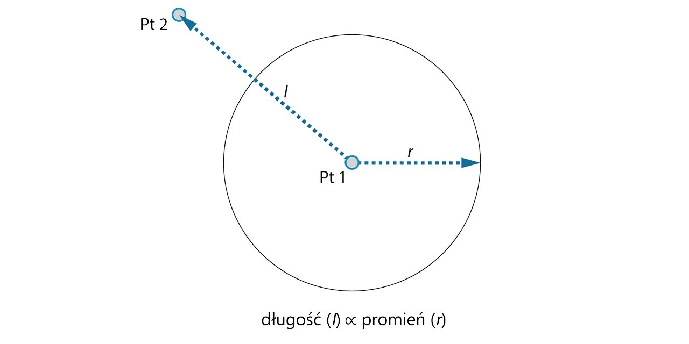
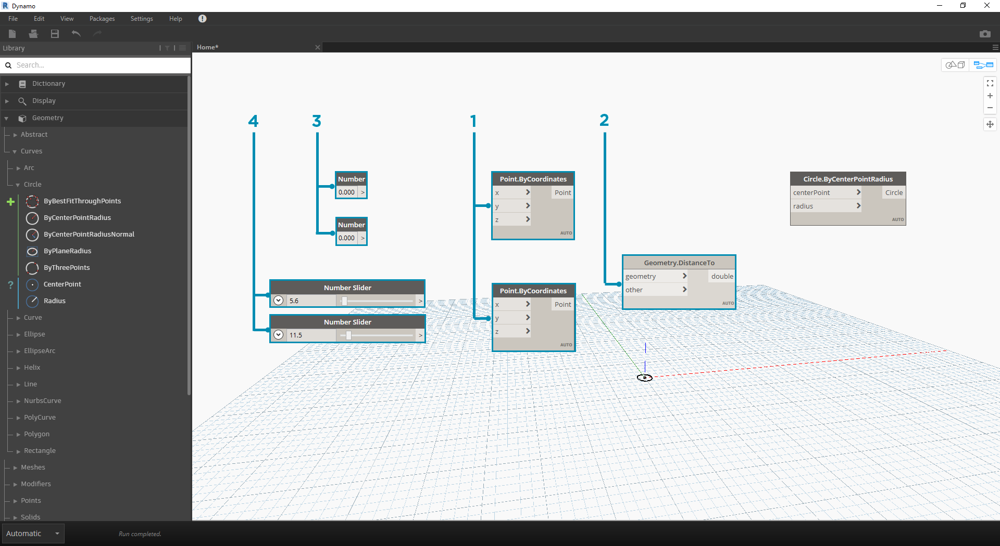

## PIERWSZE KROKI

Po zapoznaniu się z układem interfejsu i nawigowaniem po obszarze roboczym kolejnym etapem jest zapoznanie się z typowym procesem roboczym tworzenia wykresu w dodatku Dynamo. Zacznijmy od utworzenia okręgu o dynamicznym rozmiarze, a następnie utwórzmy szyk okręgów o różnych promieniach.

### Definiowanie celów i zależności

Zanim dodamy cokolwiek do obszaru roboczego dodatku Dynamo, konieczne jest pełne zrozumienie tego, co próbujemy osiągnąć i jakie będą znaczące zależności. Należy pamiętać, że zawsze gdy łączymy dwa węzły, tworzymy jawne łącze między nimi — później możemy zmienić przepływ danych, ale po ustanowieniu połączenia ta zależność pozostaje trwała. W tym ćwiczeniu chcemy utworzyć okrąg (*cel*), w przypadku którego wartość wejściowa promienia jest zdefiniowana za pomocą odległości od pobliskiego punktu (*zależność*).



> Punkt definiujący zależność na podstawie odległości jest powszechnie określany jako „punkt przyciągania” (lub „atraktor”). Tutaj odległość od punktu przyciągania będzie używana do określenia, jak duży będzie nasz okrąg.

### Dodawanie węzłów do obszaru roboczego

Po naszkicowaniu celów i zależności możemy rozpocząć tworzenie wykresu. Potrzebne są węzły reprezentujące sekwencję operacji wykonywanych przez dodatek Dynamo. Ponieważ wiemy, że chcemy utworzyć okrąg, zacznijmy od zlokalizowania węzła, który do tego służy. Używając pola wyszukiwania lub przeglądając bibliotekę, znajdziemy więcej niż jeden sposób tworzenia okręgu.


> 1. Przejdź do obszaru Geometria > Krzywe > Okrąg > **Circle.ByPointRadius**.
2. Wyszukaj > „ByCenterPointRadius...”

Dodajmy węzeł **Circle.ByPointRadius** do obszaru roboczego, klikając go w bibliotece — powinno to dodać węzeł do środka obszaru roboczego.


> 1. Węzeł Circle.ByPointandRadius w bibliotece
2. Kliknięcie węzła w bibliotece powoduje dodanie go do obszaru roboczego

Potrzebne są również węzły **Point.ByCoordinates**, **Number Input** i **Number Slider**.



> 1. Geometria > Punkty > Punkt > **Point.ByCoordinates**
2. Geometria > Geometria > **DistanceTo**
3. Dane wejściowe > Podstawowe > **Number**
4. Dane wejściowe > Podstawowe > **Number Slider**

### Łączenie węzłów z przewodami

Mamy już kilka węzłów, więc teraz musimy połączyć porty węzłów z przewodami. Połączenia te zdefiniują przepływ danych.


> 1. **Number** do **Point.ByCoordinates**
2. **Number Sliders** do **Point.ByCoordinates**
3. **Point.ByCoordinates** (2) do **DistanceTo**
4. **Point.ByCoordinates** i **DistanceTo** do **Circle.ByCenterPointRadius**

### Wykonywanie programu

Po zdefiniowaniu przepływu programu wystarczy tylko wydać dodatkowi Dynamo polecenie wykonania go. Po uruchomieniu programu (automatycznie lub po kliknięciu przycisku Uruchom w trybie ręcznym) dane zostaną przekazane przez przewody. Wyniki powinny pojawić się w podglądzie 3D.


> 1. (Kliknij przycisk Uruchom) — jeśli pasek wykonywania jest w trybie ręcznym, aby uruchomić wykres, należy kliknąć przycisk Uruchom.
2. Podgląd węzła — umieszczenie kursora myszy na polu w prawym dolnym rogu węzła powoduje wyświetlenie wyskakującego pola wyników.
3. Podgląd 3D — jeśli dowolny z węzłów tworzy geometrię, zostanie ona wyświetlona w podglądzie 3D.
4. Geometria wyjściowa w węźle tworzenia.

### Dodawanie szczegółów

Jeśli nasz program działa, w podglądzie 3D powinniśmy zobaczyć okrąg, który przechodzi przez nasz punkt przyciągania. To doskonały wynik. Ale może zajść potrzeba dodania większej liczby szczegółów lub większej liczby elementów sterujących. Dopasujmy wejście węzła okręgu, tak aby można było kalibrować wpływ na promień. Dodaj kolejny węzeł **Number Slider** do obszaru roboczego, a następnie kliknij dwukrotnie puste miejsce obszaru roboczego, aby dodać węzeł bloku kodu — **Code Block**. Edytuj pole w bloku kodu, określając ```X/Y```.


> 1. **Blok kodu**
2. **DistanceTo** i **Number Slider** do **Code Block**
3. **Code Block** do **Circle.ByCenterPointRadius**

### Dodawanie złożoności

Rozpoczynanie od czegoś prostego, a następnie zwiększanie złożoności jest skutecznym sposobem na stopniowe tworzenie programu. Po utworzeniu działającego rozwiązania dla jednego okręgu wykorzystajmy je do manipulowania więcej niż jednym okręgiem. Jeśli użyjemy siatki punktów zamiast jednego punktu środkowego i uwzględnimy tę zmianę w wynikowej strukturze danych, program będzie teraz tworzyć wiele okręgów — każdy z nich będzie miał unikalną wartość promienia definiowaną przez kalibrowaną odległość do punktu przyciągania.


> 1. Dodaj węzeł **Number Sequence** i zastąp wejścia węzła **Point.ByCoordinates** — kliknij prawym przyciskiem myszy węzeł Point.ByCoordinates i wybierz opcję Skratowanie > Odniesienie krzyżowe.
2. Dodaj węzeł **Flatten** po węźle Point.ByCoordinates. Aby całkowicie spłaszczyć listę, pozostaw domyślną wartość wejścia ```amt``` równą ```-1```.
3. Podgląd 3D zostanie zaktualizowany o siatkę okręgów.

### Dopasowywanie za pomocą manipulacji bezpośredniej

Czasami manipulacja liczbowa nie stanowi właściwego podejścia. Teraz można ręcznie popychać i pociągać geometrię punktu podczas nawigacji w podglądzie 3D tła. Można również sterować inną geometrią, która została utworzona przez punkt. Na przykład węzeł **Sphere.ByCenterPointRadius** również umożliwia manipulację bezpośrednią. Można sterować położeniem punktu za pomocą serii wartości X, Y i Z przy użyciu węzła **Point.ByCoordinates**. Jednak dzięki metodzie manipulacji bezpośredniej można aktualizować wartości suwaków, ręcznie przesuwając punkt w trybie **nawigacji w podglądzie 3D**. Zapewnia to bardziej intuicyjne podejście do sterowania zestawem wartości dyskretnych identyfikujących położenie punktu.


> 1. Aby zastosować **manipulację bezpośrednią**, wybierz panel punktu do przesunięcia — nad wybranym punktem pojawią się strzałki.
2. Przełącz do trybu **nawigacja w podglądzie 3D**.


> 1. Umieść kursor na punkcie, a pojawią się osie X, Y i Z.
2. Kliknij i przeciągnij kolorową strzałkę, aby przesunąć odpowiednią oś, a wartości **Number Slider** zostaną dynamicznie zaktualizowane zgodnie z ręcznie przesuniętym punktem.


> 1. Zwróć uwagę, że przed rozpoczęciem operacji **bezpośredniej manipulacji** do komponentu **Point.ByCoordinates** był podłączony tylko jeden suwak. Po ręcznym przesunięciu punktu w kierunku osi X dodatek Dynamo automatycznie wygeneruje nowy węzeł **Number Slider** dla wejścia X.

