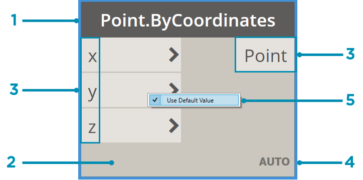
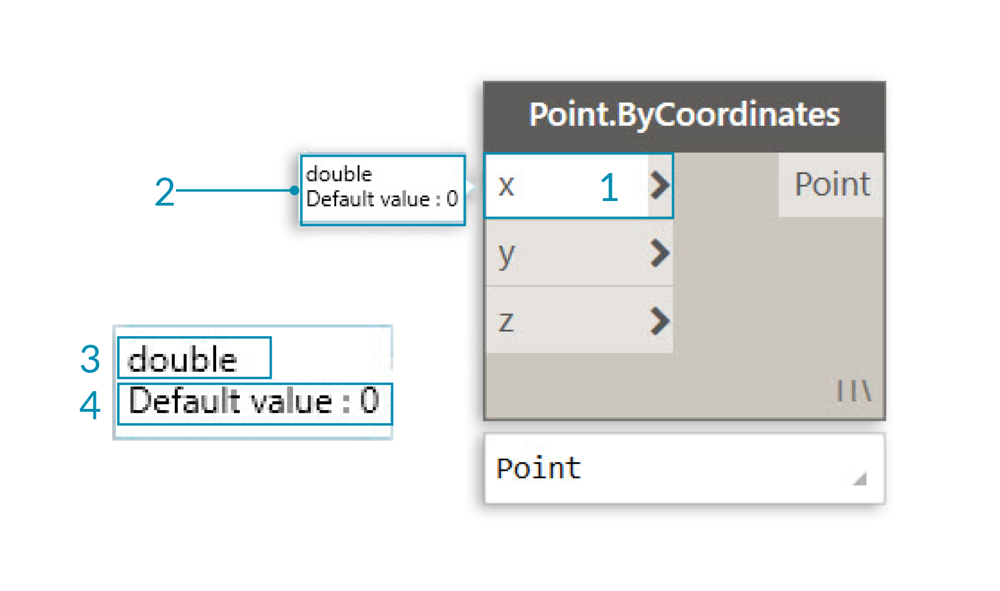
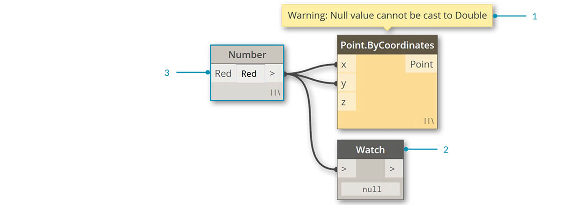

## Węzły

W dodatku Dynamo **węzły** są obiektami, które można połączyć w celu utworzenia programu wizualnego. Każdy **węzeł** wykonuje operację — czasami może ona być tak prosta, jak przechowywanie liczby, ale może być bardziej skomplikowana, na przykład tworzenie lub przywoływanie geometrii.

### Budowa węzła

Większość węzłów w dodatku Dynamo składa się z pięciu części. Istnieją wyjątki, takie jak węzły Input, ale budowę każdego węzła można opisać w następujący sposób: 

> 1. Nazwa — nazwa węzła w konwencji nazewnictwa Kategoria.Nazwa
2. Część główna — treść główna węzła, kliknięcie której prawym przyciskiem myszy powoduje przedstawienie opcji na poziomie całego węzła
3. Porty (wejściowe i wyjściowe) — gniazda dla przewodów, które dostarczają dane wejściowe do węzła, jak również wyprowadzają wyniki działania węzła
4. Ikona skratowania — wskazuje opcję skratowania określoną dla wejść zgodnej listy (więcej informacji na ten temat przedstawiono w dalszej części)
5. Wartość domyślna — po kliknięciu prawym przyciskiem myszy portu wejściowego: niektóre węzły mają wartości domyślne, które mogą być używane lub nie.

### Kanały Dolotowe

Wejścia i wyjścia węzłów są nazywane portami i działają jak gniazda dla przewodów. Dane są przekazywane do węzła przez porty po lewej stronie i wypływają z węzła po wykonaniu jego operacji po prawej stronie. Porty oczekują, że otrzymają dane określonego typu. Na przykład podłączenie liczby, takiej jak *2,75*, do portów w węźle Point By Coordinates („punkt według współrzędnych”) spowoduje utworzenie punktu. Jednak jeśli do tego samego portu zostanie podłączony ciąg *„Czerwony”*, spowoduje to błąd.

> Wskazówka: umieść kursor na porcie, aby wyświetlić etykietę narzędzia zawierającą oczekiwany typ danych.

> 1. Etykieta portu
2. Etykieta narzędzia
3. Typ danych
4. Wartość domyślna

### Stany

Dodatek Dynamo wskazuje stan wykonania programu wizualnego przez renderowanie węzłów w różnych schematach kolorów na podstawie stanów poszczególnych węzłów. Ponadto po ustawieniu wskaźnika myszy na nazwie lub portach albo kliknięciu ich prawym przyciskiem myszy wyświetlane są dodatkowe informacje i opcje.

> 1. Aktywne — węzły, których nazwy mają ciemnoszare tło, są dobrze połączone i wszystkie ich wejścia zostały pomyślnie połączone
2. Nieaktywne — węzły szare są nieaktywne i muszą zostać połączone za pomocą przewodów, aby były częścią przepływu programu w aktywnym obszarze roboczym
3. Stan błędu — kolor czerwony wskazuje, że węzeł jest w stanie błędu
4. Zablokowanie — węzeł przezroczysty jest zablokowany, co oznacza zawieszenie jego wykonywania
5. Wybrane — obecnie wybrane węzły mają obramowanie wyróżnione kolorem błękitnym
6. Ostrzeżenie — żółte węzły są w stanie ostrzeżenia, co oznacza, że mogą mieć niepoprawne typy danych
7. Podgląd w tle — kolor ciemnoszary oznacza, że podgląd geometrii jest wyłączony

Jeśli program wizualny zawiera ostrzeżenie lub błędy, dodatek Dynamo dostarczy dodatkowe informacje na temat problemu. Każdy żółty węzeł ma również etykietę narzędzia nad nazwą. Umieść wskaźnik myszy na tej etykiecie narzędzia, aby ją rozwinąć.

> Wskazówka: na podstawie informacji z etykiety narzędzia sprawdź we wcześniejszych węzłach, czy wymagane typy danych lub struktury danych nie są błędne.

> 1. Etykieta narzędzia z ostrzeżeniem — wartość „null” lub nie można zinterpretować danych jako wartości typu Double, czyli liczby
2. Użyj węzła Watch, aby sprawdzić dane wejściowe
3. Wcześniejszy węzeł przechowuje wartość „Czerwony”, a nie liczbę

