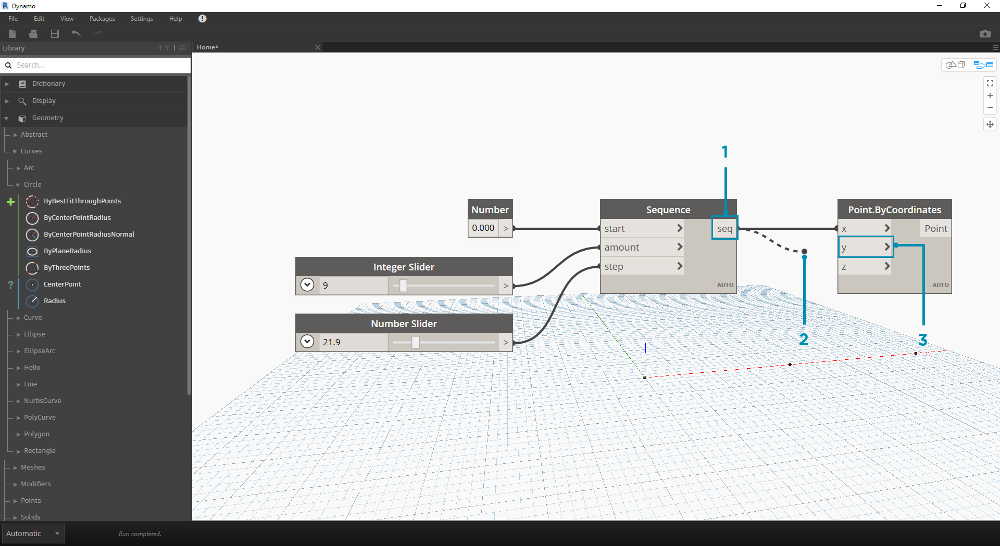

## Przewody

Przewody łączą węzły, aby utworzyć zależności i ustalić przepływ programu wizualnego. Możemy interpretować je jako przewody elektryczne, które przenoszą impulsy z jednego obiektu do następnego.

### Przepływ programu

Przewód łączy port wyjściowy jednego węzła z portem wejściowym innego węzła. Ta kierunkowość określa **przepływ danych** w programie wizualnym. Mimo że możemy uporządkować węzły w obszarze roboczym tak, jak chcemy, ze względu na to, że porty wyjściowe są umieszczone po prawej stronie węzłów, a porty wejściowe po lewej stronie, zwykle mówimy, że program przepływa od lewej strony do prawej.


### Tworzenie przewodów

Utwórz przewód, klikając lewym przyciskiem myszy port, a następnie klikając lewym przyciskiem myszy port innego węzła, aby utworzyć połączenie. W trakcie tworzenia połączenia przewód będzie wyświetlany jako kreskowany, a po pomyślnym połączeniu zostanie przyciągnięty i stanie się linią ciągłą. Dane zawsze będą przepływać przez ten przewód z wyjścia do wejścia. Można jednak utworzyć przewód w dowolnym kierunku, jeśli chodzi o sekwencję klikania połączonych portów.

> Wskazówka: przed ukończeniem połączenia za pomocą drugiego kliknięcia zezwól na przyciągnięcie przewodu do portu i umieść na nim wskaźnik myszy, aby wyświetlić etykietę narzędzia tego portu.



> 1. Kliknij port wyjściowy ```seq``` węzła Number Sequence
2. Podczas przesuwania wskaźnika myszy w kierunku innego portu przewód jest kreskowany
3. Kliknij port wejściowy ```y``` węzła Point.ByCoordinates, aby ukończyć połączenie

### Edytowanie przewodów

Często chcemy dostosować przepływ programu w programie wizualnym, edytując połączenia reprezentowane przez przewody. Aby edytować przewód, kliknij lewym przyciskiem myszy już połączony port wejściowy węzła. Dostępne są teraz dwie opcje:


> 1. Istniejący przewód
2. Aby zmienić połączenie z portem wejściowym, kliknij lewym przyciskiem myszy inny port wejściowy
3. Aby usunąć przewód, odciągnij przewód, a następnie kliknij lewym przyciskiem myszy obszar roboczy

*Uwaga — istnieje dodatkowa możliwość jednoczesnego przenoszenia wielu przewodów. Omówiono to tutaj: [http://dynamobim.org/dynamo-1-3-release/](http://dynamobim.org/dynamo-1-3-release/)

### Podglądy przewodów

Domyślnie podgląd wszystkich przewodów jest wyświetlany jako szare pociągnięcie. Po wybraniu węzła wszystkie łączące przewody są renderowane z tym samym wyróżnieniem w kolorze błękitnym co węzeł.


> 1. Domyślny przewód
2. Wyróżniony przewód

Dodatek Dynamo umożliwia także dostosowanie wyglądu przewodów w obszarze roboczym za pomocą menu Widok > Łączniki. W tym miejscu można przełączać między przewodami w postaci krzywych i polilinii albo całkowicie je wyłączyć.


> 1. Typ łącznika: krzywe
2. Typ łącznika: polilinie

