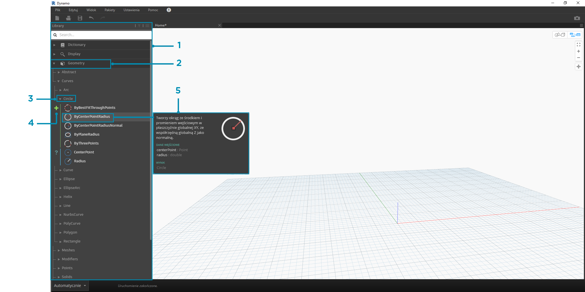
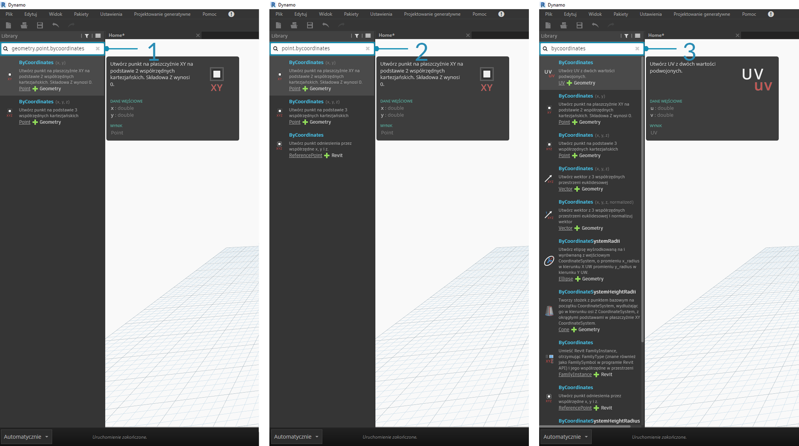

## Biblioteka Dynamo

**Biblioteka Dynamo** zawiera węzły dodawane do obszaru roboczego w celu zdefiniowania programów wizualnych do wykonania. W bibliotece można wyszukiwać węzły lub przechodzić do nich. Zawarte tu węzły, węzły podstawowe, węzły niestandardowe, które definiujemy, oraz węzły z menedżera pakietów, które dodajemy do dodatku Dynamo, są zorganizowane hierarchicznie — według kategorii. Przeanalizujmy tę organizację i najważniejsze węzły, których często się używa.

### Biblioteka bibliotek

**Biblioteka** Dynamo używana w aplikacji stanowi w rzeczywistości kolekcję bibliotek funkcjonalnych, z których każda zawiera węzły pogrupowane według kategorii. Choć ta organizacja może się na początku wydawać niejasna, jest to elastyczny sposób porządkowania węzłów dostarczanych z domyślną instalacją dodatku Dynamo. Rozwiązanie to sprawdza się jeszcze lepiej, gdy rozpoczyna się rozszerzanie tej podstawowej funkcjonalności o węzły niestandardowe i dodatkowe pakiety.

#### Schemat organizacyjny

Sekcja **Biblioteka** interfejsu użytkownika dodatku Dynamo składa się z hierarchicznie zorganizowanych bibliotek. Gdy przechodzimy do szczegółów w bibliotece, przeglądamy kolejno bibliotekę, kategorie biblioteki i podkategorie kategorii, aby znaleźć węzeł.



> 1. Biblioteka — region interfejsu dodatku Dynamo
2. Biblioteka — kolekcja powiązanych kategorii, takich jak **Geometria**
3. Kategoria — kolekcja powiązanych węzłów, np. wszystkich powiązanych z **okręgami**
4. Podkategoria — podział węzłów w kategorii, zazwyczaj według **tworzenia**, **operacji** i **zapytań**
5. Węzeł — obiekty dodawane do obszaru roboczego w celu wykonywania operacji

#### Konwencje nazewnictwa:

Hierarchia każdej biblioteki jest odzwierciedlona w nazwach węzłów dodawanych do obszaru roboczego. Można jej również używać w polu wyszukiwania lub w blokach kodu (gdzie używa się *języka tekstowego Dynamo*). Podczas wyszukiwania węzłów oprócz słów kluczowych można wpisywać hierarchię, oddzielając jej elementy kropkami.

Wpisanie różnych części miejsca węzła w hierarchii biblioteki w formacie ```biblioteka.kategoria.nazwa_węzła``` zwraca różne wyniki:



> 1. ```biblioteka.kategoria.nazwa_węzła```
2. ```kategoria.nazwa_węzła```
3. ```nazwa_węzła``` lub ```słowo_kluczowe```

Zazwyczaj nazwa węzła w obszarze roboczym jest renderowana w formacie ```kategoria.nazwa_węzła```, z pewnymi ważnymi wyjątkami, szczególnie w przypadku kategorii widoków i wejść. Należy zwrócić uwagę na podobnie nazwane węzły i na różnicę ich kategorii:


> 1. Węzły z większości bibliotek mają format kategorii
2. Węzły ```Point.ByCoordinates``` i ```UV.ByCoordinates``` mają tę samą nazwę, ale pochodzą z różnych kategorii
3. Istotne wyjątki to funkcje wbudowane, Core.Input, Core.View i operatory

### Często używane węzły

Do podstawowej instalacji dodatku Dynamo dołączono setki węzłów — które są niezbędne do tworzenia programów wizualnych? Skupmy się na tych, które pozwalają zdefiniować parametry programu (**Input**), wyświetlić wyniki działania węzła (**Watch**) oraz zdefiniować wyjścia lub funkcjonalność za pomocą skrótu (**Code Block**).

#### Dane wejściowe

Węzły Input (wejścia) są podstawowym sposobem obsługi kluczowych parametrów programu wizualnego przez użytkownika — Ciebie lub kogoś innego. Poniżej znajdują się węzły dostępne w kategorii danych wejściowych biblioteki podstawowej:


> 1. Operacje logiczne
2. Liczba
3. Ciąg
4. Suwaka liczby
5. Suwak liczby całkowitej
6. Ścieżka do katalogu
7. Ścieżka pliku

#### Watch

Węzły Watch (obserwacyjne) są niezbędne do zarządzania danymi, które przepływają przez program wizualny. Chociaż można wyświetlić wynik węzła za pomocą podglądu danych węzła, może zajść potrzeba stałego wyświetlania ich w węźle **Watch** lub wyświetlania wyników geometrii za pomocą węzła **Watch3D**. Oba te elementy znajdują się w kategorii widoku w bibliotece podstawowej.

> Wskazówka: czasami podgląd 3D może rozpraszać, gdy program wizualny zawiera wiele węzłów. Warto rozważyć wyczyszczenie zaznaczenia opcji Wyświetlanie podglądu tła w menu Ustawienia i użycie zamiast tego węzła Watch3D do wyświetlania podglądu geometrii.


> 1. Watch — po wybraniu elementu w węźle Watch zostanie on oznaczony w węźle Watch3D i podglądach 3D
2. Watch3D — uchwyt znajdujący się po prawej stronie na dole umożliwia zmianę rozmiaru i nawigację za pomocą myszy tak samo jak w podglądzie 3D

#### Code Block

Węzły **Code Block** (bloki kodu) umożliwiają definiowanie bloku kodu z wierszami oddzielonych średnikami. Może to być coś tak prostego, jak ```X/Y```. Bloków kodu można też używać jako skrótów do definiowania wejścia liczbowego lub wywoływania funkcji innego węzła. Składnia potrzebna do tego celu jest zgodna z konwencją nazewnictwa języka tekstowego Dynamo, DesignScript, i opisano ją w sekcji 7.2. Spróbujmy utworzyć okrąg za pomocą tego skrótu:


> 1. Kliknij dwukrotnie, aby utworzyć węzeł **Code Block**
2. Wpisz ```Circle.ByCenterPointRadius(x,y);```
3. Kliknięcie obszaru roboczego w celu wyczyszczenia zaznaczenia powinno spowodować automatyczne dodanie wejść ```x``` i ```y```
4. Utwórz węzły **Point.ByCoordinates** i **Number Slider**, a następnie połącz je z wejściami bloku kodu
5. Wynik wykonania programu wizualnego powinien być okręgiem w podglądzie 3D

