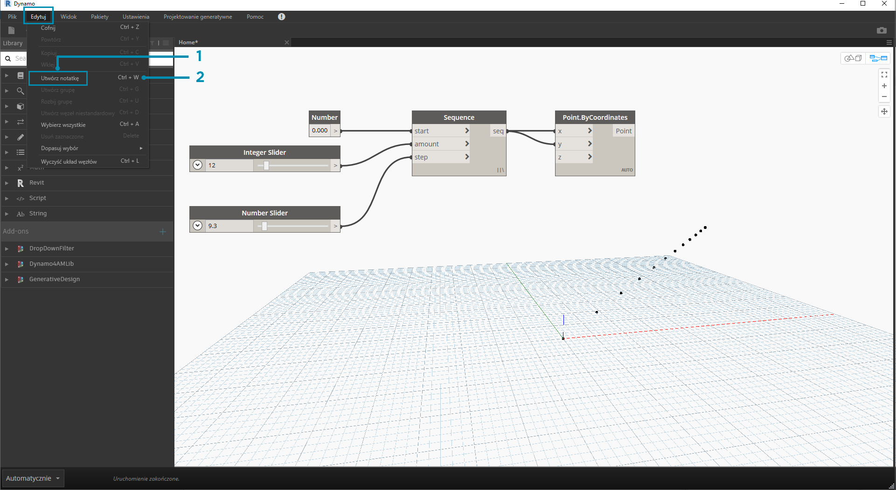
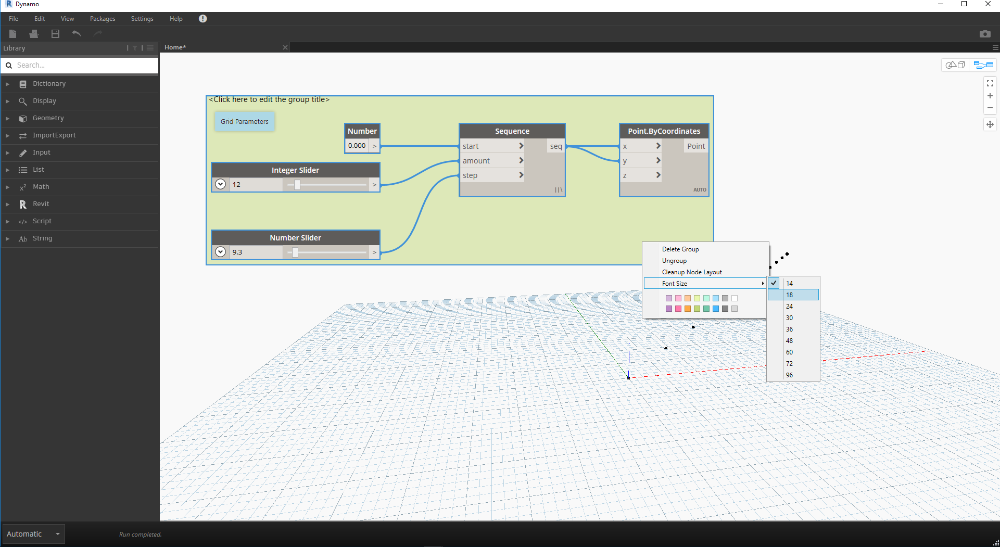

## Zarządzanie programem

Praca z procesem programowania wizualnego może być bardzo wydajna i twórcza, ale przepływ programu i kluczowe dane wejściowe użytkownika mogą bardzo szybko zostać przesłonięte przez złożoność i układ obszaru roboczego. Przyjrzyjmy się niektórym wzorcom postępowania dotyczącym zarządzania programem.

### Wyrównanie

Po dodaniu więcej niż kilku węzłów do obszaru roboczego może zajść potrzeba przeorganizowania układu węzłów, aby zwiększyć czytelność całości. Po wybraniu więcej niż jednego węzła i kliknięciu prawym przyciskiem myszy obszaru roboczego w oknie podręcznym zostanie wyświetlone menu **Dopasuj wybór** z opcjami wyrównania i dystrybucji na osiach X i Y.

> 1. Wybierz więcej niż jeden węzeł
2. Kliknij prawym przyciskiem myszy obszar roboczy
3. Użyj opcji **Dopasuj wybór**

### Uwagi

Po nabraniu pewnego doświadczenia użytkownik może „odczytywać” program wizualny, przeglądając nazwy węzłów i podążając za przepływem programu. W przypadku użytkowników na wszystkich poziomach zaawansowania zaleca się również umieszczanie etykiet i opisów w prostym języku. Dodatek Dynamo zawiera przeznaczony do tego celu węzeł **Note** z edytowalnym polem tekstowym. Opisy można dodawać do obszaru roboczego na dwa sposoby:

> 1. Przejdź do menu Edycja > Utwórz notatkę
2. Użyj skrótu klawiaturowego Ctrl+W

Po dodaniu notatki do obszaru roboczego zostanie wyświetlone pole tekstowe umożliwiające edycję tekstu w notatce. Po utworzeniu notatki można ją edytować, klikając dwukrotnie lub klikając prawym przyciskiem myszy węzeł Note.

### Grupowanie

Gdy program wizualny stanie się duży, pomocne będzie zidentyfikowanie zawartych w nim większych kroków. Można wyróżnić większe kolekcje węzłów jako **grupę**, aby oznaczyć je etykietą z kolorowym prostokątem w tle i tytułem. Istnieją trzy sposoby utworzenia grupy z więcej niż jednym wybranym węzłem:

> 1. Przejdź do menu Edycja > Utwórz grupę
2. Użyj skrótu klawiaturowego Ctrl+G
3. Kliknij prawym przyciskiem myszy obszar roboczy i wybierz polecenie „Utwórz grupę”

Po utworzeniu grupy można edytować jej ustawienia, takie jak tytuł i kolor. 

> Wskazówka: używanie zarówno notatek, jak i grup jest skutecznym sposobem opisywania pliku i zwiększania jego czytelności.

Oto nasz program z sekcji 2.4 z dodanymi notatkami i grupami:

> 1. Notatka: „Parametry siatki”
2. Notatka: „Punkty siatki”
3. Grupa: „Utwórz siatkę punktów”
4. Grupa: „Utwórz punkt przyciągania”
5. Notatka: „Kalibracja wartości odległości”
6. Notatka: „Zmienna siatka okręgów”

