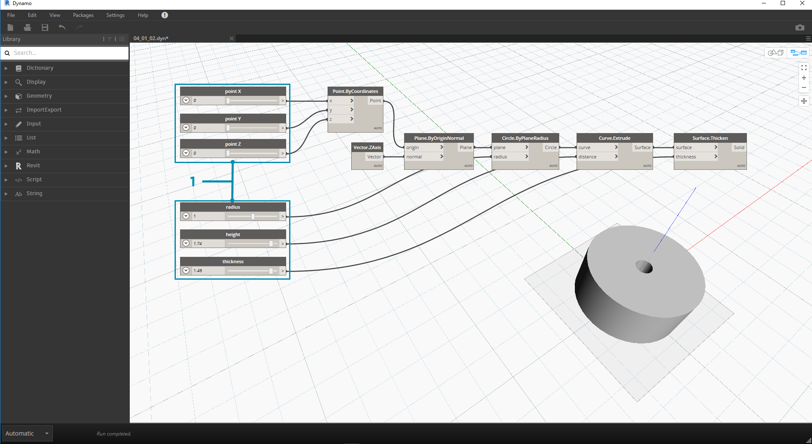
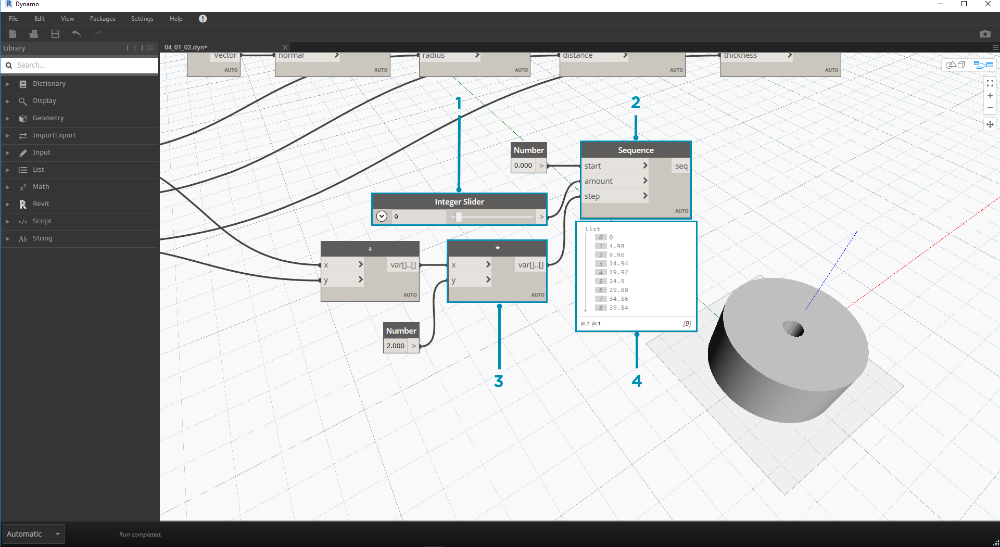

## Dane

Dane są niezbędnym elementem programów. Podróżują przez przewody, trafiając na wejścia węzłów, w których są przetwarzane i przekształcane do nowej postaci — danych wyjściowych. Przeanalizujmy definicję danych, ich strukturę i rozpocznijmy korzystanie z nich w dodatku Dynamo.

### Co to są dane?

Dane to zestaw wartości zmiennych jakościowych lub ilościowych. Najprostszą formą danych są liczby, takie jak ```0```, ```3,14``` lub ```17```. Jednak dane mogą być wielu innych typów, jak na przykład zmienna reprezentująca zmieniające się liczby (```height```), znaki (```myName```), geometria (```Circle```) lub lista elementów danych (```1,2,3,5,8,13,...```). Dane są potrzebne w przypadku dodawania czegoś do portów wejściowych węzłów Dynamo — można mieć dane bez operacji, ale aby przetworzyć operacje reprezentowane przez węzły, dane są niezbędne. Po dodaniu węzła do obszaru roboczego, jeśli nie ma on żadnych wejść, wynik będzie funkcją, a nie wynikiem samej operacji.


> 1. Proste dane
2. Pomyślne wykonanie danych i operacji (węzeł A)
3. Operacja (węzeł A) bez danych wejściowych zwraca funkcję ogólną

### Uwaga na wartości null

Typ ```„null”``` reprezentuje brak danych. Chociaż jest to pojęcie abstrakcyjne, często można się z nim spotkać podczas pracy z programowaniem wizualnym. Jeśli operacja nie utworzy poprawnego wyniku, węzeł zwróci wartość null. Testowanie pod kątem wartości null i usuwanie ich ze struktury danych jest kluczową częścią tworzenia skutecznych programów.

|Ikona|Nazwa/składnia|Dane wejściowe|Wyjścia|
| -- | -- | -- | -- |
||Object.IsNull|obj|bool|

### Struktury danych

Programowanie wizualne umożliwia bardzo szybkie generowanie dużej ilości danych, co może wymagać metod zarządzania ich hierarchią. Taka właśnie jest rola struktur danych, schematów organizacyjnych, w których przechowujemy dane. Specyfika struktur danych i sposób ich używania zależą od konkretnego języka programowania. W dodatku Dynamo dodajemy hierarchię do danych za pomocą list. Przeanalizujemy to szczegółowo w kolejnych rozdziałach, ale na początek możemy po prostu stwierdzić, że:

Lista reprezentuje kolekcję elementów umieszczonych w jednej strukturze danych:

* Mam pięć palców (*elementy*) dłoni (*lista*).
* Na mojej ulicy (*lista*) jest dziesięć domów (*elementy*).


> 1. Węzeł **Number Sequence** definiuje listę liczb za pomocą wejść *start*, *amount* i *step*. Za pomocą tych węzłów utworzyliśmy dwie oddzielne listy dziesięciu liczb, jedna z nich obejmuje liczby *100–109*, a druga — *0–9*.
2. Węzeł **List.GetItemAtIndex** wybiera element z listy o określonym indeksie. W przypadku wybierania indeksu *0* pobieramy pierwszy element z listy (w tym przypadku *100*).
3. Stosując ten sam proces do drugiej listy, otrzymujemy wartość *0*, czyli pierwszy element na liście.
4. Teraz scalamy dwie listy w jedną, używając węzła **List.Create**. Warto zauważyć, że węzeł tworzy *listę list.* Powoduje to zmianę struktury danych.
5. Teraz gdy ponownie użyjemy węzła **List.GetItemAtIndex** z indeksem *0*, pobierzemy pierwszą listę na liście list. Oznacza to, że lista jest traktowana jak element — stanowi to pewną różnicę w porównaniu z innymi językami skryptowymi. W kolejnych rozdziałach bardziej szczegółowo zajmiemy się manipulowaniem listami i strukturami danych.

Kluczowe pojęcie hierarchii danych w dodatku Dynamo, które należy zrozumieć: **w odniesieniu do struktury danych listy są traktowane jak elementy.** Innymi słowy, analizując strukturę danych, dodatek Dynamo stosuje proces „od góry do dołu”. Co to oznacza? Przeanalizujmy to na przykładzie.

### Używanie danych do tworzenia łańcucha walców

> Pobierz plik przykładowy do tego ćwiczenia (kliknij prawym przyciskiem myszy i wybierz polecenie Zapisz element docelowy jako): [Building Blocks of Programs - Data.dyn](datasets/4-1/Building Blocks of Programs - Data.dyn). Pełna lista plików przykładowych znajduje się w załączniku.

W pierwszym przykładzie złożymy walec z powłoką, stosując hierarchię geometrii opisaną w tej sekcji. 

> 1. **Point.ByCoordinates —** po dodaniu węzła do obszaru rysunku widać punkt w początku siatki podglądu dodatku Dynamo. Domyślne wartości wejść *x, y* i *z* to *0,0*, co daje punkt w tym położeniu.


> 1. **Plane.ByOriginNormal —** następny krok w hierarchii geometrii to płaszczyzna. Istnieje kilka sposobów skonstruowania płaszczyzny — użyjemy dla wejścia pozycji origin i normal. Origin (początek) to węzeł punktu utworzony w poprzednim kroku.
2. **Vector.ZAxis —** jest to wektor jednostkowy w kierunku z. Warto zwrócić uwagę, że nie ma wejść, tylko wektor o wartości [0,0,1]. Użyjemy go jako wejścia *normal* dla węzła *Plane.ByOriginNormal*. Pozwala to uzyskać prostokątną płaszczyznę w podglądzie dodatku Dynamo.


> 1. **Circle.ByPlaneRadius —** dodając następny etap w hierarchii, tworzymy teraz krzywą z płaszczyzny w poprzednim kroku. Po utworzeniu podłączenia do węzła uzyskujemy okrąg w początku. Domyślna wartość promienia (radius) węzła wynosi *1*.


> 1. **Curve.Extrude —** teraz dodamy temu elementowi wyrazu, nadając mu głębię i dodając trzeci wymiar. Ten węzeł tworzy powierzchnię z krzywej poprzez jej wyciągnięcie. Domyślna odległość w węźle wynosi *1*, a w rzutni powinien być widoczny walec.


> 1. **Surface.Thicken —** ten węzeł umożliwia uzyskanie zamkniętej bryły przez odsunięcie powierzchni o określoną odległość i zamknięcie formy. Domyślna wartość grubości wynosi *1*, a w rzutni widoczny jest walec z powłoką, zgodny z tymi wartościami.


> 1. **Number Slider —** zamiast używać domyślnych wartości dla wszystkich tych wejść, dodajmy do modelu kontrolę parametryczną.
2. **Domain Edit —** po dodaniu do obszaru rysunku węzła Number Slider kliknij daszek w lewym górnym rogu, aby wyświetlić opcje domeny.
3. **Min/Max/Step —** zmień wartości *min*, *max* i *step* na odpowiednio *0*,*2* i *0,01*. Umożliwia to sterowanie wielkością całkowitej geometrii.


> 1. **Węzły Number Slider —** we wszystkich domyślnych wejściach skopiujmy i wklejmy kilka razy ten suwak liczby (wybierz suwak, naciśnij klawisze Ctrl+C, a następnie klawisze Ctrl+V), tak aby wszystkie wejścia z domyślnymi wartościami miały zamiast nich suwaki. Niektóre z wartości suwaka muszą być większe od zera, aby definicja działała (na przykład potrzebna jest głębokość wyciągnięcia w celu pogrubienia powierzchni).

Za pomocą tych suwaków utworzyliśmy teraz parametryczny walec z powłoką. Spróbuj zmieniać niektóre z tych parametrów i obserwuj, jak geometria jest aktualizowana dynamicznie w rzutni dodatku Dynamo.



> 1. **Węzły Number Slider —** w ramach kontynuacji dodaliśmy wiele suwaków do obszaru rysunku i musimy oczyścić interfejs właśnie utworzonego narzędzia. Kliknij prawym przyciskiem myszy jeden suwak, wybierz polecenie „Zmień nazwę” i zmień nazwę każdego suwaka na odpowiednią dla danego parametru. Nazwy możesz sprawdzać na powyższej ilustracji.

W tym momencie mamy już utworzony wspaniały walec z pogrubieniem. Obecnie jest to jeden obiekt. Przyjrzyjmy się temu, jak utworzyć szyk walców pozostających dynamicznie połączonych. W tym celu utworzymy listę walców, zamiast pracować z pojedynczym elementem.


> 1. **Dodawanie (+) —** naszym celem jest dodanie wiersza walców obok utworzonego walca. Aby dodać jeden walec przylegający do bieżącego, musimy uwzględnić zarówno promień walca, jak i grubość jego powłoki. Uzyskamy tę liczbę przez dodanie dwóch wartości suwaków.



> Ten krok jest trudniejszy, więc przeanalizujmy go powoli: celem końcowym jest utworzenie listy liczb definiujących położenie każdego walca w wierszu.

> 1. **Mnożenie —** najpierw pomnożymy wartość z poprzedniego kroku przez 2. Wartość z poprzedniego kroku reprezentuje promień. Chcemy przesunąć walec o pełną średnicę.
2. **Number Sequence —** za pomocą tego węzła tworzymy szyk liczb. Pierwsze wejście to węzeł *mnożenia* z poprzedniego kroku skierowany do wartości *step*. Wartość *start* można ustawić na *0,0* za pomocą węzła *number*.
3. **Integer Slider — ** w przypadku wartości *amount* połączymy suwak liczby całkowitej. Określi to liczbę utworzonych walców.
4. **Wyjście —** na tej liście znajduje się przesunięcie każdego walca w szyku i jest ona parametrycznie sterowana przez oryginalne suwaki.


> 1. Ten krok jest prosty — podłącz sekwencję zdefiniowaną w poprzednim kroku do wejścia *x* oryginalnego węzła *Point.ByCoordinates*. Spowoduje to zastąpienie suwaka *pointX*, który można usunąć. Teraz widzimy szyk walców w rzutni (upewnij się, że suwak liczby całkowitej ma wartość większą niż 0).


> Łańcuch cylindrów jest nadal dynamicznie połączony ze wszystkimi suwakami. Zmieniaj wartości poszczególnych suwaków i obserwuj aktualizację definicji.

