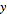

## Matematyka

Jeśli najprostszą formą danych są liczby, najprostszym sposobem powiązywania tych liczb jest matematyka. Od prostych operatorów, takich jak dzielenie czy funkcje trygonometryczne, po bardziej złożone formuły — matematyka stanowi doskonały sposób na rozpoczęcie badania zależności i wzorców między liczbami.

### Operatory arytmetyczne

Operatory to zestaw komponentów, w których używane są funkcje algebraiczne z dwiema wejściowymi wartościami liczbowymi dającymi jedną wartość wyjściową (dodawanie, odejmowanie, mnożenie, dzielenie itp.). Można je znaleźć w obszarze Operatory > Operacje.

|Ikona|Nazwa|Składnia|Dane wejściowe|Wyjścia|
| -- | -- | -- | -- | -- |
||Dodaj|+|var[]...[], var[]...[]|var[]...[]|
||Odejmij|-|var[]...[], var[]...[]|var[]...[]|
||Pomnóż|*|var[]...[], var[]...[]|var[]...[]|
||Podziel|/|var[]...[], var[]...[]|var[]...[]|

### Formuła parametryczna

> Pobierz plik przykładowy do tego ćwiczenia (kliknij prawym przyciskiem myszy i wybierz polecenie Zapisz element docelowy jako): [Building Blocks of Programs - Math.dyn](datasets/4-2/Building Blocks of Programs - Math.dyn). Pełna lista plików przykładowych znajduje się w załączniku.

Po poznaniu operatorów kolejnym krokiem jest połączenie operatorów i zmiennych, co pozwala utworzyć bardziej złożone zależności za pomocą **formuł**. Utworzymy formułę, którą można sterować przez parametry wejściowe, np. suwaki.

> 1. **Number Sequence:** zdefiniuj sekwencję liczb w oparciu o trzy wejścia: *start, amount* i *step*. Ta sekwencja reprezentuje „t” w równaniu parametrycznym, dlatego chcemy użyć listy wystarczająco dużej, aby zdefiniować spiralę.

W powyższym kroku utworzono listę liczb definiujących dziedzinę parametryczną. Złota spirala jest zdefiniowana jako równanie: = i =. Grupa węzłów poniżej reprezentuje to równanie w formie programowania wizualnego.

> Podczas przechodzenia przez grupę węzłów należy zwrócić uwagę na analogię pomiędzy programem wizualnym a równaniem pisemnym.

> 1. **Number Slider:** dodaj dwa suwaki liczb do obszaru rysunku. Suwaki te reprezentują zmienne *a* i *b* równania parametrycznego. Te elementy reprezentują stałą, która jest elastyczna, lub parametry, które można dostosować do żądanego wyniku.
2. ** * :** węzeł mnożenia jest reprezentowany przez gwiazdkę. Użyjemy tego wielokrotnie, aby połączyć zmienne mnożenia.
3. **Math.RadiansToDegrees:** wartości „*t*” muszą być przekształcone w stopnie w celu ich oszacowania w funkcjach trygonometrycznych. Należy pamiętać, że podczas szacowania tych funkcji dodatek Dynamo domyślnie obsługuje wartości w stopniach.
4. **Math.Pow:** jako funkcja wartości „*t*” i liczby „*e*” tworzy to ciąg Fibonacciego.
5. **Math.Cos i Math.Sin:** te dwie funkcje trygonometryczne będą różnicować współrzędną x i współrzędną y każdego punktu parametrycznego.
6. **Watch: **teraz widzimy, że wynik to dwie listy — współrzędne *x* i *y* punktów użytych do wygenerowania spirali.

### Od formuły do geometrii

Teraz zestaw węzłów z poprzedniego kroku będzie działać poprawnie, ale to sporo pracy. Aby utworzyć wydajniejszy proces roboczy, zapoznaj się z częścią **Bloki kodu** (sekcja 3.3.2.3) w celu zdefiniowania ciągu wyrażeń Dynamo w jednym węźle. W następnej serii kroków przeanalizujemy używanie równania parametrycznego do rysowania spirali Fibonacciego. 

> 1. **Point.ByCoordinates:** połącz górny węzeł multiplication z wejściem „*x*”, a dolny — z wejściem „*y*”. Na ekranie pojawi się spirala parametryczna punktów.

> 1. **Polycurve.ByPoints:** połącz węzeł Point.ByCoordinates z poprzedniego kroku z węzłem *points*. Węzeł *connectLastToFirst* możemy pozostawić bez wejścia, ponieważ nie tworzymy krzywej zamkniętej. Spowoduje to utworzenie spirali przechodzącej przez każdy punkt zdefiniowany w poprzednim kroku.

Mamy gotową spiralę Fibonacciego. Przekształcimy to jeszcze bardziej w dwóch osobnych ćwiczeniach, tworząc kształty nautilusa i słonecznika. Są to abstrakcje systemów naturalnych, ale zapewni to dobrą reprezentację tych dwóch różnych zastosowań spirali Fibonacciego.

### Od spirali do nautilusa

> 1. Punktem wyjścia będzie ten sam krok co w poprzednim ćwiczeniu: utworzenie szyku spirali punktów za pomocą węzła **Point.ByCoordinates**.

> 1. **Polycurve.ByPoints:** jest to węzeł z poprzedniego ćwiczenia, którego użyjemy jako odniesienia.
2. **Circle.ByCenterPointRadius:** użyjemy tutaj węzła circle z tymi samymi wejściami co w poprzednim kroku. Domyślną wartością promienia jest *1,0*, dlatego natychmiast widoczne będą wyniki okręgów. Od razu staje się jasne, w jaki sposób te punkty odbiegają dalej od początku.

> 1. **Circle.ByCenterPointRadius:** aby utworzyć bardziej dynamiczny szyk okręgów, podłączymy oryginalną sekwencję liczb (czyli „*t*”) do wartości radius.
2. **Number Sequence:** jest to oryginalny szyk „*t*”. Przez podłączenie tej pozycji do wartości promienia środki okręgów wciąż odbiegają dalej od początku, ale promień okręgów rośnie, tworząc interesujący wykres okręgów Fibonacciego. Jeszcze lepiej, jeśli uda Ci się przekształcić go w wykres 3D.

### Od nautilusa do wzorca ulistnienia

Mamy już powłokę nautilusa — przejdźmy do siatek parametrycznych. Użyjemy podstawowego obrotu na spirali Fibonacciego, aby utworzyć siatkę Fibonacciego, a wynik zostanie wymodelowany na wzór [rosnących nasion słonecznika](http://ms.unimelb.edu.au/~segerman/papers/sunflower_spiral_fibonacci_metric.pdf).

> 1. Także tutaj jako punktu wyjścia użyjemy tego samego kroku co w poprzednim ćwiczeniu: tworzenie spiralnego szyku punktów za pomocą węzła **Point.ByCoordinates**.

> 1. **Geometry.Rotate:** dostępnych jest kilka opcji Geometry.Rotate. Należy pamiętać, aby wybrać węzeł z wejściami *geometry*, *basePlane* i *degrees*. Połącz węzeł **Point.ByCoordinates** z wejściem geometry.
2. **Plane.XY:** połącz z wejściem *basePlane*. Wykonamy obrót wokół początku, który ma to samo położenie co podstawa spirali.
3. **Number Range:** na potrzeby wartości wejściowej w stopniach utworzymy wiele obrotów. Można to zrobić szybko za pomocą komponentu Number Range. Połącz to z wejściem *degrees*.
4. **Number:** aby zdefiniować zakres liczb, dodaj trzy węzły number do obszaru rysunku w kolejności pionowej. Od góry do dołu przypisz odpowiednio wartości *0,0; 360,0* i *120,0*. Sterują one obrotem spirali. Zwróć uwagę na wyniki z wyjścia węzła **Number Range** po połączeniu trzech węzłów number z tym węzłem.

Nasz wynik zaczyna przypominać wir. Dostosuj niektóre parametry węzła **Number Range** i obserwuj, jak zmieniają się wyniki: 

> 1. Zmień rozmiar kroku (step) węzła **Number Range** z *120,0* na *36,0*. Zwróć uwagę, że w ten sposób powstaje więcej obrotów, co zapewnia gęstszą siatkę.

> 1. Zmień rozmiar kroku (step) węzła **Number Range** z *36,0* na *3,6*. Daje to teraz dużo gęstszą siatkę, a kierunkowość spirali jest niejasna. W ten sposób utworzyliśmy słonecznik.

