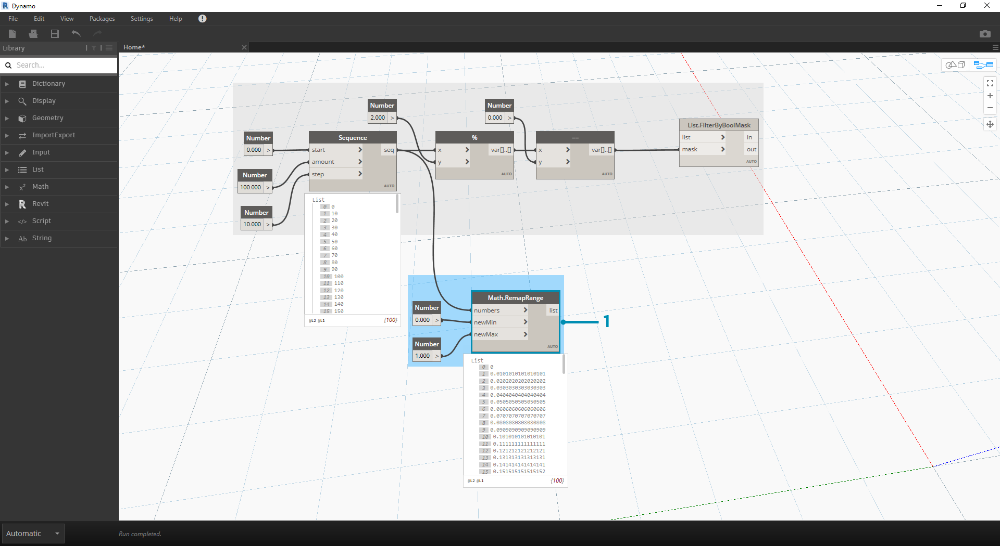

## Logika

**Logika**, a w szczególności **logika warunkowa**, pozwala określić operację lub zestaw operacji na podstawie testu. Przez oszacowanie testu uzyskamy wartość logiczną reprezentującą prawdę (```True```) lub fałsz (```False```), za pomocą której można sterować przepływem programu.

### Wartości logiczne

Zmienne liczbowe mogą przechowywać liczby z szerokiego zakresu. Zmienne logiczne mogą przechowywać tylko dwie wartości, nazywane Prawda lub Fałsz, Tak lub Nie albo 1 lub 0. Rzadko stosuje się operacje logiczne do wykonywania obliczeń z powodu ich ograniczonego zakresu.

### Instrukcje warunkowe

Instrukcja „If” (jeśli) stanowi kluczowe pojęcie w programowaniu: „Jeśli *to* jest prawdą, wtedy *tak się stanie*, w przeciwnym razie stanie się *coś innego*”. Wynikowa operacja tej instrukcji zależy od wartości logicznej. Istnieje wiele sposobów definiowania instrukcji „If” w dodatku Dynamo:

|Ikona|Nazwa|Składnia|Dane wejściowe|Wyjścia|
| -- | -- | -- | -- | -- |
||Jeśli|Jeśli|test, prawda, fałsz|wynik|
||Wzór|IF(x,y,z)|x, y, z|wynik|
||Blok kodu|(x?y:z)|x, y, z|wynik|

Przeanalizujmy krótki przykład dotyczący działania każdego z tych trzech węzłów z użyciem instrukcji warunkowej „If”:


> Na tej ilustracji *wartość logiczna* jest ustawiona na *true*, co oznacza, że wynik jest ciągiem: *„this is the result if true” (to jest wynik, jeśli prawda).* Trzy węzły tworzące instrukcję *If* działają tu w ten sam sposób.


> Węzły działają identycznie. Jeśli *wartość logiczna* zostanie zmieniona na *false*, wynik będzie liczbą *Pi*, jak to zdefiniowano w oryginalnej instrukcji *If*.

### Filtrowanie listy

> Pobierz plik przykładowy do tego ćwiczenia (kliknij prawym przyciskiem myszy i wybierz polecenie Zapisz element docelowy jako): [Building Blocks of Programs - Logic.dyn](datasets/4-3/Building Blocks of Programs - Logic.dyn). Pełna lista plików przykładowych znajduje się w załączniku.

Użyjmy logiki, aby rozdzielić listę liczb na listę liczb parzystych i listę liczb nieparzystych.


> 1. **Number Range —** dodaj zakres liczb do obszaru rysunku.
2. **Number —** dodaj trzy number liczb do obszaru rysunku. Wartość dla każdego węzła number powinna wynosić: *0,0* dla *start*, *10,0* dla *end* i *1,0* dla *step*.
3. **Wyjście —** wynik wyjściowy to lista 11 liczb w zakresie od 0 do 10.
4. **Modulo (%) — ** węzeł *Number Range* do *x* i *2,0* do *y*. Spowoduje to obliczenie reszty z dzielenia przez 2 dla każdej liczby na liście. Wynik z tej listy to lista wartości 0 i 1.
5. **Test równości (==) —** dodaj test równości do obszaru rysunku. Podłącz wyjście *modulo* do wejścia *x* i wartość *0,0* do wejścia *y*.
6. **Watch —** wynik testu równości jest listą wartości logicznych true i false. Są to wartości używane do oddzielenia elementów na liście. *0* (lub *true*) reprezentuje liczby parzyste, a *1* (lub *false*) reprezentuje liczby nieparzyste.
7. **List.FilterByBoolMask —** ten węzeł filtruje wartości na dwie różne listy w oparciu o wejściową wartość logiczną. Podłącz oryginalny węzeł *Number Range* do wejścia *list* oraz wyjście *equality test* do wejścia *mask*. Wyjście *in* reprezentuje wartości true, podczas gdy wyjście *out* reprezentuje wartości false.
8. **Watch —** w wyniku tego mamy teraz listę liczb parzystych i listę liczb nieparzystych. Użyliśmy operatorów logicznych do rozdzielenia list na wzory.

### Od logiki do geometrii

Bazując na logice ustanowionej w pierwszym ćwiczeniu, zastosujmy tę konfigurację do operacji modelowania.

 Oprzemy się na poprzednim ćwiczeniu z tymi samymi węzłami. Jedyne wyjątki to (oprócz zmiany formatu):

> 1. Zmianie ulegną wartości wejściowe.
2. Odłączyliśmy wejście list in od węzła *List.FilterByBoolMask*. Na razie odłożymy te węzły na bok, ale później w tym ćwiczeniu się przydadzą.


> Najpierw połączmy węzły zgodnie z ilustracją powyżej. Ta grupa węzłów reprezentuje równanie parametryczne definiujące krzywą liniową. Kilka uwag:

> 1. **Pierwszy suwak** powinien mieć wartość min. równą 1, maks. równą 4 i krok równy 0,01.
2. **Drugi suwak** powinien mieć wartość min. równą 0, maks. równą 1 i krok równy 0,01.
3. **PolyCurve.ByPoints —** jeśli zostanie skopiowany powyższy wykres węzłów, wynikiem będzie krzywa sinusoidalna w rzutni podglądu Dynamo.

Metoda stosowana tutaj dla wejść: użyj węzłów number dla bardziej statycznych właściwości i węzłów Number Slider dla właściwości bardziej elastycznych. Chcemy zachować oryginalny węzeł Number Range definiowany na początku tego kroku. Jednak tworzona tutaj krzywa sinusoidalna powinna mieć pewną elastyczność. Możemy przesunąć te suwaki, aby obserwować, jak aktualizowane są częstotliwość i amplituda krzywej.


> Będziemy analizować definicję nie po kolei, więc spójrzmy na wynik końcowy, aby móc się odwoływać do tego, do czego dążymy. Pierwsze dwa kroki są wykonywane oddzielnie, chcemy je teraz połączyć. Użyjemy bazowej krzywej sinusoidalnej do sterowania położeniem komponentów zamka, a za pomocą logiki prawdy/fałszu będziemy przełączać się między małymi i większymi kostkami.



> 1. **Math.RemapRange — **za pomocą sekwencji liczb utworzonej w kroku 01 utwórzmy nową serię liczb poprzez ponowne odwzorowanie zakresu. Oryginalne liczby z zakresu od 0 do 100 z kroku 01. Te liczby mieszczą się w zakresie od 0 do 1 dla odpowiednio wejść *newMin* i *newMax*.


> 1. **Curve.PointAtParameter — **podłącz węzeł *Polycurve.ByPoints* (z kroku 2) do węzła *curve* i węzeł *Math.RemapRange* do węzła *param*. W tym kroku tworzone są punkty wzdłuż krzywej. Ponownie odwzorowaliśmy liczby na wartości od 0 do 1, ponieważ wejście *param* szuka wartości w tym zakresie. Wartość *0* reprezentuje punkt początkowy, a wartość *1* reprezentuje punkty końcowe. Wszystkie liczby między nimi są odwzorowane na wartości z zakresu *[0,1]*.


> 1. **List.FilterByBoolMask — **podłącz węzeł *Curve.PointAtParameter* z poprzedniego kroku do wejścia *list*.
2. **Watch —** węzeł obserwacyjny dla *in* i węzeł obserwacyjny dla *out* pokazują, że mamy dwie listy reprezentujące indeksy parzyste i nieparzyste. Punkty te są uporządkowane w ten sam sposób na krzywej, co przedstawimy w następnym kroku.


> 1. **Cuboid.ByLengths —** ponownie utwórz połączenia widoczne na ilustracji powyżej, aby uzyskać zamek wzdłuż krzywej sinusoidalnej. Prostopadłościan jest tutaj tylko kostką. Definiujemy jego rozmiar na podstawie punktu krzywej w środku kostki. Logika podziału na wartości parzyste/nieparzyste powinna być teraz czytelna w modelu.


> 1. **Number Slider —** wracając do początku definicji, możemy przesuwać suwak liczby i obserwować aktualizację zamka. Górny wiersz obrazów przedstawia wartości z zakresu dla górnego suwaka liczb. Jest to częstotliwość fali.
2. **Number Slider —** dolny wiersz obrazów reprezentuje zakres wartości dla dolnego suwaka. Jest to amplituda fali.

