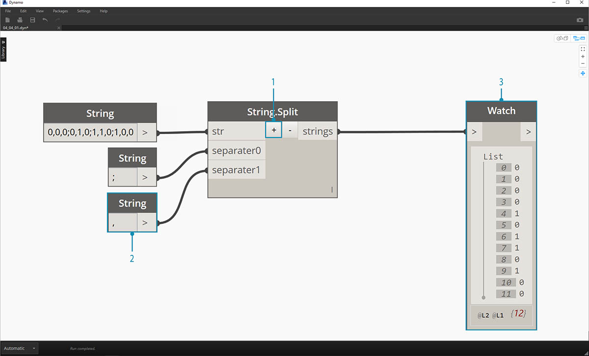
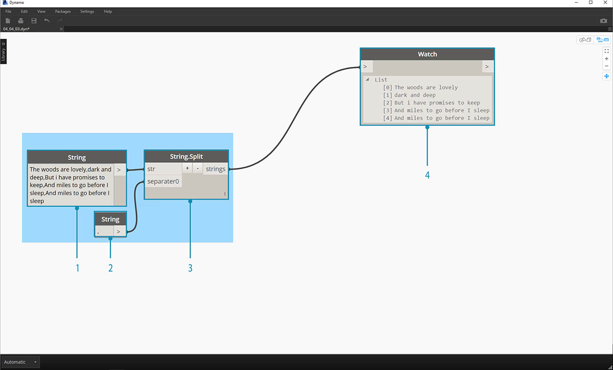

## Ciągi

Formalnie **ciąg** jest sekwencją znaków reprezentujących stałą literową lub pewnego typu zmienną. Nieformalnie ciąg to programistyczne określenie tekstu. Pracowaliśmy już z liczbami, zarówno z liczbami całkowitymi, jak i z liczbami dziesiętnymi, aby sterować parametrami. Tak samo możemy pracować z tekstem.

### Tworzenie ciągów

Ciągi mogą być używane w wielu zastosowaniach, w tym do definiowania parametrów niestandardowych, opisywania zestawów dokumentacji i analizowania zestawów danych tekstowych. Węzeł string (ciąg) znajduje się w kategorii Podstawowe > Kategoria wejściowa.

> Przykładowe węzły powyżej są ciągami. Liczba może być przedstawiona jako ciąg, podobnie jak litera lub cały szyk tekstu.

### Stosowanie zapytań do ciągów

> Pobierz plik przykładowy do tego ćwiczenia (kliknij prawym przyciskiem myszy i wybierz polecenie Zapisz element docelowy jako): [Building Blocks of Programs - Strings.dyn](datasets/4-4/Building Blocks of Programs - Strings.dyn). Pełna lista plików przykładowych znajduje się w załączniku.

Można szybko analizować duże ilości danych, stosując zapytania do ciągów. Omówimy niektóre podstawowe operacje, które przyspieszają proces roboczy i ułatwiają współdziałanie oprogramowania.

Na poniższej ilustracji przedstawiono ciąg danych pochodzących z zewnętrznego arkusza kalkulacyjnego. Ciąg reprezentuje wierzchołki prostokąta na płaszczyźnie XY. Przeanalizujmy niektóre operacje dzielenia ciągów w miniaturowym ćwiczeniu:

> 1. Separator „;” oddziela każdy wierzchołek prostokąta. Powoduje to utworzenie listy z 4 elementami dla każdego wierzchołka.

> 1. Naciśnięcie klawisza „*+*” w środku węzła powoduje utworzenie nowego separatora.
2. Dodaj ciąg „*,*” do obszaru rysunku i utwórz podłączenie do nowego wejścia separatora.
3. Wynik stanowi teraz listę dziesięciu elementów. Węzeł wykonuje dzielenie najpierw na podstawie separatora *separator0*, a następnie na podstawie separatora *separator1*.

Powyższa lista elementów może wyglądać jak liczby, ale nadal są one traktowane w dodatku Dynamo jak pojedyncze ciągi. Aby utworzyć punkty, ich typ danych musi zostać przekształcony z ciągu w liczbę. Jest to wykonywane za pomocą węzła String.ToNumber.

> 1. Ten węzeł jest prosty. Podłącz wyniki węzła String.Split do wejścia. Wynik nie wygląda inaczej, ale typ danych to teraz *number* (liczba), a nie *string* (ciąg).

> 1. Po wykonaniu pewnych dodatkowych podstawowych operacji mamy teraz prostokąt narysowany w punkcie początkowym na podstawie oryginalnego wejścia string.

### Manipulowanie ciągami

Ponieważ ciąg jest ogólnym obiektem tekstowym, zakres jego zastosowań jest szeroki. Przyjrzyjmy się niektórym istotnym operacjom w obszarze Podstawowe > Kategoria ciągu w dodatku Dynamo:

Jest to metoda łączenia dwóch ciągów w kolejności. Powoduje pobranie każdego ciągu literalnego z listy i utworzenie jednego scalonego ciągu.

> Powyższa ilustracja przedstawia scalanie trzech ciągów:

> 1. Aby dodać lub odjąć ciągi w scaleniu, można kliknąć przyciski +/- w środku węzła.
2. Wynikiem jest jeden scalony ciąg ze spacjami i interpunkcją.

Metoda łączenia jest bardzo podobna do scalania, ale zawiera dodatkową warstwę interpunkcji.

Osoby pracujące w programie Excel prawdopodobnie miały już do czynienia z plikami CSV. Są to pliki z wartościami rozdzielonymi przecinkami. Można użyć przecinka (lub, jak w tym przypadku, dwóch kresek) jako separatora z węzłem łączącym, aby utworzyć podobną strukturę danych: 

> Powyższa ilustracja przedstawia łączenie dwóch ciągów:

> 1. Wejście separatora umożliwia utworzenie ciągu rozdzielającego łączone ciągi.

### Praca z ciągami

W tym ćwiczeniu użyjemy metod wykonywania zapytań i manipulowania ciągami w celu zdekonstruowania ostatniej zwrotki wiersza [Stopping By Woods on a Snowy Evening](http://www.poetryfoundation.org/poem/171621) (Przystając pod lasem w śnieżny wieczór) autorstwa Roberta Frosta. Nie jest to najpraktyczniejsze zastosowanie, ale pomoże nam zrozumieć koncepcje operacji na ciągach podczas stosowania ich do czytelnych wierszy z rytmem i rymem.

> Zacznijmy od podstawowego podziału ciągu zwrotki. Na początku należy zauważyć, że zapis jest sformatowany za pomocą przecinków. Użyjemy tego formatu, aby rozdzielić wiersze na poszczególne elementy.

> 1. Ciąg podstawowy zostaje wklejony do węzła string.
2. Do oznaczenia separatora używany jest inny węzeł string. W tym przypadku używamy przecinka.
3. Do obszaru rysunku zostaje dodany węzeł String.Split. Zostaje on połączony z tymi dwoma ciągami.
4. Wynik na wyjściu to wiersze będące osobnymi elementami.

> Przejdźmy teraz do interesującej części wiersza: ostatnich dwóch wierszy. Oryginalna zwrotka była jednym elementem danych. Dane te zostały rozdzielone na poszczególne elementy w pierwszym kroku. Teraz musimy wyszukać tekst, który próbujemy znaleźć. Mimo że *możemy* to zrobić, wybierając dwa ostatnie elementy listy, to jednak jeśli byłaby to cała książka, nie chcielibyśmy czytać wszystkiego i ręcznie wyodrębniać elementów.

> 1. Zamiast ręcznego wyszukiwania używamy węzła String.Contains, aby wyszukać zestaw znaków. Jest to podobne do wykonywania polecenia „Znajdź” w edytorze tekstu. W tym przypadku zostanie zwrócona wartość „true” lub „false”, jeśli ten ciąg podrzędny zostanie znaleziony w elemencie.
2. W wejściu „searchFor” definiujemy ciąg podrzędny, którego szukamy w zwrotce. Użyjmy węzła string z tekstem „And miles”.
3. Zwrócony wynik zawiera listę pozycji false i true. Użyjemy tych wartości logicznych, aby przefiltrować elementy w następnym kroku.

> 1. List.FilterByBoolMask jest węzłem, za pomocą którego wyodrębnimy pozycje odpowiadające wartościom false i true. Wyjście „in” zwraca frazy z wejściem „mask” równym „true”, a wyjście „out” — te odpowiadające wartości „false”.
2. Wyniki na wyjściu „in” są zgodne z oczekiwaniami, czyli zwracają dwa ostatnie wiersze zwrotki.

> Chcemy teraz podkreślić powtórzenie w tej zwrotce, scalając te dwa wiersze. Przeglądając wyniki na wyjściu w poprzednim kroku, łatwo zauważyć, że na liście znajdują się dwa elementy:

> 1. Za pomocą dwóch węzłów List.GetItemAtIndex można wyodrębnić te elementy, używając wartości 0 i 1 jako wejścia indeksu.
2. Na wyjściu każdego z tych węzłów pojawiają się dwa ostatnie wiersze — w kolejności.

> Aby scalić te dwa elementy w jeden, użyjemy węzła String.Join:

> 1. Po dodaniu węzła String.Join widać, że potrzebny jest separator.
2. Aby utworzyć separator, dodamy węzeł string do obszaru rysunku i wpiszemy przecinek.
3. Ostatnie wyjście scala dwa ostatnie elementy w jeden.

Może to wydawać się dużą ilością pracy w celu wyodrębnienia dwóch ostatnich wierszy i to prawda — operacje na ciągach często wymagają pewnych początkowych nakładów pracy na. Ale są one skalowalne i mogą być względnie łatwo stosowane do dużych zestawów danych. Podczas pracy z zastosowaniem parametrów z arkuszami kalkulacyjnymi i funkcjami współdziałania należy pamiętać o operacjach na ciągach.

