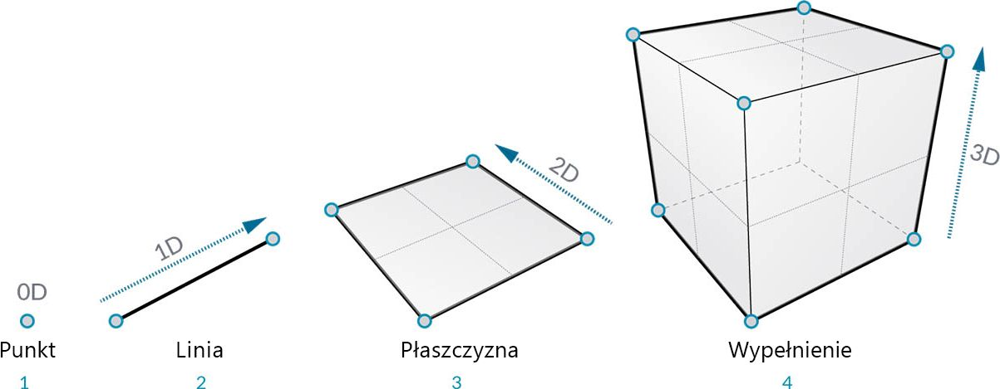
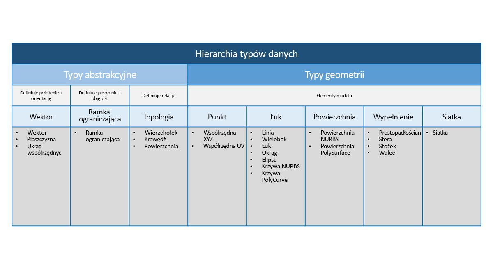
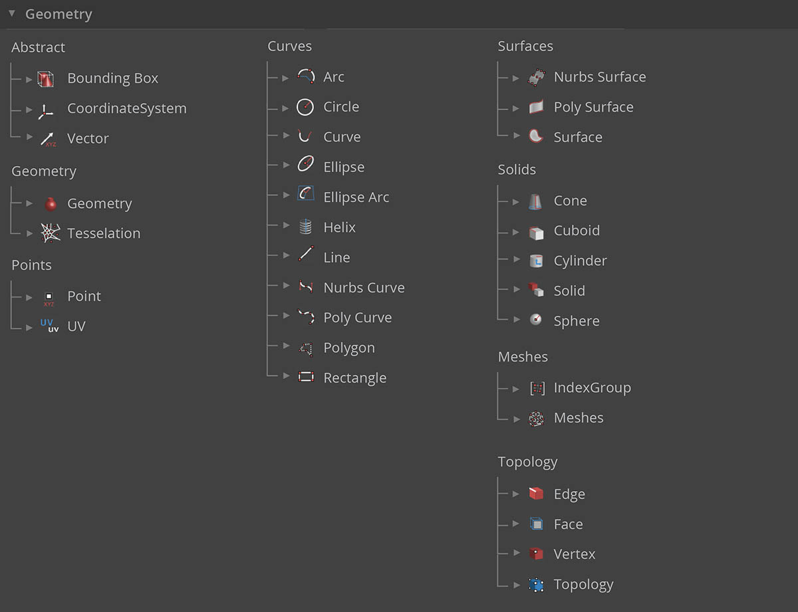

## Geometria — przegląd

**Geometria** to język projektowania. Kiedy rdzeń środowiska lub języka programowania ma jądro geometryczne, daje to olbrzymie możliwości w zakresie projektowania precyzyjnych i wydajnych modeli, automatyzacji procedur projektowania oraz generowania iteracji projektowych za pomocą algorytmów.

### Podstawy

Geometria, definiowana tradycyjnie, stanowi analizę kształtu, rozmiaru, względnego położenia figur i właściwości przestrzeni. Ta dziedzina ma bogatą historię obejmującą tysiące lat. Wraz z nadejściem i popularyzacją komputerów zyskaliśmy potężne narzędzie do definiowania, badania i generowania geometrii. Obecnie obliczenie wyniku złożonych interakcji geometrycznych jest tak łatwe, że nawet nie zauważamy, gdy to robimy.

> Aby przekonać się, jak zróżnicowana i złożona może być geometria tworzona za pomocą komputera, szybko wyszukaj w Internecie królika Stanford — model kanoniczny używany do testowania algorytmów.

Zrozumienie geometrii w kontekście algorytmów, obliczeń i złożoności może wydawać się prawdziwym wyzwaniem. Istnieje jednak kilka kluczowych i stosunkowo prostych zasad stanowiących podstawy do rozpoczęcia tworzenia bardziej zaawansowanych aplikacji:

1. Geometria to **dane** — zarówno dla komputera, jaki dla dodatku Dynamo królik nie różni się zbytnio od liczby.
2. Geometria bazuje na **abstrakcji** — zasadniczo elementy geometryczne są opisywane przez liczby, zależności i wzory w ramach danego przestrzennego układu współrzędnych
3. Geometria ma **hierarchię** — punkty łączą się, tworząc linie, linie stykają się ze sobą, tworząc powierzchnie itd.
4. Geometria jednocześnie opisuje **część i całość** — kiedy mamy daną krzywą, jest to zarówno kształt, jak i wszystkie możliwe punkty wzdłuż niej

W praktyce zasady te oznaczają, że musimy mieć świadomość tego, z czym pracujemy (jaki to typ geometrii, jak został utworzony itd.), aby móc płynnie składać, rozkładać i ponownie składać różne geometrie, opracowując bardziej złożone modele.

### Analiza hierarchii

Przyjrzyjmy się zależności między abstrakcyjnym a hierarchicznym opisem geometrii. Ponieważ te dwie koncepcje są powiązane, ale nie zawsze są od razu oczywiste, już zaraz po rozpoczęciu tworzenia bardziej złożonych procesów roboczych lub modeli można natrafić na problemy związane z pojęciami. Na początek użyjmy wymiarowości jako łatwego deskryptora „przedmiotów”, które modelujemy. Liczba wymiarów wymaganych do opisania kształtu daje nam pogląd na hierarchiczne uporządkowanie geometrii.

> 1. **Punkt** (definiowany przez współrzędne) nie ma wymiarów — to tylko liczby opisujące poszczególne współrzędne
2. **Linia** (definiowana przez dwa punkty) ma *jeden* wymiar — po linii można podróżować do przodu (kierunek dodatni) lub do tyłu (kierunek ujemny)
3. **Płaszczyzna** (zdefiniowana przez dwie linie) ma *dwa* wymiary — można po niej podróżować bardziej w lewo lub bardziej w prawo
4. **Prostopadłościan** (zdefiniowany przez dwie płaszczyzny) ma *trzy* wymiary — można zdefiniować położenie względem góry lub dołu

Wymiarowość jest wygodnym sposobem rozpoczęcia kategoryzowania geometrii, ale niekoniecznie jest najlepszym rozwiązaniem. W końcu nie modelujemy tylko za pomocą punktów, linii, płaszczyzn i prostopadłościanów — co jeśli chcemy użyć czegoś zakrzywionego? Ponadto istnieje cała inna kategoria typów geometrycznych, które są całkowicie abstrakcyjne. Oznacza to, że definiują one właściwości, takie jak orientacja, objętość lub zależności między częściami. Nie możemy dosłownie uchwycić wektora, więc jak zdefiniować go względem tego, co widzimy w przestrzeni? Bardziej szczegółowa kategoryzacja hierarchii geometrycznej powinna uwzględniać różnicę między typami abstrakcyjnymi („pomocniczymi”), które można pogrupować według tego, co pomagają osiągnąć, a typami, które pomagają opisać kształt elementów modelu.

### Geometria w programie Dynamo Studio

Co to oznacza w kontekście używania dodatku Dynamo? Zrozumienie typów geometrii i ich zależności pozwala na nawigację w kolekcji **Węzły geometrii** dostępnej w bibliotece. Węzły geometrii są uporządkowane alfabetycznie (nie hierarchicznie) — tutaj są one wyświetlane podobnie do ich układu w interfejsie dodatku Dynamo.

Ponadto tworzenie modeli w dodatku Dynamo i łączenie podglądu elementów widocznych w podglądzie tła z przepływem danych na wykresie powinno stawać się w miarę upływu czasu bardziej intuicyjne.

> 1. Zwróć uwagę na zakładany układ współrzędnych renderowany przez siatkę i kolorowe osie
2. Wybrane węzły spowodują renderowanie odpowiedniej geometrii (jeśli dany węzeł tworzy geometrię) w tle w kolorze wyróżnienia
> Pobierz plik przykładowy do tego obrazu (kliknij prawym przyciskiem myszy i wybierz opcję Zapisz element docelowy jako): [Geometry for Computational Design - Geometry Overview.dyn](datasets/5-1/Geometry for Computational Design - Geometry Overview.dyn). Pełna lista plików przykładowych znajduje się w załączniku.

### Dalsze kroki z geometrią

Tworzenie modeli w dodatku Dynamo nie ogranicza się do tego, co można wygenerować za pomocą węzłów. Poniżej przedstawiono kilka najważniejszych sposobów, w jakie można przenieść proces na następny poziom za pomocą geometrii:

1. Dodatek Dynamo umożliwia importowanie plików — spróbuj użyć pliku CSV dla chmur punktów lub pliku SAT w celu dołączenia powierzchni
2. W przypadku pracy z programem Revit można odwoływać się do elementów programu Revit, aby używać ich w dodatku Dynamo
3. Menedżer pakietów Dynamo udostępnia dodatkowe funkcje dla rozszerzonych operacji i typów geometrii — sprawdź pakiet [Mesh Toolkit](https://github.com/DynamoDS/Dynamo/wiki/Dynamo-Mesh-Toolkit)

