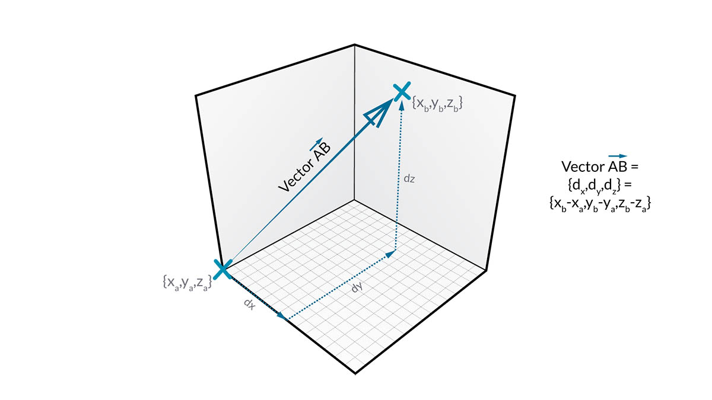
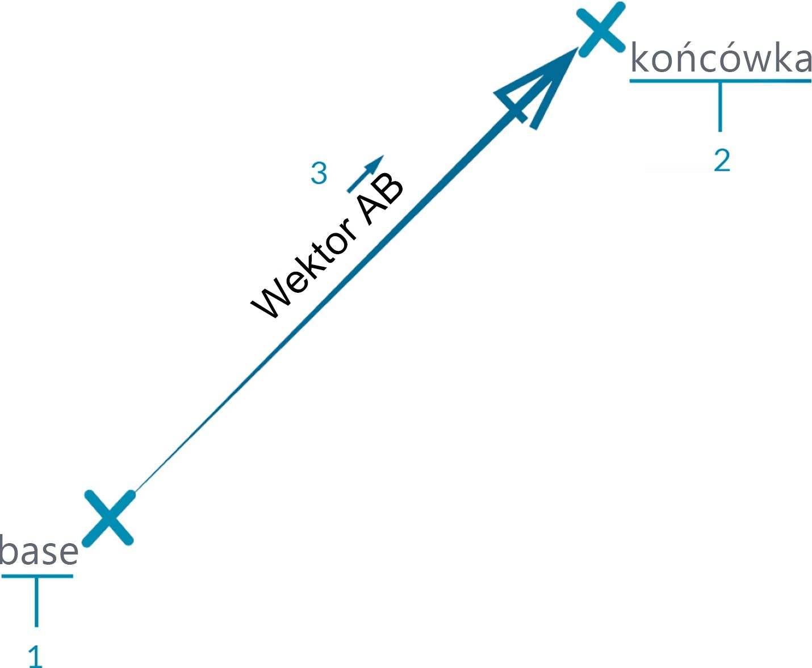
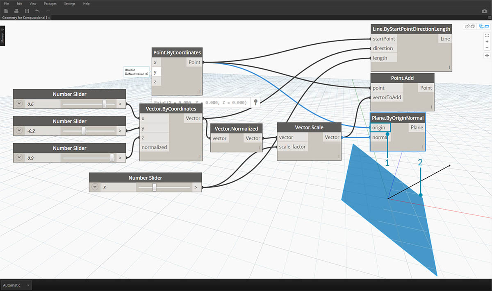

## Wektory, płaszczyzny i układy współrzędnych

Wektory, płaszczyzny i układy współrzędnych tworzą podstawową grupę abstrakcyjnych typów geometrii. Pomagają definiować położenie, orientację i kontekst przestrzenny dla innych typów geometrii, które opisują kształty. Jeśli stwierdzam, że jestem w Nowym Jorku przy 42-tej ulicy oraz Broadwayu (układ współrzędnych), stoję na poziomie ulicy (płaszczyzna) i patrzę na północ (wektor), używam tych „elementów pomocniczych”, by określić, gdzie jestem. To samo dotyczy produktu takiego jak etui telefonu czy drapacza chmur — potrzebujemy tego kontekstu do opracowania modelu.

### Co to jest wektor?

Wektor jest wielkością geometryczną opisującą kierunek i wartość. Wektory są abstrakcyjne. To znaczy, że reprezentują wielkość, a nie element geometryczny. Wektory można łatwo pomylić z punktami, ponieważ i jedne, i drugie zawierają listę wartości. Istnieje jednak zasadnicza różnica: punkty opisują położenie w danym układzie współrzędnych, natomiast wektory opisują względną różnicę w pozycji, która odpowiada pojęciu „kierunku”.

Jeśli pojęcie względnej różnicy jest niejasne, o wektorze AB można myśleć w ten sposób: „stoję w punkcie A, patrząc w kierunku punktu B”. Kierunek, stąd (A) dotąd (B), jest wektorem.

Dalsze rozbicie wektorów na ich części przy użyciu tej samej notacji AB:

> 1. **Punkt początkowy** wektora nosi nazwę **punktu zaczepienia**.
2. **Punkt końcowy** wektora nosi nazwę **wierzchołka** lub **zwrotu**.
3. Wektor AB nie jest taki sam jak wektor BA, który wskazuje w przeciwnym kierunku.

Z wektorów i ich abstrakcyjnej definicji można się pośmiać, oglądając klasyczną komedię „Czy leci z nami pilot?”:

> *Zrozumiałem, zrozumiałem. Jaki jest nasz wektor, Victor?*

Wektory są kluczowym elementem modeli w dodatku Dynamo. Ponieważ należą one do kategorii abstrakcyjnych „elementów pomocniczych”, gdy utworzymy wektor, nie zobaczymy niczego w podglądzie tła.

> 1. Można użyć linii jako symbolu zastępczego dla podglądu wektora.
> Pobierz plik przykładowy do tego obrazu (kliknij prawym przyciskiem myszy i wybierz opcję Zapisz element docelowy jako): [Geometry for Computational Design - Vectors.dyn](datasets/5-2/Geometry for Computational Design - Vectors.dyn). Pełna lista plików przykładowych znajduje się w załączniku.

### Co to jest płaszczyzna?

Płaszczyzny to dwuwymiarowe abstrakcyjne „elementy pomocnicze”. Mówiąc konkretniej, płaszczyzny są „płaskie” i rozciągają się w dwóch kierunkach w nieskończoność. Zazwyczaj są one renderowane jako mniejsze prostokąty w pobliżu ich początku.

W tym momencie zapewne myślisz sobie: „Chwileczkę! Początek? Brzmi to jak układ współrzędnych... Taki jak używany do modelowania w oprogramowaniu CAD”!

I masz rację. Większość programów do modelowania wykorzystuje płaszczyzny konstrukcyjne lub „poziomy” do definiowania lokalnego kontekstu dwuwymiarowego, w którym odbywa się szkicowanie. Bardziej znajomo mogą brzmieć określenia XY, XZ, YZ — lub — północ, południowy wschód czy rzut. Wszystkie one to płaszczyzny definiujące nieskończony „płaski” kontekst. Płaszczyzny nie mają głębokości, ale pomagają również w opisie kierunku — każda płaszczyzna ma początek, kierunek X, kierunek Y i kierunek Z (górę).

> 1. Chociaż płaszczyzny są abstrakcyjne, mają początek, więc można je umieścić w przestrzeni.
2. W dodatku Dynamo płaszczyzny są renderowane w podglądzie tła.
> Pobierz plik przykładowy do tego obrazu (kliknij prawym przyciskiem myszy i wybierz opcję Zapisz element docelowy jako): [Geometry for Computational Design - Planes.dyn](datasets/5-2/Geometry for Computational Design - Plane.dyn). Pełna lista plików przykładowych znajduje się w załączniku.

### Co to jest układ współrzędnych?

Jeśli pojęcie płaszczyzny jest już dla nas jasne, zrozumienie układów współrzędnych jest już o krok od tego. Płaszczyzna ma te same części co układ współrzędnych pod warunkiem, że mamy na myśli standardowy układ współrzędnych — „euklidesowy” lub „XYZ”.

Istnieją jednak inne, alternatywne układy współrzędnych, takie jak walcowy lub sferyczny. Jak zostanie to przedstawione w kolejnych sekcjach, układy współrzędnych można również stosować do innych typów geometrii w celu zdefiniowania położenia w ramach takiej geometrii.

> Dodawanie alternatywnych układów współrzędnych — walcowego, sferycznego

> 1. Chociaż układy współrzędnych są abstrakcyjne, mają początek, więc można je umieścić w przestrzeni.
2. W dodatku Dynamo układy współrzędnych są renderowane w podglądzie tła jako punkt (początek) oraz linie definiujące osie (oś X jest czerwona, oś Y — zielona, a oś Z — niebieska, zgodnie z konwencją).
> Pobierz plik przykładowy do tego obrazu (kliknij prawym przyciskiem myszy i wybierz opcję Zapisz element docelowy jako): [Geometry for Computational Design - Coordinate System.dyn](datasets/5-2/Geometry for Computational Design - Coordinate System.dyn). Pełna lista plików przykładowych znajduje się w załączniku.

