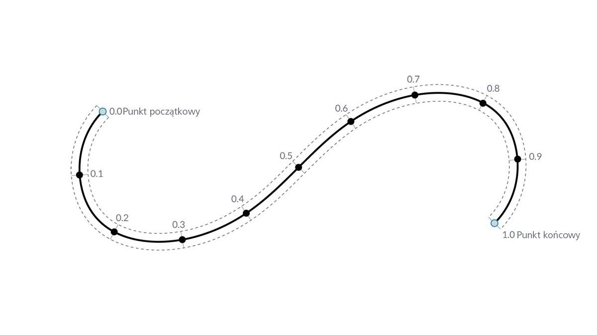
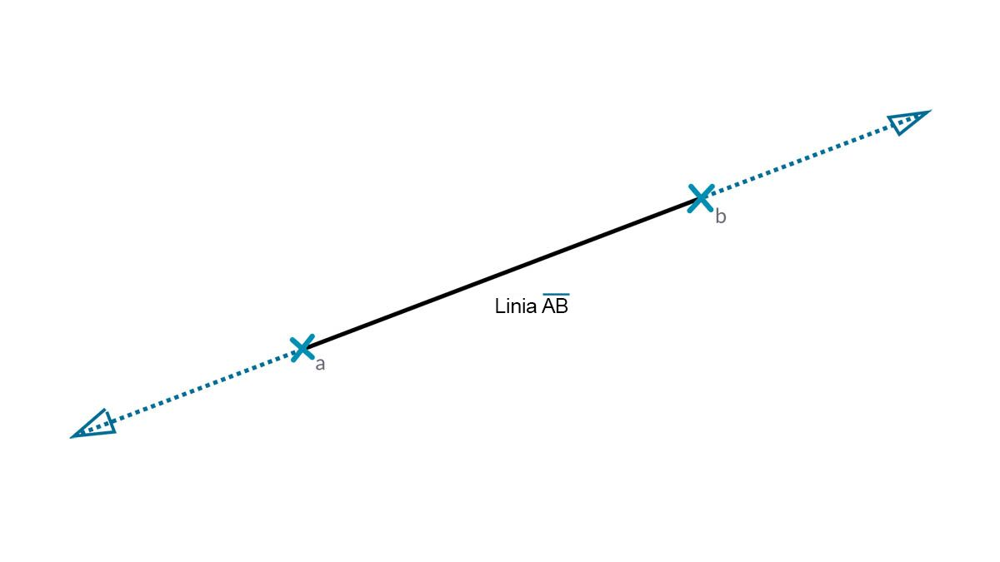
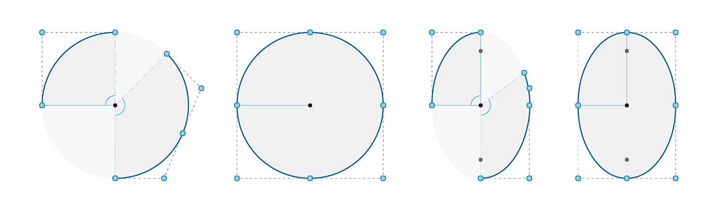

## Krzywe

Krzywe są pierwszym z opisanych typów danych geometrycznych, które mają bardziej znany zestaw właściwości opisujących kształt: jak bardzo są zakrzywione lub proste? Jak są długie lub krótkie? Należy też pamiętać, że punkty są nadal blokami konstrukcyjnymi służącymi do definiowania dowolnego elementu — od linii do splajnu oraz wszystkich typów krzywych.


> 1. Linia
2. Polilinia
3. Łuk
4. Okrąg
5. Elipsa
6. Krzywa NURBS
7. Krzywa PolyCurve

### Co to jest krzywa?

Termin **Krzywa** obejmuje zazwyczaj wszystkie różne kształty zakrzywione (nawet jeśli są proste). Krzywa jako taka to nadrzędna kategoryzacja wszystkich tych typów kształtów — linii, okręgów, splajnów itp. Określając to bardziej technicznie: krzywa opisuje każdy możliwy punkt, który można znaleźć przez wprowadzenie „t” do kolekcji funkcji — od funkcji prostych (```x = -1,26*t, y = t```) po funkcje wymagające przeprowadzenia złożonych obliczeń. Niezależnie od tego, z jakiego rodzaju krzywą pracujemy, ten **parametr** o nazwie „t” jest właściwością, którą można ocenić. Ponadto niezależnie od wyglądu kształtu wszystkie krzywe mają także punkt początkowy i punkt końcowy, które zbiegają się z minimalnymi i maksymalnymi wartościami „t” użytymi do utworzenia krzywej. Pomaga to również zrozumieć jej kierunkowość.



> Ważne: dodatek Dynamo zakłada, że domena wartości „t” dla krzywej jest rozumiana jako 0,0 do 1,0.

Wszystkie krzywe posiadają również wiele właściwości lub cech, których można używać do ich opisania lub analizy. Gdy odległość między punktem początkowym a końcowym wynosi zero, krzywa jest „zamknięta”. Ponadto każda krzywa ma wiele punktów kontrolnych, a jeśli wszystkie te punkty znajdują się w tej samej płaszczyźnie, krzywa jest „płaska”. Niektóre właściwości mają zastosowanie do całej krzywej, natomiast inne mają zastosowanie tylko do określonych punktów wzdłuż krzywej. Na przykład płaskość stanowi właściwość globalną, a wektor styczny dla danej wartości „t” stanowi właściwość lokalną.

### Linie

**Linie** są najprostszą postacią krzywych. Mogą nie wyglądać na zakrzywione, ale w rzeczywistości są krzywymi — bez krzywizny. Istnieje kilka różnych sposobów tworzenia linii. Najbardziej intuicyjna to pociągnięcie jej od punktu A do punktu B. Kształt linii AB zostanie narysowany między punktami, z matematycznego punktu widzenia będzie się ona rozciągać w nieskończoność w obu kierunkach.



Po połączeniu dwóch linii uzyskujemy **polilinię**. Tutaj mamy prostą reprezentację punktu kontrolnego. Edycja dowolnego z tych punktów spowoduje zmianę kształtu polilinii. Jeśli polilinia jest zamknięta, mamy do czynienia z wielobokiem. Jeśli długości krawędzi wieloboku są równe, określamy go jako regularny.


### Łuki, okręgi, łuki eliptyczne i elipsy

Wraz ze wzrostem złożoności funkcji parametrycznych definiujących kształt możemy pójść o krok dalej od linii, aby utworzyć **łuk**, **okrąg**, **łuk eliptyczny** lub **elipsę**, opisując jeden lub dwa promienie. Różnice między łukiem a okręgiem lub elipsą polegają tylko na tym, czy kształt jest zamknięty.



### Krzywe NURBS i PolyCurve

**NURBS** (niejednorodne wymierne splajny podstawowe) to reprezentacje matematyczne, które mogą dokładnie modelować dowolne kształty — od prostej dwuwymiarowej linii, okręgu, łuku lub prostokąta po najbardziej złożoną trójwymiarową swobodną krzywą organiczną. Ze względu na swoją elastyczność (stosunkowo niewiele punktów kontrolnych, a przy tym gładką interpolację opartą na ustawieniach stopni) i precyzję (związanie przez solidną matematykę) modele NURBS mogą być używane w każdym procesie: od ilustracji i animacji po produkcję.


**Stopień**: stopień krzywej określa zakres wpływu, jaki punkty kontrolne mają na krzywą; im większy stopień, tym większy ten zakres. Stopień jest dodatnią liczbę całkowitą. Liczba ta wynosi zazwyczaj 1, 2, 3 lub 5, ale może być dowolną dodatnią liczbą całkowitą. Linie NURBS i polilinie mają zazwyczaj stopień 1, a większość krzywych swobodnych ma stopień 3 lub 5.

**Punkty kontrolne**: punkty kontrolne to lista punktów o długości co najmniej stopnień+1. Jedną z najprostszych metod zmiany kształtu krzywej NURBS jest przesunięcie jej punktów kontrolnych.

**Waga**: punkty kontrolne mają skojarzoną liczbę zwaną wagą. Wagi są zazwyczaj liczbami dodatnimi. Gdy wszystkie punkty kontrolne krzywej mają tę samą wagę (zwykle 1), krzywa jest nazywana niewymierną. W przeciwnym razie krzywa jest nazywana wymierną. Większość krzywych NURBS jest niewymiernych.

**Węzły**: węzły są listą liczb (stopień+N-1), gdzie N jest liczbą punktów kontrolnych. Węzły są używane razem z wagami do sterowania wpływem punktów kontrolnych na wynikową krzywą. Jeden z nich służy do tworzenia punktów podziału w niektórych punktach krzywej.


> 1. Stopień = 1
2. Stopień = 2
3. Stopień = 3

Należy zauważyć, że im większa wartość stopnia, tym więcej punktów kontrolnych jest używanych do interpolacji wynikowej krzywej.

Utworzymy w dodatku Dynamo krzywą sinusoidalną za pomocą dwóch różnych metod tworzenia krzywych NURBS w celu porównania wyników.


> 1. Węzeł *NurbsCurve.ByControlPoints* używa listy punktów jako punktów kontrolnych
2. Węzeł *NurbsCurve.ByPoints* rysuje krzywą przechodzącą przez listę punktów
> Pobierz plik przykładowy do tego obrazu (kliknij prawym przyciskiem myszy i wybierz opcję Zapisz element docelowy jako): [Geometry for Computational Design - Curves.dyn](datasets/5-4/Geometry for Computational Design - Curves.dyn). Pełna lista plików przykładowych znajduje się w załączniku.

