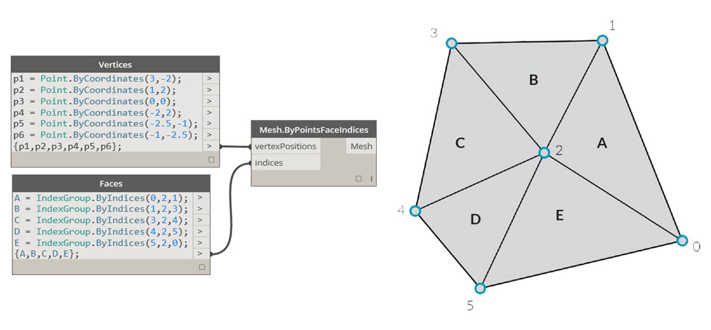

## Siatki

W dziedzinie modelowania obliczeniowego siatki są jedną z najbardziej rozpowszechnionych form reprezentowania geometrii 3D. Geometria siatki może być uproszczoną i elastyczną alternatywą dla pracy z obiektami NURBS. Siatki są używane we wszystkich zastosowaniach — od renderowania i wizualizacji po cyfrowe wytwarzanie i drukowanie 3D.

### Co to jest siatka?

Siatka jest zbiorem czworokątów i trójkątów reprezentujących geometrię powierzchni lub bryły. Podobnie jak w przypadku brył, struktura obiektu siatki zawiera wierzchołki, krawędzie i powierzchnie. Istnieją dodatkowe właściwości, dzięki którym siatki są niepowtarzalne, jak na przykład normalne.


> 1. Wierzchołki siatki
2. Krawędzie siatki *Krawędzie z tylko jedną przylegającą powierzchnią są nazywane „nagimi”. Pozostałe krawędzie są „obleczone”
3. Powierzchnie siatki

### Elementy siatki

Dodatek Dynamo definiuje siatki za pomocą struktury danych wierzchołek-powierzchnia. Na najbardziej podstawowym poziomie struktura ta stanowi po prostu zbiór punktów, które są pogrupowane w wieloboki. Punkty siatki są nazywane wierzchołkami, natomiast wieloboki podobne do powierzchni nazywane są powierzchniami. Aby utworzyć siatkę, potrzebna jest lista wierzchołków i system grupowania tych wierzchołków w powierzchnie zwany grupą indeksów.



> 1. Lista wierzchołków
2. Lista grup indeksów do zdefiniowania powierzchni

#### Wierzchołki i normalne wierzchołków

Wierzchołki siatki są po prostu listą punktów. Indeks wierzchołków jest bardzo ważny podczas tworzenia siatki oraz uzyskiwania informacji o strukturze siatki. Dla każdego wierzchołka istnieje również odpowiadająca mu normalna wierzchołka (wektor), która opisuje średni kierunek dołączonych powierzchni i pomaga zrozumieć orientację „do wewnątrz” i „na zewnątrz” siatki.


> 1. Wierzchołki
2. Normalne wierzchołków

#### Powierzchnie

Powierzchnia stanowi uporządkowaną listę trzech lub czterech wierzchołków. Reprezentacja „powierzchni” siatki jest więc wnioskowana na podstawie położenia indeksowanych wierzchołków. Mamy już listę wierzchołków tworzących siatkę, więc zamiast udostępniać pojedyncze punkty w celu zdefiniowania powierzchni, wystarczy użyć indeksu wierzchołków. Dzięki temu możemy użyć tego samego wierzchołka w więcej niż jednej powierzchni.


> 1. Czworokątna powierzchnia utworzona z indeksami 0, 1, 2 i 3
2. Trójkątna powierzchnia utworzona z indeksami 1, 4 i 2 Uwaga: grupy indeksów mogą być przesunięte w kolejności — o ile kolejność jest ustawiona w kierunku przeciwnym do ruchu wskazówek zegara, powierzchnia zostanie zdefiniowana poprawnie

### Siatki a powierzchnie NURBS

Czym różni się geometria siatki od geometrii NURBS? Kiedy można użyć jednej zamiast drugiej?

#### Parametryzacja

W poprzednim rozdziale pokazano, że powierzchnie NURBS są definiowane przez serię krzywych NURBS biegnących w dwóch kierunkach. Kierunki te są oznaczone jako ```U``` i ```V```. Umożliwiają parametryzowanie powierzchni NURBS zgodnie z domeną powierzchni dwuwymiarowej. Same krzywe są przechowywane w postaci równań w komputerze, dzięki czemu wynikowe powierzchnie mogą być obliczane z dowolnym stopniem dokładności. Łączenie wielu powierzchni NURBS może być jednak trudne. Połączenie dwóch powierzchni NURBS spowoduje utworzenie polipowierzchni, w której różne przekroje geometrii będą miały różne parametry UV i definicje krzywych.


> 1. Powierzchnia
2. Krzywa izoparametryczna
3. Punkt kontrolny powierzchni
4. Wielobok kontrolny powierzchni
5. Punkt izoparametryczny
6. Ramka powierzchni
7. Siatka
8. Naga krawędź
9. Sieć siatki
10. Krawędzie siatki
11. Normalna wierzchołka
12. Powierzchnia siatki/Normalna powierzchni siatki

Natomiast siatki składają się z określonej liczby dokładnie zdefiniowanych wierzchołków i powierzchni. Sieć wierzchołków nie może być ogólnie zdefiniowana przez proste współrzędne ```UV```, a ponieważ liczba powierzchni jest określona, stopień dokładności jest wbudowany w siatkę. Można go zmienić tylko przez uściślenie siatki i dodanie większej liczby powierzchni. Brak opisów matematycznych pozwala na elastyczniejszą obsługę złożonych geometrii za pomocą jednej siatki.

### Wpływ lokalny a globalny

Inną ważną różnicą jest zakres, w jakim zmiana lokalna w geometrii siatki lub NURBS wpływa na całą formę. Przesunięcie jednego wierzchołka siatki ma wpływ tylko na powierzchnie, które przylegają do tego wierzchołka. W powierzchniach NURBS stopień wpływu jest bardziej skomplikowany i zależy od stopnia powierzchni, jak również od wag i węzłów punktów kontrolnych. Jednak przesunięcie pojedynczego punktu kontrolnego w powierzchni NURBS powoduje gładsze, bardziej rozległe zmiany w geometrii.


> 1. Powierzchnia NURBS — przesunięcie punktu kontrolnego ma wpływ, który rozciąga się na całą powierzchnię kształtu
2. Geometria siatki — przesunięcie wierzchołka ma wpływ tylko na sąsiednie elementy

Jedną z analogii, która może być pomocna, jest porównanie obrazu wektorowego (składającego się z linii i krzywych) z obrazem rastrowym (składającym się z poszczególnych pikseli). Po powiększeniu obrazu wektorowego krzywe pozostają wyraźne i przejrzyste. Natomiast powiększenie obrazu rastrowego powoduje, że poszczególne piksele stają się większe. W tej analogii powierzchnie NURBS odpowiadają obrazowi wektorowemu, ponieważ istnieje gładka zależność matematyczna. Natomiast siatka zachowuje się podobnie do obrazu rastrowego z ustawioną rozdzielczością.

### Zestaw Mesh Toolkit

Możliwości tworzenia siatki w dodatku Dynamo można rozszerzyć, instalując pakiet [Mesh Toolkit](https://github.com/DynamoDS/Dynamo/wiki/Dynamo-Mesh-Toolkit). Zestaw Dynamo Mesh Toolkit zawiera narzędzia do importowania siatek z zewnętrznych formatów plików, tworzenia siatki z obiektów geometrii Dynamo oraz ręcznego tworzenia siatek na podstawie wierzchołków i indeksów. Ta biblioteka zawiera również narzędzia do modyfikowania siatek, naprawiania siatek i wyodrębniania warstw poziomych do użycia w produkcji.

W rozdziale 10.2 przedstawiono przykład użycia zestawu Mesh Toolkit.


