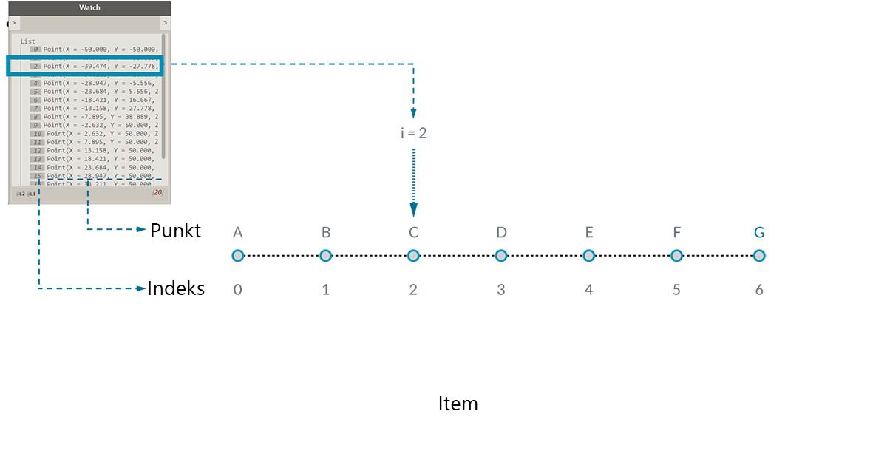
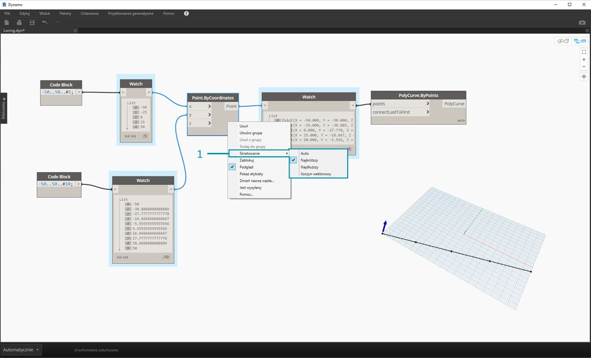
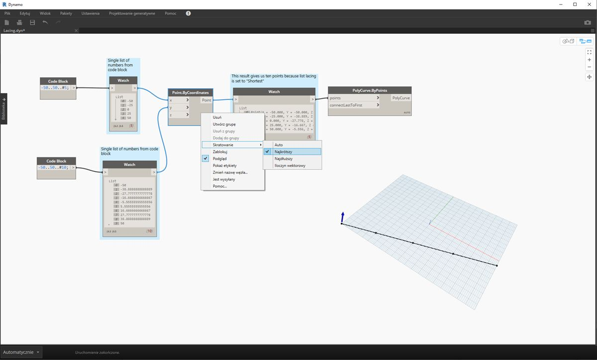
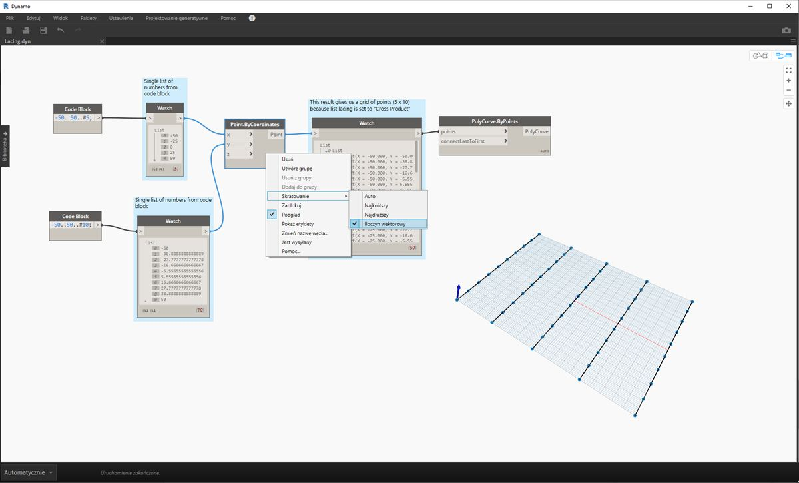

## Co to jest lista?

Lista to zbiór elementów. Weźmy na przykład kiść bananów. Każdy banan jest elementem listy (czyli kiści). Łatwiej jest chwycić kiść bananów niż zbierać pojedyncze banany — i tak samo jest w przypadku grupowania elementów według zależności parametrycznych w strukturze danych.

> Autor zdjęcia: [Augustus Binu](https://commons.wikimedia.org/wiki/File:Bananas_white_background_DS.jpg?fastcci_from=11404890&c1=11404890&d1=15&s=200&a=list).

Robiąc zakupy, wkładamy wszystkie kupione artykuły do torby. Taka torba również jest listą. Jeśli chcemy upiec chleb bananowy, potrzebujemy 3 kiści bananów (robimy *dużo* chleba bananowego). Torba to lista kiści bananów, a każda kiść to lista bananów. Torba jest więc listą list (dwuwymiarową), a kiście bananów są listą (jednowymiarową).

W dodatku Dynamo dane list są uporządkowane, a pierwszy element na każdej liście ma indeks „0”. Poniżej omówiono sposób definiowania list w dodatku Dynamo oraz to, jak listy wiążą się ze sobą nawzajem.

## Indeksowanie od zera

Jedno, co może z początku wydawać się dziwne, to fakt, że pierwszy indeks listy zawsze ma wartość 0, a nie 1. Gdy zatem mówimy o pierwszym elemencie listy, oznacza to tak naprawdę element odpowiadający indeksowi 0.

Jeśli na przykład liczymy palce prawej dłoni, najprawdopodobniej ponumerujemy je od 1 do 5. Gdybyśmy jednak umieścili te palce na liście, w dodatku Dynamo otrzymałyby indeksy od 0 do 4. Chociaż początkującym programistom może się to wydawać trochę dziwne, indeksowanie od zera stanowi standardową praktykę w większości systemów obliczeniowych.

Należy pamiętać, że lista wciąż zawiera 5 elementów, po prostu korzystamy z systemu liczenia od zera. Elementy na liście nie muszą być liczbami. Mogą to być dane dowolnego typu obsługiwanego przez dodatek Dynamo, takie jak punkty, krzywe, powierzchnie, rodziny itp.

Często najprostszym sposobem na sprawdzenie typu danych przechowywanych na liście jest połączenie węzła Watch z elementem wyjściowym innego węzła. Domyślnie węzeł Watch automatycznie wyświetla wszystkie indeksy po lewej stronie listy, a elementy danych po prawej stronie.

Indeksy są kluczowym elementem podczas pracy z listami.

### Dane wejściowe i wyjściowe

W odniesieniu do list dane wejściowe i wyjściowe różnią się w zależności od używanego węzła Dynamo. Możemy na przykład użyć listy 5 punktów i połączyć jej elementy wyjściowe z dwoma różnymi węzłami Dynamo, *PolyCurve.ByPoints* i *Circle.ByCenterPointRadius*:

> 1. Element wejściowy *points* węzła *PolyCurve.ByPoints* wyszukuje wartości *„Point[]”*. Reprezentują one listę punktów.
2. Elementem wyjściowym węzła *PolyCurve.ByPoints* jest jedna krzywa PolyCurve utworzona na podstawie listy pięciu punktów.
3. Element wejściowy *centerPoint* węzła *Circle.ByCenterPointRadius* wymaga wartości *„Point”*.
4. Elementem wyjściowym węzła *Circle.ByCenterPointRadius* jest lista pięciu okręgów, których środki odpowiadają pierwotnej liście punktów.

Dane wejściowe dla węzłów *PolyCurve.ByPoints* i *Circle.ByCenterPointRadius* są takie same, ale węzeł PolyCurve pozwala uzyskać jedną krzywą PolyCurve, a węzeł Circle — 5 okręgów ze środkami w poszczególnych punktach. Jest to intuicyjnie zrozumiałe: krzywa PolyCurve jest rysowana jako łuk łączący 5 punktów, a okręgi tworzone są w każdym punkcie osobno. Co zatem dzieje się z danymi?

Po najechaniu kursorem myszy na element wejściowy *points* węzła *Polycurve.ByPoints* widzimy, że wyszukuje on wartości *„Point[]”*. Zwróć uwagę na nawiasy na końcu. To oznacza listę punktów, a do utworzenia krzywej PolyCurve potrzebne są dane wejściowe w postaci listy. Ten węzeł będzie więc sumował każdą listę w jedną krzywą PolyCurve.

Natomiast element wejściowy *centerPoint* węzła *Circle.ByCenterPointRadius* wymaga wartości *„Point”*. W tym węźle wyszukiwany jest jeden punkt, czyli element, w celu zdefiniowania środka okręgu. Dlatego otrzymujemy pięć okręgów z danych wejściowych. Zrozumienie tej różnicy w danych wejściowych w dodatku Dynamo pomaga lepiej zrozumieć działanie węzłów podczas zarządzania danymi.

### Skratowanie

Dopasowywanie danych stanowi problem bez idealnego rozwiązania. Ma on miejsce, gdy węzeł ma dostęp do danych wejściowych o różnych rozmiarach. Zmiana algorytmu dopasowywania danych może prowadzić do uzyskania całkiem różnych wyników.

Wyobraź sobie węzeł służący do tworzenia odcinków między punktami (Line.ByStartPointEndPoint). Ma on dwa parametry wejściowe, określające współrzędne obu punktów:

Jak widać, istnieją różne sposoby rysowania linii między tymi zbiorami punktów. Opcje skratowania można znaleźć, klikając prawym przyciskiem myszy środek węzła i wybierając menu „Skratowanie”.

### Plik bazowy

> Pobierz plik przykładowy do tego ćwiczenia (kliknij prawym przyciskiem myszy i wybierz opcję Zapisz element docelowy jako): [Lacing.dyn](datasets/6-1/Lacing.dyn). Pełna lista plików przykładowych znajduje się w Załączniku.

Aby zademonstrować poniżej operacje skratowania, użyjemy tego pliku bazowego do zdefiniowania najkrótszej listy, najdłuższej listy i iloczynu wektorowego.

> 1. Zmienimy skratowanie w węźle *Point.ByCoordinates*, ale nie zmienimy żadnych innych elementów na wykresie powyżej.

#### Najkrótsza lista

Najprostszym sposobem jest łączenie elementów wejściowych pojedynczo, aż jeden ze strumieni się wyczerpie. Jest to tak zwany algorytm „najkrótszej listy”. Jest to domyślne działanie węzłów Dynamo:

> Po zmianie skratowania na opcję *najkrótsza lista* otrzymujemy podstawową linię ukośną złożoną z pięciu punktów. Pięć punktów to długość krótszej listy, a więc skratowanie według najkrótszej listy zatrzymuje się po dotarciu do końca tej listy.

#### Najdłuższa lista

Algorytm „najdłuższa lista” kontynuuje łączenie elementów wejściowych i ponownie używa elementów do momentu, aż wszystkie strumienie się wyczerpią:

> Po zmianie skratowania na opcję *najdłuższa lista* otrzymujemy linię ukośną, która dalej przebiega pionowo. Tak samo, jak na diagramie koncepcyjnym, ostatni element z listy 5 elementów będzie używany ponownie do momentu osiągnięcia długości dłuższej listy.

#### Iloczyn wektorowy

Metoda iloczynu wektorowego służy do wykonania wszystkich możliwych połączeń:

> Po zmianie opcji skratowania na *iloczyn wektorowy* otrzymujemy wszystkie kombinacje wszystkich list, co daje siatkę punktów 5x10. Jest to struktura danych równoważna wobec iloczynu wektorowego pokazanego na powyższym diagramie koncepcyjnym, z tą różnicą, że dane stanowią teraz listę list. Po połączeniu w krzywą PolyCurve widzimy, że każda lista jest zdefiniowana przez wartość X, co daje rząd pionowych linii.

