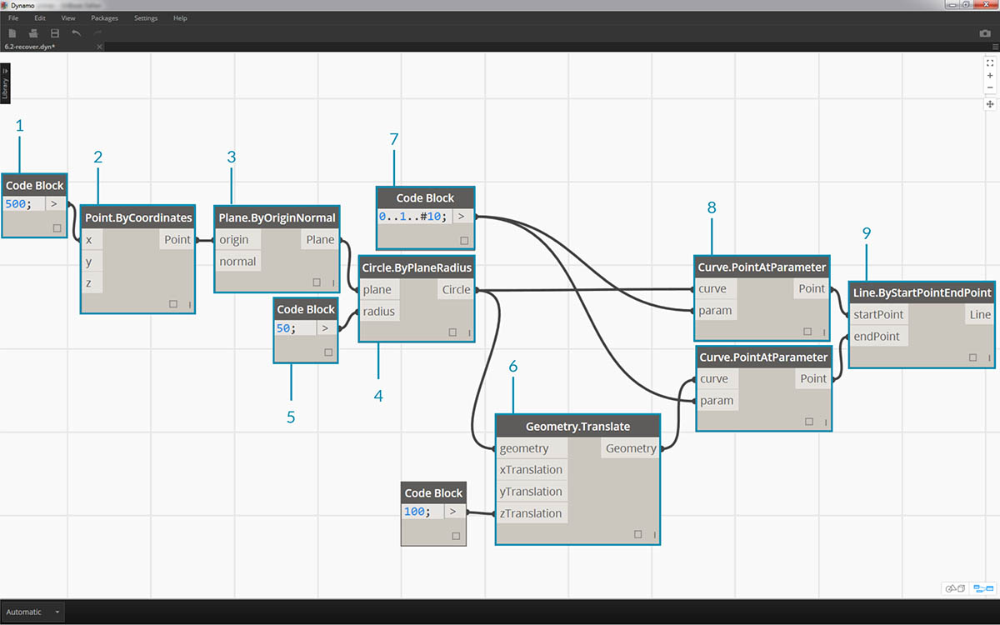
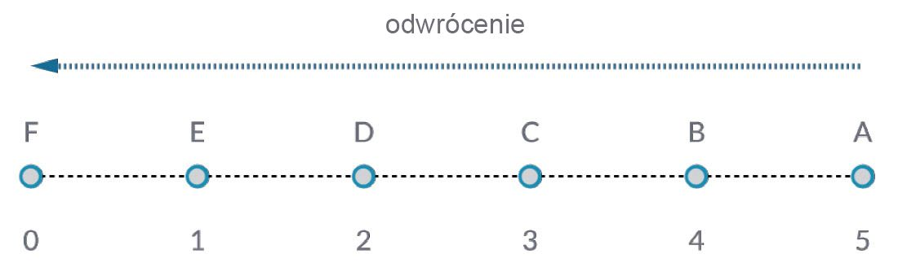
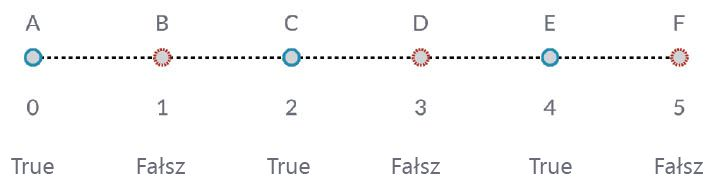

## Praca z listami

Ustaliliśmy już, czym jest lista. Omówmy teraz operacje, które możemy na niej wykonać. Wyobraź sobie listę jako talię kart do gry. Talia jest listą, a każda karta reprezentuje element.


> Autor zdjęcia: [Christian Gidlöf](https://commons.wikimedia.org/wiki/File:Playing_cards_modified.jpg)

Jakie **zapytania** możemy wykonać z poziomu listy? Umożliwia to dostęp do istniejących właściwości.

* Liczba kart w talii? 52.
* Liczba kolorów? 4.
* Materiał? Papier.
* Długość? 3,5" lub 89 mm.
* Szerokość? 2,5" lub 64 mm.

Jakie **działania** możemy wykonać na liście list? Umożliwia to zmianę listy w oparciu o daną operację.

* Możemy potasować talię.
* Możemy posortować talię według wartości.
* Możemy posortować talię według kolorów.
* Możemy podzielić talię.
* Możemy rozdać karty w talii.
* Możemy wybrać określoną kartę w talii.

Dla wszystkich operacji wymienionych powyżej istnieją analogiczne węzły Dynamo do pracy z listami danych ogólnych. W poniższych lekcjach przedstawiono niektóre z podstawowych operacji, które można wykonywać na listach.

## Operacje na listach

Poniższy obraz przedstawia wykres bazowy, za pomocą którego przedstawimy podstawowe operacje na listach. Przeanalizujemy zarządzanie danymi na liście i zaprezentujemy wyniki wizualne.

#### Ćwiczenie — operacje na listach

> Pobierz plik przykładowy do tego ćwiczenia (kliknij prawym przyciskiem myszy i wybierz polecenie Zapisz element docelowy jako): [List-Operations.dyn](datasets/6-2/List-Operations.dyn). Pełna lista plików przykładowych znajduje się w załączniku.



> 1. Rozpocznij od węzła *Code Block* o wartości ```500;```
2. Podłącz wejście *x* do węzła *Point.ByCoordinates*.
3. Podłącz węzeł z poprzedniego kroku do wejścia origin węzła *Plane.ByOriginNormal*.
4. Za pomocą węzła *Circle.ByPlaneRadius* podłącz węzeł z poprzedniego kroku do wejścia plane.
5. Używając węzła *Code Block*, oznacz wartość ```50;``` dla pozycji *radius*. To pierwszy okrąg, który utworzymy.
6. Za pomocą węzła *Geometry.Translate* przesuń okrąg w górę o 100 jednostek w kierunku Z.
7. Za pomocą węzła *Code Block* zdefiniuj zakres dziesięciu liczb między 0 a 1 przy użyciu tego wiersza kodu: ```0..1..#10;```
8. Wstaw blok kodu z poprzedniego kroku do wejścia *param* dwóch węzłów *Curve.PointAtParameter*. Podłącz węzeł *Circle.ByPlaneRadius* do wejścia curve górnego węzła i węzeł *Geometry.Translate* do wejścia curve węzła poniżej.
9. Za pomocą węzła *Line.ByStartPointEndPoint* połącz dwa węzły *Curve.PointAtParameter*.


> 1. Węzeł *Watch3D* pokazuje wyniki węzła *Line.ByStartPointEndPoint*. Między dwoma okręgami rysowane są linie reprezentujące podstawowe operacje na listach. Będziemy używać tego podstawowego wykresu Dynamo do przeanalizowania operacji na listach poniżej.

### List.Count


> Węzeł *List.Count* jest prosty: zlicza wartości na liście i zwraca ich liczbę. Jego działanie jest nieco bardziej złożone podczas pracy z listami list, ale zilustrujemy to w późniejszych sekcjach.

#### Ćwiczenie — węzeł List.Count

> Pobierz plik przykładowy do tego ćwiczenia (kliknij prawym przyciskiem myszy i wybierz polecenie Zapisz element docelowy jako): [List-Count.dyn](datasets/6-2/List-Count.dyn). Pełna lista plików przykładowych znajduje się w załączniku.


> 1. Węzeł *List.Count* zwraca liczbę linii w węźle *Line.ByStartPointEndPoint*. W tym przypadku wynosi ona 10, co odpowiada liczbie punktów utworzonych z oryginalnego węzła *Code Block*.

### List.GetItemAtIndex


> Węzeł *List.GetItemAtIndex* zapewnia podstawowy sposób stosowania zapytania dotyczącego elementu listy. Na powyższej ilustracji używamy indeksu *„2”* w celu zapytania o punkt oznaczony jako *„C”*.

#### Ćwiczenie — węzeł List.GetItemAtIndex

> Pobierz plik przykładowy do tego ćwiczenia (kliknij prawym przyciskiem myszy i wybierz polecenie Zapisz element docelowy jako): [List-GetItemAtIndex.dyn](datasets/6-2/List-GetItemAtIndex.dyn). Pełna lista plików przykładowych znajduje się w załączniku.


> 1. Za pomocą węzła *List.GetItemAtIndex* wybieramy indeks *„0”*, czyli pierwszy element na liście linii.
2. Węzeł *Watch3D* pokazuje, że wybraliśmy jedną linię. Uwaga: aby uzyskać obraz taki jak powyżej, należy wyłączyć podgląd węzła *Line.ByStartPointEndPoint*.

### List.Reverse



> Węzeł *List.Reverse* odwraca kolejność wszystkich elementów na liście.

#### Ćwiczenie — węzeł List.Reverse

> Pobierz plik przykładowy do tego ćwiczenia (kliknij prawym przyciskiem myszy i wybierz polecenie Zapisz element docelowy jako): [List-Reverse.dyn](datasets/6-2/List-Reverse.dyn). Pełna lista plików przykładowych znajduje się w załączniku.


> 1. Aby poprawnie zwizualizować odwróconą listę linii, utwórz więcej linii, zmieniając blok kodu na ```0..1..#100;```
2. Wstaw węzeł *List.Reverse* między węzłami *Curve.PointAtParameter* i *Line.ByStartPointEndPoint* dla jednej z list punktów.
3. Węzły *Watch3D* pokazują dwa różne wyniki. Pierwszy pokazuje wynik bez odwróconej listy. Linie łączą się pionowo z sąsiednimi punktami. Natomiast odwrócona lista powoduje połączenie wszystkich punktów w kolejności odwrotnej na drugiej liście.

### List.ShiftIndices


> Węzeł *List.ShiftIndices* jest dobrym narzędziem do tworzenia skrętów lub wzorców śrubowych albo do innych podobnych manipulacji danymi. Ten węzeł przesuwa elementy na liście o podaną wartość indeksu.

#### Ćwiczenie — węzeł List.ShiftIndices

> Pobierz plik przykładowy do tego ćwiczenia (kliknij prawym przyciskiem myszy i wybierz polecenie Zapisz element docelowy jako): [List-ShiftIndices.dyn](datasets/6-2/List-ShiftIndices.dyn). Pełna lista plików przykładowych znajduje się w załączniku.


> 1. W tym samym procesie, w którym występuje odwrócona lista, wstaw węzeł *List.ShiftIndices* do węzłów *Curve.PointAtParameter* i *Line.ByStartPointEndPoint*.
2. Używając węzła *Code Block*, określ wartość *„1”*, aby przesunąć listę o jeden indeks.
3. Zauważmy, że zmiana jest subtelna, ale wszystkie linie w dolnym węźle *Watch3D* przesunęły się o jeden indeks podczas łączenia się z drugim zestawem punktów.


> 1. Po zmianie wartości w węźle *Code Block* na większą, na przykład *„30”*, zauważamy znaczną różnicę w liniach ukośnych. W tym przypadku przesunięcie działa jak obiektyw aparatu, tworząc skręt w oryginalnej formie walcowej.

### List.FilterByBooleanMask



> Węzeł *List.FilterByBooleanMask* usuwa niektóre elementy w oparciu o listę wartości logicznych lub wartości odczytywanych jako „true” lub „false”.

#### Ćwiczenie — węzeł List.FilterByBooleanMask

> Pobierz plik przykładowy do tego ćwiczenia (kliknij prawym przyciskiem myszy i wybierz polecenie Zapisz element docelowy jako): [List-FilterByBooleanMask.dyn](datasets/6-2/List-FilterByBooleanMask.dyn). Pełna lista plików przykładowych znajduje się w załączniku.


> Aby utworzyć listę wartości odczytywanych jako „true” lub „false”, musimy wykonać nieco więcej pracy.

> 1. Używając węzła *Code Block*, zdefiniuj wyrażenie ze składnią: ```0..List.Count(list);```. Połącz węzeł *Curve.PointAtParameter* z wejściem *list*. Przeanalizujemy tę konfiguracje dokładniej w rozdziale dotyczącym bloku kodu, ale wiersz kodu w tym przypadku tworzy listę reprezentującą każdy indeks węzła *Curve.PointAtParameter*.
2. Używając węzła *„%”* (moduł), połącz wyjście węzła *Code Block* z wejściem *x* oraz wartość *4* z wejściem *y*. Spowoduje to zwrócenie reszty z dzielenia listy indeksów przez 4. Węzeł modułu jest bardzo przydatny podczas tworzenia szyku. Wszystkie wartości będą odczytywane jako możliwe reszty z dzielenia przez 4, czyli 0, 1, 2 i 3.
3. Na podstawie węzła *modułu* wiemy, że wartość 0 oznacza, iż indeks jest podzielny przez 4 (0, 4, 8 itd...). Za pomocą węzła *„==”* możemy sprawdzić tę dzielność, testując tę pozycję pod kątem wartości *„0”*.
4. Węzeł *Watch* pokazuje tylko, że mamy wzorzec true/false, który wygląda następująco: *true,false,false,false...*.
5. Używając tego wzorca true/false, utwórz połączenie z wejściem mask dwóch węzłów *List.FilterByBooleanMask*.
6. Połącz węzeł *Curve.PointAtParameter* z każdym wejściem list węzła *List.FilterByBooleanMask*.
7. Wyjścia węzła *Filter.ByBooleanMask* to *„in”* oraz *„out”*. Wyjście *„in”* reprezentuje wartości, które miały wartość maski *„true”*, a wyjście *„out”* — wartość maski *„false”*. Podłączając wyjścia *„in”* do wejść *startPoint* i *endPoint* węzła *Line.ByStartPointEndPoint*, utworzyliśmy przefiltrowaną listę linii.
8. Węzeł *Watch3D* pokazuje, że mamy mniej linii niż punktów. Wybraliśmy tylko 25% węzłów, filtrując tylko wartości true.

